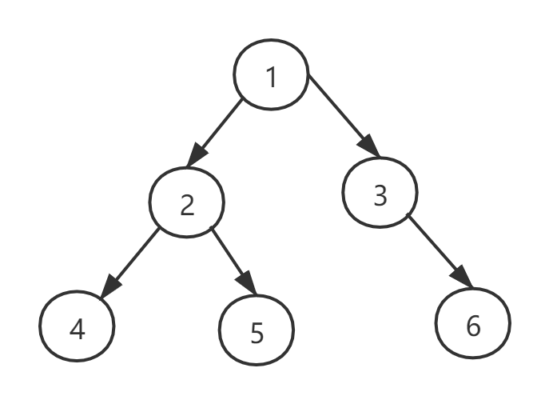
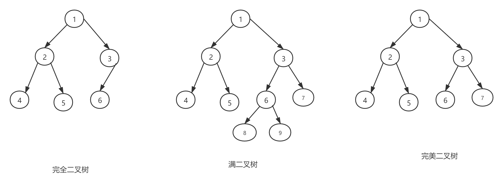
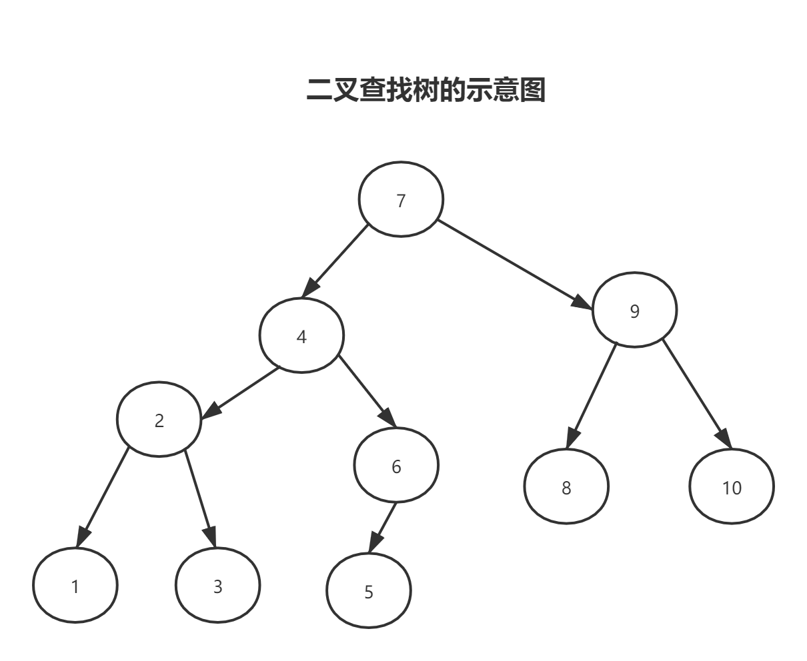

# 关于二叉树 

> 我们所使用的数据结构由结点组成，结点包含的链接可以为空(null)或者指向其他结点。在二叉树中，每个结点只能有一个父结点（只有一个例外，也就是根结点，它没有父结点），而且每个结点都只有左右两个链接，分别指向自己的左子结点和右子结点。

## 定义

​	二叉树（binary tree）是指树中节点的度不大于2的有序树，它是一种最简单最重要的树。二叉树的递归定义为：二叉树是一棵空树，或者是一棵由一个根节点和两棵互不相交的，分别称作根的左子树和右子树组成的非空树；左子树和右子树又同样都是二叉树。如下图所示：

## 特点

1. 每个节点度最多为2.

2. 度为0的节点比度为2的节点多1个。

   **证明如下：**

   - 拥有n个节点的树有n-1条边。

   - 假设度为0的节点数为n0个，度为1的节点数为n1个，度为2的节点数为n2个。

   - 由于点的数量等于边的数量加1，因此：n0+n1+n2 = n(度为1的节点数边为1，度为2的节点数边为2)，则

     得到下面等式：n0+n1+n2 =  n1 + 2n2 + 1;所以n0 = n2 + 1,因此度为0的节点比度为2 的节点多1个。

## 二叉树-遍历：

​	**根据根节点所在的位置来区分：**

1. 前序遍历。根 左 右 

   1→2→4→5→3→6

2. 中序遍历。 左 根 右

   4→2→5→1→3→6

3. 后序遍历。 左  右 根

   4→5→2→6→3→1

## 分类：

1. ## 完全二叉树

   ##  只有在最后一层的右边缺少节点的二叉树

2. ## 满二叉树  

   ##  没有度为1的节点，只有度为0和度为2的节点的二叉树就叫做满二叉树

3. ## 完美二叉树

   ## 每一层节点都满的二叉树

​	如下图所示：

## 二叉树--完全二叉树

## 特点：

- 编号为i的子节点：

  ​	左孩子编号： 2 * i

  ​	右孩子编号: 2 * i + 1

- 可以用连续空间存储（数组）

## 二叉树--二叉查找树

## 定义：二叉查找树(Binary Search Tree),又称为二叉搜索树。设x为二叉查找树中的一个结点，x节点包含关键字key，节点x的key值记为key[x]。如果y是x的左子树中的一个结点，则key[y] <= key[x];如果y是x的右子树的一个结点。则key[y]>=key[x]。

在二叉查找树中：

1. 若任意节点的左子树不空，则左子树上所有结点的值均小于它的根结点的值；
2. 任意节点的右子树不空，则右子树上所有结点的值均大于它的根结点的值；
3. 任意节点的左、右子树也分别为二叉查找树；
4. 没有键值相等的节点。