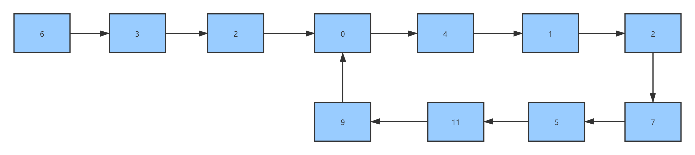
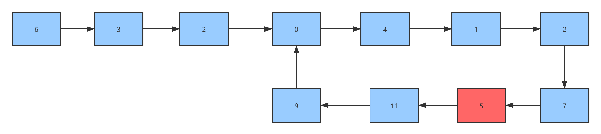
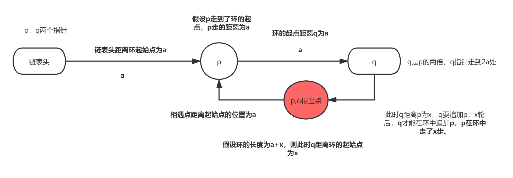

# 链表典型应用场景（一）

## 场景一：环状链表=>判断环状链表

## 描述：给定一个链表，判断链表中是否有环。

​	内容： 如果链表中有某个节点，可以通过连续跟踪 next 指针再次到达，则链表中存在环。 为了表示给定链表中的环，我们使用整数 pos 来表示链表尾连接到链表中的位置（索引从 0 开始）。 如果 pos 是 -1，则在该链表中没有环。注意：pos 不作为参数进行传递，仅仅是为了标识链表的实际情况。

​	如果链表中存在环，则返回 true 。 否则，返回 false 。

## 思路一 使用哈希表（额外的存储区）存储已经遍历过的节点    

代码如下：

```javascript
/**
 * Definition for singly-linked list.
 * function ListNode(val) {
 *     this.val = val;
 *     this.next = null;
 * }
 */

/**
 * @param {ListNode} head
 * @return {boolean}
 */
// 使用hash表来记录,目前复杂度为时间复杂度O(n),空间复杂度也是O(n)
var hasCycle = function(head) {
  let cache = new Set()
  while(head) {
    if (cache.has(head)) {
      // 如果cache发现存在的元素，代表有环
      return true 
    } else {
      cache = cache.add(head)
    }
    head = head.next
  }
  return false
}
```

## 思路二 双指针做法    

​	使用快慢指针 快指针一次向前2个节点 慢指针一次向前1个节点 

- 有环的链表中 快指针和慢指针最终一定会在环中相遇 
- 无环的链表中 快指针会率先访问到链表尾 从而终结检测过程    

代码如下：

```javascript
/**
 * Definition for singly-linked list.
 * function ListNode(val) {
 *     this.val = val;
 *     this.next = null;
 * }
 */
/**
 * @param {ListNode} head
 * @return {boolean}
 */
// 目前时间复杂度为O(n)，空间复杂度为O(1)
var hasCycle = function(head) {
  let slow = head
  let fast = head
  while(fast && fast.next) {
    fast = fast.next.next // 快节点一次走两个节点
    slow = slow.next // 慢节点一次走一个节点
    if (fast === slow) {
      return true
    }
  }
  return false
}
```

## 场景二：环状列表=>返回链表开始入环的第一个节点。 如果链表无环，则返回 `null`。 

## 描述：给定一个链表，返回链表开始入环的第一个节点。 如果链表无环，则返回 `null`。 

## 解题思路：

​	这类链表题目一般都是使用双指针法解决的，例如寻找距离尾部第K个节点、寻找环入口、寻找公共尾部入口等。 

**算法流程：**

1. 首先还是通过快慢指针（其中快指针走两步，慢指针走一步），先判断当前链表是环形链表。

    

2. 找到快慢指针的相遇位置。针对图一环形链表，快慢指针相遇位置在5节点处。

    

3. 快慢指针相遇后，把其中一个节点放到头部节点，另一节点放到相遇节点，两个节点一起往后走，相遇点就是环的起始位置。

4. 我们用数学思维来思考（其中p为慢指针，q为快指针，p一次走一步，q一次走两步）

   - 首先假设链表的起始点距离环的起始点为a.

   - 假设p走到环的起始点时，即p走了距离a，则q距离head应该走了2a的距离。

   - 这个时候假设q已经在环里面了，假设环的长度为a+x，则环剩余的距离为x，现在p和q同时在环里面，p在环的起始位置，q在距离起始点a的距离，x轮后，q才能在环中追加p，p在环中走了x步。

   - 则p距离相遇点的距离为x，则相遇点距离环起始点的位置为a。

     如下图所示：

     
   

代码如下：

```javascript
/**
 * Definition for singly-linked list.
 * function ListNode(val) {
 *     this.val = val;
 *     this.next = null;
 * }
 */
/**
 * @param {ListNode} head
 * @return {ListNode}
 */
var detectCycle = function(head) {
    if (!head) return null
    let slow = head;
    let fast = head;
    while(fast && fast.next) {
      slow = slow.next
      fast = fast.next.next
      if (slow === fast)  {
        let temp = head
        while(temp !== fast) {
          temp = temp.next
          fast = fast.next
        }
        return fast
      }
    }
    return null
};
```

## 场景三：编写一个算法来判断一个数 `n` 是不是快乐数。 

描述「快乐数」定义为：

- 对于一个正整数，每一次将该数替换为它每个位置上的数字的平方和。
- 然后重复这个过程直到这个数变为 1，也可能是 **无限循环** 但始终变不到 1。
- 如果 **可以变为**  1，那么这个数就是快乐数。

如果 `n` 是快乐数就返回 `true` ；不是，则返回 `false` 。

**解题思路：**

1. 我们举个例子：当输入值为7时，平方和就转换为：7 =>49=>97=>130=>10=>1;

  

2. 题目可以转化为：判断一个链表是否有环。如果遍历某个节点为1 ，说明没环，就是快乐数。如果遍历到重复的节点值，说明有环，就不是快乐数。

3. 再举个例子，当输入值为116时，平方和构成的链表就是：如下图所示：
   

代码实现如下：

```javascript
/**
 * @param {number} n
 * @return {boolean}
 */
var isHappy = function (n) {
  var pre = n
  var cur = getNext(n)
  while (cur !== pre && cur !== 1) {
    pre = getNext(pre)
    cur = getNext(getNext(cur))
  }
  return cur === 1
}
var getNext = function (n) {
  let t = 0
  while (n) {
    t += (n % 10) * (n % 10)
    n = Math.floor(n / 10)
  }
  return t
}
```

