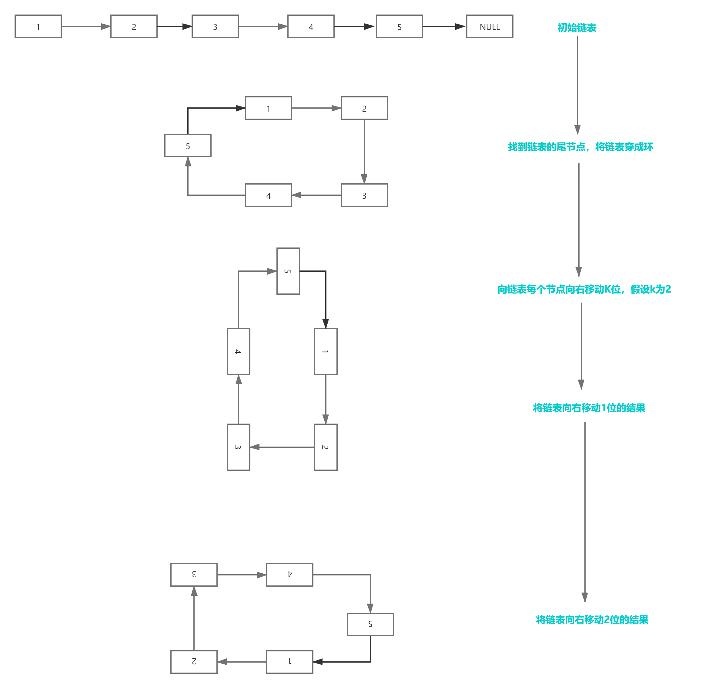
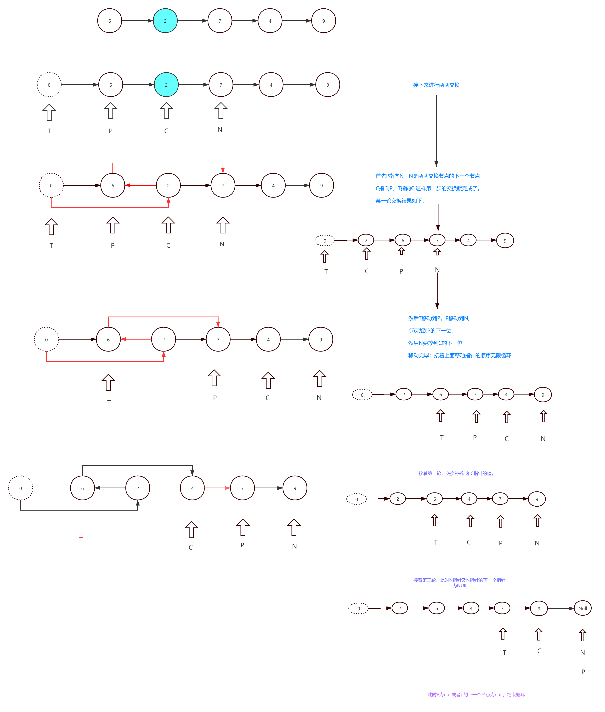
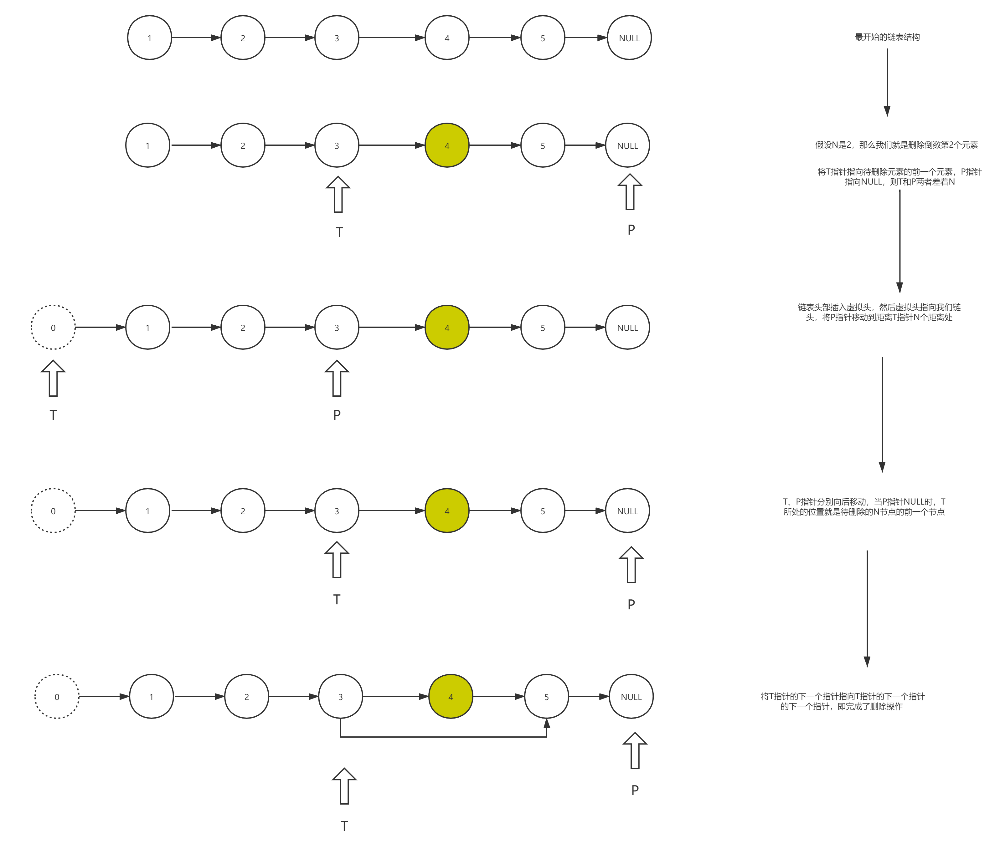
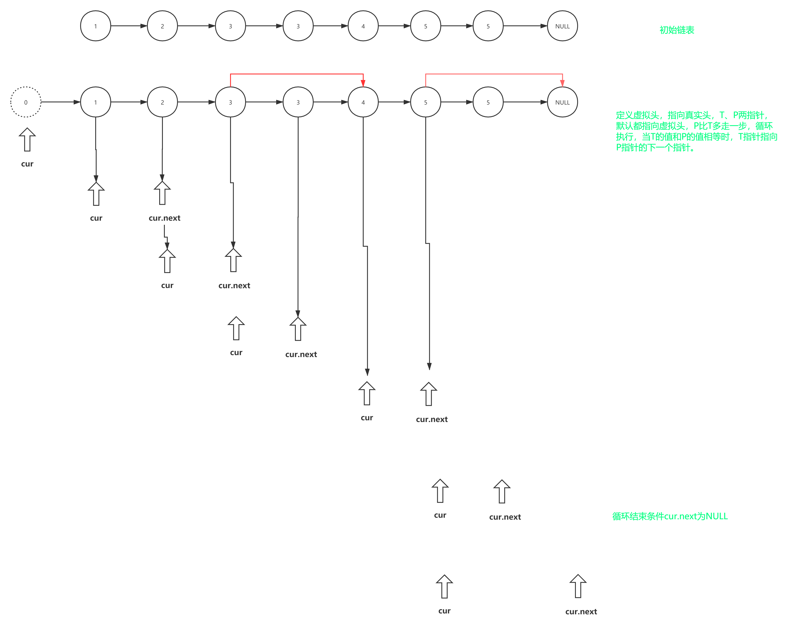

# 链表典型应用场景（三）

## 场景一：旋转链表

## 描述：给定一个链表，旋转链表，将链表每个节点向右移动k个位置，其中k是非负数。

## 算法思路：

- 判断我们的这个节点是不是为空。
- 找到我们链表的尾节点，穿成环。
- 获取到链表的长度，找到size-k个节点
- 将头部节点指向size-k个节点的下一个节点。
- 断开size-k个节点的下一个节点。

## 思维导图如下：

代码编写如下：

```javascript
/**
 * @param {ListNode} head
 * @param {number} k
 * @return {ListNode}
 */
var rotateRight = function (head, k) {
  if (!head) return null
  let cur = head,
    size = 1
  while (cur.next) {
    cur = cur.next
    size += 1
  }
  cur.next = head //将链表尾节点和head穿成环
  // 找到向右旋转的个数
  k = k % size // 处理k大于链表长度的情况
  k = size - k // 链表向右移动的位数
  while (k--) { // 将链表右移k位
    cur = cur.next
  }
  head = cur.next
  cur.next = null
  return head
}
```

## 场景二：旋转链表二

## 描述：给定一个链表，两两交换其中相邻的节点，并返回交换后的链表。 

## 算法思路：

1. 创建一个虚拟头节点T,指向链表里的head;
2. 再分别命名三个指针，指向原链表的head，head.next和head.next.next;
3. 接下来进行两两交换：
4. 首先P指向N，接着C指向P，然后T指向C；这样第一步的交换就完成了；
5. 接着T移动到P，然后P移动到N，然后C移动到P后一位，然后N要放在C的下一位，移动完毕；
6. 接着上种移动指针的顺序无限循环；
7. 接着第二轮，交换P指针和C指针的值，然后，T指针到P的位置；
8. 接着P指针到N的位置，然后，N往后移一位：
9. 这里思考一下，如果，没有9这个节点呢？我们需要注意什么 呢？
10. 此时要判断P==null || p.nex==null;

## 思维导图如下：



代码编写如下：

```javascript
/**
 * @param {ListNode} head
 * @return {ListNode}
 */
var swapPairs = function(head) {
  let ret = new ListNode(-1, head),temp = ret;
  while(temp.next && temp.next.next) {
    let pre = temp.next,cur = temp.next.next;
    pre.next = cur.next;
    cur.next = pre;
    temp.next = cur;
    temp = pre;
  }
  return ret.next;
};
```
## 场景三：删除链表的倒数第 N 个结点

## 描述：给你一个链表，删除链表的倒数第 `n` 个结点，并且返回链表的头结点。 

**提示：**

- 链表中结点的数目为 `sz`
- `1 <= sz <= 30`
- `0 <= Node.val <= 100`
- `1 <= n <= sz`

## 算法思路：

1. 先假设我的N是2 ，那么我们就是删除倒数第2个元素，但是链表是没有索引的，就不能按着数组的方法删除； 
2. 想要删除倒数第N个元素，就必须找到当前待删除的前一个元素； 
3. 那么如何删除倒数第2个元素呢？
4.  首先，先在当前待删除元素的前一个元素命名为T指针，然后呢，在当前链表的尾节点他指向的是NUll空指针，我们命名为这个空指针是P
5. 当我们P指针指向的是NUll的时候，我们的T指针必然指向的是当前待删除的前一个元素； 
6. 所以T指针和P指针两者的关系和距离显而易见；T和P两者差着题中给定的N个节点，差着 N+1个步；
7. 接着我们将链表的头部插入一个虚拟头节点；然后将虚拟头节点指向我们链表的头节点；
8. 然后让T指针在虚拟头节点的位置上，根据第6点得到T和P之间的距离，把P 放到正确位 置
9. 当 P指向NULL时候，当前待删除节点的前一个节点就找到了
10. 最后，让当前待删除的前一个节点 指向 待删除的下一个节点；也就是断开了当前待删除 的节点的前一位到当前待删除的节点的指向；    

## 思维导图如下：



代码如下：

```javascript
/**
* Definition for singly-linked list.
* function ListNode(val, next) {
* this.val = (val===undefined ? 0 : val)
* this.next = (next===undefined ? null : next)
* }
*/
/**
* @param {ListNode} head
* @param {number} n
* @return {ListNode}
*/
var removeNthFromEnd = function (head, n) {
  if (!head) return null
  let ret = new ListNode(-1, head),
    pre = ret,
    cur = head
  while (n--) cur = cur.next
  if (!cur) return head.next
  while (cur) (pre = pre.next), (cur = cur.next)
  pre.next = pre.next.next
  return ret.next
}
```

## 场景四：删除排序链表中重复的元素    

## 描述：给你一个有序数组 `nums` ，请你 **原地** 删除重复出现的元素，使每个元素 **只出现一次** ，返回删除后数组的新长度。

## 算法思路：

1. 首先声明一个虚拟头节点，然后让这个虚拟头节点指向链表的head； 
2. 接着使用双指针，慢指针是T,快指针是P,P比T多走一位; 
3. 然后设置一个while循环，如果T.val = P.next.val，那么就是出现了重复的元素，就需要去重；
4. 删除的方法就是让 T 的下一个指针指向下一个的下一个；
5.  如果不相等则 T 移动到下一个位置继续循环；
6. 当 T 和 P.next 的存在为循环结束条件，当二者有一个不存在时说明链表没有去重复的必要了；

## 思维导图：



## 代码如下：

```javascript
/**
 * @param {ListNode} head
 * @return {ListNode}
 */
var deleteDuplicates = function (head) {
  if (!head) return null
  let cur = head
  while (cur && cur.next) {
    if (cur.val == cur.next.val) {
      cur.next = cur.next.next
    } else {
      cur = cur.next
    }
  }
  return head
}
```

## 场景五：删除排序链表中重复的元素||

## 描述：给定一个排序链表，删除所有含有重复数字的节点，只保留原始链表中 *没有重复出现* 的数字。

## 示例：

```javascript
输入: 1->2->3->3->4->4->5
输出: 1->2->5
```

## 算法思路：

1. 首先我们要新建一个节点指向head，为的是创建一条头指针为空的链(**因为删除重复元素时有可能需要删除第一个**)；
2. 接着我们遍历链表来查找重复的数；
3. 命名prev为前一个指针，cur为当前指针； 
4. 如果cur 和 cur.next的val相同，那么cur继续向前移，prev不动； 
5. 等到不相同了，再将prev.next指向cur.next，这样就一次性跳过重复的数； 
6. 当然有时候还没遇到相同数，而我们又需要更新prev； 
7. 所以多加一个判断条件，来判断是要更新prev还是删除相同数;

## 代码编写：

```javascript
var deleteDuplicates = function (head) {
  if (!head) return null
    pre = ret,
    cur = head
  while (cur && cur.next) {
    if (cur.next.val != pre.next.val) {
      cur = cur.next
      pre = pre.next
    } else {
      while (cur && cur.next && pre.next.val == cur.next.val) {
        cur = cur.next
      }
      pre.next = cur.next
      cur = cur.next
    }
  }
}  
```

