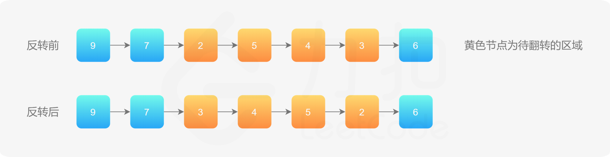
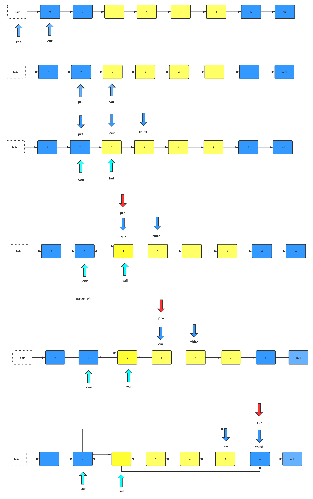

# 链表典型应用场景（二）

## 场景一：反转链表

## 描述：输入: 1->2->3->4->5->NULL类似这样的链表，输出: 5->4->3->2->1->NULL

## 算法思路：

- 定义pre节点指向空节点。

- 定义指针--cur，cur指向我们的头节点。

- 定义指针--next,next指向cur所指向节点的下一个节点。

  这样我们的指针就初始化完毕了。

1. 首先，我们将cur指针所指向的节点指向pre指针所指向的节点。

2. 然后，移动指针pre到指针cur所在的位置，移动cur到next所在的位置。此时，我们已经反转了第一个节点。

3. 将我们的next指针指向cur指针所指向节点的下一个节点。

   然后重复上述操作。

   代码编写如下：

   ```javascript
   /**
    * @param {ListNode} head
    * @return {ListNode}
    */
   var reverseList = function(head) {
     if (!head) return null;
     let pre = null,cur = head;
     while(cur) {
       [cur.next,pre,cur] = [pre,cur,cur.next]
       // let next = cur.next;
       // cur.next = pre;
       // pre = cur;
       // cur = next;
     }
     return pre;
   };
   ```

## 场景二：反转链表二

## 描述：反转从位置m到n的链表。请使用一趟扫描完成反转。

## 最终实现效果为：


## 算法思路：

1. 首先我们定义一个虚拟头节点，起名叫做hair，将它指向我们的真实头节点。
2. 定义一个指针pre指向虚拟头节点。
3. 定义一个指针cur指向pre指针所指向节点的下一个节点。
4. 让我们的pre指针和cur指针同时向后移动，直到我们找到了第m个节点。
5. 定义指针con和tail,con指向pre所指向的节点，tail指向cur指针所指向的节点。
6. con所指向的节点，将是我们将部分链表反转后，部分链表头节点的前驱节点。tail则是部分部分链表反转后的尾节点。
7. 开始我们的链表反转，首先定义一个指针third指向cur所指向的节点的下一个节点，然后,将cur所指向的节点指向pre所指向的节点，将pre指针移动到cur指针所在的位置。将cur指针移到到third指针所在的位置，直到我们的pre指针指向第n个节点。
8. 此时pre指针指向了第m个节点并且将第m到第n个节点之间反转完毕。
9. 我们将con指针所指向的节点指向pre指针所指向的节点，将tail指针所指的节点指向cur指针所指的节点。
10. 这样就完成了从到m到n链表的反转操作。

上述流程图：见下图所示




代码实现如下：

解法一：

```javascript
/**
 * Definition for singly-linked list.
 * function ListNode(val, next) {
 *     this.val = (val===undefined ? 0 : val)
 *     this.next = (next===undefined ? null : next)
 * }
 */
/**
 * @param {ListNode} head
 * @param {number} left
 * @param {number} right
 * @return {ListNode}
 */
var reverseBetween = function(head, left, right) {
  // 因为头节点有可能发生变化，使用虚拟头节点可以避免复杂的分类讨论
  const dummyNode = new ListNode(-1);
  dummyNode.next = head;

  let pre = dummyNode;
  // 第 1 步：从虚拟头节点走 left - 1 步，来到 left 节点的前一个节点
  // 建议写在 for 循环里，语义清晰
  for (let i = 0; i < left - 1; i++) {
      pre = pre.next;
  }

  // 第 2 步：从 pre 再走 right - left + 1 步，来到 right 节点
  let rightNode = pre;
  for (let i = 0; i < right - left + 1; i++) {
      rightNode = rightNode.next;
  }

  // 第 3 步：切断出一个子链表（截取链表）
  let leftNode = pre.next;
  let curr = rightNode.next;

  // 注意：切断链接
  pre.next = null;
  rightNode.next = null;

  // 第 4 步：反转链表的子区间
  reverseLinkedList(leftNode);

  // 第 5 步：接回到原来的链表中
  pre.next = rightNode;
  leftNode.next = curr;
  return dummyNode.next;
};

const reverseLinkedList = (head) => {
  let pre = null;
  let cur = head;

  while (cur) {
      const next = cur.next;
      cur.next = pre;
      pre = cur;
      cur = next;
  }
}
```

解法二：

```javascript
/**
 * Definition for singly-linked list.
 * function ListNode(val, next) {
 *     this.val = (val===undefined ? 0 : val)
 *     this.next = (next===undefined ? null : next)
 * }
 */
/**
 * @param {ListNode} head
 * @param {number} left
 * @param {number} right
 * @return {ListNode}
 */
var reverseBetween = function(head, left, right) {
    if (!head) return null;
    let ret = new ListNode(-1,head),pre = ret,cnt = right -left + 1;
    while(--left) {
        pre = pre.next
    }
    pre.next = reverse(pre.next, cnt);
    return ret.next;
};

var reverse = function(head, n) {
    let pre = null, cur = head;
    while(n--) {
        [cur.next, pre, cur] = [pre, cur,cur.next];
    }
    head.next = cur;
    return pre;
}
```

## 场景三： K个一组反转链表

## 描述：给你一个链表，每 *k* 个节点一组进行翻转，请你返回翻转后的链表。*k* 是一个正整数，它的值小于或等于链表的长度。

## 如果节点总数不是 *k* 的整数倍，那么请将最后剩余的节点保持原有顺序。 

## 算法思路：

1. 首先我们创建一个虚拟头节点hair，并将虚拟头节点指向链表的头节点。

2. 定义指针pre指向虚拟头节点，定义指针tail指向pre所指的节点。

3. 移动tail指针，找到第k个节点。

4. 反转从head节点到tail节点之间的链表，我们可以参照前面的反转链表方法，将反转链表操作抽取出来成为一个方法命名为reverse。

5. 我们向reverse方法中传入head节点以及tail指针所指向的节点。

6. 定义一个指针pre指向tail指针所指节点的下一个节点，定义指针p指向head节点，定义指针next指向p指针所指向节点的下一个节点。

7. 将指针p所指的节点指向指针pre所指的节点。

8. 将pre指针挪动到p指针所指指针的节点上。

9. 将p指针挪动到next指针所指的节点上。

10. next指针则继续指向p指针所指节点的下一个节点。

11. 重复上述步骤。

12. 当指针prev与指针tail指向同一个节点的时候，我们的k个一组的链表反转完成了，然后将这部分链表返回。

13. 让pre指针所指的节点指向tail指针所指的节点。

14. pre指针移动到head指针所在的位置，head指针移动到pre指针所指节点的下一个节点。

15. tail指针再次指向pre指针所指的节点。

16. 然后tail节点再移动K步，如果tail节点为空，证明后面的节点不足K个，返回链表。

    ```javascript
    /*
     * @lc app=leetcode.cn id=25 lang=javascript
     *
     * [25] K 个一组翻转链表
     */
    
    // @lc code=start
    /**
     * Definition for singly-linked list.
     * function ListNode(val, next) {
     *     this.val = (val===undefined ? 0 : val)
     *     this.next = (next===undefined ? null : next)
     * }
     */
    /**
     * @param {ListNode} head
     * @param {number} k
     * @return {ListNode}
     */
    var reverseKGroup = function(head, k) {
      if (!head) return null;
      let ret = new ListNode(-1, head),pre = ret;
      do {
        pre.next = reverse(pre.next, k);
        for(let i = 0; i<k&& pre;i++) {
          pre = pre.next;
        }
        if (!pre) break;
      } while(1);
      return ret.next;
    };
    var reverse = function (head, n) {
      let pre = head, cur = head, con = n;
      while(--n&&pre) {
        pre = pre.next;
      }
      if (!pre) return head;
      pre = null;
      while(con--) {
        [cur.next,pre, cur] = [pre,cur,cur.next];
      }
      head.next = cur;
      return pre;
    }
    ```

    