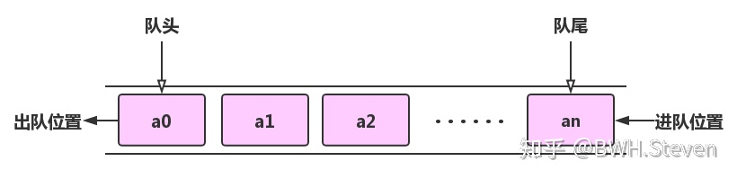
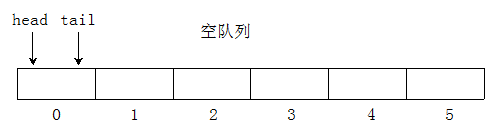
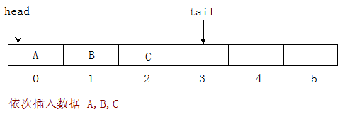
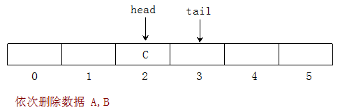
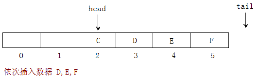
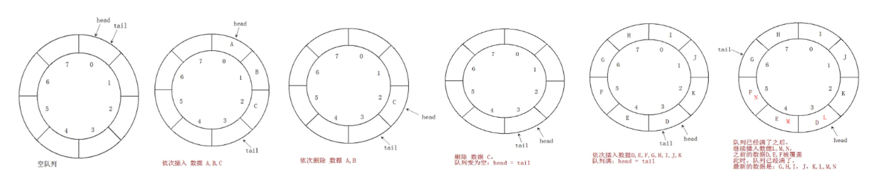

## 关于队列

## 引言

中午在食堂打饭，真是一个令人头疼的事情，去食堂的路上也总是步伐匆匆，为什么啊，这还用说，迟一点去，你就会知道什么叫做人山人海，在食堂排队的时候，相比较学生来说，打饭阿姨毕竟是少说，在每个窗口都有人的时候，不免我们就得等待，直到前面的一个学生打完饭离开，后面排队的人才可以继续向前走，直到轮到自己，别提多费劲了，但是秩序和规则却是我们每个人应该遵守的，也只能抱怨自己来的迟了。

**这种"先进先出"的例子就是我们所讲的基本数据结构之一"队列"**

## 队列的基本定义

定义：队列是一种只允许在一段进行删除操作，在另一端进行插入操作的线性表

允许插入的一段称作队尾(rear)，允许删除的一端称为队头(front)

队列的数据元素又叫做队列元素，在队列中插入一个队列元素称为入队，从队列中删除一个队列元素称为出队，也正是因为队列只允许在一段插入，另一端删除，所以这也就是我们前面例子中体现出来的先进先出(FIFO-first in first out)的概念。



## 队列的顺序表示-顺序队列

用一组连续的存储单元依次存放从队首到队尾的元素，附设两个指针head和tail分别指向队首元素和队尾元素的位置(有的地方用front和rear表示)



当head = tail = 0 时表示空队列



当插入新元素到队尾时，tail加1



当删除队首元素时，head加1 ，上图如果把c也删除，那么head = tail了，

tail始终指向队列元素的下一个元素

对应的操作：

- 队空: head  = tail

- 求队长:tail - head

- 入队:新元素按tail指示位置加入，再将队尾指针加1，即tail = tail + 1

- 出队:将head指示的元素取出，再将队头指针加1，即head = head + 1



依次插入数据D,E,F，此时tail指向队尾的下一位，再插入数据就无法将数据插入队列，很明显该队列还有存储空间未使用，但队列已溢出，此时称为假溢出。

## 队列的抽象数据类型

```javascript
class Queue {
  constructor(n) {
    this.head = 0
    this.tail = 0
    this.queue = new Array(n)
  }
  enQueue(value) {
    if (this.isFull()) return false
    this.queue[this.tail] = value
    this.tail += 1
    return true
  }
  deQueue() {
    if (this.isEmpty()) return false
    this.head += 1
    return true
  }
  isFull() {
    return this.tail === this.queue.length
  }
  isEmpty() {
    return this.head === this.tail
  }
  front() {
    if (this.isEmpty()) return -1
    return this.queue[this.head]
  }
  rear() {
    if (this.isEmpty()) return -1
    return this.queue[this.tail - 1]
  }
  output() {
    let output = []
    for (let i = this.head; i < this.queue.length;i++) {
      output.push(this.queue[this.head])
      this.head += 1;
    }
   console.log(output) 
  }
}
```

**测试代码**

```javascript
let queue = new Queue(3)
queue.enQueue(1)
queue.enQueue(2)
queue.enQueue(3)
queue.enQueue(4)
queue.deQueue()
queue.enQueue(5)
queue.enQueue(6)
console.log(queue.front()) // 2
console.log(queue.rear()) // 3
console.log(queue.isFull()) // true
queue.output() // [2,3]
```

## 循环队列

## 定义

为充分利用向量空间，克服"[假溢出](https://baike.baidu.com/item/%E5%81%87%E6%BA%A2%E5%87%BA/11050937)"现象的方法是：将向量空间想象为一个首尾相接的圆环，并称这种向量为循环向量。存储在其中的队列称为循环队列（Circular Queue）。循环队列是把[顺序队列](https://baike.baidu.com/item/%E9%A1%BA%E5%BA%8F%E9%98%9F%E5%88%97/20832734)首尾相连，把存储队列元素的表从逻辑上看成一个环，成为循环队列。

1. 当head = tail = 0 时表示空队列

2. 依次插入数据A、B和C，入队时tail指针发生变化。即tail = (tail  + 1) % maxsize，此处A、B和C入队后，tail依次处在tail = (0 + 1) % 8 = 1，tail = (1 + 1) % 8 = 2，tail = (2 + 1) % 8 = 3索引的位置处。

3. 依次删除数据A、B，head = (head + 1) % maxsize,删除数据C，队列为空。

4. 依次插入数据D,E,F,G,H,I,J,K，队列满：head = tail。

5. 队满和队空时，均有head = tail,因些，只凭head = tail无法区分是满还是空。

   如何判断队列满还是空？

   **方法1： 用一个计数变量来记载队列中的元素个数**

   初始化队列时c=0; 

   当入队时，计数变量＋1（ c=c+1 ） 

   当出队时，计数变量－1 （c=c-1） 

   当计数变量＝maxsize时，队满 

   当计数变量＝0时，队空 

## 
  

## 循环队列的抽象数据类型

```javascript
var MyCircularQueue = function(k) {
  this.head = 0 // 表示队首的索引
  this.tail = 0 // 表示队尾的索引
  this.cnt = 0 // 队列包含的总元素数
  this.queue = new Array(k) // 首先创建一个容量为k的数组，用来存储数据
}

MyCircularQueue.prototype.enQueue = function (value) {
  if (this.isFull()) return false
  this.queue[this.tail] = value
  this.tail += 1
  if (this.tail === this.queue.length) this.tail = 0
  // 等价于this.tail = (this.tail + 1) % this.queue.length
  this.cnt += 1
  return true
}

MyCircularQueue.prototype.deQueue = function () {
  if (this.isEmpty()) return false
  this.head += 1
  if (this.head === this.queue.length) this.head =  0
  // 等价于 this.head = (this.head + 1) % this.queue.length
  this.cnt -= 1
  return true
}

MyCircularQueue.prototype.front = function () {
  if (this.isEmpty()) return -1
  return this.queue[this.head]
}

MyCircularQueue.prototype.tail = function () {
  if (this.isEmpty()) return -1
  return this.queue[(this.tail - 1 + this.queue.length) % this.queue.length)]
}

MyCircularQueue.prototype.isEmpty = function () {
  return this.cnt === 0
}

MyCircularQueue.prototype.isFull = function () {
  return this.cnt === this.queue.length
}

MyCircularQueue.prototype.size = function () {
  return this.cnt
}

MyCircularQueue.prototype.output  = function () {
  let output = 'Queue: '
  for (let i = 0,j = this.head;i<this.cnt;i++){
   output += this.queue[j] + ' '
   j += 1
   if (j === this.queue.length) j = 0 
  }
  console.log(output)
}

MyCircularQueue.prototype.clear = function () {
  this.head = this.tail = this.cnt = 0
  return true
}
```

**测试代码**

```javascript
let myCircularQueue = new MyCircularQueue(5)
myCircularQueue.enQueue(2)
myCircularQueue.enQueue(3)
myCircularQueue.enQueue(4)
myCircularQueue.deQueue()
myCircularQueue.enQueue(5)
myCircularQueue.enQueue(6)
myCircularQueue.enQueue(7)
myCircularQueue.output() // Queue: 3 4 5 6 7

```

