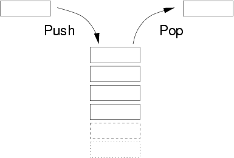

## 关于栈

## 定义

堆栈被称为是后进先出(LIFO last-in,first-out)的数据结构——最后压进（插入到）堆栈的项最先从堆栈中弹出或移除 。

## 特点

只允许在一端进行插入和删除的线性表

## 

## 栈实现的功能如下

- push：在最顶层加入数据。
- pop：返回并移除最顶层的数据。
- peek：返回最顶层数据的值，但不移除它。
- clear： 去除栈中所有元素。
- length： 获取栈中元素个数。

```javascript
// 构造函数
function Stack () {
    this.dataList = [];
    this.top = -1;
}

// 入栈操作
Stack.prototype.push = function (el) {
    this.dataList[++this.top] = el;
}

// 出栈操作
Stack.prototype.pop = function () {
    return this.dataList[this.top--];
}

// 获取栈顶元素
Stack.prototype.peek = function () {
    return this.dataList[this.top];
}

// 去除栈中所有元素
Stack.prototype.clear = function () {
    delete this.dataList;
    this.dataList = [];
    this.top = -1;
}

// 获取栈中元素个数
Stack.prototype.length = function () {
    return this.top + 1;
}
```

## 应用

1、括号匹配

2、化栈为队

3、递归

4、浏览器的前进后退功能