# JavaScript可视化：Promise和Async/Await
> 如果你还没有阅读我之前发表的文章JavaScript事件循环，那么先去阅读一下可能会更好的理解这篇文章。我将会再次涉及事件循环，假设一些关于调用栈、Web API和队列等基础知识，但是这次我也会介绍一些令人兴奋的额外特性
## 介绍
在书写JavaScript的时候，我经常不得不去处理一些依赖于其它任务的任务！比如说我们想要得到一个图片，对其进行压缩，应用一个滤镜，然后保存它 。
我们最先需要做的事情是得到我们想要编辑的图片。getImage函数可以处理这个问题！一旦图片被成功加载，我们可以传递那个值到一个resizeImage函数。当图片已经被成功地重新调整大小时，我们想要在applyFilter函数中为图片应用一个滤镜。在图片被压缩和添加滤镜后，我们想要保存图片并且让用户知道所有的事情都正确地完成了！
最后，我们可能得到这样的结果:

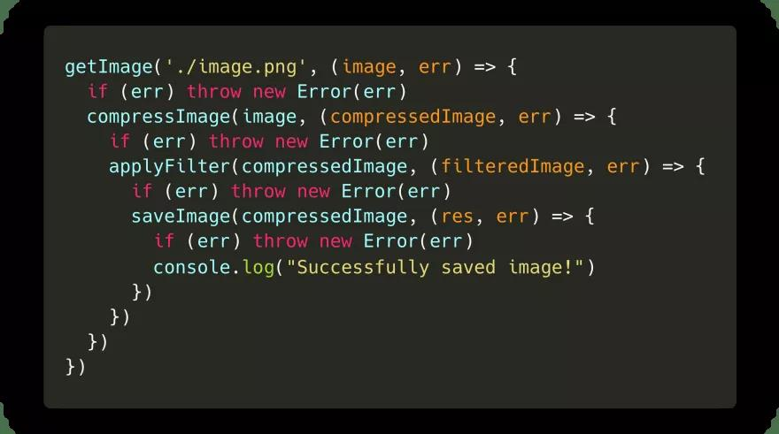

额，注意到了吗？尽管它完成了事情，但是完成的并不是很好。我们最终得到了许多嵌套的回调函数，这些回调函数依赖于前一个回调函数。这通常被称为回调地狱，由于我们最终得到了大量嵌套的回调函数，这使我们的代码阅读起来特别困难。
幸运的，我们现在有一个叫做Promise的东西来帮助我们摆脱困境！让我们看看promise是什么，以及它们是如何在类似于上述的情况下帮助我们的。
## Promise语法
ES6引入了Promise。在许多教程中，你可能会读到这样的内容：

> Promise是一个值的占位符，这个值在未来的某个时间要么resolve要么reject

对于我来说，这样的解释从没有让事情变得更清楚。事实上，它只是让我感觉Promise是一个奇怪的、模糊的、不可预测的一段魔法。接下来让我们看看promise真正是什么？

我们可以使用一个接收一个回调函数的Promise构造器创建一个promise。

好酷，让我们尝试一下！

等等，刚刚得到的返回是什么？

Promise是一个对象，它包含一个状态[[PromiseStatus]]和一个值[[PromiseValue]]。在上面的例子中，你可以看到[[PromiseStatus]]的值是pending,promise的值是undefined

不要担心 - 你将永远不会与这个对象进行交互，你甚至不能访问[[PromiseStatus]]和[[PromiseValue]]这俩个属性！

然而，在使用Promise的时候，这俩个属性的值是非常重要的。

PromiseStatus的值，也就是Promise的状态，可以是以下三个值之一：

- ✅fulfilled: promise已经被resolved。一切都很好，在promise内部没有错误发生。
- ❌rejected: promise已经被rejected。哎呦，某些事情出错了。
- ⏳pending: promise暂时还没有被解决也没有被拒绝，仍然处于pending状态

好吧，这一切听起来很棒，但是什么时候promise的状态是pending、fulfilled或rejected呢? 为什么这个状态很重要呢？

在上面的例子中，我们只是为Promise构造器传递了一个简单的回调函数()=> {}。然而，这个回调函数实际上接收两个参数。第一个参数的值经常被叫做resolve或res,它是一个函数，在Promise应该解决(resolve)的时候会被调用。第二个参数的值经常被叫做reject或rej,它也是一个函数，在Promise出现一些错误应该被拒绝(reject)的时候被调用。

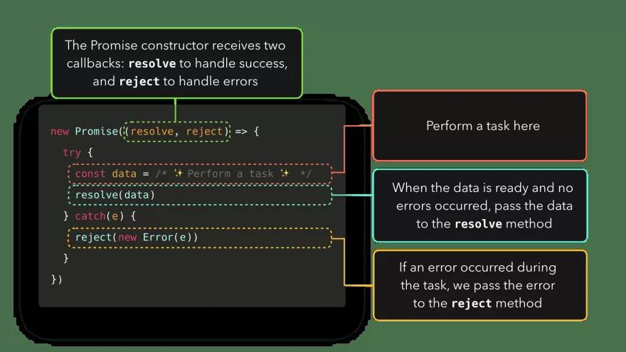

让我们尝试看看当我们调用resolve或reject方法时得到的日志。在我的例子中，把resolve方法叫做res,把reject方法叫做rej。

太好了！我们终于知道如何摆脱pending状态和undefined值了！当我们调用resolve方法时，promise的状态是fulfilled。当我们调用reject方法时，promise的状态是rejected。

promise的值，即[[PromiseValue]]的值，是我们作为参数传递给resolve或reject方法的值。

> 有趣的事实：我让Jake Archibald校对这篇文章，它指出当前的状态显示为resolved而不是fulfuilled实际上是Chrome中的一个bug。感谢Mathias Bynens，这个问题现在已经在Canary中修复了。译者注：Canary是谷歌浏览器的一个实验性的版本，方便开发者可以提前体验各种新特性。具体的介绍可以看这里:What is Chrome Canary?

好了，现在我们知道如何更好控制那个模糊的Promise对象。但是它被用来做什么呢？

在介绍章节，我展示了一个获得图片、压缩图片、为图片应用过滤器并保存它的例子！最终，这变成了一个混乱的嵌套回调。

幸运的，Promise可以帮助我们解决这个问题！首先，让我们重写整个代码块，以便每个函数返回一个Promise来代替之前的函数。

如果图片被加载完成并且一切正常，让我们用加载完的图片解决(resolve)promise!否则，如果在加载文件时某个地方有一个错误，我们将会用发生的错误拒绝(reject)promise。

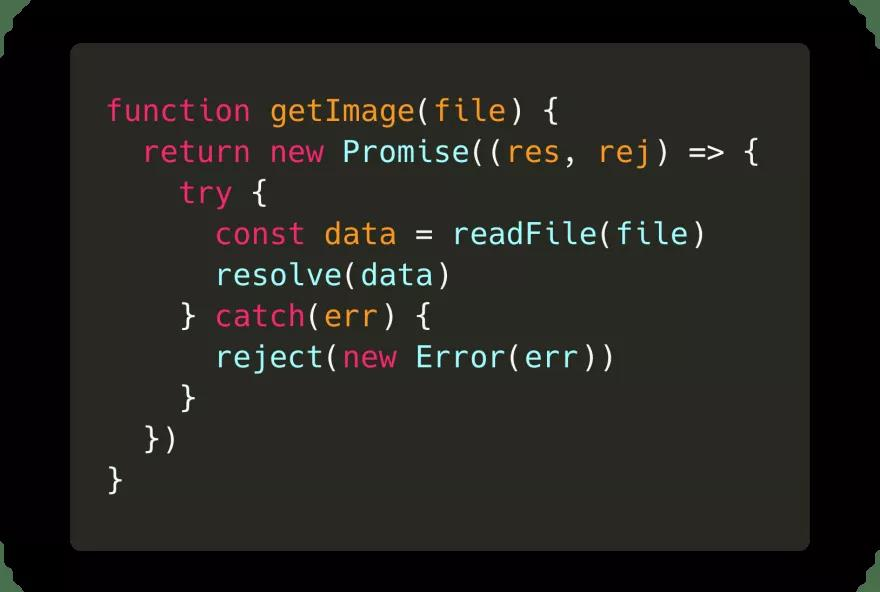

让我们看下当我们在终端运行这段代码时会发生什么？

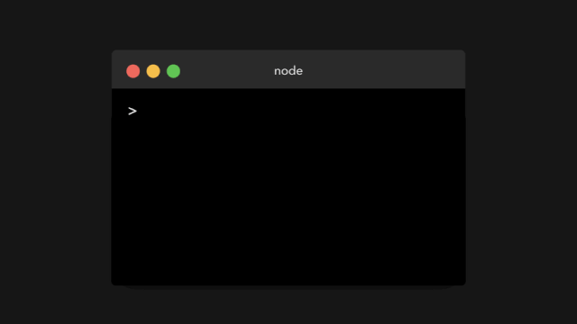

非常酷！就像我们所期望的一样，promise得到了解析数据后的值。

但是现在呢？我们不关心整个promise对象，我们只关心数据的值！幸运的，有内置的方法来得到promise的值。

对于一个promise, 我们可以使用它上面的3个方法：

- .then(): 在一个promise被resolved后调用
- .catch(): 在一个promise被rejected后被调用
- .finally(): 不论promise是被resolved还是reject总是调用

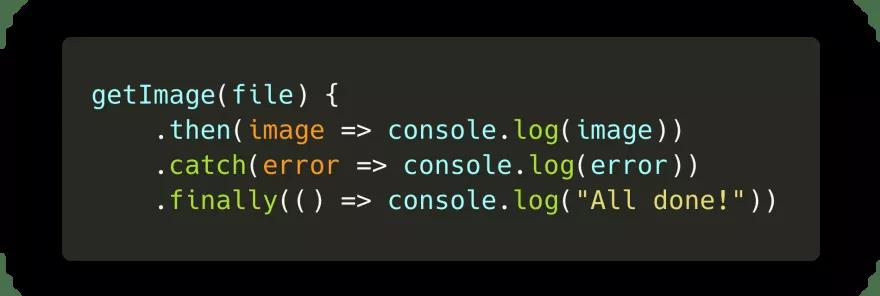

.then方法接收传递给resolve方法的值。

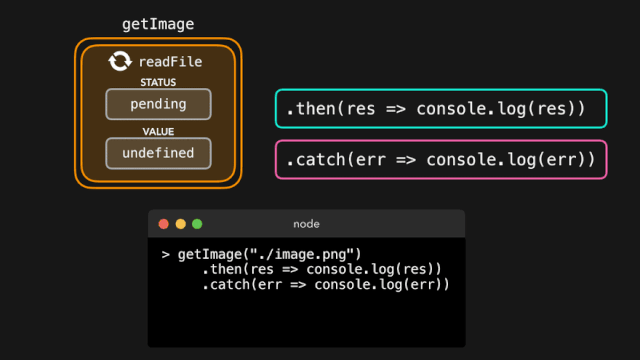

.catch方法接收传递给rejected方法的值

最终，我们拥有了promise被解决后(resolved)的值，并不需要整个promise对象！现在我们可以用这个值做任何我们想做的事。

顺便提醒一下，当你知道一个promise总是resolve或者总是reject的时候，你可以写Promise.resolve或Promise.reject，传入你想要reject或resolve的promise的值。

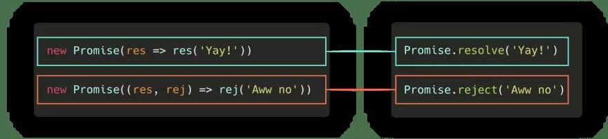

在下边的例子中你将会经常看到这个语法

在getImage的例子中，为了运行它们，我们最终不得不嵌套多个回调。幸运的，.then处理器可以帮助我们完成这件事！

.then它自己的执行结果是一个promise。这意味着我们可以链接任意数量的.then：前一个then回调的结果将会作为参数传递给下一个then回调！

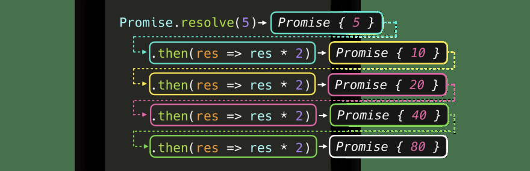

在getImage示例中，为了传递被处理的图片到下一个函数，我们可以链接多个then回调。相比于之前最终得到许多嵌套回调，现在我们得到了整洁的then链。

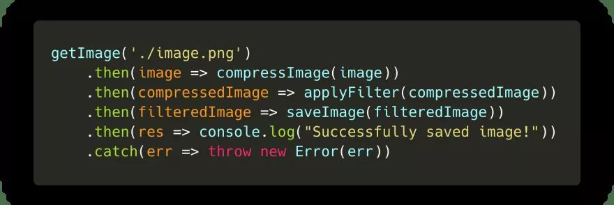

完美!这个语法看起来已经比之前的嵌套回调好多了。
## 宏任务和微任务(macrotask and microtask)
我们知道了一些如何创建promise以及如何提取出promise的值的方法。让我们为脚本添加一些更多的代码并且再次运行它：

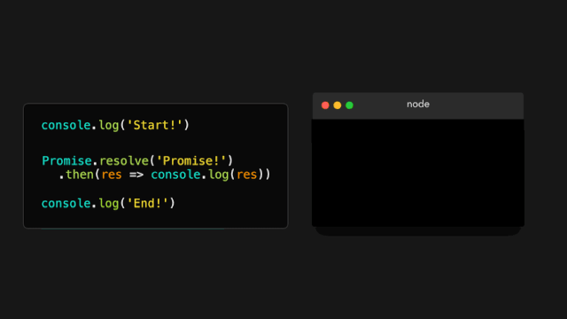

等下，发生了什么？！

首先，Start!被输出。好的，我们已经看到了那一个即将到来的消息：console.log('Start!')在最前一行输出！然而，第二个被打印的值是End!，并不是promise被解决的值！只有在End!被打印之后，promise的值才会被打印。这里发生了什么？

我们最终看到了promise真正的力量！尽管JavaScript是单线程的，我们可以使用Promise添加异步任务！

等等，我们之前没见过这种情况吗？在JavaScript event loop中，我们不是也可以使用浏览器原生的方法如setTimeout创建某类异步行为吗？

是的！然而，在事件循环内部，实际上有2种类型的队列：宏任务(macro)队列(或者只是叫做任务队列)和微任务队列。(宏)任务队列用于宏任务，微任务队列用于微任务。

那么什么是宏任务，什么是微任务呢？尽管他们比我在这里介绍的要多一些，但是最常用的已经被展示在下面的表格中！

我们看到Promise在微任务列表中！当一个Promise解决(resolve)并且调用它的then()、catch()或finally()方法的时候，这些方法里的回调函数被添加到微任务队列！这意味着then(),chatch()或finally()方法内的回调函数不是立即被执行，本质上是为我们的JavaScript代码添加了一些异步行为！

那么什么时候执行then(),catch(),或finally()内的回调呢？事件循环给与任务不同的优先级：
1. 当前在调用栈(call stack)内的所有函数会被执行。当它们返回值的时候，会被从栈内弹出。
2. 当调用栈是空的时，所有排队的微任务会一个接一个从微任务任务队列中弹出进入调用栈中，然后在调用栈中被执行！(微任务自己也能返回一个新的微任务，有效地创建无限的微任务循环 )
3. 如果调用栈和微任务队列都是空的，事件循环会检查宏任务队列里是否还有任务。如果宏任务中还有任务，会从宏任务队列中弹出进入调用栈，被执行后会从调用栈中弹出！

让我们快速地看一个简单的例子：

- Task1: 立即被添加到调用栈中的函数，比如在我们的代码中立即调用它。
- Task2,Task3,Task4: 微任务，比如promise中then方法里的回调，或者用queueMicrotask添加的一个任务。
- Task5,Task6: 宏任务，比如setTimeout或者setImmediate里的回调

首先，Task1返回一个值并且从调用栈中弹出。然后，JavaScript引擎检查微任务队列中排队的任务。一旦微任务中所有的任务被放入调用栈并且最终被弹出，JavaScript引擎会检查宏任务队列中的任务，将他们弹入调用栈中并且在它们返回值的时候把它们弹出调用栈。

图中足够粉色的盒子是不同的任务，让我们用一些真实的代码来使用它！

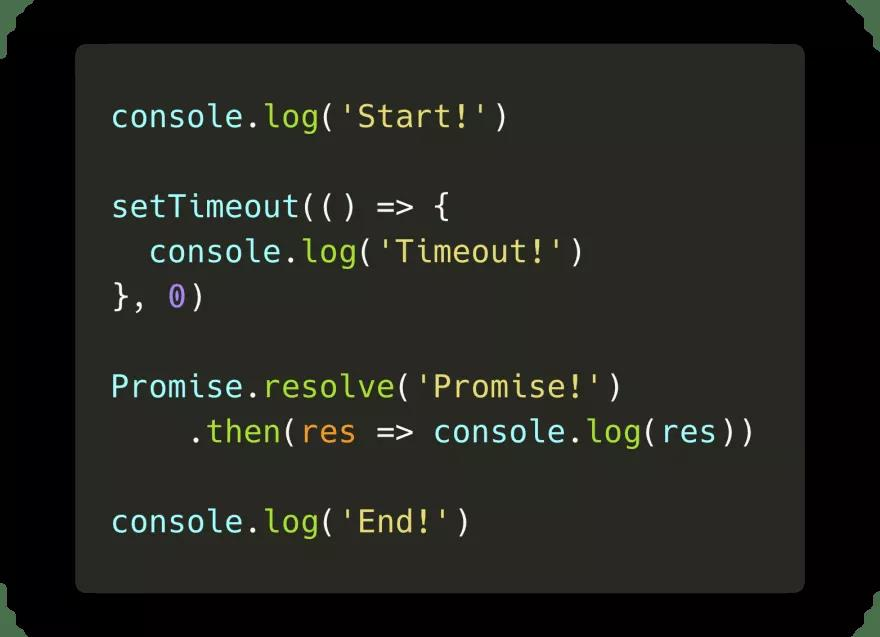

在这段代码中，我们有宏任务setTimeout和微任务promise的then回调。一旦JavaScript引擎到达setTimeout函数所在的那行就会涉及到事件循环。让我们一步一步地运行这段代码，看看会得到什么样的日志！

> 快速提一下：在下边的例子中，我正在展示的像console.log,setTimeout和Promise.resolve等方法正在被添加到调用栈中。它们是内部的方法实际上没有出现在堆栈痕迹中，因此如果你正在使用调试器，不用担心，你不会在任何地方见到它们。它只是在没有添加一堆样本文件代码的情况下使这个概念解释起来更加简单。

在第一行，JavaScript引擎遇到了console.log()方法，它被添加到调用栈，之后它在控制台输出值Start!。console.log函数从调用栈内弹出，之后JavaScript引擎继续执行代码。

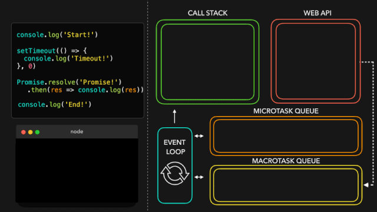

JavaScript引擎遇到了setTimeout方法，他被弹入调用栈中。setTimeout是浏览器的原生方法：它的回调函数(() => console.log('In timeout'))将会被添加到Web API，直到计时器完成计时。尽管我们为计时器提供的值是0，在它被添加到宏任务队列(setTimeout是一个宏任务)之后回调还是会被首先推入Web API。

JavaScript引擎遇到了Promise.resolve方法。Promise.resolve被添加到调用栈。在Promise解决(resolve)值之后，它的then中的回调函数被添加到微任务队列。

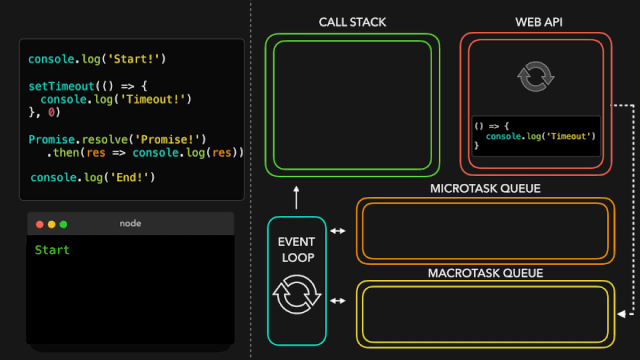

JavaScript引擎遇到了console.log()方法。它被立即添加到调用栈，在它在控制台输出End!之后，从调用栈中弹出，之后JavaScript引擎继续执行代码。

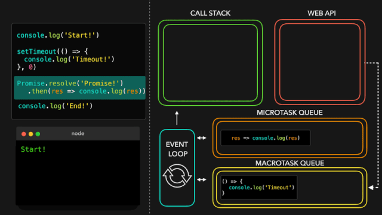

JavaScript引擎看到调用栈现在是空的。由于调用栈是空的，它将会去检查在微任务队列中是否有在排队的任务！是的，有任务在排队，promise的then中的回调函数正在等待轮到它！它被弹入调用栈，之后它输出了promise被解决后(resolved)的值: 在这个例子中的字符串Promise!。

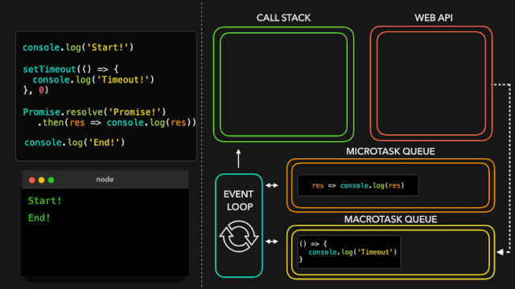

JavaScript引擎看到调用栈是空的，因此，如果任务在排队的话，它将会再次去检查微任务队列。此时，微任务队列完全是空的。

到了去检查宏任务队列的时候了：setTimeout回调仍然在那里等待！setTimeout被弹入调用栈。回调函数返回console.log方法，输出了字符串In timeout!。setTimeout回调从调用栈中弹出。

终于，所有的事情完成了! 看起来我们之前看到的输出最终并不是那么出乎意料。

## Async/Await

ES7引入了一个新的在JavaScript中添加异步行为的方式并且使promise用起来更加简单！随着async和await关键字的引入，我们能够创建一个隐式的返回一个promise的async函数。但是，我们该怎么做呢？

之前，我们看到不管是通过输入new Promise(() => {}),Promise.resolve或Promise.reject，我们都可以显式的使用Promise对象创建promise。

我们现在能够创建隐式地返回一个对象的异步函数，而不是显式地使用Promise对象！这意味着我们不再需要写任何Promise对象了。

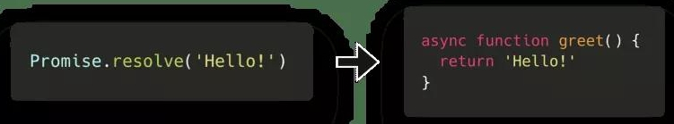

尽管async函数隐式的返回promise是一个非常棒的事实，但是在使用await关键字的时候才能看到async函数的真正力量。当我们等待await后的值返回一个resolved的promise时，通过await关键字，我们可以暂停异步函数。如果我们想要得到这个resolved的promise的值，就像我们之前用then回调那样，我们可以为被await的promise的值赋值为变量！

这样，我们就可以暂停一个异步函数吗？很好，但这到底是什么意思？

当我们运行下面的代码块时让我们看下发生了什么：

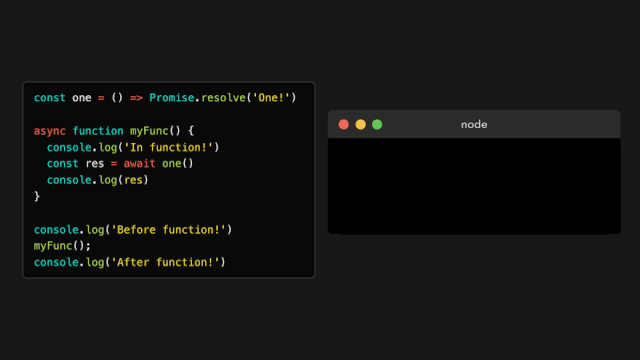

额，这里发生了什么呢？

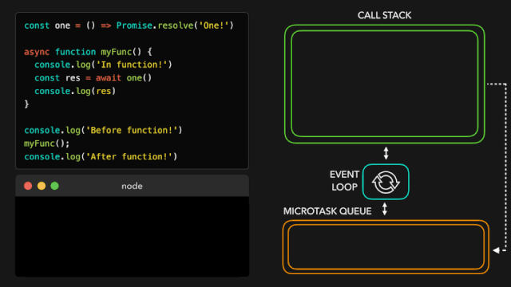

首先，JavaScript引擎遇到了console.log。它被弹入到调用栈中，这之后Before function!被输出。

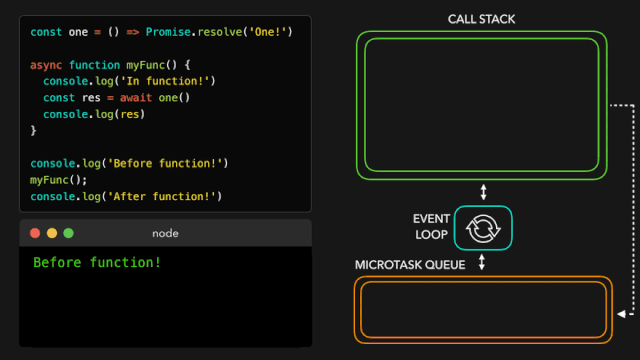

然后，我们调用了异步函数myFunc()，这之后myFunc函数体运行。函数主体内的最开始一行，我们调用了另一个console.log，这次传入的是字符串In function!。console.log被添加到调用栈中，输出值，然后从栈内弹出。

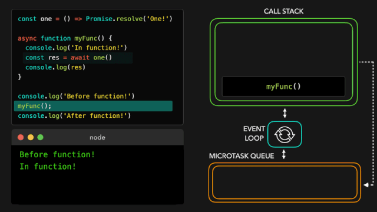

函数体继续执行，将我们带到第二行。最终，我们看到一个await关键字！

最先发生的事是被等待的值执行：在这个例子中是函数one。它被弹入调用栈，并且最终返回一个解决状态的promise。一旦Promise被解决并且one返回一个值，JavaScript遇到了await关键字。

当遇到await关键字的时候，异步函数被暂停。函数体的执行被暂停，async函数中剩余的代码会在微任务中运行而不是一个常规任务！

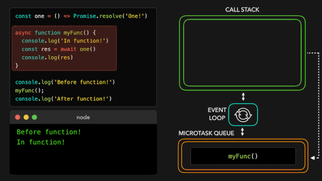

现在，因为遇到了await关键字，异步函数myFunc被暂停，JavaScript引擎跳出异步函数，并且在异步函数被调用的执行上下文中继续执行代码：在这个例子中是全局执行上下文！‍♀️

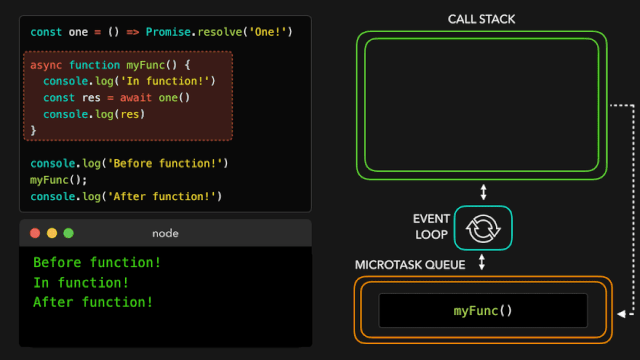

最终，没有更多的任务在全局执行上下文中运行！事件循环检查看看是否有任何的微任务在排队：是的，有！在解决了one的值以后，异步函数myFunc开始排队。myFunc被弹入调用栈中，在它之前中断的地方继续运行。

变量res最终获得了它的值，也就是one返回的promise被解决的值！我们用res的值(在这个例子中是字符串One!)调用console.log。One!被打印到控制台并且console.log从调用栈弹出。

最终，所有的事情都完成了！你注意到async函数相比于promise的then有什么不同吗？await关键字暂停了async函数，然而如果我们使用then的话，Promise的主体将会继续被执行！

嗯，这是相当多的信息！当使用Promise的时候，如果你仍然感觉有一点不知所措，完全不用担心。我个人认为，当使用异步JavaScript的时候，只是需要经验去注意模式之后便会感到自信。

当使用异步JavaScript的时候，我希望你可能遇到的“无法预料的”或“不可预测的”行为现在变得更有意义！