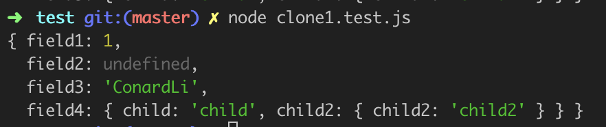
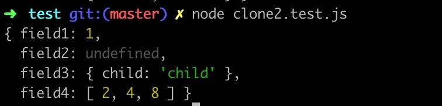
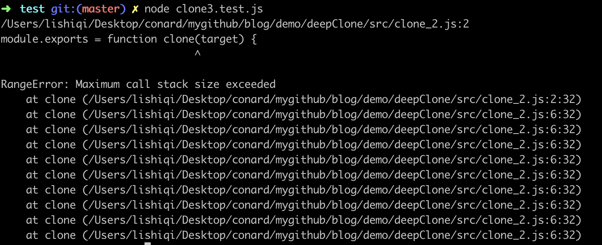
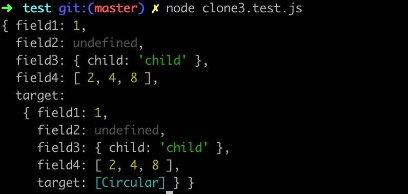
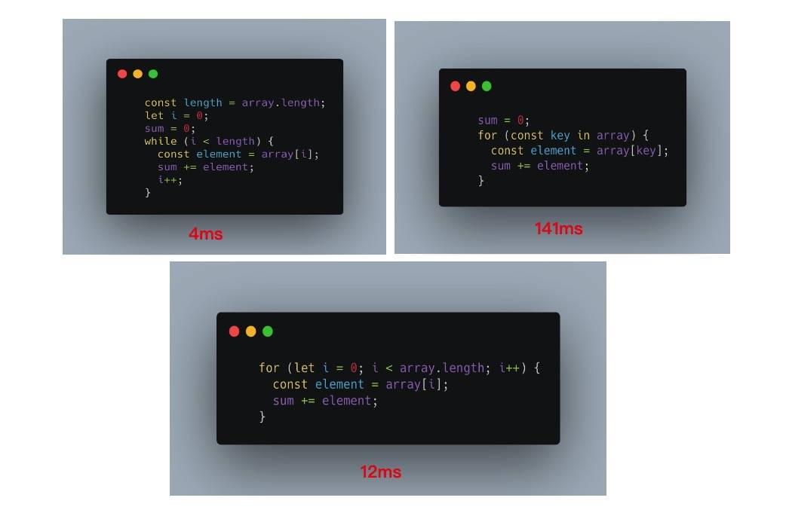
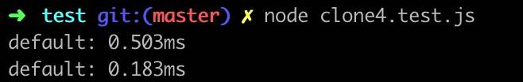
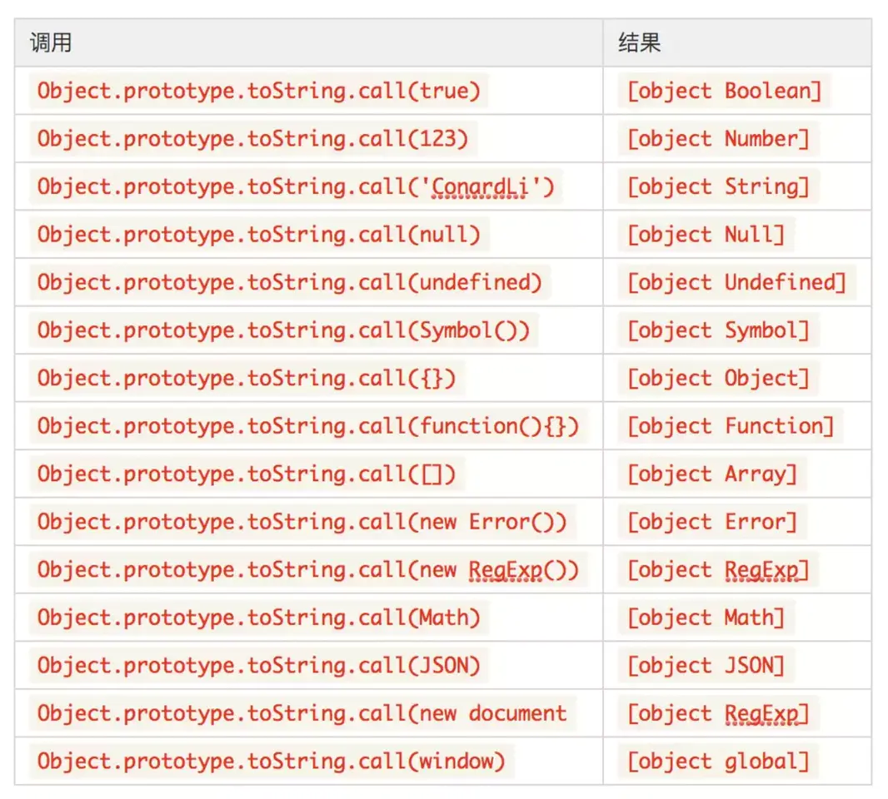
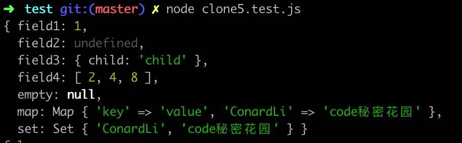
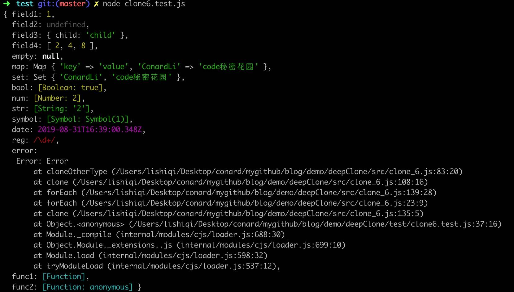
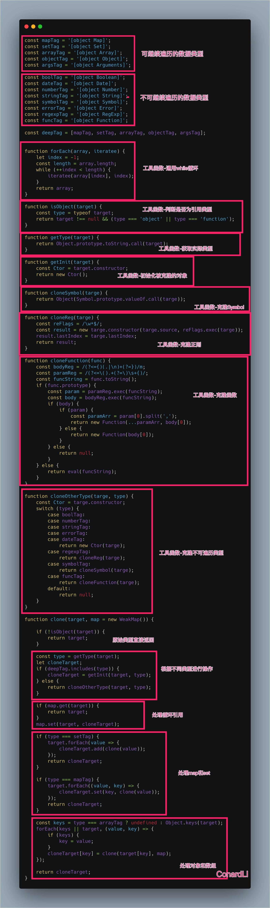

# 如何写出一个惊艳面试官的深拷贝？ 

**赋值（Copy）**

赋值是将某一**数值或对象**赋给某个**变量**的过程，分为：

1、基本数据类型：赋值，赋值之后两个变量互不影响

2、引用数据类型：赋**址**，两个变量具有相同的引用，指向同一个对象，相互之间有影响

对基本类型进行赋值操作，两个变量互不影响。

```javascript
// success
let a = "success";
let b = a;
console.log(b);  // success

a = "error";
console.log(a);   // error

console.log(b);    // success
```

对引用类型进行赋**址**操作，两个变量指向同一个对象，改变变量 a 之后会影响变量 b，哪怕改变的只是对象 a 中的基本类型数据。

```javascript
// success
let a = {
    name: "success",
    book: {
        title: "You Don't Know JS",
        price: "45"
    }
}
let b = a;
console.log(b);
// {
// 	name: "success",
// 	book: {title: "You Don't Know JS", price: "45"}
// } 

a.name = "change";
a.book.price = "55";
console.log(a);
// {
// 	name: "change",
// 	book: {title: "You Don't Know JS", price: "55"}
// } 

console.log(b);
// {
// 	name: "change",
// 	book: {title: "You Don't Know JS", price: "55"}
// }
```

通常在开发中并不希望改变变量 a 之后会影响到变量 b，这时就需要用到浅拷贝和深拷贝。

在讲javascript之前先问自己三个问题：

- 你真的理解什么是深拷贝吗？
- 在面试官眼里，什么样的深拷贝才算合格？
- 什么样的深拷贝能让面试官感到惊艳？

本文由浅入深，带你一步一步实现一个惊艳面试官的深拷贝。

## 深拷贝和浅拷贝的定义

深拷贝已经是一个老生常谈的话题了，也是现在前端面试的高频题目，但是令我吃惊的是有很多同学还没有搞懂深拷贝和浅拷贝的区别和定义。

- **浅拷贝**：拷贝的是对象的指针，修改内容互相影响

- **深拷贝**：整个对象拷贝到另一个内存中，修改内容互不影响

  ```javascript
  arr.slice();
  arr.concat();
  ```

  文中提到这两个方法不是浅拷贝，应该是**深拷贝**的

  ```javascript
  let arr1 = [1,2,3,4];
  let arr2 = arr1.slice(0);
  let arr3 = arr1.concat();
  arr2[1] = 6;
  console.log(arr1); // [1,2,3,4]
  console.log(arr2); // [1,6,3,4]
  console.log(arr3); // [1,2,3,4]
  ```

  我们来明确一下深拷贝和浅拷贝的定义：

  浅拷贝：


  > 创建一个新对象，这个对象有着原始对象属性值的一份精确拷贝。如果属性是基本类型，拷贝的就是基本类型的值，如果属性是引用类型，拷贝的就是内存地址，所以如果其中一个对象改变了这个地址，就会影响到另一个对象。

  深拷贝：

  

  > 将一个对象从内存中完整的拷贝一份出来，从堆内存中开辟一个新的区域存放新对象，且修改新对象不会影响原对象。

  话不多说，浅拷贝就不再多说，下面我们直入正题：

  **乞丐版**

  在不使用第三方库的情况下，我们想要深拷贝一个对象，用的最多的就是下面这个方法。

  ```javascript
  JSON.parse(JSON.stringfy());
  ```

  这种写法非常简单，而且可对应对大部分的应用场景，但是它还是有很大缺陷的，比如拷贝其他引用类型、拷贝函数、循环引用等情况。显然，面试时你只说出这样的方法是一定不会合格的。

  接下来，我们一起来手动实现一个深拷贝方法。

  **基础版本**

  如果是浅拷贝的话，我们可以很容易写出下面的代码：

  ```javascript
  function clone(target) {
      let cloneTarget = {};
      for(const key in target) {
          cloneTarget[key] = target[key];
      }
      return cloneTarget;
  };
  ```

  创建一个新的对象，遍历需要克隆的对象，将需要克隆对象的属性依次添加到新对象上，返回。

  如果是深拷贝的话，考虑到我们要拷贝的对象是不知道有多少层深度的，我们可以用递归来解决问题，稍微改写上面的代码：

  - 如果是原始类型，无需继续拷贝，直接返回
  - 如果是引用类型，创建一个新的对象，遍历需要克隆的对象，将需要克隆对象的属性执行深拷贝后依次添加到新对象上。

  很容易理解，如果有更深层次的对象可以继续递归直到属性为原始类型，这样我们就完成了一个最简单的深拷贝：
**clone_1**

  ```javascript
module.exports = function clone(target) {
    if (typeof target === 'object') {
        let cloneTarget = {};
        for (const key in target) {
            cloneTarget[key] = clone(target[key]);
        }
        return cloneTarget;
    } else {
        return target;
    }
};
  ```

我们可以打开测试代码中的clone1.test.js对下面的测试用例进行测试：
```
const clone = require('../src/clone_1');

const target = {
    field1: 1,
    field2: undefined,
    field3: 'ConardLi',
    field4: {
        child: 'child',
        child2: {
            child2: 'child2'
        }
    },
    field5: [1, 2]
};

const result = clone(target);

console.log(result);
```
执行结果：

  

  这是一个最基础版本的深拷贝，这段代码可以让你向面试官展示你可以用递归解决问题，但是显然，他还有非常多的缺陷，比如，还没有考虑数组。

  **考虑数组**

  在上面的版本中，我们的初始化结果只考虑了普通的object,下面我们只需要把初始化代码稍微一变，就可以兼容数组了：
    **clone_2**
  ```javascript
module.exports = function clone(target) {
    if (typeof target === 'object') {
        let cloneTarget = Array.isArray(target) ? [] : {};
        for (const key in target) {
            cloneTarget[key] = clone(target[key]);
        }
        return cloneTarget;
    } else {
        return target;
    }
};
  ```
在clone2.test.js中执行下面的测试用例
```javascript
const clone = require('../src/clone_2');
const target = {
    field1: 1,
    field2: undefined,
    field3: {
        child: 'child'
    },
    field4: [2, 4, 8]
};
const result = clone(target);
console.log(result);
```
执行结果：


  OK,没有问题，你的代码又向合格迈进了一小步。

  ## 循环引用

  我们执行下面这样一个测试用例：

  ```javascript
const clone = require('../src/clone_2');
const target = {
    field1: 1,
    field2: undefined,
    field3: {
        child: 'child'
    },
    field4: [2, 4, 8]
};
target.target = target;
const result = clone(target);
console.log(result);
  ```

  可以看到下面的结果：

  

  很明显，因为递归进入死循环导致栈内存溢出了。

  原因就是上面的对象存在循环引用的情况，即对象的属性间接或直接的引用了自身的情况：

  

  解决循环引用问题，我们可以额外开辟一个存储空间，来存储当前对象和拷贝对象的对应关系，当需要拷贝当前对象时，先去存储空间中找，有没有拷贝过这个对象，如果有的话直接返回，如果没有的话继续拷贝，这样就巧妙化解了循环引用的问题。

  这个存储空间，需要可以存储key-value形式的数据，且key可以是一个引用类型，我们可以选择Map这种数据结构：

  1. 检查map中有无克隆过的对象。

  2. 有- 直接返回。

  3. 没有-将当前对象作为key，克隆对象作为value进行存储。

  4. 继续克隆。
     ```javascript
     module.exports = function clone(target, map = new Map()) {
         if (typeof target === 'object') {
         	let cloneTarget = Array.isArray(target) ? [] : {};
             if (map.get(target)) {
                 return map.get(target);
             }
             map.set(target, cloneTarget);
             for (const key in target) {
                 cloneTarget[key] = clone(target[key], map);
             }
             return cloneTarget;
         } else {
             return target;
         }
     };
     ```
     再来执行上面的测试用例：
  


     可以看到，执行没有报错，且target属性，变为了一个Circular类型，即循环应用的意思。

     接下来，我们可以使用，WeakMap替代Map来使代码达到画龙点睛的作用。

     ```javascript
        module.exports = function clone(target, map = new WeakMap()) {
            if (typeof target === 'object') {
                let cloneTarget = Array.isArray(target) ? [] : {};
                if (map.get(target)) {
                    return target;
                }
                map.set(target, cloneTarget);
                for (const key in target) {
                    cloneTarget[key] = clone(target[key], map);
                }
                return cloneTarget;
            } else {
                return target;
            }
        };
     ```
     为什么要这样做呢？先来看看WeakMap的作用：

     > WeakMap对象是一组键/值对的集合，其中的键是弱引用的。其键必须是对象，而值可以是任意的。

     什么是弱引用呢？

     > 在计算机程序设计中，弱引用与强引用相对，是指不能确保其引用的对象不会被垃圾回收器回收的引用。一个对象若只被弱引用所引用，则被认为是不可访问（或弱可访问）的，并因此可能在任何时刻被回收。

     我们默认创建一个对象：const obj = {},就默认创建了一个强引用的对象，我们只有手动将obj = null，它才会被垃圾回收机制进行回收，如果是弱引用对象，垃圾回收机制会自动帮我们回收。

     举个例子：

     如果我们使用Map的话，那么对象间是存在强引用关系的：

     ```javascript
     let obj = {name: 'albert'};
     const target = new Map();
     target.set(obj, 'code秘密花园');
     obj = null;
     ```

     虽然我们手动将obj，进行释放，然是target依然对obj存在强引用关系，所以这部分内存依然无法被释放。

     再来看WeakMap:

     ```javascript
     let obj = { name: 'albert'};
     const target = new WeakMap();
     target.set(obj, 'code秘密花园');
     obj = null;
     ```

     如果是WeakMap的话，target和obj存在的就是弱引用关系，当下一次垃圾回收机制执行时，这块内存就会被释放掉。

     设想一下，如果我们要拷贝的对象非常庞大时，使用Map会对内存造成非常大的额外消耗，而且我们需要手动消除Map的属性才能释放这块内存，而WeakMap会帮我们巧妙化解这个问题。

     我也经常在某些代码中看到有人使用WeakMap来解决循环引用的问题，但是解释都是模棱两可的，当你不大了解WeakMap的真正作用时。我建议你也不要在面试中写这样的代码，结果只能是给自己挖坑，即使是准备面试，你写的每一行代码也都是需要经过深思熟虑并且非常明白的。

     能考虑到循环引用的问题，你已经向面试官展示了你考虑问题的全面性，如果还能用WeakMap解决问题，并很明确的向面试官解释这样做的目的，那么你的代码在面试官里应该算是合格了。

     **性能优化**

     在上面的代码中，我们遍历数组的对象都使用了for in 这种方式，实际上for in在遍历时效率是非常低的，我们来对比下常见的三种循环for、while、for in的执行效率：
       

     可以看到，while的效率是最好的，所以，我们可以想办法把for in遍历改变为while遍历。

     我们先使用while来实现一个通用的forEach遍历，iteratee是遍历的回调函数，它可以接收每次遍历的value和index两个参数：

     ```javascript
     function forEach(array,iteratee) {
         let index = -1;
         const length = array.length;
         while (++index < length) {
             iteratee(array[index], index);
         }
         return array;
     }
     ```

     下面对我们的clone函数进行改写：当遍历数组时，直接使用forEach进行遍历，当遍历对象时，使用Object.keys取出所有的key进行遍历，然后在遍历时把forEach回调函数的value当作key使用：

     ```javascript
         function clone1(target, map = new WeakMap()) {
            if (typeof target === 'object') {
                let cloneTarget = Array.isArray(target) ? [] : {};
                if (map.get(target)) {
                    return target;
                }
                map.set(target, cloneTarget);
                for (const key in target) {
                    cloneTarget[key] = clone1(target[key], map);
                }
                return cloneTarget;
            } else {
                return target;
            }
        }

        function forEach(array, iteratee) {
            let index = -1;
            const length = array.length;
            while (++index < length) {
                iteratee(array[index], index);
            }
            return array;
        }

        function clone2(target, map = new WeakMap()) {
            if (typeof target === 'object') {
                const isArray = Array.isArray(target);
                let cloneTarget = isArray ? [] : {};

                if (map.get(target)) {
                    return target;
                }
                map.set(target, cloneTarget);

                const keys = isArray ? undefined : Object.keys(target);
                forEach(keys || target, (value, key) => {
                    if (keys) {
                        key = value;
                    }
                    cloneTarget[key] = clone2(target[key], map);
                });

                return cloneTarget;
            } else {
                return target;
            }
        }

        module.exports = {
            clone1,
            clone2
        };
     ```

     下面，我们执行clone4.test.js分别对上一个克隆函数和改写后的克隆函数进行测试：

     ```javascript
     const { clone1, clone2 } = require('../src/clone_4');
     const target = {
         field1: 1,
         field2: undefined,
         field3: {
             child: 'child'
         },
         field4: [2, 4, 8],
         f: { f: { f: { f: { f: { f: { f: { f: { f: { f: { f: { f: {} } } } } } } } } } } },
     };
     
     target.target = target;
     
     console.time();
     const result = clone1(target);
     console.timeEnd();
     
     console.time();
     const result2 = clone2(target);
     console.timeEnd();
     ```

     执行结果：
    

     很明显，我们的性能优化是有效的。

     到这里，你已经向面试官展示了，在写代码的时候你会考虑程序的运行效率，并且你具有通用函数的抽象能力。

     **其他数据类型**

     在上面的代码中，我们其实只考虑了普通的object和array两种数据类型，实际上所有的引用类型远远不止这两个，还有很多，下面我们先尝试获取对象准确的类型。

     **合理的判断引用类型**

     首先，判断是否为引用类型，我们还需要考虑function和null两种特殊的数据类型：

     ```javascript
     function isObject(target) {
         const type = typeof target;
         return target !== null && (type === 'object' || type === 'function');
     }
     if (!isObject(target)) {
         return target;
     }
     // ...
     ```

     **获取数据类型**

     我们可以使用toString来获取准确的引用类型：

     > 每一个引用类型都有toString方法，默认情况下，toString()方法被每个object对象继承。如果此方法在自定义对象中未被覆盖，toString()返回"[object type]"，其中type是对象的类型。

     注意，上面提到了如果此方法在自定义对象中未被覆盖，toString才会达到预想的效果，事实上，大部分引用类型比如Array、Date、RegExp等都重写了toString方法。

     我们可以直接调用object原型上未被覆盖的toString()方法，使用call来改变this指向来达到我们想要的效果。

     ```javascript
        function getType(target) {
            return Object.prototype.toString.call(target);
        }
     ```
        

     下面我们抽离出一些常用的数据类型以便后面使用：

     ```javascript
     const mapTag = '[object Map]';
     const setTag = '[object Set]';
     const arrayTag = '[object Array]';
     const objectTag = '[object Object]';
     
     const boolTag = '[object Boolean]';
     const dateTag = '[object Date]';
     const errorTag = '[object Error]';
     const numberTag = '[object Number]';
     const regexpTag = '[object RegExp]';
     const stringTag = '[object String]';
     const symbolTag = '[object Symbol]';
     ```

     在上面的集中类型中，我们简单将他们分为两类：

     - 可以继续遍历的类型
     - 不可以继续遍历的类型

     我们分别为它们做不同的拷贝。

     **可继续遍历的类型**

     上面我们已经考虑的object、array都属于可以继续遍历的类型，因为它们内存都还可以存储其他数据类型的数据，另外还有Map、Set等都是可以继续遍历的类型，这里我们只考虑这四种，如果你有兴趣可以继续探索其他类型。

     有序这几种类型还需要继续进行递归，我们首先需要获取它们的初始化数据，例如上面的[]和{}，我们可以通过拿到constructor的方式来通用的获取。

     例如：const target = {}就是const target = new Object()的语法糖。另外这种方法还有一个好处：因为我们还使用了原对象的构造方法，所以它可以保留对象原型上的数据，如果直接使用普通的{}，那么原型必然是丢失了的。

     ```javascript
     function getInit(target) {
         const Ctor = target.constructor;
         return new Ctor();
     }
     ```
下面，我们改写clone函数，对可继续遍历的数据类型进行处理：
```javascript
const mapTag = '[object Map]';
const setTag = '[object Set]';
const arrayTag = '[object Array]';
const objectTag = '[object Object]';
const argsTag = '[object Arguments]';
const deepTag = [mapTag, setTag, arrayTag, objectTag, argsTag];
function forEach(array, iteratee) {
    let index = -1;
    const length = array.length;
    while (++index < length) {
        iteratee(array[index], index);
    }
    return array;
}
function isObject(target) {
    const type = typeof target;
    return target !== null && (type === 'object' || type === 'function');
}
function getType(target) {
    return Object.prototype.toString.call(target);
}
function getInit(target) {
    const Ctor = target.constructor;
    return new Ctor();
}
function clone(target, map = new WeakMap()) {
    // 克隆原始类型
    if (!isObject(target)) {
        return target;
    }
    // 初始化
    const type = getType(target);
    let cloneTarget;
    if (deepTag.includes(type)) {
        cloneTarget = getInit(target, type);
    }
    // 防止循环引用
    if (map.get(target)) {
        return target;
    }
    map.set(target, cloneTarget);
    // 克隆set
    if (type === setTag) {
        target.forEach(value => {
            cloneTarget.add(clone(value));
        });
        return cloneTarget;
    }
    // 克隆map
    if (type === mapTag) {
        target.forEach((value, key) => {
            cloneTarget.set(key, clone(value));
        });
        return cloneTarget;
    }
    // 克隆对象和数组
    const keys = type === arrayTag ? undefined : Object.keys(target);
    forEach(keys || target, (value, key) => {
        if (keys) {
            key = value;
        }
        cloneTarget[key] = clone(target[key], map);
    });
    return cloneTarget;
}
module.exports = {
    clone
};
```

 我们执行clone5.test.js对下面的测试用例进行测试： 

```javascript
const { clone } = require('../src/clone_5');

const map = new Map();
map.set('key', 'value');
map.set('ConardLi', 'code秘密花园');

const set = new Set();
set.add('ConardLi');
set.add('code秘密花园');

const target = {
    field1: 1,
    field2: undefined,
    field3: {
        child: 'child'
    },
    field4: [2, 4, 8],
    empty: null,
    map,
    set,
};
const result = clone(target);
console.log(result);
console.log(result.map === target.map);
```
**执行结果**


没有问题，离大功告成又进一步，下面我们继续处理其他类型：

**不可继续遍历的类型**

其他剩余的类型我们把它们统一归类成不可处理的数据类型，我们依次进行处理：

Bool、Number、String、Date、Error这几种类型我们都可以直接用构造函数和原始数据创建一个新对象：

```javascript
const mapTag = '[object Map]';
const setTag = '[object Set]';
const arrayTag = '[object Array]';
const objectTag = '[object Object]';
const argsTag = '[object Arguments]';

const boolTag = '[object Boolean]';
const dateTag = '[object Date]';
const numberTag = '[object Number]';
const stringTag = '[object String]';
const symbolTag = '[object Symbol]';
const errorTag = '[object Error]';
const regexpTag = '[object RegExp]';
const funcTag = '[object Function]';

const deepTag = [mapTag, setTag, arrayTag, objectTag, argsTag];


function forEach(array, iteratee) {
    let index = -1;
    const length = array.length;
    while (++index < length) {
        iteratee(array[index], index);
    }
    return array;
}

function isObject(target) {
    const type = typeof target;
    return target !== null && (type === 'object' || type === 'function');
}

function getType(target) {
    return Object.prototype.toString.call(target);
}

function getInit(target) {
    const Ctor = target.constructor;
    return new Ctor();
}

function cloneSymbol(targe) {
    return Object(Symbol.prototype.valueOf.call(targe));
}

function cloneReg(targe) {
    const reFlags = /\w*$/;
    const result = new targe.constructor(targe.source, reFlags.exec(targe));
    result.lastIndex = targe.lastIndex;
    return result;
}

function cloneFunction(func) {
    const bodyReg = /(?<={)(.|\n)+(?=})/m;
    const paramReg = /(?<=\().+(?=\)\s+{)/;
    const funcString = func.toString();
    if (func.prototype) {
        const param = paramReg.exec(funcString);
        const body = bodyReg.exec(funcString);
        if (body) {
            if (param) {
                const paramArr = param[0].split(',');
                return new Function(...paramArr, body[0]);
            } else {
                return new Function(body[0]);
            }
        } else {
            return null;
        }
    } else {
        return eval(funcString);
    }
}

function cloneOtherType(targe, type) {
    const Ctor = targe.constructor;
    switch (type) {
        case boolTag:
        case numberTag:
        case stringTag:
        case errorTag:
        case dateTag:
            return new Ctor(targe);
        case regexpTag:
            return cloneReg(targe);
        case symbolTag:
            return cloneSymbol(targe);
        case funcTag:
            return cloneFunction(targe);
        default:
            return null;
    }
}

function clone(target, map = new WeakMap()) {
    // 克隆原始类型
    if (!isObject(target)) {
        return target;
    }
    // 初始化
    const type = getType(target);
    let cloneTarget;
    if (deepTag.includes(type)) {
        cloneTarget = getInit(target, type);
    } else {
        return cloneOtherType(target, type);
    }

    // 防止循环引用
    if (map.get(target)) {
        return map.get(target);
    }
    map.set(target, cloneTarget);

    // 克隆set
    if (type === setTag) {
        target.forEach(value => {
            cloneTarget.add(clone(value, map));
        });
        return cloneTarget;
    }

    // 克隆map
    if (type === mapTag) {
        target.forEach((value, key) => {
            cloneTarget.set(key, clone(value, map));
        });
        return cloneTarget;
    }

    // 克隆对象和数组
    const keys = type === arrayTag ? undefined : Object.keys(target);
    forEach(keys || target, (value, key) => {
        if (keys) {
            key = value;
        }
        cloneTarget[key] = clone(target[key], map);
    });

    return cloneTarget;
}
module.exports = {
    clone
};
```

克隆Symbol类型：

```javascript
function cloneSymbol(targe) {
    return Object(Symbol.prototype.valueOf.call(targe));
}
克隆正则：
function cloneReg(targe) {
    const reFlags = /\w*$/;
    const result = new targe.constructor(targe.source, reFlags.exec(targe));
    result.lastIndex = targe.lastIndex;
    return result;
}
```

实际上还有很多数据类型我这里没有写到，有兴趣的话可以继续探索实现一下。

能写到这里，面试官已经看到了你考虑问题的严谨性，你对变量和类型的理解，对JS API的熟练程度，相信面试官已经开始对你刮目相看了。

**克隆函数**

最后，我把克隆函数单独拎出来了，实际上克隆函数是没有实际应用场景的，两个对象使用一个在内存中处于同一个地址的函数也是没有任何问题的，我特意看了下lodash对函数的处理：

```javascript
const isFunc = typeof value == 'function'
if (isFunc || !cloneableTags[tag]) {
    return object ? value : {}
}
```

可见这里如果发现是函数的话就会直接返回了，没有做特殊的处理，但是我发现不少面试官还是热衷于问这个问题的，而且据我了解能写出来的少之又少。。。

实际上这个方法并没有什么难度，主要就是考察你对基础的掌握扎实不扎实。

首先，我们可以通过prototype来区分下箭头函数和普通函数，箭头函数是没有prototype的。

我们可以直接使用eval和函数字符串来重新生成一个箭头函数，注意这种方法是不适用于普通函数的。

我们可以使用正则来处理普通函数：

分别使用正则取出函数体和函数参数，然后使用`new Function ([arg1[, arg2[, ...argN]],] functionBody)`构造函数重新构造一个新的函数： 

```javascript
function cloneFunction(func) {
    const bodyReg = /(?<={)(.|\n)+(?=})/m;
    const paramReg = /(?<=\().+(?=\)\s+{)/;
    const funcString = func.toString();
    if (func.prototype) {
        console.log('普通函数');
        const param = paramReg.exec(funcString);
        const body = bodyReg.exec(funcString);
        if (body) {
            console.log('匹配到函数体：', body[0]);
            if (param) {
                const paramArr = param[0].split(',');
                console.log('匹配到参数：', paramArr);
                return new Function(...paramArr, body[0]);
            } else {
                return new Function(body[0]);
            }
        } else {
            return null;
        }
    } else {
        return eval(funcString);
    }
}
```

最后，我们再来执行clone6.test.js对下面的测试用例进行测试：

```javascript
const { clone } = require('../src/clone_6');

const map = new Map();
map.set('key', 'value');
map.set('ConardLi', 'code秘密花园');

const set = new Set();
set.add('ConardLi');
set.add('code秘密花园');

const target = {
    field1: 1,
    field2: undefined,
    field3: {
        child: 'child'
    },
    field4: [2, 4, 8],
    empty: null,
    map,
    set,
    bool: new Boolean(true),
    num: new Number(2),
    str: new String(2),
    symbol: Object(Symbol(1)),
    date: new Date(),
    reg: /\d+/,
    error: new Error(),
    func1: () => {
        console.log('code秘密花园');
    },
    func2: function (a, b) {
        return a + b;
    }
};


const result = clone(target);

console.log(target);
console.log(result);
```

执行结果：



## 最后

为了更好的阅读，我们用一张图来展示上面所有的代码：



可见，一个小小的深拷贝还是隐藏了很多的知识点的。

千万不要以最低的要求来要求自己，如果你只是为了应付面试中的一个题目，那么你可能只会去准备上面最简陋的深拷贝的方法。

但是面试官考察你的目的是全方位的考察你的思维能力，如果你写出上面的代码，可以体现你多方位的能力：

- 递归能力

- 考虑问题的全面性
- 理解weakmap的真正意义

- 考虑问题的严谨性
- 创建各种引用类型的方法，JS API的熟练程度
- 准确的判断数据类型，对数据类型的理解程度

- 写代码可以考虑性能优化
- 了解集中遍历的效率
- 代码抽象能力
- 拷贝函数：
- 箭头函数和普通函数的区别
- 正则表达式熟练程度

看吧，一个小小的深拷贝能考察你这么多的能力，如果面试官看到这样的代码，怎么能够不惊艳呢？ 

其实面试官出的所有题目你都可以用这样的思路去考虑。不要为了应付面试而去背一些代码，这样在你有经验的面试官面前都会暴露出来。你写的每一段代码都要经过深思熟虑，为什么要这样用，还能怎么优化。。。这样才能给面试官展现一个最好的你。

希望看完本篇文章能对你有如下帮助：

- 理解深浅拷贝的真正意义
- 能整我深拷贝的各个要点，对问题进行深入分析
- 可以手写一个比较完整的深拷贝

文中如有错误，欢迎在评论区指正，如果这篇文章帮助到了你，欢迎点赞和关注。