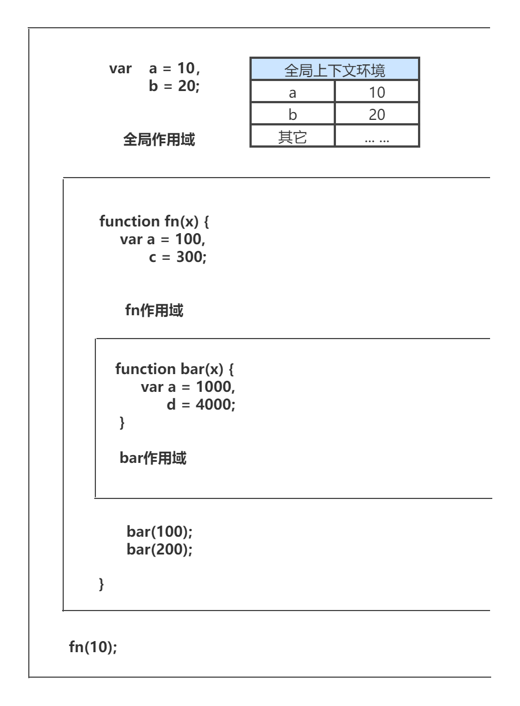
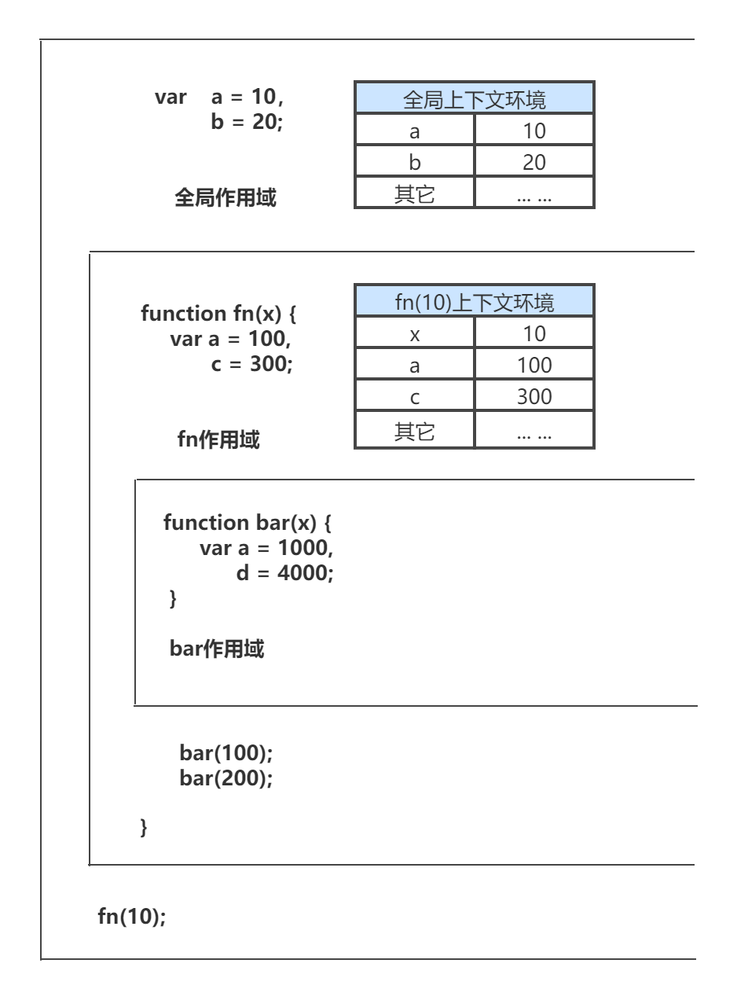
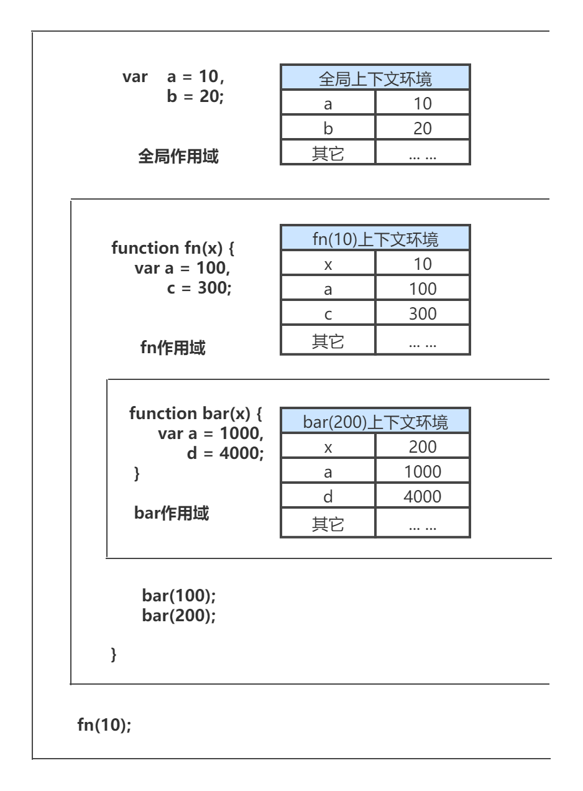
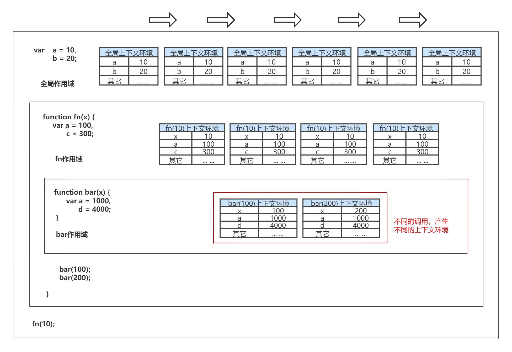

# 深入理解javascript原型和闭包—[作用域]和[上下文环境]

本文把作用域和上下文环境结合起来说一下，会理解的更深 一些。

如上图，我们在上文中已经介绍了，除了全局作用域之外，每个函数都会创建自己的作用域，**作用域在函数定义时就已经确定了。而不是在函数调用时确定。**

下面我们将按照程序执行的顺序，一步一步把各个上下文环境加上， 另外，对上下文环境不了解的朋友，可以去看看之前的两篇文章:

[深入理解javascript原型和闭包之[执行上下文栈] ][13.html]

 [深入理解javascript原型和闭包之[简介--作用域] ][14.html]

第一步，在加载程序时， 已经确定了全局上下文环境，并随着程序的执行而对变量进行赋值。

第二步，调用fn(10)，此时生成此次调用fn函数的上下文环境，压栈，并将此上下文环境设置为活动状态。

第三步，调用bar(100),生成此次调用的上下文环境，压栈，并设置为活动状态。

第四步，bar(100)调用完成。则bar(100)上下文环境被销毁。接着调用bar(200)，则又生成bar(200)的上下文环境，压栈，设置为活动状态。

第五步，bar(200)调用结束，其上下文环境被销毁，此时会回到fn(10)上下文环境，变为活动状态。

第六步，fn(10)执行完成之后，fn(10)上下文环境被销毁，全局上下文环境又回到活动状态。

结束了。像老太太的裹脚布--又臭又长！

最后我们可以把以上这几个图片连接起来看看。

连接起来看，还是挺有意思的。**作用域只是一个"地盘"，一个抽象的概念，其中没有变量。要通过作用域对应的执行上下文环境来获取变量的值。**
同一个作用域下，不同的调用会产生不同的执行上下文环境，继而产生不同的变量的值。所以，**作用域中变量的值是在执行过程中产生的确定的。而作用域却是在函数创建时就确定了。**

