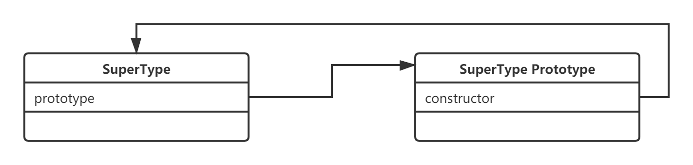
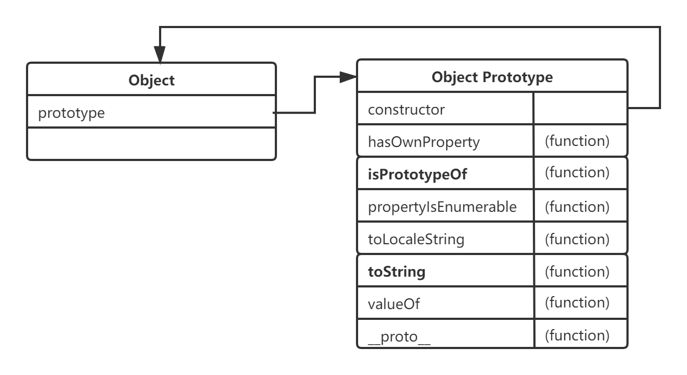
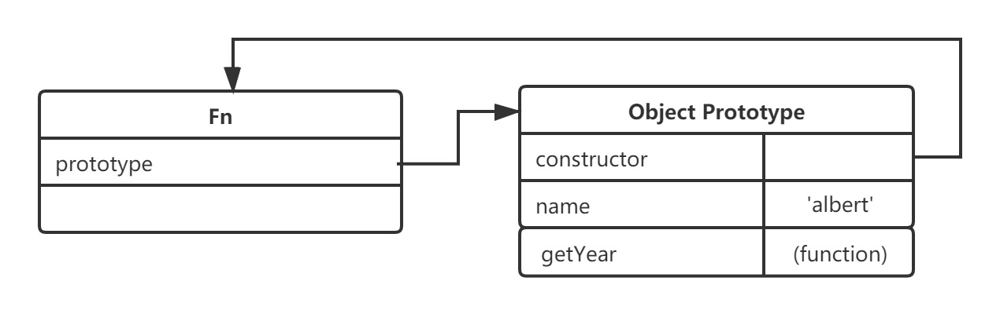

# 深入理解javascript原型和闭包—prototype原型


> 函数也是一种对象，它也是属性的集合，你也可以对函数进行自定义属性。javascript会默认给函数一个属性--prototype，每个函数都有一个属性叫做prototype,这个属性值是一个对象（属性的集合），默认的只有一个叫做constructor的属性，指向这个函数本身。


如上图，SuperType是一个函数，右侧的方框就是它的原型。

原型既然作为对象，属性的集合，不可能就只弄个constructor来玩玩，可以自定义许多属性。例如Object大哥，人家的prototype里面，就有好几个其它属性。

你也可以在自己自定义的方法的prototype中新增自己的属性

```javascript
function Fn() {}
Fn.prototype.name = 'albert'
Fn.prototype.getYear = function () {
    return 1990;
};
var fn  = new Fn();
console.log(fn.name);
console.log(fn.getYear());
```


Fn是一个函数，fn对象是从Fn函数new出来的，这样fn对象就可以调用Fn.prototype中的属性。

**因为每个对象都有一个隐藏的属性--"__proto__",这个属性引用了创建这个对象的函数的prototype。即fn.__proto__ === Fn.prototype,这里的__proto__成为"隐式原型"**

