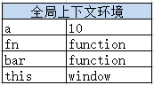

# 深入理解javascript原型和闭包—执行上下文栈

> 执行全局代码时，会产生一个执行上下文环境，每次调用函数都又会产生执行上下文环境。当函数调用完成时，这个上下文环境以及其中的数据都会被消除，再重新回到全局上下文环境。**处于活动状态的执行上下文环境只有一个。**

**执行上下文栈是一个压栈出栈的过程**。


可根据以下代码来详细介绍上下文栈的压栈、出栈过程。

```javascript
var a = 10,                  // 1.进入全局上下文环境
		fn,
        bar = function (x) {
            var b = 5;       // 3.进入fn函数上下文环境
            fn(x + b);
        };
fn = function (y) {
    var c = 5;
    console.log(y + c);
}
bar(10);                     // 2.进入bar函数上下文环境
```

如上代码。

在执行代码之前，首先先创建全局上下文环境。


然后是代码执行。代码执行到bar(10)之前，上下文环境中的变量都在执行过程中被赋值。




执行bar(10),跳转到bar函数内部，执行函数体语句之前，会创建一个新的执行上下文环境。


并将这个执行上下文环境压栈，设置为活动状态。


执行到fn(x + b),又调用了fn函数。进入fn环境，在执行函数体语句之前，会创建fn函数的执行上下文环境，并压栈，设置为活动状态。


待fn(x + b)执行完毕，即fn函数执行完毕后，此次调用fn所生成的上下文环境出栈，并且被销毁（已经用完了，就要及时销毁，释放内存）。


同理，待bar(10)执行完毕，即bar函数执行完毕后，调用bar函数所生成的上下文环境出栈，并且被销毁（已经用完了，就要及时销毁，释放内存）。


好了，这段简短代码的执行上下文环境的变化过程介绍完了。其中上下文环境的变量赋值过程我省略了许多，因为那些并不难，一看就知道。

讲到这里，我不得不很遗憾的跟大家说：其实以上我们所演示的是一种比较理想的情况。有一种情况，而且是很常用的一种情况，无法做到这样干净利落的说销毁就销毁。这种情况就是伟大的--闭包。
要说闭包，咱们还得先从自由变量和作用域说起。