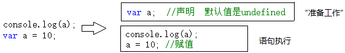

## 深入理解javascript原型和闭包—简述【执行上下文】上

什么是"执行上下文"（也叫做"执行上下文环境"）？暂且不下定义，先看一段代码：

```javascript
console.log(a); // Uncaught ReferenceError: a is not defined.

console.log(a); undefined;
var a;

console.log(a); // undefined
var a = 10;
```

第一句报错，a未定义，很正常。第二句、第三句输出都是undefined，说明浏览器在执行console.log(a)时，已经知道了a是undefined，但却不知道a是10（第三句中）。

在一段js代码拿过来真正一句一句运行之前，浏览器已经做了一些"准备工作"，其中就包括对变量的声明，而不是赋值。变量赋值是在赋值语句执行的时候进行的。可用下图模拟：



这是第一种情况。

下面还有。先来个简单的。

```javascript
console.log(this); // Window {parent: Window, opener: null, top: Window, length: 3, frames: Window, …}
```

有js开发经验的朋友应该都知道，你无论在哪个位置获取this，都是有值的。至于this的取值情况，比较复杂，会专门拿出一篇文章来讲解。

与第一种情况不同的是：第一种情况只是对变量进行声明（并没有赋值），而此种情况直接给this赋值。这也是”准备工作“情况要做的事情之一。

下面还有...第三种情况。

在第三种情况中，需要注意代码注释中的两个名词--”函数表达式“和"函数声明"。虽然两者都很常用，但是这两者在"准备工作时"，却是两种待遇。

```javascript
console.log(f1); // function f1() {}
function f1() {} // 函数声明
console.log(f2); // undefined
var f2 = function() {}; // 函数表达式
```

看以上代码。”函数声明“时我们看到了第二种情况的影子，而”函数表达式“时我们看到 第一种情况的影子。

没错。在"准备工作"中，对待函数表达式就像对待"var a = 10"这样的变量，只是声明。而对待函数声明时，却把函数整个赋值了。

好了，"准备工作"介绍完毕。

我们总结一下，在"准备工作"中完成了哪些工作：

- 变量、函数表达式--变量声明，默认赋值为undefined;
- this--赋值
- 函数声明--赋值

这三种数据的准备情况我们称之为”执行上下文“或者"执行上下文环境"。