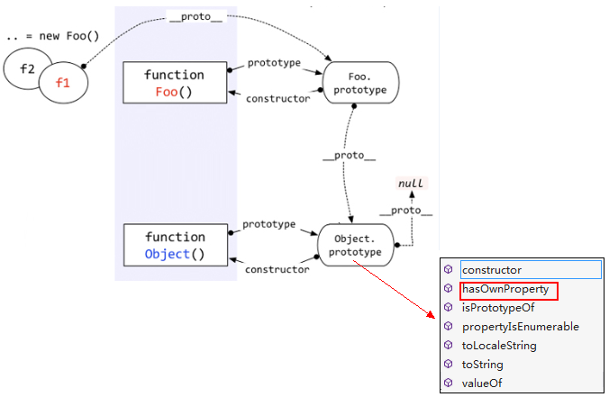

# 深入理解javascript原型和闭包—继承

> java中的继承与javascript中的继承是两个完全不同的概念

## javascript中的继承是通过原型链来体现的

```javascript
function Foo() {}
var f1 = new Foo();
f1.a = 10;
Foo.prototype.a = 100;
Foo.prototype.b = 200;
console.log(f1.a); // 10
console.log(f1.b); // 200
```

以上代码中，f1是Foo函数new出来的对象，f1.a是f1对象的基本属性，f1.b是怎么来的呢？--从Foo.prototype中得来的，因为f1.__proto__指向的是Foo.prototype。

**访问一个对象的属性时，先在基本属性中查找，如果没有，再沿着__proto__这条链向上找，这就是原型链。如下图。**


上图中，访问f1.b时，f1的基本属性中没有b，于是沿着__proto__找到了Foo.prototype.b。

那么我们在实际应用中如何区分一个属性到底是基本的还是从原型中找到的呢？大家可能都知道答案了--hasOwnProperty，特别是在for...in...循环中，一定要注意。


等等，不对！f1的hasOwnProperty方法是从哪里来的？f1本身没有，Foo.prototype中也没有，哪儿来的？

好问题。

它是从Object.prototype中来的，请看图：



对象的原型链是沿着__proto__这条线走的，因此在查找f1.hasOwnProperty属性时，就会顺着原型链一直查找到Object.prototype.

由于所有的对象的原型链都会找到Object.prototype，因此所有的对象都会有Object.prototype的方法。这就是所谓的"继承"。

说一个函数的例子吧。

我们都知道每个函数都有call，apply方法，都有length,arguments，caller等属性。为什么每个函数都有？这肯定是"继承"的。函数由Function函数创建，因此继承的Function.prototype中的方法。不信可以请微软的Visual Studio老师给我们验证一下:


看到了吧，有call、length等这些属性。

那怎么还有hasOwnProperty呢？--那是Function.prototype继承自Object.prototype的方法。有疑问可以看看讲Instanceof时候那个大图，看看Function.prototype.__proto__是否指向Object.prototype。

## 原型的灵活性
+ 对象或者函数，刚开始new出来之后，可能啥属性都没有。但是你可以这会儿加一个，过一会儿再加两个，非常灵活。
+ 如果继承的方法不适，可以做出修改。
+ 如果感觉当前缺少你要用的方法，可以自己去创建。