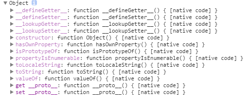

# 深入理解javascript原型和闭包—隐式原型

> 每个函数function都有一个prototype，即原型。每个对象都有一个__proto__，可成为隐式原型。

这个__proto__是一个隐藏的属性，javascript不希望开发者用到这个属性值，有的低版本浏览器甚至不支持这个属性值。所以一般编辑器中，都不会有__proto__的智能提示，但是你不用管它，直接写出来就是了。




上面截图看来，obj.__proto__和Object.prototype的属性一样！

obj这个对象本质上是被Object函数创建的，因此obj.__proto__和Object.prototype的属性一样。如下图所示：


即，**每个对象都有一个__proto__属性，指向创建该对象的函数的prototype。** 

但是**Object.prototype确定是一个特例--它的__proto__指向的是null，切记切记！**


函数也是一种对象，函数也有__proto__属性

函数也是被创建出来的，谁创建了函数呢？答案是Function，注意这个大写的"F"。

```javascript
function fn(x,y) {
    return x+ y;
}
console.log(fn(10, 20));
var fn1  = new Function("x", "y", "return x+ y;");
console.log(fn1(5, 6));
```

以上代码中，第一种方式是比较传统的创建函数的方式，第二种是用new Function创建的。

**不推荐使用第二种方式创建函数，这里只是向大家演示，函数是被Function创建的。**

根据上面的一句话--对象的__proto__指向的是创建它的函数的prototype，就会出现:obj.__proto__和Object.prototype的属性一样。如下图所示：


上图中，很明显的标出了：自定义函数Foo.__proto__指向Function.prototype，Object.__proto__指向Function.prototype，唉，怎么还有一个.......Function.__proto__指向Function.prototype?这不成了循环引用了？

对！是一个环形结构。

Function也是一个函数，函数是一种对象，也有__proto__属性。既然是函数，那么它一定是被Function创建的。所以Function是被自身创建的。所以它的__proto__指向了自身的prototype。

最后一个问题，Function.prototype指向的对象，它的__proto__是不是也指向Object.prototype？

答案是肯定的，因为Function.prototype指向的也是一个普通的被Object创建的对象，所以也遵循基本的规则。


> 下节重点讲解--instanceof。