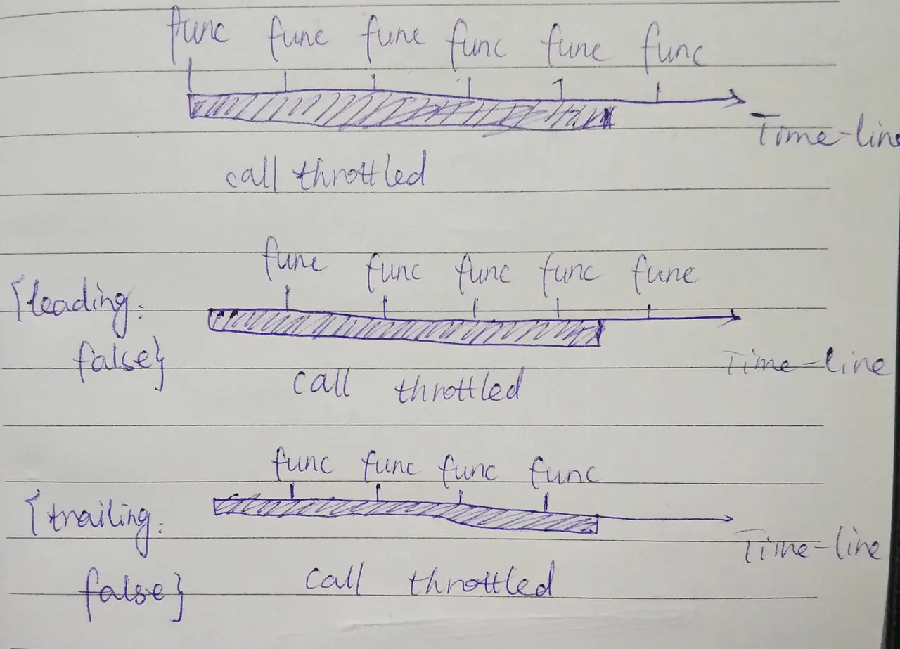

# 防抖和节流原理分析—节流

> 如果你持续触发事件，每隔一段时间，只执行一次事件。

根据首次是否执行以及结束后是否执行，效果有所不同，实现的方式也有所不同。我们用leading代表首次是否执行，trailing代表结束后是否再执行一次。

关于节流的实现，有两种主流的实现方式，一种是使用时间戳，一种是设置定时器。

**实现**

**第一版—使用时间戳**

让我们来看第一种方法：使用时间戳，当触发事件的时候，我们取出当前的时间戳，然后减去之前的时间戳（最一开始值设为0），如果大于设置的时间周期，就执行函数，然后更新时间戳为当前的时间戳，如果小于，就不执行。

看了这个表述，是不是感觉已经可以写出代码了。。。让我们来写第一版的代码：

```javascript
// 第一版
function throttle(func, wait) {
    var context,args;
    var previous = 0;
    
    return function() {
        var now = +new Date();
        context = this;
        args = arguments;
        if (now - previous > wait) {
            func.apply(context,args);
            previous = now;
        }
    }
}
```

例子依然是用讲debounce中的例子，如果你要使用：

```javascript
container.onmousemove = throttle(getUserAction, 1000);
```

效果演示如下：


我们可以看到：当鼠标移入的时候，事件立刻执行，每过1s会执行一次，如果在4.2s停止触发，以后不会再执行事件。

第二版—使用定时器

接下来，我们讲讲第二种实现方式，使用定时器。

当触发事件的时候，我们设置一个定时器，再触发事件的时候，如果定时器存在，就不执行，直到定时器执行，然后执行函数，清空定时器，这样就可以设置下个定时器。

```javascript
// 第二版 
function throttle(func, wait) {
    var timeout;
    var previous = 0;
    
    return function() {
        context = this;
        args = arguments;
        if(!timeout) {
            timeout = setTimeout(function() {
                timeout = null;
                func.apply(context, args);
            }, wait)
        }
    }
}
```

为了让效果更加明显，我们设置wait的时间为3s，效果演示如下：

我们可以看到：当鼠标移入的时候，事件不会立刻执行，晃了3s后终于执行了一次，此后每3s执行一次，当数字显示为3的时候，立刻移出鼠标，相当于大约9.2秒的时候停止触发，但是依然会在第12s的时候执行一次事件。

所以比较两个方法：

- 第一种事件会立刻执行，第二种事件会在n秒后第一次执行
- 第一种事件停止触发后没有办法再执行事件，第二种事件停止触发后依然会再执行一次事件

**第三版—双剑合璧**

那我们想要一个什么样的呢？

有人就说了：我想要一个有头有尾的！就是鼠标移入能立刻执行，停止触发的时候还能再执行一次！

所以我们综合两者的优势，然后双剑合璧，写一版代码：

```javascript
// 第三版
function throttle(func, wait) {
    var timeout, context,args, result;
    var previous = 0;
    
    var later = function() {
        previous = +new Date();
        timeout = null;
        func.apply(context, args);
    };
   
   var throttled = function() {
       var now = +new Date();
       // 下次触发func剩余的时间
       var remaining = wait - (now - previous);
       context = this;
       args = arguments;
       // 如果剩余的时间了或者你改了系统时间
       if (remaining <= 0 || remaining > wait) {
           if (timeout) {
               clearTimeout(timeout);
               timeout = null;
           }
           previous = now;
           func.apply(context,args);
       } else if (!timeout) {
           timeout = setTimeout(later, remaining);
       }
   };
   return throttled;
}
```

效果演示如下：	

		

我们可以看到：鼠标移入，事件立刻执行，晃了3s，事件再一次执行，当数字变成3的时候，也就是6s后，我们立刻移出鼠标，停止触发事件，9s的时候，依然会再执行一次事件。

## 第四版—优化

但是我有时也希望无头有尾，或者有头无尾，这个咋办？

那我们设置个 `options` 作为第三个参数，然后根据传的值判断到底哪种效果，我们约定:

`leading：false `表示禁用第一次执行 `trailing: false` 表示禁用停止触发的回调

我们来改一下代码：

```
// 第四版
function throttle(func, wait, options) {
    var timeout, context, args, result;
    var previous = 0;
    // 此处大佬的意思应该是给options一个默认值，我们可以用ES6语法写在函数声明上。
    if (!options) options = {};

    var later = function() {
        previous = options.leading === false ? 0 : new Date().getTime();
        timeout = null;
        func.apply(context, args);
        if (!timeout) context = args = null;
    };

    var throttled = function() {
        var now = new Date().getTime();
        if (!previous && options.leading === false) previous = now;
        var remaining = wait - (now - previous);
        context = this;
        args = arguments;
        if (remaining <= 0 || remaining > wait) {
            if (timeout) {
                clearTimeout(timeout);
                timeout = null;
            }
            previous = now;
            func.apply(context, args);
            // 不知为何此处要加 if (!timeout) context = args = null;希望看到此处的大佬指教一下。
            if (!timeout) context = args = null;
        } else if (!timeout && options.trailing !== false) {
            timeout = setTimeout(later, remaining);
        }
    };
    return throttled;
}
复制代码
```

## 终版——取消

在 `debounce` 的实现中，我们加了一个 `cancel` 方法，`throttle` 我们也加个 `cancel` 方法：

```
function throttle(func, wait, options) {
    var timeout, context, args, result;
    var previous = 0;
    if (!options) options = {};

    var later = function() {
        previous = options.leading === false ? 0 : new Date().getTime();
        timeout = null;
        func.apply(context, args);
        if (!timeout) context = args = null;
    };

    var throttled = function() {
        var now = new Date().getTime();
        if (!previous && options.leading === false) previous = now;
        var remaining = wait - (now - previous);
        context = this;
        args = arguments;
        if (remaining <= 0 || remaining > wait) {
            if (timeout) {
                clearTimeout(timeout);
                timeout = null;
            }
            previous = now;
            func.apply(context, args);
            if (!timeout) context = args = null;
        } else if (!timeout && options.trailing !== false) {
            timeout = setTimeout(later, remaining);
        }
    };

    throttled.cancel = function() {
        clearTimeout(timeout);
        previous = 0;
        timeout = null;
    };

    return throttled;
}
复制代码
```

## 注意

我们要注意 `underscore` 的实现中有这样一个问题：

那就是` leading：false` 和 `trailing: false` 不能同时设置。

如果同时设置的话，比如当你将鼠标移出的时候，因为 `trailing` 设置为 `false`，停止触发的时候不会设置定时器，所以只要再过了设置的时间，再移入的话，就会立刻执行，就违反了 `leading: false`，`bug` 就出来了，所以，这个 `throttle` 只有三种用法：

```
container.onmousemove = throttle(getUserAction, 1000);
container.onmousemove = throttle(getUserAction, 1000, {
    leading: false
});
container.onmousemove = throttle(getUserAction, 1000, {
    trailing: false
});
```

 理解函数节流

通过这张我手画的图，我相信可以更容易理解函数节流这个概念。



在这张粗制滥造的手绘图中，从左往右的轴线表示时间轴，下方的粗蓝色线条表示不断的调用throttled函数（看做连续发生的），而上方的一个一个节点表示我们得到的执行func函数的结果。

从图上可以看出来，我们通过函数节流，成功的限制了func函数在一段时间内的调用频率，在实际中能够提高我们应用的性能表现。

接下来我们探究一下Underscore中_.throttle函数的实现。

## Underscore的实现

我们在探究源码之前，先了解一下Underscore API手册中关于_.throttle函数的使用说明：

throttle_.throttle(function, wait, [options])

创建并返回一个像节流阀一样的函数，当重复调用函数的时候，最多每隔 wait毫秒调用一次该函数。对于想控制一些触发频率较高的事件有帮助。（注：详见：javascript函数的throttle和debounce）

默认情况下，throttle将在你调用的第一时间尽快执行这个function，并且，如果你在wait周期内调用任意次数的函数，都将尽快的被覆盖。如果你想禁用第一次首先执行的话，传递{leading: false}，还有如果你想禁用最后一次执行的话，传递{trailing: false}。

```javascript
var throttled = _.throttle(updatePosition, 100);

$(window).scroll(throttled);
```

结合我画的那张示意图，应该比较好理解了。

如果传递的options参数中，leading为false，那么不会在throttled函数被执行时立即执行func函数；trailing为false，则不会在结束时调用最后一次func。

**Underscore源码（附注释）**：

```
// Returns a function, that, when invoked, will only be triggered at most once
// during a given window of time. Normally, the throttled function will run
// as much as it can, without ever going more than once per `wait` duration;
// but if you'd like to disable the execution on the leading edge, pass
// `{leading: false}`. To disable execution on the trailing edge, ditto.
_.throttle = function (func, wait, options) {
	var timeout, context, args, result;
	var previous = 0;
	if (!options) options = {};

	var later = function () {
		//previous===0时，下一次会立即触发。
		//previous===_.now()时，下一次不会立即触发。
		previous = options.leading === false ? 0 : _.now();
		timeout = null;
		result = func.apply(context, args);
		if (!timeout) context = args = null;
	};

	var throttled = function () {
		//获取当前时间戳（13位milliseconds表示）。
		//每一次调用throttled函数，都会重新获取now，计算时间差。
		//而previous只有在func函数被执行过后才回重新赋值。
		//也就是说，每次计算的remaining时间间隔都是每次调用throttled函数与上一次执行func之间的时间差。
		var now = _.now();
		//!previous确保了在第一次调用时才会满足条件。
		//leading为false表示不立即执行。
		//注意是全等号，只有在传递了options参数时，比较才有意义。
		if (!previous && options.leading === false) previous = now;
		//计算剩余时间，now-previous为已消耗时间。
		var remaining = wait - (now - previous);
		context = this;
		args = arguments;
		//remaining <= 0代表当前时间超过了wait时长。
		//remaining > wait代表now < previous，这种情况是不存在的，因为now >= previous是永远成立的(除非主机时间已经被修改过)。
		//此处就相当于只判断了remaining <= 0是否成立。
		if (remaining <= 0 || remaining > wait) {
			//防止出现remaining <= 0但是设置的timeout仍然未触发的情况。
			if (timeout) {
				clearTimeout(timeout);
				timeout = null;
			}
			//将要执行func函数，重新设置previous的值，开始下一轮计时。
			previous = now;
			//时间达到间隔为wait的要求，立即传入参数执行func函数。
			result = func.apply(context, args);
			if (!timeout) context = args = null;
			//remaining>0&&remaining<=wait、不忽略最后一个输出、
			//timeout未被设置时，延时调用later并设置timeout。
			//如果设置trailing===false，那么直接跳过延时调用later的部分。
		} else if (!timeout && options.trailing !== false) {
			timeout = setTimeout(later, remaining);
		}
		return result;
	};

	throttled.cancel = function () {
		clearTimeout(timeout);
		previous = 0;
		timeout = context = args = null;
	};

	return throttled;
};
复制代码
```

接下来，我们分三种情况分析Underscore源码：

- 没有配置options选项时
- options.leading === false时
- options.trailing === false时

## 默认情况（options === undefined）

在默认情况下调用throttled函数时，options是一个空的对象`{}`，此时`options.leading!==false`并且`options.trailing!==false`，那么throttled函数中的第一个if会被忽略掉，因为options.leading === false永远不会满足。

此时，不断地调用throttled函数，会按照以下方式执行：

- 用now变量保存当前调用时的时间戳，previous默认为0，计算remaining剩余时间，此时应该会小于0，满足了`if (remaining <= 0 || remaining > wait)`。
- 清空timeout并清除其事件，为previous重新赋值以记录当前调用throttled函数的值。
- 能够进入当前的if语句表示剩余时间不足或者是第一次调用throttled函数（且options.leading !== false），那么将会立即执行func函数，使用result记录执行后的返回值。
- 下一次调用throttled函数时，重新计算当前时间和剩余时间，如果剩余时间不足那么仍然立即执行func，如此不断地循环。如果remaining时间足够（大于0），那么会进入else if语句，设置一个timeout异步事件，此时注意到timeout会被赋值，直到later被调用才回被赋值为null。这样做的目的就是为了防止不断进入else if条件语句重复设置timeout异步事件，影响性能，消耗资源。
- 之后调用throttled函数，都会按照这样的方式执行。

通过上面的分析，我们可以发现，除非设置options.leading===false，否则第一次执行throttled函数时，条件语句`if (!previous && options.leading === false) previous = now;`不会被执行。间接导致remaining<0，然后进入if语句立即执行func函数。

接下来我们看看设置options.leading === false时的情况。

## options.leading === false

设置options.leading为false时，执行情况与之前并没有太大差异，仅在于`if(!previous && options.leading === false)`语句。当options.leading为false时，第一次执行会满足这个条件，所以赋值previous=== now，间接使得remaining>0。

由于timeout此时为undefined，所以!timeout为true。设置later为异步任务，在remaining时间之后执行。

此后再不断的调用throttled方法，思路同2.1无异，因为!previous为false，所以`if(!previous && options.leading === false)`该语句不再判断，会被完全忽略。可以理解为设置判断!previous的目的就是在第一次调用throttled函数时，判断options.leading是否为false，之后便不再进行判断。

## options.trailing === false

此时的区别在于else if中的执行语句。如果`options.trailing === false`成立，那么当remaining>0时间足够时，不会设置timeout异步任务。那么如何实现时间到就立即执行func呢？是通过不断的判断remaining，一旦`remaining <= 0`成立，那么就立即执行func。