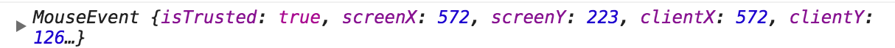

# 防抖和节流原理分析—防抖

> 防抖，是一个可以限制指定函数触发频率的函数。我们可以理解为连续调用同一个函数多次，只得到执行该函数一次的结果；但是隔一段时间再次调用时，又可以重新获得新的结果。

前言

在前端开发中会遇到一些频繁的事件触发，比如:

1. window的resize、scroll
2. mousedown、mousemove
3. keyup、keydown
4. ......

为此，我们举个示例代码来了解事件如何频繁的触发:

我们写个index.html文件：

```html
<!DOCTYPE html>
<html lang="zh-cmn-Hans">

<head>
    <meta charset="utf-8">
    <meta http-equiv="x-ua-compatible" content="IE=edge, chrome=1">
    <title>debounce</title>
    <style>
        #container{
            width: 100%; height: 200px; line-height: 200px; text-align: center; color: #fff; background-color: #444; font-size: 30px;
        }
    </style>
</head>

<body>
    <div id="container"></div>
    <script src="debounce.js"></script>
</body>

</html>

```

debounce.js文件的代码如下:

```javascript
var count = 1;
var container = document.getElementById('container');

function getUserAction() {
    container.innerHTML = count++;
};

container.onmousemove = getUserAction;
```

我们来看看效果：


从左边滑到右边就触发了165次**getUserAction**函数！

因为这个例子很简单，所以浏览器完全反应的过来，可是如果是复杂的回调函数或是ajax请求呢？假设1秒触发了60次，每个回调必须在1000/60=16.67ms完成，否则就会有卡顿出现。

为了解决这个问题，一般有两种解决方案：

- debounce防抖
- throttle节流

**原理**

防抖的原理就是：你尽管触发事件，但是我一定在事件触发n秒后才执行，如果你在一个事件触发的n秒内又触发了这个事件，那我就以新的事件的时间为准，n秒后才执行，总之，就是要等你触发完事件n秒内不再触发事件，我才执行，真是任性呐！

**实现**

**第一版**

根据这段表述，我们可以写第一版的代码：

```javascript
// 第一版
function debounce(func, wait) {
    var timeout;
    return function () {
        clearTimeout(timeout);
        timeout = setTimeout(func, wait);
    }
}
```

如果我们要使用它，以最一开始的例子为例:

```javascript
container.onmousemove = debounce(getUserAction, 1000);
```

现在随你怎么移动，反正你移动完1000ms内不再触发，你移动完1000后，我才执行事件。看看使用效果：


顿时就从165次降低成了1次！

棒棒哒，我们接着完善它。

**第二版-this**

如果我们在getUserAction函数中console.log(this),在不使用debounce函数的时候，this的值为:

```javascript
<div id="container"></div>
```

但是如果使用我们的debounce函数，this就会指向Window对象！

所以我们需要将this指向正确的对象。

我们修改下代码:

```javascript
// 第二版
function debounce(func, wait) {
    var timeout;
    return function () {
        var context = this;
        clearTimeout(timeout)
        timeout = setTimeout(function() {
            func.apply(context);
        },wait);
    }
}
```

现在this已经可以正确指向了。让我们看下个问题：

**第三版—event对象**

javascript在事件处理函数中会提供事件对象event，我们修改下getUserAction函数:

```javascript
function getUserAction(e) {
    console.log(e);
    container.innerHTML = count++;
}
```

如果我们不使用debounce函数，这里会打印MouseEvent对象，如图所示:



但是在我们实现的debounce函数中，却只会打印**undefined**!

所以我们再修改一下代码:

```javascript
// 第三版
function debounce(func, wait) {
    var timeout;
    
    return function () {
        var context = this;
        var args = arguments;
        clearTimeout(timeout);
        timeout = setTimeout(function() {
            func.apply(context, args);
        },wait);
    }
}
```

到此为止，我们修复了两个小问题：

this指向event对象

**第四版—立即执行**

这个时间，代码已经很是完善了，但是为了让这个函数更加完善，我们接下来思考一个新的需求。

这个需求就是：

我不希望非要等到事件停止触发后才执行，我希望立刻执行函数，然后等到停止触发n秒后，才可以重新触发执行。

想想这个需求也是很有道理的嘛，那我们加个**immediate**参数判断是否是立刻执行。

```javascript
// 第四版
function debounce(func,wait,immediate) {
    var timeout;
    
    return function() {
        var context = this;
        var args = arguments;
        
        if (timeout) {
            clearTimeout(timeout);
        }
        if (immediate) {
           // 如果已经执行过，不再执行
            var callNow = !timeout;
            timeout = setTimeout(function() {
                timeout = null;
            },wait)
            if (callNow) {
                func.apply(context,args);
            }
        } else {
            timeout = setTimeout(function () {
            func.apply(context,args);
        	}, wait)
        }
    }
}
```

再看看使用效果:

**第五版—返回值**

此时注意一点，就是getUserAction函数可能是有返回值的，所以我们也要返回函数的执行结果，但是当immediate为false的时候，因为使用了setTimeout，我们将func.apply(context, args)的返回值赋给变量，最后再return的时候，值将会一直是**undefined**，所以我们只在immediate为true的时候返回函数的执行结果。

```javascript
// 第五版
function debounce(func,wait,immediate) {
    var timeout,result;
    
    return function() {
        var context = this;
        var args = arguments;
        
        if (timeout) {
            clearTimeout(timeout);
        }
        if (immediate) {
           // 如果已经执行过，不再执行
            var callNow = !timeout;
            timeout = setTimeout(function() {
                timeout = null;
            },wait)
            if (callNow) {
               result = func.apply(context,args);
            }
        } else {
            timeout = setTimeout(function () {
            func.apply(context,args);
        	}, wait)
        }
        return result;
    }
}
```

**终版—取消**

最后我们再思考一个小需求，我希望能取消debounce函数，比如说我debounce的时间间隔是10秒钟，immediate为true，这样的话，我只有等10秒后才能重新触发事件，现在我希望有一个按钮，点击后，取消防抖，这样我再去触发，就可以又立刻执行啦！是不是很开心？

为了这个需求，我们写最后一版的代码:

```javascript
// 第六版 
function debounce(func,wait,immediate) {
  var timeout,result;
  var debounced =  function() {
      var context = this;
      var args = argument;
      if (timeout) {
        clearTimeout(timeout);
      }
      if (immediate) {
        // 如果已经执行过，不再执行
         var callNow = !timeout;
         timeout = setTimeout(function() {
             timeout = null
         },wait);
         if (callNow) {
             result = func.apply(context, args);
         }
      } else {
         timeout = setTimeout(function() {
             func.apply(context,args);
         },wait)
      }
      return result;
      
  };
  debounce.cancel = function() {
    clearTimeout(timeout);
    timeout = null;
  };
  return debounced;
}
```

那么该如何使用这个cancel函数呢？依然是以上面的demo为例：

```javascript
var count = 1;
var container = document.getElementById('container');

function getUserAction(e) {
    container.innerHTML = count++;
};

var setUseAction = debounce(getUserAction, 10000, true);

container.onmousemove = setUseAction;

document.getElementById("button").addEventListener('click', function(){
    setUseAction.cancel();
})
```

## underscore的实现

underscore源码如下（附代码注释）：

```javascript
// Returns a function, that, as long as it continues to be invoked, will not
// be triggered. The function will be called after it stops being called for
// N milliseconds. If `immediate` is passed, trigger the function on the
// leading edge, instead of the trailing.
//去抖函数，传入的函数在wait时间之后（或之前）执行，并且只会被执行一次。
//如果immediate传递为true，那么在函数被传递时就立即调用。
//实现原理：涉及到异步JavaScript，多次调用_.debounce返回的函数，会一次性执行完，但是每次调用
//该函数又会清空上一次的TimeoutID，所以实际上只执行了最后一个setTimeout的内容。
_.debounce = function (func, wait, immediate) {
	var timeout, result;

	var later = function (context, args) {
		timeout = null;
		//如果没有传递args参数，那么func不执行。
		if (args) result = func.apply(context, args);
	};

	//被返回的函数，该函数只会被调用一次。
	var debounced = restArgs(function (args) {
		//这行代码的作用是清除上一次的TimeoutID，
		//使得如果有多次调用该函数的场景时，只执行最后一次调用的延时。
		if (timeout) clearTimeout(timeout);
		if (immediate) {
			////如果传递了immediate并且timeout为空，那么就立即调用func，否则不立即调用。
			var callNow = !timeout;
			//下面这行代码，later函数内部的func函数注定不会被执行，因为没有给later传递参数。
			//它的作用是确保返回了一个timeout,并且保持到wait毫秒之后，才执行later，
			//清空timeout。而清空timeout是在immediate为true时，callNow为true的条件。
			//timeout = setTimeout(later, wait)的存在是既保证上升沿触发，
			//又保证wait内最多触发一次的必要条件。
			timeout = setTimeout(later, wait);
			if (callNow) result = func.apply(this, args);
		} else {
			//如果没有传递immediate，那么就使用_.delay函数延时执行later。
			timeout = _.delay(later, wait, this, args);
		}

		return result;
	});

	//该函数用于取消当前去抖效果。
	debounced.cancel = function () {
		clearTimeout(timeout);
		timeout = null;
	};

	return debounced;
};

```

可以看到underscore使用了闭包的方法，定义了两个私有属性:timeout和result，以及两个私有方法later和debounced。最终会返回debounced作为处理之后的函数。timeout用于接受并存储setTimeout返回的TimeoutID,result用于执行用户传入的func函数的执行结果，later方法用于执行传入的func函数。

**实现原理**

利用了javascript的异步执行机制，javascript会优先执行完所有的同步代码，然后去事件队列中执行所有的异步任务。

当我们不断的触发debounced函数时，它会不断的clearTimeout(timeout),然后再重新设置新的timeout，所以实际上在我们的代码执行完之前，每次调用debounced函数都会重置timeout。所以异步事件队列中的异步任务会不断刷新，直到最后一个debounced函数执行完。只有最后一个debounced函数设置的later异步任务会在同步代码执行之后被执行。

所以当我们在之前实验中不断的移动鼠标时，实际上是不断的调用debounced函数，不断的清除timeout对应的异步任务，然后又设置新的timeout异步任务。当我们停止的时间不超过1s时，timeout对应的异步任务还没有触发，所以再次移动鼠标触发debounced函数还可以清除timeout任务，然后设置新的timeout任务。一旦停止的时间超过2s，最终的timeout对应的异步代码就会执行。

**总结**

- 防抖是限制函数执行频率的一种方法。
- 防抖后的函数在指定时间内最多被触发一次，连续触发防抖后的函数只能得到一次的触发效果。
- underscore防抖的实现依赖于javascript的异步执行机制，优先执行同步代码，然后执行事件队列中的异步代码。