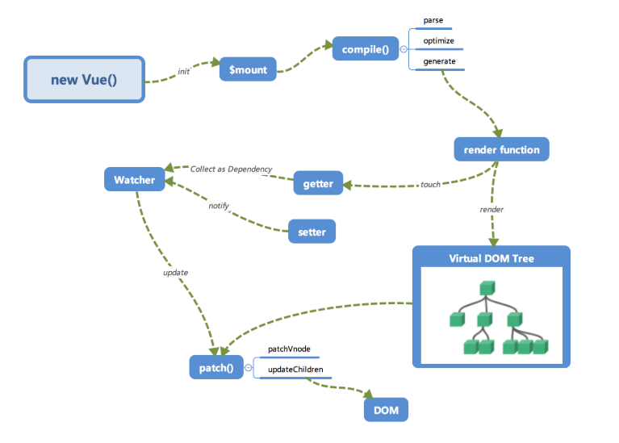
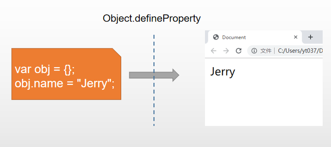
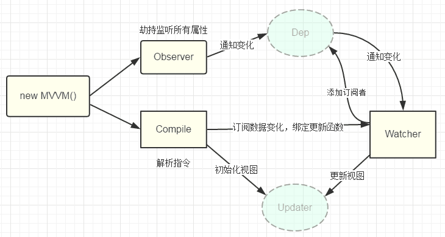
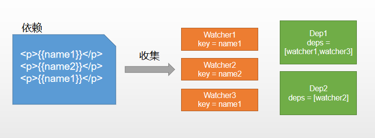

# 手写 Vue 源码

## Vue 工作流程



## 初始化

初始化 data、props、事件等

## 挂载

执行编译，首次渲染、创建和追加过程

## 编译

编译模块分为三个阶段：parse、optimize、generate

## 数据响应式

渲染函数执行时会触发 getter 进行依赖收集，将来数据变化时会触发 setter 进行更新

## 虚拟 dom

Vue2 开始支持 Virtual DOM,通过 JS 对象描述 dom，数据变更时映射为 dom 操作

```javascript
// dom
<div name="vuejs" style="color:red" @click="xx">
	<a> click me</a>
</div>
// vdom
{
    tag: 'div',
    props:{
        name:'vuejs',
        style:{color:red},
        onClick:xx
    }
    children: [
        {
            tag: 'a',
            text: 'click me'
        }
	]
}
```

## 更新视图

数据修改时监听器会执行更新，通过对比新旧 vdom，得到最小修改，就是 patch

## Vue2 响应式的原理：defineProperty



```html
<div id="app">
  <p>你好，<span id="name"></span></p>
</div>
<script>
  var obj = {};
  Object.defineProperty(obj, "name", {
    get() {
      console.log("获取name");
      return document.querySelector("#name").innerHTML;
    },
    set(nickName) {
      console.log("设置name");
      document.querySelector("#name").innerHTML = nickName;
    },
  });
  obj.name = "Jerry";
  console.log(obj.name);
</script>
```

## 实现自己的 Vue

简化版架构图



具体代码实现如下：

```javascript
//创建mvue.js
/**new MVue({
    data: {
        msg: "hello,vue"
    }
})**/
class MVue {
  constructor(options) {
    // 保存选项
    this.$options = options;
    // 传入data选项
    this.$data = options.data;
    //响应化
    this.observe(this.$data);
  }
  observe(value) {
    if (!value || typeof value !== "object") {
      return;
    }
    // 遍历，执行数据响应式
    Object.keys(value).forEach((key) => {
      this.defineReactive(value, key, value[key]);
    });
  }
  defineReactive(obj, key, val) {
    // 递归
    this.observe(val);
    // 给obj定义属性
    Object.defineProperty(obj, key, {
      get() {
        return val;
      },
      set(newVal) {
        if (newVal === val) {
          return;
        }
        val = newVal;
        console.log(`${key}属性更新了`);
      },
    });
  }
}
```

创建 index.html

```html
<script src="mvue.js"></script>
<script>
  const app = new MVue({
    data: {
      test: "I am test",
      foo: {
        bar: "bar",
      },
    },
  });
  app.$data.test = "hello,vue.js";
  app.$data.foo.bar = "oh my bar";
</script>
```

为$data 做代理,mvue.js

```javascript
observe(value) {
    // ...
    Object.keys(value).forEach(key => {
        this.defineReactive(value, key, value[key])
        // 代理data中的属性到vue根上
        this.proxyData(key);
    })
}
// 在vue根上定义属性代理data中的数据
proxyData(key) {
    Object.defineProperty(this, key, {
        get() {
            return this.$data[key]
        },
        set(newVal) {
            this.$data[key] = newVal
        }
    })
}
```

测试代码的变化

```html
<script>
  app.test = "hello,vue.js";
  app.foo.bar = "oh my bar";
</script>
```

依赖收集与追踪



看下面案例，理出思路：

```javascript
new Vue({
  template: `<div>
        <span>{{name1}}</span>
        <span>{{name2}}</span>
        <span>{{name1}}</span>
        <div>`,
  data: {
    name1: "name1",
    name2: "name2",
    name3: "name3",
  },
  created() {
    this.name1 = "开课吧";
    this.name3 = "Jerry";
  },
});
```

创建 Dep，mvue.js

```javascript
// mvue.js
class Dep {
  constructor() {
    //存放所有的依赖
    this.deps = [];
  }
  // 在deps中添加一个监控器对象
  addDep(dep) {
    this.deps.push(dep);
  }
  // 通知所有监控器去更新视图
  notify() {
    this.deps.forEach((dep) => dep.update());
  }
}
```

创建 watcher,mvue.js

```javascript
// 监控器，负责更新视图
class Watcher {
  constructor(vm, key) {
    // 在new一个监听器对象时将该对象赋值给Dep.target，在get中会用到
    Dep.target = this;
    this.vm = vm;
    this.key = key;
  }
  // 更新视图的方法
  update() {
    console.log(`属性${this.key}更新了`);
  }
}
```

依赖收集，mvue.js

```javascript
 defineReactive(obj, key, val) {
     // 递归
     this.observe(val);

     // 每次defineReactive创建一个Dep实例
     const dep = new Dep()

     // 给obj定义属性
     Object.defineProperty(obj, key, {
         get() {
             // 将Dep.target（即当前的watcher对象存入Dep的deps中）
             Dep.target && dep.addDep(Dep.target)
         	return val
         },
         set(newVal) {
             if (newVal === val) {
             	return
             }
            // val = newVal
            // console.log(`${key}属性更新了`);
             // 在set的时候触发dep的notify来通知所有的watcher对象更新视图
             dep.notify()
         }
     })
}
```

测试代码

```javascript
class KVue {
  constructor(options) {
    // ...
    // 新建一个Watcher观察者对象，这时候Dep.target会指向这个Watcher对象
    new Watcher(this, "test");
    // 访问get函数，为了触发依赖收集
    this.test;

    new Watcher(this, "foo.bar");
    this.foo.bar;
  }
}
```

## 编译器 compile

核心任务:

1. 获取并遍历 DOM 树
2. 文本节点：获取{{}}格式的内容并解析
3. 元素节点：访问节点特性，截获 k-和@开头内容并解析

## 目标功能

```html
<body>
  <div id="app">
    <p>{{name}}</p>
    <p k-text="name"></p>
    <p>{{age}}</p>
    <p>{{doubleAge}}</p>
    <input type="text" k-model="name" />
    <button @click="changeName">呵呵</button>
    <div k-html="html"></div>
  </div>
  <script src="./compile.js"></script>
  <script src="./mvue.js"></script>
  <script>
    const mvue = new MVue({
      el: "#app",
      data: {
        name: "I am test.",
        age: 12,
        html: "<button>这是一个按钮</button>",
      },
      created() {
        console.log("开始啦");
        setTimeout(() => {
          this.name = "我是测试";
        }, 1500);
      },
      methods: {
        changeName() {
          this.name = "哈喽,Vuejs";
          this.age = 1;
        },
      },
    });
  </script>
</body>
```

## compile.js

根据节点类型编译，compile.js

```javascript
// 1. 获取并遍历DOM树
// 2. 文本节点：获取{{}}格式的内容并解析
// 3. 元素节点：访问节点特性，截获k-和@开头内容并解析
// new Compile('#app', vm)
class Compile {
  constructor(el, vm) {
    this.$vm = vm;
    this.$el = document.querySelector(el);

    if (this.$el) {
      // 执行编译
      this.compile(this.$el);
    }
  }

  compile(el) {
    // 遍历el
    const childNodes = el.childNodes;
    // 每次拿出一个dom节点
    Array.from(childNodes).forEach((node) => {
      // 判断节点类型
      if (this.isElement(node)) {
        // 3. 元素节点：访问节点特性，截获k-和@开头内容并解析
        // console.log('编译元素'+node.nodeName);
        this.compileElement(node);
      } else if (this.isInter(node)) {
        // 2. 文本节点：获取{{}}格式的内容并解析
        // console.log('编译插值文本'+node.textContent);
        this.compileText(node);
      }

      // 递归
      if (node.childNodes && node.childNodes.length > 0) {
        this.compile(node);
      }
    });
  }

  isElement(node) {
    return node.nodeType === 1;
  }
  // 判断是否是插值表达式
  isInter(node) {
    return node.nodeType === 3 && /\{\{(.*)\}\}/.test(node.textContent);
  }

  // 编译插值文本
  compileText(node) {
    // 获取表达式
    // {{a+b()}}
    const exp = RegExp.$1;
    this.update(node, exp, "text");
  }

  // 通用方法 update(node, 'xxx', 'text')
  update(node, exp, dir) {
    // 构造更新函数并执行：相当于首次赋值
    let updaterFn = this[dir + "Updater"];
    updaterFn && updaterFn(node, this.$vm[exp]);

    // 创建watcher，执行后续更新操作
    // 额外传递一个更新函数：能够更新指定dom元素
    new Watcher(this.$vm, exp, function (value) {
      updaterFn && updaterFn(node, value);
    });
  }

  textUpdater(node, value) {
    node.textContent = value;
  }

  compileElement(node) {
    // 获取属性
    const nodeAttrs = node.attributes;
    Array.from(nodeAttrs).forEach((attr) => {
      //   k-text="test"
      const attrName = attr.name; // k-text
      const exp = attr.value; // test

      if (attrName.indexOf("k-") === 0) {
        // 指令 k-text k-model
        const dir = attrName.substring(2); // text
        this[dir] && this[dir](node, exp);
      }
    });
  }

  text(node, exp) {
    this.update(node, exp, "text");
  }
}
```

更新 Watcher,mvue.js

```javascript
class Watcher {
  constructor(vm, key, cb) {
    this.vm = vm;
    this.key = key;
    //传入更新函数cb
    this.cb = cb;
    // 设定将当前Watcher实例到Dep.target
    Dep.target = this;
    this.vm[this.key]; // 读取vm的属性触发依赖收集
    Dep.target = null;
  }
  // 更新
  update() {
    // comsole.log('视图更新啦！')；
    this.cb.call(this.vm, this.vm[this.key]);
  }
}
```

测试代码

```javascript
class KVue {
  constructor(options) {
    // 保存选项
    this.$options = options;
    // 保存data
    this.$data = options.data;
    // 对传入data对象执行响应化处理
    this.observe(this.$data);
    // 测试
    // new Watcher(this, 'test')
    // this.test; // 读取属性，触发依赖收集

    new Compile(options.el, this);
    if (options.created) {
      options.created.call(this);
    }
  }
}
```

## 拓展

数据响应化怎么做

首先数据响应化也是以 k 开头的指令:k-model

添加 k-model 指令相当于给当前节点的 input 事件进行监听，当键盘敲下时就改变 input 输入框指定的值

具体实现 compile.js 中添加 model 方法

```javascript
// compile.js
model(node, exp) {
    // 1.执行更新
    this.update(node, exp, 'model')
    // 2.事件监听
    node.addEventListener('input', e=> {
        this.$vm[exp] = e.target.value
    })
}
```

## 如何实现 k-html、@click

k-html 指令就相当于将 v-html 引用的 data 属性的值赋值给当前节点

@click 指令相当于给当前节点添加 click 事件，并从选项的 methods 对象中获取回调函数，并执行

具体代码实现如下：

compile.js 中添加 htmlUpdater、eventHandler

```javascript
htmlUpdater(node, value) {
    node.innerHTML = value
}
eventHandler(node, exp, dir) {
    // 获取回调函数
    const fn = this.$vm.options.methods && this.$vm.$options.methods[exp];
    if (dir && fn) { // 如果用户有监听事件并且fn也存在
        node.addEventHandler(dir, fn.bind(this.$vm));
    }
}
```

至此简单版的 vue 流程已实现完成，还有很多可以添加的指令和优化点，有兴趣的同学可以完善更多功能。
