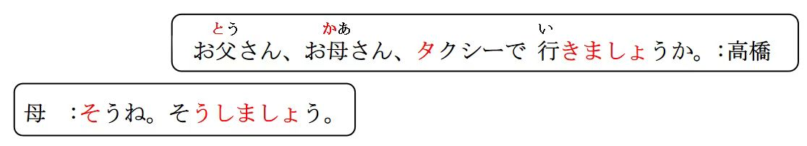

# うえ、した、みぎ、ひだり...

## 方位处所词

## 训读基数词

| 词汇      | 假名               | 释义               |
| :-------- | :----------------- | :----------------- |
| 上        | ふたつ ③           | 上                 |
| 下        | した ②             | 下                 |
| 右        | みぎ ⓪             | 右                 |
| 左        | ひだり ⓪           | 左                 |
| 前        | まえ ①             | 前                 |
| 後        | ろうしろ ⓪         | （场所） 后        |
| 中        | なか ①             | 中间， 里面        |
| 外        | そと ①             | 外                 |
| 傍        | そば ①             | 旁边               |
| 横        | よこ ⓪             | 侧面， 旁边        |
| 隣        | となり ⓪           | 旁边， 隔壁        |
| 周り      | まわり ⓪           | 周围               |
| 間        | あいだ ⓪           | ......之间         |
| 真ん 中   | まんなか ⓪         | 正中间             |
| 中心      | ちゅうしん ⓪       | 中心               |
| 角        | かど ①             | 拐角， 角落        |
| 辺／ 辺り | へん ⓪ ／ あたり ① | 周边， 周围        |
| -側       | -がわ ⓪            | .....侧            |
| 東        | ひがし ⓪           | 东                 |
| 西        | にし ⓪             | 西                 |
| 南        | みなみ ⓪           | 南                 |
| 北        | きた ⓪ ②           | 北                 |
| 向こ う   | むこう ② ⓪         | 对面； 远方； 对方 |
| 向か い   | むかい ⓪           | （正） 对面        |

## 横 ・ 隣 ・ そ ば 区 別

1. 隣（ となり ） ⓪
   以同类事物为对象的旁边。
   中国の 隣は 日本で す ： 即使两国距离很远， 中
   间隔了山或者海， 但是在国家这个类别中， 中
   国的旁边是日本， 中间没有隔其他的国家。
2. 横（ よこ ⓪ ）
   水平方向的左右的旁边。 不是前后， 或者斜面
   至于中间有没有隔同类事物， 或是距离远近， 没
   有相关限制。
   横に 座る （ 在强调坐的方位）
3. そば ①
   距离近。 无关是否隔同类对象， 是否是水平方
   向， 是否密接。 只要近就可以。
   ず っ と そ ば に い る （ 具象或抽象的距离近）

   > 总结：
   > ① 横： （ 横向的） 旁边（ 横排）  
   > ② 隣： （ 紧贴的） 旁边（ 邻着）  
   > ③ 縦： （ 竖向的） 纵； 竖  
   > ④ そば： （ 近处的） 旁边  
   > ⑤ 周り： （ 附近的） 周围

   ## V ましょう<建议> 直接建议

   意义： 用于建议对方与自己一起做某事， 是敬体形式。  
   接续： 动词的第一连用形(ま す 去ま す ） +ま し ょ う  
   译文： ......吧； ......怎么样； （一起） 做、 、 吧

```ts
(1) 今日は 天安門に行きましょう 。
今天（ 一起） 去天安门吧~
(2) そうね 、 そうしましょう 。
そうする 是啊， 就按照你说的做吧~
(3) こ こ で 写真を 一枚撮りましょう 。
撮る 在这里拍张照片吧~
(4) こ の 単語の 意味は 辞書で 調べましょう 。  // 調べ る
这个单词的意思我们一起用词典查一下吧
```

## V ましょうか<建议>

一起做，，吗？ 比较委婉的建议

> 「 Ｖ ましょうか 」 比「 Ｖ ましょう 」 语气委婉， 征求意见的语感更强。

```ts
(1) お 父さ ん 、 お 母さ ん 、 タ ク シ ー で 行き ま し ょ う か 。
爸爸， 妈妈， 一起坐的士去吗？
(2) あ そ こ の 喫茶店で コ ー ヒ ー を 飲み ま し ょ う か 。
飲む 一起在那里的咖啡店喝杯咖啡吗？
```

```ts
(1)（一起） 散步吧。 （直接） 散歩す る 「 さ んぽす る 」
⇒ （ 一緒に )散歩し ましょう 。
(2) A:一起回家嘛？ （委婉） 帰る 「 かえ る 」
⇒ （ 一緒に ） 家に 帰りましょうか 。
B:好， 就那样做吧。 那样做： そうする
⇒ ええ 、 そうしましょう 。
```

## N1 二に N2 がある/いる <存在>

意义： 表示人、 物存在于某处。  
接续： N1(处所)に N2（物体、 植物） が +あります  
N1(处所)に N2（人、 动物） が +い ます  
译文： N1 处有 N2 （某地有某物） に ： 存在的场所

```ts
(1) あそこに毛沢東の肖像画があります。
 那里有毛爷爷的肖像画。
(2) 天安門の 北に 景山公園があります。
天安门的北边有景山公园
(3) 下に 観光客がおおぜいいますね。
下面有很多游客。
(4) 正門「 せいもん 」の前に王さんがいます。
 正门那里有小王。
```

## N1 に(は) N2 がある/いる <存在>

N1 に 」 后面接上助词「 は 」 ， 可以强调、 突出存在的场所。
尤其在表达否定意义时， 用「 は 」 进行强调。

```ts
（1） "天安門の 正面に" は 天安門広場が あります。
（2） 故宮の 向こ う に は 、 景山公園があります。
（3） 教室に は 学生が " いません "。 います。 いる ー いない
（4）部屋にはテレビがない。
```

## 練習 れんしゅう

```ts
（1）A: 房间里面有谁？ 部屋「 へや」 /李さ ん
⇒ 部屋に （ は ） 誰がいますか。
   B: 有小李。
⇒ り さ んがい ま す。 誰か（が）いますか。
（2）桌子的上面有书。 机の 上/本つくえうえほん
⇒ つ く え の 上に 本があ る ・あります 。
书在桌子上。
```

## N2 は N1 にある/いる <所在>

意义： 表示人、 物的所在之处。  
接续： N2(物体， 植物)は N1（处所） に +ある  
N2(人、 动物)は N1（处所） に +いる  
译文： N ２ 在 N １ 处 （某物在某地）

```ts
(1） 故宮は 天安門の 北にあります。 故宫在天安门的北边。
(2) 私たちは今、 北京の 中心にいます。 我们现在在北京的中心。
(3) 高橋： すみません 、 王さんはいますか。 小王在吗？
鈴木： いません 。 // 不在
(4)高橋： すみません 、 お手洗いはどこにありますか。
洗手间在哪里呢？
鈴木： 1階にはありません 。 2階です。
いっかい"不"在1楼。 在2楼
(5) 故宮は 天安門の 北です。
```
## 精読の教文

<vue-plyr>
  <audio controls crossorigin playsinline autoplay loop>
    <source src=".../audio/7-1-1.mp3" type="audio/mp3" />
  </audio>
 </vue-plyr>

