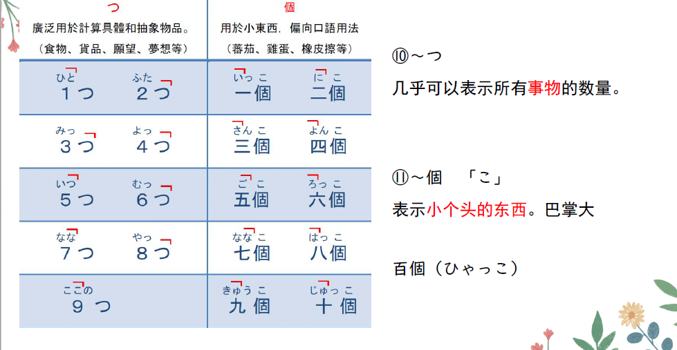
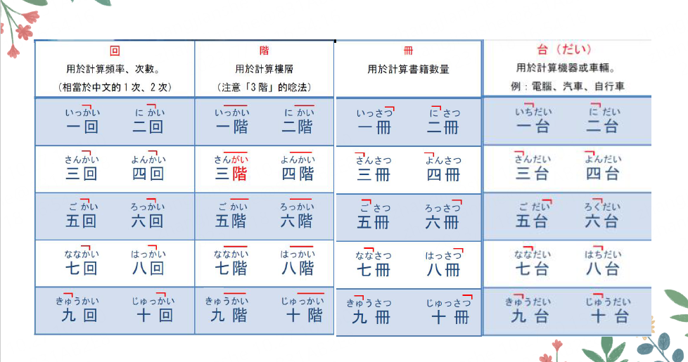
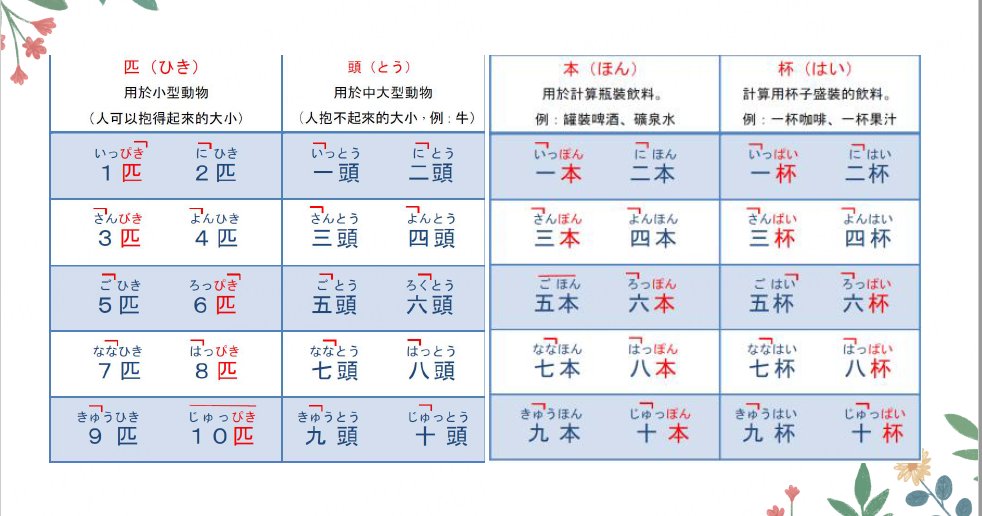
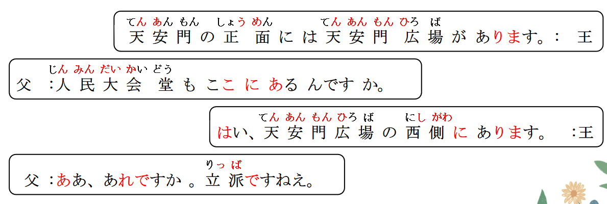

# だい、はい、ひき、んですか

## 量的后缀

1. 出现的「 ～ 人/～ 階/～ 枚/～ （ か ） 国/～ 本/～ 台/～ 冊/～ 杯/～ 匹」 均接在
   数词后面， 表示量的成分。 其性质属于后缀， 只能接在数词后面与其共同构成数
   量词， 不能单独使用， 因此它与汉语的量词并不完全相同。 更需要注意的是， 大
   多数与汉语量词同形的音读后缀， 它们与数词的搭配情况并非等同于汉语， 不能
   将二者等量齐观。 另外， 有些日语表示量的后缀虽然与汉语同形， 但二者的意义
   和用法并非完全一致， 需要加以辨别。
2. 此外， ハ行的量词本身会发生浊音或半浊音的变化，  
   は ひふへほ 杯「 は い 」 匹「 ひき 」 本「 ほ ん」  
   其变音规则是： **1 p** / 2 h / **3 b** / 4 h / 5 h / **6 p** / 7 h / **8 p** / 9 h / **10 p**。  
   举例如下： P： **っ ＋ 半浊音ぱ** b： 浊音ば

   > 1 本： いっぽん 1 支  
   > 3 本： さんぼん 3 支  
   > 6 本： ろっぽん  
   > 8 本： はっぽん  
   > 10 本： じゅっぽん/じっぽん

## 楼层类：层，楼 階＜かい＞

| 1 階         | 2 階     | 3 階                     | 4 階         | 5 階                       |
| :----------- | :------- | :----------------------- | ------------ | -------------------------- |
| **いっかい** | にかい   | **さんがい<br>さんかい** | よんかい     | ごかい                     |
| 6 階         | 7 階     | 8 階                     | 9 階         | 10 階                      |
| **ろっかい** | ななかい | **はっかい<br>はちかい** | きゅうかい　 | **じゅっかい<br>じっかい** |

> 何階 なんがい

## 书本类：册，本 （厚度）冊＜さつ＞

| 1 冊         | 2 冊     | 3 冊         | 4 冊       | 5 冊                       |
| :----------- | :------- | :----------- | ---------- | -------------------------- |
| **いっさつ** | にさつ   | さんさつ     | よんさつ   | ごさつ                     |
| 6 冊         | 7 冊     | 8 冊         | 9 冊       | 10 冊                      |
| ろくさつ     | ななさつ | **はっさつ** | きゅうさつ | **じゅっさつ<br>じっさつ** |

> 何冊 なんさつ

## 车辆.电器（电视、电话）类 台＜だい＞

| 1 代/辆/台/个 | 2 代/辆/台/个 | 3 代/辆/台/个 | 4 代/辆/台/个 | 5 代/辆/台/个  |
| :------------ | :------------ | :------------ | ------------- | -------------- |
| いちだい      | にだい        | さんだい      | よんだい      | ごだい         |
| 6 代/辆/台/个 | 7 代/辆/台/个 | 8 代/辆/台/个 | 9 代/辆/台/个 | 10 代/辆/台/个 |
| ろくだい      | ななだい      | はちだい      | きゅうだい    | 　じゅうだい   |

> 何代・何台 なんだい

## 体形高大的动物（牛、马）：匹，头 頭 ＜とう＞

| 1 頭         | 2 頭     | 3 頭         | 4 頭       | 5 頭                       |
| :----------- | :------- | :----------- | ---------- | -------------------------- |
| **いっとう** | にとう   | さんとう     | よんとう   | ごとう                     |
| 6 頭         | 7 頭     | 8 頭         | 9 頭       | 10 頭                      |
| ろくとう     | ななとう | **はっとう** | きゅうとう | **じゅっとう<br>じっとう** |

> 何頭　なんとう
> 蝶: ちょう　１　蚕:　かいこ　１　用とう（頭）来形容。

## 动物类（小型的动物） 匹 <ひき>

> ① 兽类＜匹；头；只＞
>
> ② 鱼类＜条，尾＞
>
> ③ 虫类＜条，只＞

| 1 匹         | 2 匹     | 3 匹         | 4 匹       | 5 匹                       |
| :----------- | :------- | :----------- | ---------- | -------------------------- |
| **いっぴき** | にひき   | **さんびき** | よんひき   | ごひき                     |
| 6 匹         | 7 匹     | 8 匹         | 9 匹       | 10 匹                      |
| **ろっぴき** | ななひき | **はっぴき** | きゅうひき | **じゅっぴき<br>じっぴき** |

> 何匹 なんびき

## 饮水（酒、茶）用的容器：杯 杯＜はい＞

| 1 杯         | 2 杯     | 3 杯                     | 4 杯       | 5 杯                       |
| :----------- | :------- | :----------------------- | ---------- | -------------------------- |
| **いっぱい** | にはい   | **さんばい**             | よんはい   | ごはい                     |
| 6 杯         | 7 杯     | 8 杯                     | 9 杯       | 10 杯                      |
| **ろっぱい** | ななはい | **はっぱい<br>はちはい** | きゅうはい | **じゅっぱい<br>じっぱい** |

> 何杯 なんばい

## 细长类 本 <ほん>

> ① 细长物、笔类＜根；杆；枝＞
>
> ② 瓶子类＜瓶＞
>
> ③ 胶卷类＜卷；个＞
>
> ④ 影视作品＜部＞
>
> ⑤ 文章类＜篇＞

| 1 本         | 2 本     | 3 本                     | 4 本       | 5 本                       |
| :----------- | :------- | :----------------------- | ---------- | -------------------------- |
| **いっぽん** | にほん   | **さんぼん**             | よんほん   | ごはい                     |
| 6 本         | 7 本     | 8 本                     | 9 本       | 10 本                      |
| **ろっぽん** | ななはい | **はっぽん<br>はちほん** | きゅうはい | **じゅっぽん<br>じっぽん** |

> 何本 なんぼん

## 扁平类：薄的、扁平的物品　枚　<まい>

> ① 纸张类＜张＞
>
> ② 树叶类＜枚；片＞
>
> ③ 板子类＜块＞
>
> ④ 硬币类＜枚；个＞
>
> ⑤ 盘子碟子类＜个＞

| 1 枚             | 2 枚               | 3 枚           | 4 枚                   | 5 枚                 |
| :--------------- | :----------------- | :------------- | ---------------------- | -------------------- |
| いちまい         | にまい             | さんまい       | よんまい               | ごまい               |
| 6 枚             | 7 枚               | 8 枚           | 9 枚                   | 10 枚                |
| ろくまい         | ななまい           | はちまい       | きゅうまい             | じゅうまい           |
| 11 枚            | 14 枚              | 20 枚          | 21 枚                  | 25 枚                |
| じゅういちまい ④ | 　じゅうよんまい ③ | にじゅうまい ② | にじゅう・いちまい ①-② | にじゅう・ごまい ①-◎ |

> 何枚　なんまい

## 动物类＜飞禽类＞　羽　<わ>

> ① 禽类＜只＞
>
> ② 兔子＜只＞
>
> 兎：うさぎ
> 鵜：う
> 鷺：さぎ

| 1 羽       | 2 羽   | 3 羽       | 4 羽       | 5 羽                   |
| :--------- | :----- | :--------- | ---------- | ---------------------- |
| いちわ     | にわ   | **さんば** | **よんば** | ごわ                   |
| 6 羽       | 7 羽   | 8 羽       | 9 羽       | 10 羽                  |
| **ろっぱ** | ななわ | はちわ     | きゅうわ   | **じゅっぱ<br>じっぱ** |

> 何羽 なんば

## 广泛量词-つ、個



## 广泛量词-回、階、冊、台



## 广泛量词-匹、頭、本、杯



## 数量词 + V <对象的数量>

意义：表示动作所涉及对象的数量。　　
接续：名词+助词+数量词+V

```ts
(1) 我吃了两个苹果。// ふたつ　２つ　リンゴ　苹果　食べる
    リンゴをふたつたべました。
(2) ここで写真を一枚撮りましょう。
    一起在这里拍一张照片吧~
(3) 毎日、リンゴを2つ食べます。
   每天，要吃两个苹果。
(4) ビールは飲みませんでしたが、ワインを3杯飲みました。
  啤酒没喝，但是，喝了3杯红酒。
```

> 描述对象的数量时，汉语时常将数量词放在表示对象的名词前面，如“一
>
> 张照片”“两个苹果”“三杯酒”，日语则一般将数量词放在“名词+格助
>
> 词”后、动词前。

## 数量词的在句中的位置大致分为以下两种，且意思基本一致。数量词是名词。

1. 数量词+の+N（が/を）+V  
   例：２つのりんごを食べました。
2. N（が/を）+数量词+V  
   例：りんごを２つ食べました。

```ts
練習:　　
(1) 买了两本书。 // 本を買う「ほんをかう」 二冊「にさつ」
⇒　本を二冊買った・買いました。　　二冊の本を買った。
(2) 院子里有两只鸡。　// 庭「にわ」　 鶏「にわとり」　二羽「にわ」
⇒　庭に（は）鶏が二羽いる・います。
(3) 买了两枚一百块钱的邮票。　 // 切手「きって」を買う　　二枚：にまい　 百円「ひゃくえん」
⇒　百円の切手を二枚買った・買いました。
```

## ~んですか＜要求说明＞、～んです＜说明理由＞

> んです和んですか的区别

1. んです用法：加强语气，解释说明
2. んですか用法：加强语气，要求解释说明

```ts
例句：いいです。 　好的、可以。
　　　いいんです。 好的！！可以！！　　　
　　　いいですか。　可以嘛？　
　　　いいんですか。！！可以吗？？！！
```

## ~んですか＜要求说明＞

意义：用于说话人基于某一前提，向对方进一步确认情况或要求对方予以说明，解释，  
也表达说话人吃惊或者疑惑的语气。  
① 作用：加强语气，要求对方给我解释说明  
② 注意： んです的简体是んだ　んです是のです的口语 时态和肯否定体现在前面的词上  
接续：动词、形容词连体形+んですか　 名词だ+な+んですか  
说明：「ん（n）」是由「の（no）」变化而来（元音“o”脱落造成）的，一般用于口语中。

```ts
(1) 父：人民大会堂もここにあるんですか。 人民大会堂也在这里吗？？！　 　
　　王：はい、人民大会堂は天安門の西側にあります。 //（好奇）てんあんもん　にしがわ
(2) 顔色[脸色]が悪いですね。何かあったんですか。　//（关心，疑惑） かおいろ
　　 你脸色好差啊。 何か（が)ある。　// 是不是发了什么事情呢？　
(3) あ、アイスクリーム！お姉ちゃんが買ったんですか。　//（吃惊，喜悦）　
啊！冰激凌！ 是姐姐你买的吗？？！
(4) 小王看到小李很晚要出门）李さん、こんな時間にどこへ行くんですか。
もう[已经]遅いですよ。 遅い：おそい 很晚了哦！
小李啊，这个点你要去哪里啊？？！ //（震惊，疑惑？？）
```

> 例（1）中，高桥的父亲事先知道人民大会堂在天安门广场旁边，基于这一前
> 提，在到达天安门广场后，高桥的父亲向小王询问了人民大会堂的位置。

## ~んです/~ の（ん）だ/のである<说明理由>

意义：用于解释、说明前面提到的事情的原因、理由。加强语气。 　
接续：动词、形容词连体形+んです／の(ん)だ／のである  
名词+な+んです／の(ん)だ／のである

```ts
(1) ああ、ここ日本でも有名ですよ。日本のテレビ番組で紹介したんです。
　　啊，这里 在日本也很有名哦！ 在日本的电视节目上介绍过了。　
(2) 鈴木：えっ、今晩の試合を見ないんですか。什么？ 你居然不看今晚的比赛？
　⇒王：ええ、明日テストがあるんです。 是的，（是因为）明天有考试。
(3) 明日僕は行かない。授業があるんだ。 明天我不去。 有课。
(4) 昨日久しぶりに会社を休んだ。風邪を引いたのである。
```

> 「のである」☞ 用于文体正式的书面语（见本课第 3 单元）。

## 接续

1. 动词/形容词/名词/副词（そう） 简体 +**んです**・ のです。
2. 除了 二类形容词/名词/副词的非过去时肯定(原型) + **な\*\***んです\*\*。

| 接续       | 原形     | ない形       | た形       | なかった形       |
| :--------- | :------- | :----------- | ---------- | ---------------- |
| 动词       | わかる   | 分からない   | 分かった   | 分からなかった   |
| 一类形容词 | やさしい | 優しくない   | 優しかった | 優しくなかった   |
| 二类形容词 | きれいだ | 綺麗ではない | 綺麗だった | 綺麗ではなかった |
| 名词       | 先生だ   | 先生ではない | 先生だった | 先生ではなかった |
| 副词       | そうだ   | そうではない | そうだった | そうではなかった |

## 接续-例子

1. 动词：食べる**んです** 食べない**んです** 食べた**んです** 食べなかった**んです**
2. 一类形容词：優しい**んです** やさしくない**んです** やさしかった**んです** やさしくなかった**んです**
3. 二类形容词，名词，副词的非过去式肯定（原形），+な＋**んです**・のです
4. 二类形容词：きれいな**んです** きれいではない**んです** きれいだった**んです** 綺麗ではなかった**んです**
5. 名词： 先生な**んです** 先生ではない**んです** 先生だった**んです** 先生ではなかった**んです**
6. 副词： そうな**んです** そうではない**んです** そうだった**んです** そうではなかった**んです**

## 选择合适的形式

1. この店の 料理はんです。很好吃！ ！
   ① 美味しいです ➁ 美味しいな ③ 美味しいだ **④ 美味しい**
2. この絵がんです。非常喜欢这个画！！ 好き
   ① 好き ➁ 好きだ **③ 好きな** ④ 好きい
3. いつんですか 。 ― 明日んです。你什么时候去啊？ ！
   **① 行く** ➁ 行き ③ 行きます ④ 行くな
4. 彼はんです。 他是日本人哦！
   ① 日本人 **➁ 日本人な** ③ 日本人だ ④ 日本人の

```ts
(1)（ 很晚了， 看到同学还不走说） ： 你还不回去吗？ 已经10点了哦！
// まだ：还；帰る「 かえ る 」：回去；もう：已经；じゅうじ：十点
⇒ まだかえらないんですか。もうじゅうじですよ。
(2) 宿舍生活非常开心。 （ 是因为） 大家都很热情亲切。
//寮生活（ りょうせいかつ ）：宿舍生活； 親切（ しんせつ）：热情亲切　楽しい：たのしい
⇒　りょうせいかつはたのしいです。みんながしんせつなんです。
```
## 精読の教文

<vue-plyr>
  <audio controls crossorigin playsinline autoplay loop>
    <source src=".../audio/7-1-2.mp3" type="audio/mp3" />
  </audio>
 </vue-plyr>


