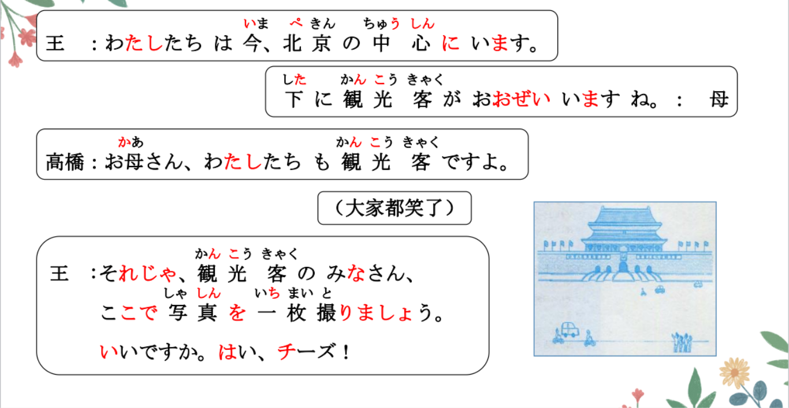

# がみえる、になる..

## N が見える <可能>

意义： 表示事物映入眼帘， 或者具备看到的能力。  
接续： 名词+が見える  
译文： 看得见......； 看得到......

```ts
(1) そこから天安門広場が全部見えます。
从那里看得见天安门广场的全貌。
(2) あそこに（ ある ）故宮が見えますね。
看得见在那里的故宫。
(3) 景山公園から、故宮が見えるんですか。
从景山公园看得见故宫嘛？
```

## 「 見る 」 与「 見える 」 的区别如下

| 词语   | 语义侧重         | 自/他动词 | 用法                                   |
| :----- | :--------------- | :-------- | :------------------------------------- |
| 見る   | 主动的动作       | 他动词    | 万里の長城を見ます<br>（眺望长城）     |
| 見える | 自然的结果或能力 | 自动词    | 万里の長城が見えます<br>（能看见长城） |

```ts
(1) 我们一起去日本看富士山吧！ （ 主动去看） // ふじさん
（ 私たちは一緒に）にほんに ・ へふじさんをみに行きましょう 。
(2) 从新干线看得见富士山。 （现在坐在新干线， 睁开眼睛就能看到富士山。）
しんかんせんから富士山が見える・ 見えます。
```

## N になる/AI くなる/AII になる <变化的结果>

意义： 表示变化的结果。  
接续： 名词+に+なる; AI く／ AII に+なる  
译文： 变得......； 变成......

```ts
(1) そろそろ11時になりますね。
(2) 肌がきれいになったよ。
(3) おなかがいっぱいになりました。
(4) 北京は寒くなりました。
北京变冷了。
```

## 練習 れんしゅう

```ts
(1) 字を大きく書きました。
把字写大了。 // おおきく 書く
(2) 部屋をきれいに掃除しました。
把房间打扫干净了。 // 綺麗に掃除する
```

## 形容词的第一连用形(A1 く / A2 に)

形容词的连用形有第一连用形和第二连用形两种形式，其中第一连用形用于修  
饰动词，表示动作的状态、结果，也可用于中顿(详见第 11 课第 3 元)。形容词第  
一连用形的变化规则如下:

| 形容词类型 | 规则         | 例               |
| :--------- | :----------- | :--------------- |
| 1 类形容词 | A い----A く | 大きい----大きく |
| 2 类形容词 | A だ----A に | 綺麗だ---綺麗に  |

```ts
(1) 从下周开始会变得忙。 // らいしゅう  忙しい 「 いそがしい 」
⇒ 来週から忙しくなる・なります。
(2) 到冬天了。 冬「 ふゆ 」
⇒ 冬になった・なりました。
(3) 城镇变热闹了。 // 町/賑やか まち にぎやか
⇒ 町は/が賑やかになった・なりました。
```
## 精読の教文
<vue-plyr>
  <audio controls crossorigin playsinline autoplay loop>
    <source src=".../audio/7-1-3.mp3" type="audio/mp3" />
  </audio>
 </vue-plyr>


## 会話
<vue-plyr>
  <audio controls crossorigin playsinline autoplay loop>
    <source src="../audio/7-1-かいわ.mp3" type="audio/mp3" />
  </audio>
 </vue-plyr>





