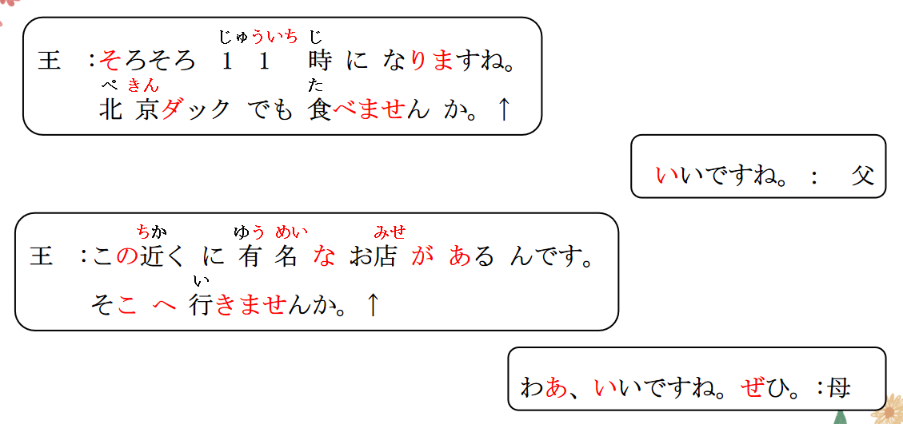

# でも、ませんか、でしょう
## 新出単語
<vue-plyr>
  <audio controls crossorigin playsinline loop>
    <source src="../audio/7-2-たんご.mp3" type="audio/mp3" />
  </audio>
 </vue-plyr>

## でも ＜示例＞

意义： 用于举例。  
翻译： 什么的； 之类的（只举一个， 暗示其他的也可）  
接续： 名词（+格助词） +でも

```ts
 (1) 北京ダック（を）でも食べませんか。
 不一起吃点北京烤鸭之类的嘛？
 (2) お茶（を）でも飲みましょうか。
 我们喝点茶什么的吗？
 (3) 公園にでも行きましょうか。
 一起去公园之类的地方吗？
```

> 名词后的格助词是「 が 」 「 を 」 时， 「 で も 」 可以替代「 が 」 「 を 」 直接接在名  
> 词后； 当名词后为其他格助词， 如「 に 」 「 へ 」 「 と 」 「 で 」 等时， 可以接在格  
> 助词后使用。 语气比较委婉， 暗示还可以有其他选择， 常用于向对方提出建议。

## 練習 れんしゅう

```ts
 (1) 听听音乐什么的嘛？ // 音楽を聞くおんがくをきく
⇒ 音楽（を）でも聞きましょうか 。
 (2) 喝个果汁什么的嘛？ // ジュース（を ）でものむ
⇒ ジュース（を）でも飲みましょうか 。
```

## V ませんか ＜建议＞

意义：

1. 用于建议、 邀请对方一起做某事。
2. 单独建议对方（你 不做、 、 吗？ ）

```ts
（1）やすむ高橋さんはちょっと休みませんか。
 （高桥你不稍微休息一下吗？ ）
```

> 译文： 不（一起） ...吗？ 接续： 动词第 1 连用形（ます形去ます）

```ts
(1) 北京ダックでも食べませんか。
不一起吃点北京烤鸭之类的吗？
(2) 一緒に公園に行きませんか。
不一起去公园吗？
(3) ここで写真を撮りませんか。
不（ 一起） 在这里拍照片吗？
```

> ☞ 和「 ましょう（か）」相比,「ませんか 」语气比较委婉，客气礼貌。

## 練習 れんしゅう

```ts
(1) 不一起看电视吗？ // テレビを 見る
⇒ （一緒に）テレビを見ませんか。
(2) 不一起去日本旅游吗？//  にほんりょこう行く
⇒ （一緒に）日本に/へ旅行に行きませんか。
```

## ~ んです/~ んですが＜引入话题＞

意义： 用于说话人引入话题， 然后就此话题向听话人提出询问、 请求、 邀请等。  
接续： 动词、 形容词连体形+んです ／んですが が ： 转折 （ 但是）  
名词+な +ん で す ／ ん で す が が ： 铺垫（ 承上启下）  
说明： 也可以用「 ですが 」 「 ですけど 」 将前后两句连接起来。

```ts
(1) 王： この近くに有名なお店があるんです。 そこへ行きませんか。
母： わあ 、いいですね。ぜひ。 务必（ 带我们去） 今いいですか。
(2) 遠藤先生、 ちょっとお話があるんです。 今よろしいでしょうか。
(3) 今晩カラオケに行くんですが、一緒に行きませんか。
(4) あのう、コピー機の使い方[使用方法]がわからないんですが、......
那个， 我不懂复印机的使用方法、 、 （言下之意）が：委婉的引出下文（请求）
```

## 練習 れんしゅう

```ts
(1) ちょっとお願いがあります/今いいですかお願い 「おねがい」请求
⇒ ちょっとお願いがあるんですが、今いいですか。
今よろしいでしょうか。）
(2) 今、ご飯を食べます/一緒に行きませんか
⇒ 今、ご飯を食べるんですが、一緒に行きませんか。
今、 ご飯を食べますが、一緒に行きませんか。
```

## ~ でしょう ＜推测＞

意义： 表示推测。 读降调、 敬体。 でしょう是です 的推测形式。  
でしょう的简体是だろう  
接续： 动词/Ⅰ 类形容词简体+でしょう Ⅱ 类形容词词干/名词/副词+でしょう  
译文： 应该 · · · · · · 吧 不要だ

```ts
(1) 12 時ごろからは混むでしょう。
从12点左右开始的话会很拥挤吧~
(2) 高橋：どの店がいいですか。 // 哪个店好呢？
⇒ 王：そうですね。あの店がいいでしょう。
 那个店应该还可以吧~
(3) 鈴木：あの人は大学の先生ですか。
那个人是大学的老师吗？
⇒ 趙：学生でしょう。应该是学生吧~
(4) 遠藤さんも国へ帰らなかったでしょう。
远藤应该也没回国吧~
```

## 接续-例子

1. 一类形容词：やさしい**でしょう** 優しくない**でしょう** 優しかった**でしょう** 優しくなかった**でしょう**
2. 动词：食べる**でしょう** 食べない**でしょう** 食べた**でしょう** 食べなかった**でしょう**
3. **二类形容词，名词，副词 的非过去式肯定（原形），不要だ。直接＋でしょう・だろう**
4. 二类形容词 綺麗**でしょう** 綺麗ではない**でしょう** 綺麗だった**でしょう** 綺麗ではなかった**でしょう**
5. 名词： 先生**でしょう** 先生ではない**でしょう** 先生だった**でしょう** 先生ではなかった**でしょう**
6. 副词： そう**でしょう** そうではない**でしょう** そうだった**でしょう** そうではなかった**でしょう**

## 練習 れんしゅう

```ts
(1) 小李（应该）是二年级吧~  // 李さん /二年生にねんせい
⇒ 李さんは二年生でしょう・だろう。
(2) 明天(应该）会下雨吧~~  // 明日/雨が 降るあしたあめがふる
⇒ 明日、雨が 降るでしょう・だろう。
```

## までに ＜期限＞

意义： 表示在某时限之前完成某动作、行为。  
接续： 时间名词+までに  
译文： （在） · · · · · · 之前 （做）

```ts
(1) 11時半までに行きましょう。
（咱们）在11点半之前去吧~
(2) 本は10日までに返します。
书的话会10号之前还。
(3) 寮には11時までに帰ります。
要在11点之前回宿舍。
(4) 日曜日までにしゅくだいをだす
在星期天之前交作业。
```

## 「まで」和「までに」都可以接在时间名词之后，二者意义用法区别如下

| 词语     | 语义侧重                      | 译文                                            | 用法                                                       |
| :------- | :---------------------------- | :---------------------------------------------- | ---------------------------------------------------------- |
| まで    | 在某时点前动作、 状态一直持续 | （做） 到...... <br>**到..为止**<br> **（V 一直在做）** | 八時から 10 時まで電話します。<br>（电话一直打到了 10 点） |
| までに | 在某时前完成动作或发生变化    | **在......之前**<br>**（做）**                          | 10 時までに電話します。<br> （10 点前打电话）              |

## 練習 れんしゅう
1. 在图书馆借书时借书处工作人员对你说：
この本は、４月31日（ ）返してくださいね。
①まで **➁までに**
2. 约会迟到的你说：
すみません、午後６時（ ）寝ました。
**①まで** ➁までに
3. 日本語の 授業は 十時（ ） 終わります。十時までです。
①まで **➁までに** **③に （具体时间点）**
4. 班主任老师对还没有完成作业的你说：
明日の午後5時（ ）先生に宿題を出してください。
①まで **➁までに**

```ts
(1) 小王从上午睡到了下午。// 王さん/午前から午後まで寝る 午前：ごぜん 午後：ごご
⇒ 王さんは午前からごごまで寝た・寝ました。
(2) 上午8点之前去教室。 // 午前八時/教室に行くはちじきょうしつ　　八時：はちじ 午前：ごぜん　教室：きょうしつ
⇒ 午前八時までに教室に行く・行きます。　
```

## 精読の教文
<vue-plyr>
  <audio controls crossorigin playsinline loop>
    <source src="../audio/7-2-1.mp3" type="audio/mp3" />
  </audio>
 </vue-plyr>
 
