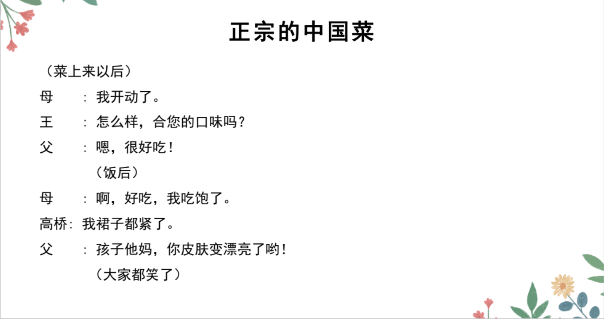

# で、にする、かいわ

## 新出単語


## で＜范围＞

意义：表示限定的范围。  
译文：在...（里）；在...（之中）

```ts
(1) 日本で富士山は一番「いちばん」高い山です。 　 // 接续：名词+で　　　　　　　　
 在日本富士山是最高的山。　
(2) ここは日本で も有名ですよ。　
 这里在日本也是很有名。
(3) “このクラスで”は山田さんと鈴木さんが日本人です。
在这个班级里面的话，山田和铃木是日本人。
(4) 北京の公園では北海公園と景山公園が好き[喜欢]です。//ほっかいこうえん
在“北京的公园”里的话，我喜欢北海公园和景山公园。
```

## 練習 れんしゅう

```ts
(1) 麻婆豆腐在日本很有名。 　 // マーボードーフ　　ぼ　ma-bo-do-fu　　　　　　　
 麻婆豆腐は日本で（は）有名です。
 日本で（は）マーボードーフは有名です。
(2) 猫是动物当中最可爱的。 　 // 猫「ねこ」　動物「どうぶつ」　一番「いちばん」
 猫は動物で一番可愛い・可愛いです。
```

## N にする＜选择、决定＞

意义：表示选择或决定的事物。　マーボードーフにする  
接续：名词+にする 　に：表示最终选择的结果干  
译文：要......；定......；选......

```ts
(1) （给对方看菜单)何「なに」にしますか。你要点什么？ // メニュー
　　　　ラーメンにします。 我要拉面。 ビールにする。 要啤酒。
(2) お酒は何「なに」にしますか。
 酒的话要点什么呢？
(3) 高橋：（在咖啡馆）私はコーヒーにします。//我要咖啡
　　鈴木：私もそれにします。我也要那个。
```

## 練習 れんしゅう

```ts
(1) 甜点的话你要什么呢？　// デザート　　 　
⇒　デザートは何「なに」にします。デザートは何にしますか。
(2) 我要草莓蛋糕！　// いちごケーキ
⇒　苺ケーキにする・します。（私は）苺ケーキにする・します。
(3) 颜色的话要红色。// 色；いろ　　赤：あか　Ｎ　　　　赤い　A1
⇒　色は赤にする・します。
```

## 精読の教文


## 会話


