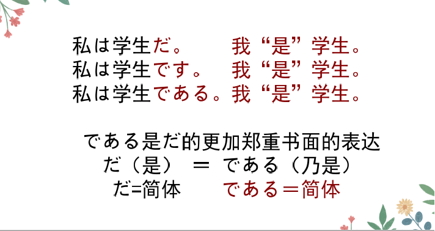
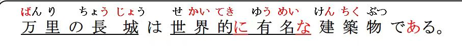
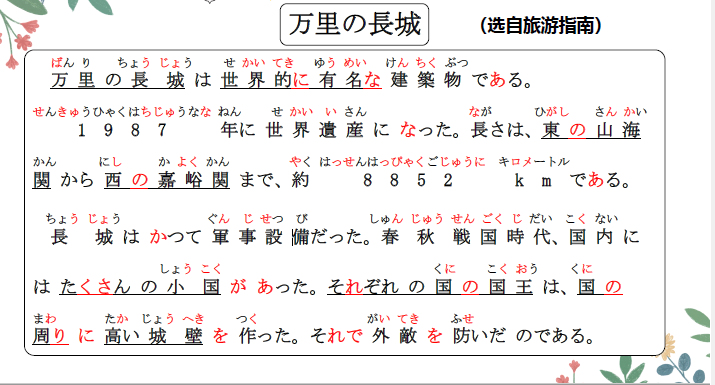
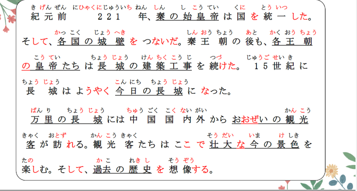
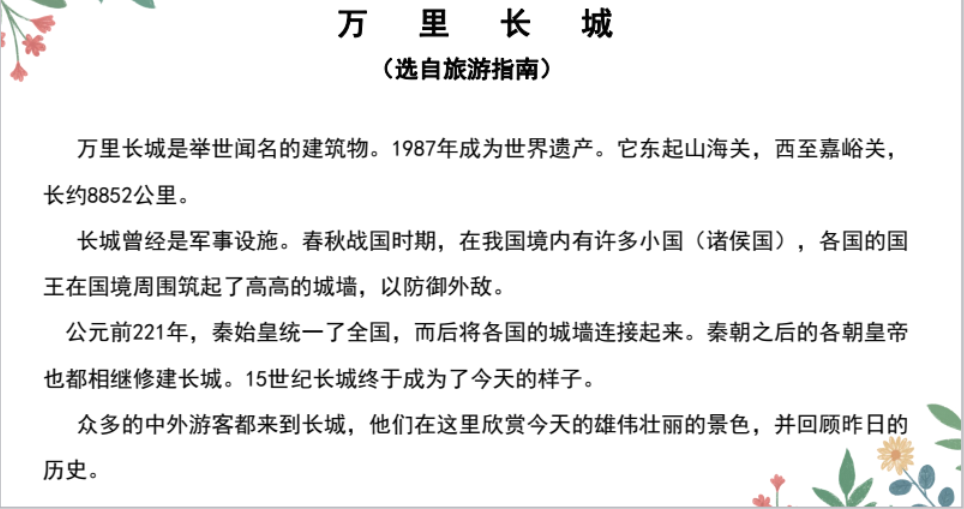

# である、に、かいわ

## 新出単語


## だ、です和である



> 口语：简体 だ　 平辈之间 关系亲密  
> 敬体：です　对人尊敬 关系不熟 生疏 　  
> 一般书面语：简体：だ　 自己写日记 　高橋さんの日記  
> 敬体 ：です 给人写信 　　　  
> 郑重书面语：简体：である　说明文 论文 学术期刊 新闻报道  
> 对事实进行客观描述

## である＜判断＞

☞ 「である」主要用于书面语，「です」「だ」则多用于口语。

|          | 肯定形式 | 否定形式     |
| :------- | :------- | :----------- |
| 非过去时 | である   | ではない     |
| 过去时   | であった | ではなかった |

```ts
(1) 万里の長城は世界的に有名な建築物である。　// 又，，又，，
　  万里长城是举世闻名的建筑物。 // すごく可愛い。非常的可爱
(2) 長さは、東の山海関から西の嘉峪関まで、約８８５２ｋｍである。
    长度，东起山海关西至嘉峪关，大约8852公里。 観光地「かんこうち」
(3) ここは有名な観光地である。
    这里是有名的景点
```

## 接续

1. 简体接**んです**・のです・んだ・のだ・のである
2. 动词：食べる**んです**　食べない**んです**　食べた**んです**　食べなかった**んです**
3. 一类形容词：優しい**んです**　やさしくない**んです**　やさしかった**んです**　やさしくなかった**んです**
4. 二类形容词，名词，副词的非过去式肯定（原形），+な＋**んです**・のです・んだ・のだ・のである
5. 二类形容词：きれいな**んです**　きれいではない**んです**　きれいだった**んです**　綺麗ではなかった**んです**
6. 名词： 先生な**んです**　 先生ではない**んです**　先生だった**んです**　先生ではなかった**んです**
7. 副词： そうな**んです**　　そうではない**んです**　そうだった**んです**　そうではなかった**んです**

## 練習 れんしゅう

```ts
(1) 北京乃是中国的首都。 // ぺきん　ちゅうごく　首都「しゅと」
⇒ 北京は中国の首都である。
(2) 大海乃是生命之源。　// うみ　生命：せいめい　故乡：故郷「ふるさと」　
⇒ 　海は生命の故郷である。
```

> だ＝である　
> のだ＝のである　　んだ＝んである（✖）没有这个说法　  
> のだ・んだ　　　のです・**んです**

## に＜客体的存在的处所/附着点＞

意义：表示客体存在的处所。 客体在を的前面。  
接续：处所、方位名词+に  
译文：在......

```ts
(1) 国の周りに高い城壁を作った。
    在国家的周围建造了高高的城墙。
(2) あの方はこの町に家を買った。 // （家を買った + 家は町にある）
    那个人在这个城市买了房子。
(3) 胡先生は２階に部屋を持っている[拥有]。// 持つ「もつ」
    （部屋を持っている + 部屋は２階にある） 胡老师在2楼拥有房间。
```
## 練習 れんしゅう
```ts
(1) 在这里丢垃圾。（垃圾丢到了这里） // 垃圾：ゴミ　 丢：捨てる（すてる）
⇒ ここにゴミを捨てる。　　// ここでゴミを捨てる。
(2) 把钱放到桌子上。（钱在桌子上）// 钱： お金（おかね）　　放：置く（おく）　
⇒　机の上にお金を置く・置きます。
　　お金を机の上に置く。
```
## に和で 的区别

> 「に」强调客体存在的场所  
> 「で」强调动作发生的场所

```ts
(1) 日本で 家を 買った。
(2) 日本に 家を 買った。
```

## 精読の教文




## 会話





