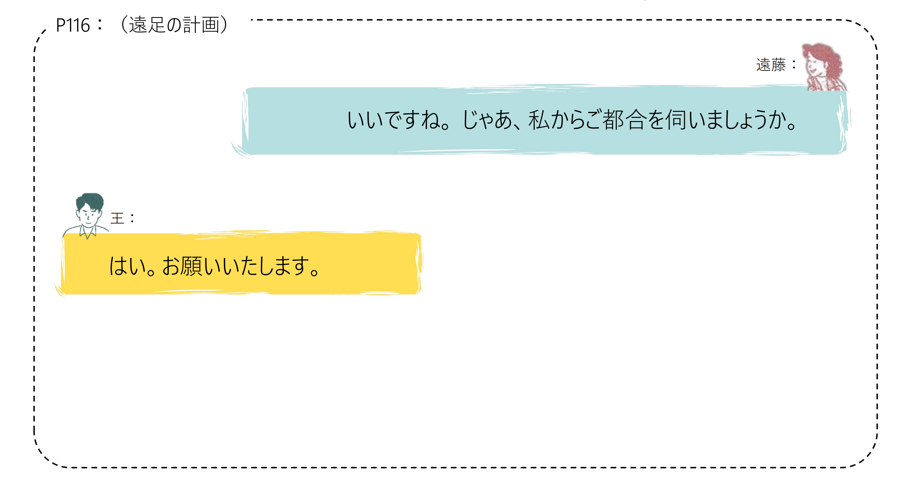
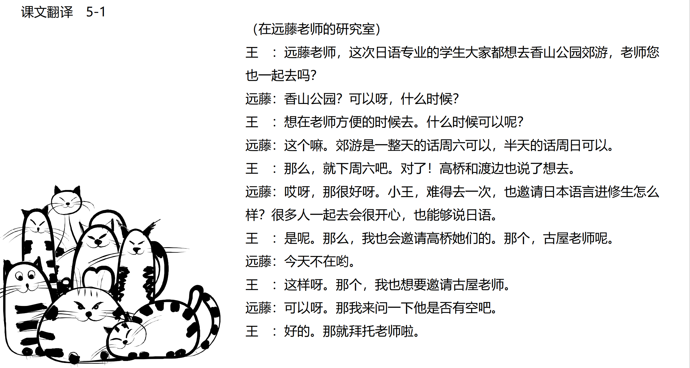

# 敬语、自谦语...

## 新出単語

<vue-plyr>
  <audio controls crossorigin playsinline loop>
    <source src="../audio/c/5-1-たんご.mp3" type="audio/mp3" />
  </audio>
 </vue-plyr>

| 単語                                         | 词性            | 翻译                                           |
| -------------------------------------------- | --------------- | ---------------------------------------------- |
| 遠足（<JpWord>えんそく</JpWord> ）           | ⓪ ＜名・自 Ⅲ ＞ | 远足;郊游                                      |
| 香山（<JpWord>こうざん</JpWord> ）           | ①<固名>         | 香山（地名）                                   |
| 都合（<JpWord>つごう</JpWord> ）             | ⓪<名>           | 情形；状况；方便与否                           |
| <JpWord>よろしい</JpWord> 「宜しい」         | ③⓪ <形 Ⅰ>       | 好；可以                                       |
| 丸一日（<JpWord>まるいちにち</JpWord> ）     | ⓪④<名>          | 一整天                                         |
| 丸-（<JpWord>まる-</JpWord> ）               | <名>            | 〈接頭〉 整个；完全                            |
| 一日（<JpWord>いちにち</JpWord> ）           | ④⓪<名>          | 一天                                           |
| 半日（<JpWord>はんにち・はんじつ</JpWord> ） | ④<名>           | 半天                                           |
| <JpWord>あら</JpWord>                        | ①<感>           | 啊（表示吃惊或感叹）                           |
| 古屋（<JpWord>ふるや</JpWord> ）             | ①<固名>         | （姓）古屋                                     |
| <JpWord>いらっしゃる</JpWord>                | ④<自 Ⅰ>         | 来；去；在（「来る」「行く」「いる」的尊他语） |
| 伺う（<JpWord>うかがう</JpWord> ）           | ⓪ <他 Ⅰ>        | 「聞く」「行く」的自谦用法）问；询问；听；拜访 |
| 尊敬（<JpWord>そんけい</JpWord> ）           | ⓪<名·他 Ⅲ>      | 尊敬，尊重                                     |
| <JpWord>なさる</JpWord>                      | ②<自 Ⅰ>         | 做；干（「する」的尊他语））                   |
| 謙譲（<JpWord>けんじょう</JpWord> ）         | ⓪ <名·形 Ⅱ>     | 谦虚；谦让 謙譲語                              |
| 参る（<JpWord>まいる</JpWord> ）             | ① <自 Ⅰ>        | 「来る·行く」的自谦说法）来；去                |
| <JpWord>スーツケース</JpWord> （suit case）  | ④<名>           | 旅行箱                                         |
| <JpWord>いたす</JpWord> （致す）             | ② ＜他 Ⅰ ＞     | （「する」的自谦说法）致力; 做                 |
| 家族連れ（<JpWord>かぞくづれ</JpWord> ）     | ⓪ ＜名＞        | 带着家人                                       |
| -連れ（<JpWord>-づれ</JpWord> ）             | 〈接尾〉        | 带着〜                                         |
| 勧める（<JpWord>すすめる</JpWord> ）         | ⓪ ＜他 Ⅱ ＞     | 推荐；劝                                       |
| オフ会（<JpWord>オフかい</JpWord> ）         | ①〈名〉         | （moff-line meeting 的省略说法）线下会议       |
| 弁論（<JpWord>べんろん</JpWord> ）           | ⓪<名·自 Ⅲ>      | 辩论                                           |
| 優勝（<JpWord>ゆうしょう</JpWord> ）         | ⓪ <名·自 Ⅲ>     | 优胜;夺冠                                      |
| 力がつく （<JpWord>ちからがつく</JpWord> ）  | ③-①             | 有了能力；实力提升                             |
| 力（<JpWord>ちから</JpWord> ）               | ③ ＜名＞        | 力量；实力                                     |
| 申し出る（<JpWord>もうしでる</JpWord> ）     | ④⓪ ＜他 Ⅱ ＞    | 提出（申请）                                   |
| 共感（<JpWord>きょうかん</JpWord> ）         | ⓪<名·自 Ⅲ>      | 同感；共呜                                     |
| 回す（<JpWord>まわす</JpWord> ）             | ⓪ ＜他 Ⅰ ＞     | 传递；转动                                     |
| 感想（<JpWord>かんそう</JpWord> ）           | ⓪ ＜名＞        | 感想；感受                                     |

## 敬语


## 練習 れんしゅう

```ts
1.古屋先生は今日はいらっしゃいません。　// いる
⇒ 古屋老师今天不在。
2.先生は明日の授業が8時からとおっしゃいました。// 言う
⇒老师说明天的课8点开始。
3.どうぞたくさん召し上がってください。// 食べる・飲む
请吃（请开动）
4.日本でどんな研究をなさいましたか。// する
在日本做什么研究。
5.今日の新聞をご覧になりましたか。// 見る・読む
您看过今天的报纸了吗?
6.これは山田先生がお書きになった日本語文法の本です。　// 書く
这是山田老师写的日语语法书。
7.李さんは佐藤さんの結婚式にご出席になりますか。// 出席する
小李出席佐藤的婚礼吗。
8.当店ではクレジットカードはご利用になれません。// 利用する
本店不能使用信用卡。
```


## 練習 れんしゅう

```ts
1.では、来週の土曜日にいたしましょう。// にする
那么，就定在下周六吧
2.じゃあ、まず土曜日のご都合を伺いましょう。// 聞く
 那么，先问一下星期六的时间吧
3.わたくしは李東と申します。// 言う
 我叫李东。
4.もうたくさんいただきました。// 食べる・飲む・もらう
 已经吃得很多了。
5.先生にお目にかかることができて、本当にうれしく存じます。
 能见到老师，我真的很高兴。【会う　思う・知る】
6.シンポジウムのことについて、お聞きしたいですが……。　
  关于研讨会的事情，我想问一下……。//【聞く＋たい】
7.先生、わたくしがご案内いたします。//案内する
  老师，我来带路。
8.では、あとでお電話いたします。　// 電話する
  那么，我稍后给您打电话。
```


## 会話

<vue-plyr>
  <audio controls crossorigin playsinline loop>
    <source src="../audio/c/5-1-かいわ.mp3" type="audio/mp3" />
  </audio>
 </vue-plyr>
 




