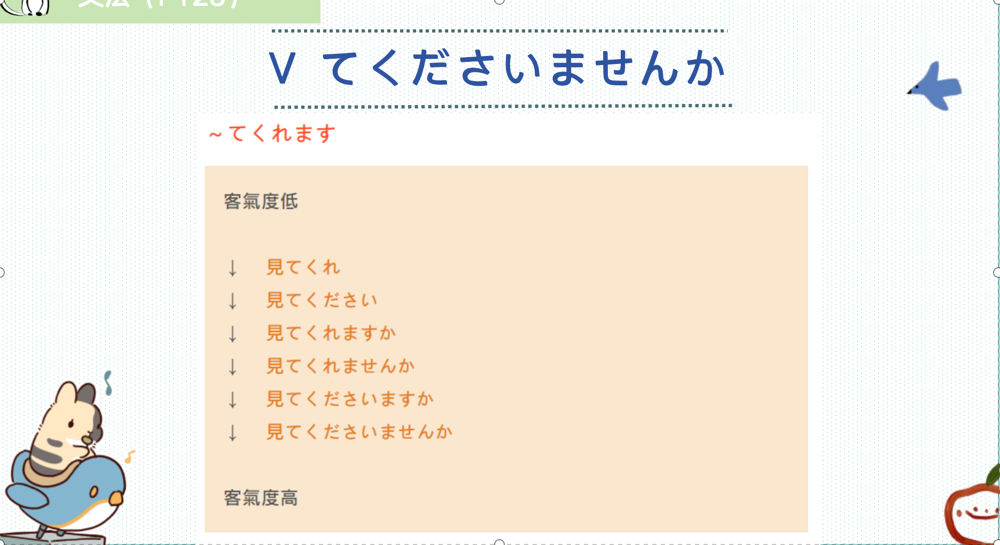
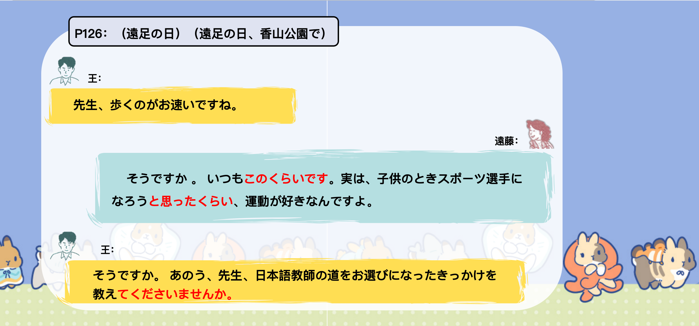
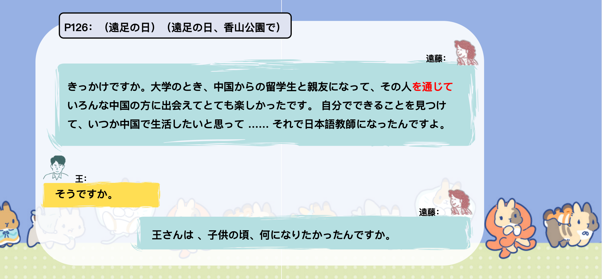
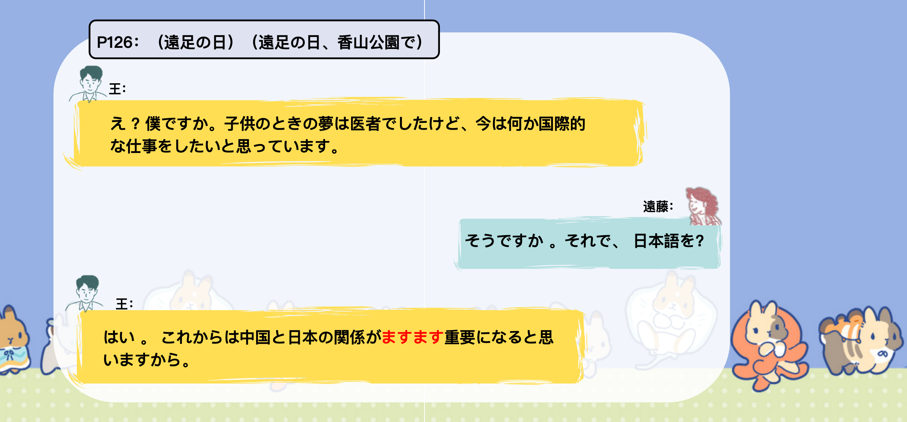
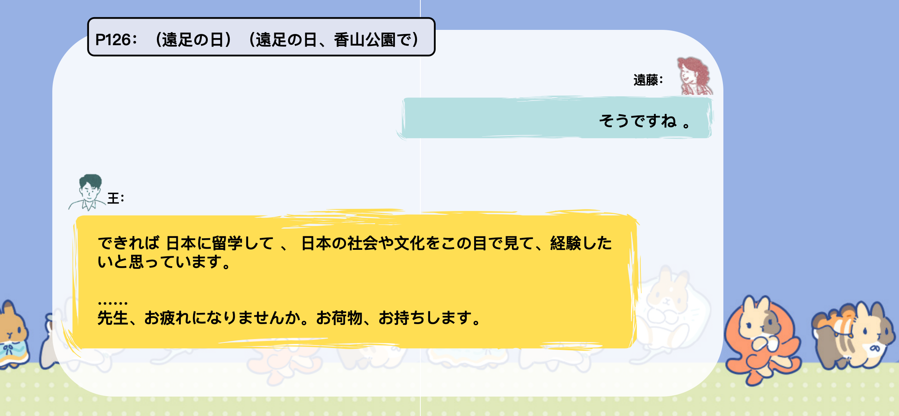
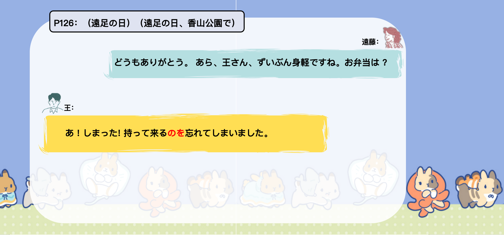
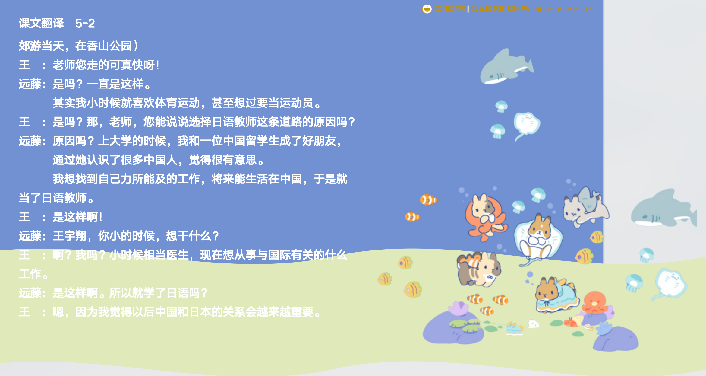
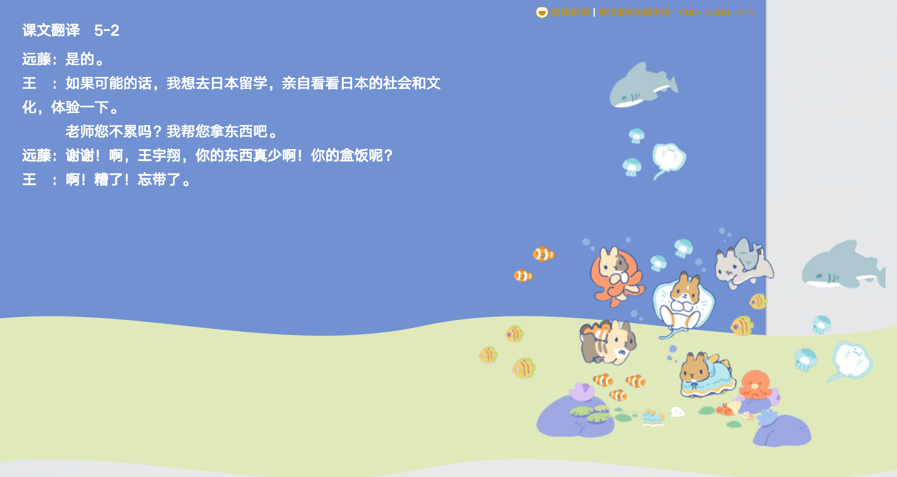

# 〜んじゃない..

## 新出単語

<vue-plyr>
  <audio controls crossorigin playsinline loop>
    <source src="../audio/c/5-2-たんご.mp3" type="audio/mp3" />
  </audio>
 </vue-plyr>

| 単語                                    | 词性               | 翻译                           |
| --------------------------------------- | ------------------ | ------------------------------ |
| 選手（<JpWord>せんしゅ</JpWord>）       | ①<名>              | 选手；运动员　　               |
| 出会う（<JpWord>であう</JpWord>）       | ②<自 Ⅰ>            | 邂逅；遇见　                   |
| <JpWord>見つける</JpWord>               | ⓪ <他 Ⅱ>           | 发现；找到                     |
| 頃（<JpWord>ころ</JpWord>）             | ① <名>             | 时期;（时间）前后              |
| <JpWord>できれば</JpWord>               | ②                  | 可以的话                       |
| 身軽（<JpWord>みがる</JpWord>）         | ⓪<形 Ⅱ>            | 轻松；轻便；身体灵便           |
| <JpWord>しまった</JpWord>               | ②<感>              | 坏了！糟糕                     |
| 何度（<JpWord>なんど</JpWord>）         | ① ＜名＞           | 几次                           |
| 忘年会（<JpWord>ぼうねんかい</JpWord>） | ③ 〈名〉           | （年底举行的）联欢会           |
| 司会（<JpWord>しかい</JpWord>）         | ⓪<名・自 Ⅲ>        | （会议、晚会等的）主持人；主持 |
| 寝坊（<JpWord>ねぼう</JpWord>）         | ⓪ <名・形 Ⅱ・自 Ⅲ> | 睡懒觉;贪睡晚起（的人）        |
| 大人（<JpWord>おとな</JpWord>）         | ⓪② ＜名＞          | 大人；成年人                   |
| 青色（<JpWord>あおいろ</JpWord>）       | ⓪ ＜名＞           | 蓝色；青色                     |
| 親しい（<JpWord>したしい</JpWord>）     | ③ <形 Ⅰ>           | 亲近（的）；亲密（的）         |

## 敬语 （2）

意义 :形容词的尊他语,对谈话对方或话题中提到的人物、事物直接表示敬意。  
接 续 :お /ご + 形容词

```ts
（1）先生、歩くのがお速いですね。
（2）最近お忙しいですか。
（3）社長はとてもお元気です。
（4）本当にお上手ですね。
（5）ご丁寧なご連絡をいただき、ありがとうございました。
```

## 練習 れんしゅう

```ts
1.请一定要幸福呀。
⇒どうかお幸せに。　
2.请多保重。 　　
⇒お大事に。
```

## ~ くらい〈程度〉

意 义 :表示事物的性质、状态达到了前述事例的程度。  
译 文 :……到…… （的程度）; ……得都……  
接 续 :简体句子+ くらい

```ts
（1）子供のときスポーツ選手になろうと思ったくらい、運動が好きなんですよ。
  我小时候喜欢运动，甚至想当运动员。
（2）できれば会いたくないくらい嫌いです。
  如果可能的话，我讨厌到不想见你。
（3）涙が出るくらい痛かった。
  痛得眼泪都要流出来了。
（4）毎日食べたいと思うくらい、おすしが好きです。
  喜欢寿司到每天都想吃的程度。
```

## 練習 れんしゅう

```ts
1.累的一步也走不动了。
⇒一歩も歩けないくらい疲れた。　
2.受伤了，疼得我想哭。
⇒怪我をして、泣きたいくらい痛かった。
```

> 如果说话人心目中对其程度没有进行高低取向时，くらい和ほど一般可以互换使用。

```ts
1. できれば会いたくないほど／くらい嫌いです。
2. 涙が出るほど／くらい痛かった。
3. 毎日食べたいと思うほど／くらい、すしが好きです。
```

> １、如果说话人心目中对其程度没有进行高低取向时，くらい和ほど有时可以互换使用，表示相同的意思。  
> 　例：日曜日は足が痛くなるぐらい（〇ほど）歩いた。

> ２、如果有高低取向，则くらい表示低，而ほど表示高。  
> 　例：彼くらい（Ｘほど）のレベルでは通訳はできない。
> 　党の御恩「ごおん」は山ほど（Ｘくらい）高く、海ほど（Ｘくらい）深い。

## V てくださいませんか

意 义:表示客气地请求对方为自己做某件事。  
译 文 :您能……吗; 能不能请您……  
接 续: V て+ くださいませんか



```ts
(1) 日本語教師の道をお選びになったきっかけを教えてくださいませんか。
能告诉我选择日语教师之路的契机吗。
（2）先生のお写真を見せてくださいませんか。
  能给我看一下老师的照片吗。
（3）古屋先生も誘ってくださいませんか。
    能邀请一下古屋老师吗。
（4）すみません、この二つがどう違うかもう少し説明してくださいませんか。
    对不起，能请你再说明一下这两个有什么不同吗。
```

> （1）中的「教える」虽然是老师的动作行为,但因为使用 了「てくださいませんか」 , 就无需将「教える」变成敬语形式了。

## 練習 れんしゅう

```ts
1.能不能请你教我日语呢？
⇒日本語を教えてくださいませんか。　
2.能不能请你借我点钱？
⇒お金を貸してくださいませんか。
```

## V てしまった

意 义:表示对已发生而无法挽回的事情或意外的、消极的结果的遗憾 、后悔的语气。  
接 续: 非自主动词 V て+しまう

```ts
（1）あ!しまった!弁当を持ってくるのを忘れてしまいました。
  啊！糟了！我忘记带便当了。
（2）バスで財布を落としてしまった。
  在公共汽车上丢了钱包。
（3）新しい靴がもう雨で濡れて［淋湿 ］しまった。
  新鞋已经被雨淋湿了。
（4）バスがなかなか来なくて、1 5分ぐらい授業に遅刻してしまった。
  公共汽车迟迟不来，上课迟到了十五分钟左右。

```

## 練習 れんしゅう

```ts
1.忘记做作业了。
⇒宿題をするのを忘れてしまった。　
2.女朋友给我的电脑坏掉了。
⇒彼女がくれたパソコンが壊れてしまった。
```

## 会話

<vue-plyr>
  <audio controls crossorigin playsinline loop>
    <source src="../audio/c/5-2-かいわ.mp3" type="audio/mp3" />
  </audio>
 </vue-plyr>
 







