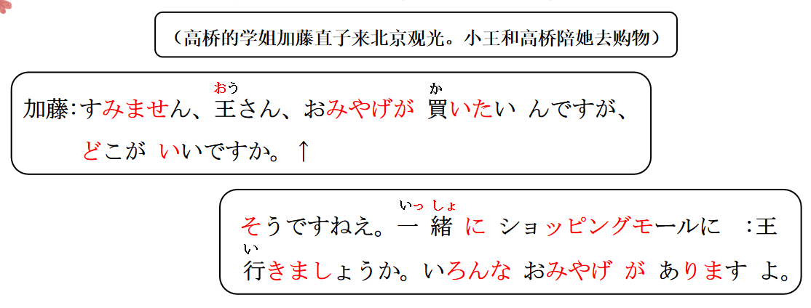

# V たい

## 新出単語
<vue-plyr>
  <audio controls crossorigin playsinline loop>
    <source src="../audio/9-1-たんご.mp3" type="audio/mp3" />
  </audio>
 </vue-plyr>

## Ｖたい＜愿望＞

意义：表示说话人第一人称（我）的愿望。 第三人称（**他她它**）  
译文：想......；想要做...... 接续：**动词第一连用形（ます去ます）+たい**  
说明：非过去时一般只能用于第一人称，用于第三人称时需要使用派生  
动词 **「V たがる」** 的形式或相应地改变形态（今后学习）。当 V 是他动词  
时，其「を」格补足语可以用「が」格，也可以用「を」格；但派生动  
词「V たがる」的「を」格补足语只能用「を」来表示。

将下列单词变成： V（第一连用形）+たい 整体看作 1 类形容词去变形

> 買う（かう）　　　想买：買いたい　 　　不想买： 買いたくない　  
> 食べる（たべる） 想吃：食べたい 　 　　不想吃： 食べたくない  
> なる 　　想成为：なりたい 　　曾经想成为： なりたかった  
> 行く（いく）　 想去：行きたい　　　　之前想去：　行きたかった

```ts
(1) 我想吃苹果！  // 吃苹果：りんごを食べる
  （私は）りんごを食べたいです。√　　或者 りんごが食べたい。特指愿望的对象 、// 第一人称时，を可以换为が。
(2) 我想成为医生。　 // 成为医生：医者になる
   医者になりたいです。// 此处に表示最终变化的结果，所以不能换为が，只有前面的助词是を时才能换成が。　
(3) 高桥她想吃苹果！
   高橋さんはリンゴを食べたがっている。// 持续体　　　
(4) 狗狗想和我玩耍。
   いぬは私とあそびたがっている。　 // 状态的持续
```

## 总结

1. Ｖたい
   ① 意思：第一人称（我）想做、、（某事）  
   ② 接续：动词第一连用形（ます形去ます）  
   ③ 词性：V たい看作一类形容词。变形按照一类形容词活用变形。  
   ④ 助词：当Ｖたい前面的助词是を时，可以把を换成表示  
   “特指”愿望对象的“が”。也可以用”を”、其他助词不变。
2. V たがる
   ① 意思：第三人称（他她它）想做、、（某事）  
   ② 接续：动词第一连用形（ます形去ます）  
   ③ 词性：Ｖたがる看作一类动词。该用什么助词就用什么。  
   不要把该用“を”的换成“が”  
   ④ 状态：他人的愿望是不会直接知道的，不能直接读懂别人内心的愿望。  
   所以一般通过他人表现出来的某种状态，知道他人的愿望。  
   经常是以表示状态持续的「V たがっている」体现出来的。


```ts
(1) おみやげが買いたいです。 // Ｎを買う
  我想买礼物。
(2) 有名な大学に入りたいです。  // はいる
  我想进入有名的大学。
(3) 今日はあの人に会いたくありません。 // 会う
 今天不想见到那个人
(4) 父は新しいパソコンを買いたがっています。 // Ｎを買うー買いたいー買いたがるー買いたがっている
爸爸他想买新的电脑。
(5) 小学校のときの先生が会いに来ましたが、そのとき田中さんは // 会うー会いたいー会いたがるー会いたがっている
いませんでした。先生は田中さんに会いたがっていました。
小学时候的老师来拜访，但是那个时候田中不在。老师想见见田中。
```

> ☞ 询问**对方**的愿望时，使用 **「V たいですか」**有时显得**不礼貌**，这种场合下
> 一般可以用「～**はどうですか**」或者「Ｎは**いかが**ですか」等表达方式。
> 第 2 人称（你）  
> このスマホを買いたいですか。或者 このスマホはどうですか。

```ts
(6) ✖趙さん、コーヒーを飲みたいですか。
→ 趙さん、コーヒーはどうですか／いかがですか。
```

## 注意

```ts
(7) 早くできたいです。✖ 早くしたいです。√
(8) 日本語がわかりたいです。✖ 日本語を勉強したい。√
```

## 練習 れんしゅう

```ts
(1) 今天（我）想休息。 休む「やすむ」
⇒ 今日は、（私は）休みたい・休みたいです。
(2) 想在这里拍照。 // しゃしんをとる
⇒ ここで写真を撮りたい。撮りたいです。　写真が撮りたい。
(3) 小王想打游戏。 // ゲームをする Ｖたがっている
⇒ 王さんはゲームをしたがっている・したがっています。
(4) 小李想睡觉。 　// 寝る「ねる」　　Ｖたがっている
⇒ 李さんは寝たがっている・寝たがっています。
```


## 精読の教文
<vue-plyr>
  <audio controls crossorigin playsinline loop>
    <source src="../audio/9-1-1.mp3" type="audio/mp3" />
  </audio>
 </vue-plyr>

