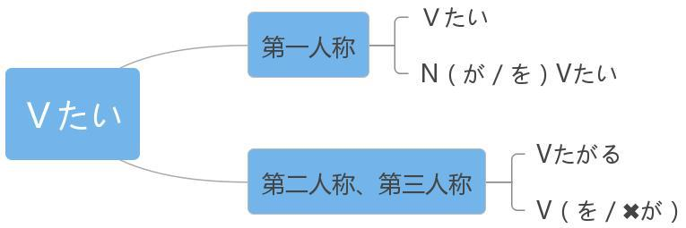

# V たい

## 新出単語

<vue-plyr>
  <audio controls crossorigin playsinline loop>
    <source src="../audio/9-1-たんご.mp3" type="audio/mp3" />
  </audio>
 </vue-plyr>

| 単語                                             | 词性         | 翻译                                          |
| ------------------------------------------------ | ------------ | --------------------------------------------- |
| ショッピングモール<JpWord>shopping mall</JpWord> | ⑥<名>        | 购物中心                                      |
| モール<JpWord>mall</JpWord>                      | ① ＜名＞     | <JpWord>仅限行人步行的</JpWord>商业街         |
| <JpWord>いろんな</JpWord>                        | ⓪<連体>      | 「いろいろな」的口语形式,各种各样             |
| ショッピングモールにいろんなおみやげがある。     |              | しょっぴんぐ                                  |
| 店員<JpWord>てんいん</JpWord>                    | ⓪<名>        | 店员；售货员 お客様「きゃくさま」             |
| それに                                           | ⓪<接>        | 然后；还有；另外；再加上 ＸＸ。そして、ＸＸ。 |
| <JpWord>チャイナドレス</JpWord> 和製 China dress  | ④<名>        | 旗袍                                          |
| チャイナ<JpWord>China</JpWord>                   | ①<固名>      | 中国                                          |
| dress<JpWord>ドレス</JpWord>                     | ① ＜名＞     | 服装；女服；女礼服                            |
| silk ク<JpWord>シル</JpWord>                     | ① ＜名＞     | 丝；丝绸 ミルク：牛奶                         |
| いらっしゃいませ                                 | ⑥            | 欢迎光临！                                    |
| <JpWord> いかが</JpWord>                          | ② ＜副＞     | 「どう」的礼貌说法怎么；怎么样                |
| いかがですか。                                   | どうですか。 | ＮのＮ 派手「はで」华丽的；花哨的             |
| 地味<JpWord>じみ</JpWord>                        | ②<形 Ⅱ>      | 朴素；不醒目 地味な服「ふく」 派手な服        |
| 試着<JpWord>しちゃく</JpWord>                       | ⓪<名·他 Ⅲ>               | 试穿；试装　 試着する                              |
| すてき〖素敵〗                                      | ⓪<形 Ⅱ>                  | 漂亮；迷人；棒；美好 素敵な夢「ゆめ」              |
| ねえ ①<感>                                          | 用于引起对方的注意       | 哎！喂                                             |
| blouse<JpWord>ブラウス</JpWord>                     | ②<名>                    | 女士:衬衣；衬衫 シャツ ① 衬衫                      |
| 中国刺 ▼ 繍<JpWord>ちゅうごくししゅう</JpWord>      | ⑤<名>                    | 中国刺绣                                           |
| 刺 ▼ 繍<JpWord>ししゅう</JpWord>                    | ⓪<名·他 Ⅲ>               | 刺绣                                               |
| <JpWord>ハンカチ</JpWord>                           | ③①⓪<名>                  | 「ハンカチーフ handkerchief」的省略说法手 绢；手帕 |
| <JpWord>ほしい</JpWord>                             | ②<形 Ⅰ>                  | 想要 什么东西 ハンカチが欲しい                     |
| <JpWord>やく</JpWord>                               | ③<名>                    | 中药 薬「くすり」                                  |
| 栄養剤<JpWord>えいようざい</JpWord>                 | ⓪③<名>                   | 营养药；补药                                       |
| 栄養<JpWord>えいよう</JpWord>                       | ⓪<名>                    | 营养                                               |
| -剤<JpWord>-ざい</JpWord>                           | ＜接尾＞                 | :                                                  |
| ~药                                                 | 百「ひゃく」             | パーセント                                         |
| ％<JpWord>パーセント percent</JpWord>               | ③<名>                    | 百分比                                             |
| 天然成分<JpWord>てんねんせいぶん</JpWord>           | ⑤<名>                    | 天然成分                                           |
| 天然<JpWord>てんねん</JpWord>                       | ⓪<名>                    | 天然                                               |
| 成分<JpWord>せいぶん</JpWord>                       | ①<名>                    | 成分                                               |
| 鹿<JpWord>しか</JpWord>                             | ⓪<名>                    | 鹿 鹿の角 角「かど」 拐角；角落                    |
| 角<JpWord>つの</JpWord>                             | ②<名>                    | <JpWord>动物的</JpWord>角 犄角                     |
| へび〖蛇〗                                          | ①<名>                    | 蛇 蛇の皮 动物的皮                                 |
| 皮<JpWord>かわ</JpWord>                             | ②<名>                    | 皮 人的肌肤 肌「はだ」①                            |
| <JpWord>うーん</JpWord>                             | ①                        | <感> 表示思考嗯 花「はな」                         |
| 中国茶<JpWord>ちゅうごくちゃ</JpWord>               | ④<名>                    | :中国茶                                            |
| ジャスミン茶<JpWord>jasmine ちゃ</JpWord>           | ③<固名>                  | 茉莉花茶                                           |
| -グラム<JpWord>法语 gramme </JpWord>                | ⓪①<接尾>                 | :克 五百グラム 500g 1 斤                           |
| キログラム                                          | ＫＧ                     | 公斤；千克                                         |
| 茶器セット<JpWord>ちゃき set</JpWord>               | ③<名>                    | 成套的茶具                                         |
| 茶器<JpWord>ちゃき</JpWord>                         | ①<名>                    | 茶具                                               |
| セット<JpWord>set</JpWord>                          | ①<名>                    | 套；组                                             |
| 最後<JpWord>さいご</JpWord>                                  | ①<名>           | 最后 まず、次に「つぎに」、最後                    |
| 紹興酒<JpWord>しょうこうしゅ</JpWord>               | ③<固名>                  | 绍兴酒；黄酒 -酒<JpWord>-しゅ</JpWord>＜接尾>:     |
| -本<JpWord>-ほん</JpWord>                           | ＜接尾＞                 | (用于数细长形状的物品瓶)根；支                     |
| ～冊<JpWord>さつ</JpWord>                           | 数书本类                 | 1，6，8，10 っぽん 三本「さんぼん」                |
| 持つ<JpWord>もつ</JpWord>                           | ①<他 Ⅰ>                  | 拿；带；拥有 待つ「まつ」等待；等                  |
| 持有的动作 拿着笔 ：ペンを持っている                | 　 　　拥有的状态 拥有车 | 車を持っている                                     |
| の                                                  | <凖助>                   | 接名词或活用词的词典形后，构成名词词组~的          |
| 緑茶<JpWord>りょくちゃ</JpWord>                              | ⓪               | 绿茶                                               |
| 紅茶<JpWord>こうちゃ</JpWord>                       | ⓪                        | 红茶                                               |
| ジャスミン茶<JpWord>ジャスミンちゃ</JpWord>         | ③④                       | :茉莉花茶                                          |
| ウーロン茶<JpWord>ウーロンちゃ</JpWord>             | ③                        | 乌龙茶                                             |
| 黒茶<JpWord>こくちゃ、くろちゃ</JpWord>             | ⓪                        | 黑茶                                               |
| プーアル茶<JpWord>プーアルちゃ</JpWord>             | ③                        | 普洱茶                                             |
| 白茶<JpWord>はくちゃ、しろちゃ、パイちゃ</JpWord>   | ⓪                        | 白茶                                               |
| 休む<JpWord>やすむ</JpWord>                       | ② <自 Ⅰ>                   | 休息；请假                                         |
| 駅前<JpWord>えきまえ</JpWord>                    | ③  <名>                     | 站前；车站前                                       |
| 外国語学部<JpWord>がいこくごがくぶ</JpWord>         | ⑥<名>                    | 外<JpWord>国</JpWord>语学院；外语系                |
| 外国語<JpWord>がいこくご</JpWord>                   | ⓪<名>                    | 外国语；外语                                       |
| 外国<JpWord>がいこく</JpWord>                       | ⓪<名>                    | 外国                                               |
| 東京<JpWord>とうきょう</JpWord>                     | ⓪<固名>                  | <JpWord>日本首都</JpWord>东京                      |
| 丈夫<JpWord>じょうぶ</JpWord>                       | ⓪<形 Ⅱ>                  | 结实<JpWord>的</JpWord>；健壮<JpWord>的</JpWord>   |
| 切手<JpWord>きって</JpWord>                         | ⓪<名>                    | 邮票                                               |
| 傘<JpWord>かさ</JpWord>                             | ①<名>                    | 伞；雨伞                                           |
| 覚える<JpWord>おぼえる</JpWord>                     | ③<他 Ⅱ>                  | 记；记忆；背过                                     |
| 電車<JpWord>でんしゃ</JpWord>                       | ⓪<名>                    | 电气化列车的简称;电车；城铁；列车                  |
| <JpWord>もうすぐ</JpWord>                           | ③<副>                    | 立刻；马上；眼看                                   |
| 軽い<JpWord>かるい</JpWord>                         | ⓪<形 Ⅰ>                  | 轻的；轻松的                                       |
| 荷兰语 kop<JpWord>コップ</JpWord>                   | ⓪<名>                    | 杯子                                               |
| 米<JpWord>こめ</JpWord>                             | ②<名>                    | 大米                                               |
| 木<JpWord>き</JpWord>                               | ①<名>                    | 树                                                 |
| 紙飛行機<JpWord>かみひこうき</JpWord>               | ④<名>                    | 纸飞机                                             |
| 石<JpWord>いし</JpWord>                             | ②<名>                    | 石头；石块                                         |
| <JpWord>ぶどう</JpWord>『葡萄』                     | ⓪<名>                    | 葡萄                                               |
| wine<JpWord>ワイン</JpWord>                         | ①<名>                    | 葡萄酒                                             |
| 石油<JpWord>せきゆ</JpWord>                         | ⓪<名>                    | 石油                                               |
| プラスチック<JpWord>plastic</JpWord>                | ④<名                     | :塑料                                              |
| 美術館<JpWord>びじゅつかん</JpWord>                 | ③<名>                    | 美术馆                                             |
| 電子書籍<JpWord>でんししょせき</JpWord>             | ④<名>                    | 电子书                                             |
| 電子<JpWord>でんし</JpWord>                         | ①<名>                    | 电子                                               |
| 書籍<JpWord>しょせき</JpWord>                       | ⓪<名>                    | 书籍                                               |
| 制作<JpWord>せいさく</JpWord>                       | ⓪<名・他 Ⅲ>              | 制作                                               |
| recipe<JpWord>レシピ</JpWord>                                | ①<名>           | 菜谱                                               |
| 画像編集加工<JpWord>がぞうへんしゅうかこう</JpWord> | ⑧<名>                    | 图像编辑加工                                       |
| 画像<JpWord>がぞう</JpWord>                         | ⓪<名>                    | :图像                                              |
| 編集<JpWord>へんしゅう</JpWord>                     | ⓪<名・他 Ⅲ               | 编辑                                               |
| 加工<JpWord>かこう</JpWord>                         | ⓪<名・他 Ⅲ>              | 加工                                               |
| cammera <JpWord>カメラ</JpWord>                     | ①<名>                    | 照相机                                             |
| 飲食店<JpWord>いんしょくてん</JpWord>               | ④<名>                    | 饮食店；小吃店                                     |
| 漫画<JpWord>まんが</JpWord>                         | ⓪<名>                    | 漫画                                               |
| 動画<JpWord>どうが</JpWord>                         | ⓪<名>                    | 视频；动画                                         |
| 視聴<JpWord>しちょう</JpWord>                       | ⓪<名・他 Ⅲ>              | 视听；观看；收视                                   |

## Ｖたい＜愿望＞

意义：表示说话人第一人称（我）的愿望。 第三人称（**他她它**）  
译文：想......；想要做...... 接续：**动词第一连用形（ます去ます）+たい**  
说明：非过去时一般只能用于第一人称，用于第三人称时需要使用派生  
动词 **「V たがる」** 的形式或相应地改变形态（今后学习）。当 V 是他动词  
时，其「を」格补足语可以用「が」格，也可以用「を」格；但派生动  
词「V たがる」的「を」格补足语只能用「を」来表示。

将下列单词变成： V（第一连用形）+たい 整体看作 1 类形容词去变形

> 買う（かう）　　　想买：買いたい　 　　不想买： 買いたくない　  
> 食べる（たべる） 想吃：食べたい 　 　　不想吃： 食べたくない  
> なる 　　想成为：なりたい 　　曾经想成为： なりたかった  
> 行く（いく）　 想去：行きたい　　　　之前想去：　行きたかった

```ts
(1) 我想吃苹果！  // 吃苹果：りんごを食べる
  （私は）りんごを食べたいです。√　　或者 りんごが食べたい。特指愿望的对象 、// 第一人称时，を可以换为が。
(2) 我想成为医生。　 // 成为医生：医者になる
   医者になりたいです。// 此处に表示最终变化的结果，所以不能换为が，只有前面的助词是を时才能换成が。　
(3) 高桥她想吃苹果！
   高橋さんはリンゴを食べたがっている。// 持续体　　　
(4) 狗狗想和我玩耍。
   いぬは私とあそびたがっている。　 // 状态的持续
```

## 总结

1. Ｖたい
   ① 意思：第一人称（我）想做、、（某事）  
   ② 接续：动词第一连用形（ます形去ます）  
   ③ 词性：V たい看作一类形容词。变形按照一类形容词活用变形。  
   ④ 助词：当Ｖたい前面的助词是を时，可以把を换成表示  
   “特指”愿望对象的“が”。也可以用”を”、其他助词不变。
2. V たがる
   ① 意思：第三人称（他她它）想做、、（某事）  
   ② 接续：动词第一连用形（ます形去ます）  
   ③ 词性：Ｖたがる看作一类动词。该用什么助词就用什么。  
   不要把该用“を”的换成“が”  
   ④ 状态：他人的愿望是不会直接知道的，不能直接读懂别人内心的愿望。  
   所以一般通过他人表现出来的某种状态，知道他人的愿望。  
   经常是以表示状态持续的「V たがっている」体现出来的。



```ts
(1) おみやげが買いたいです。 // Ｎを買う
  我想买礼物。
(2) 有名な大学に入りたいです。  // はいる
  我想进入有名的大学。
(3) 今日はあの人に会いたくありません。 // 会う
 今天不想见到那个人
(4) 父は新しいパソコンを買いたがっています。 // Ｎを買うー買いたいー買いたがるー買いたがっている
爸爸他想买新的电脑。
(5) 小学校のときの先生が会いに来ましたが、そのとき田中さんは // 会うー会いたいー会いたがるー会いたがっている
いませんでした。先生は田中さんに会いたがっていました。
小学时候的老师来拜访，但是那个时候田中不在。老师想见见田中。
```

> ☞ 询问**对方**的愿望时，使用 **「V たいですか」**有时显得**不礼貌**，这种场合下
> 一般可以用「～**はどうですか**」或者「Ｎは**いかが**ですか」等表达方式。
> 第 2 人称（你）  
> このスマホを買いたいですか。或者 このスマホはどうですか。

```ts
(6) ✖趙さん、コーヒーを飲みたいですか。
→ 趙さん、コーヒーはどうですか／いかがですか。
```

## 注意

```ts
(7) 早くできたいです。✖ 早くしたいです。√
(8) 日本語がわかりたいです。✖ 日本語を勉強したい。√
```

## 練習 れんしゅう

```ts
(1) 今天（我）想休息。 休む「やすむ」
⇒ 今日は、（私は）休みたい・休みたいです。
(2) 想在这里拍照。 // しゃしんをとる
⇒ ここで写真を撮りたい。撮りたいです。　写真が撮りたい。
(3) 小王想打游戏。 // ゲームをする Ｖたがっている
⇒ 王さんはゲームをしたがっている・したがっています。
(4) 小李想睡觉。 　// 寝る「ねる」　　Ｖたがっている
⇒ 李さんは寝たがっている・寝たがっています。
```

## 精読の教文

<vue-plyr>
  <audio controls crossorigin playsinline loop>
    <source src="../audio/9-1-1.mp3" type="audio/mp3" />
  </audio>
 </vue-plyr>


