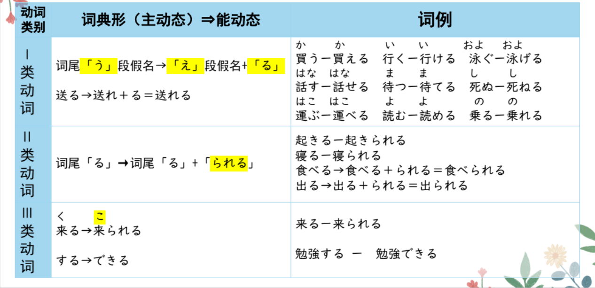
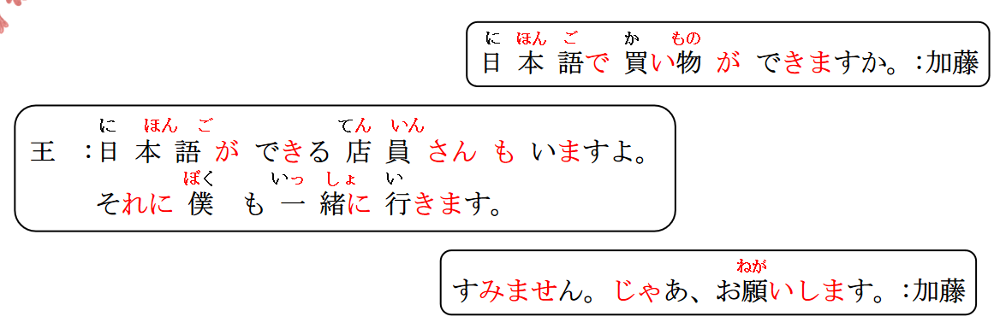

# N がほしい、N ができる...

## 新出単語

<vue-audio file="../audio/9-1-たんご.mp3" loop />

## N がほしい＜愿望＞

意义：表示说话人希望、(我)想要得到某物的愿望。  
① 译文：想要..... ② 接续：名词+が+ほしい が:特指愿望的对象 は：强调否定  
说明：非过去时一般只能用于第一人称，用于第三人称时需要使用派生  
他动词「**だれはＮをほしがっている**」的形式或相应地改变形态。

```ts
(1) 家族と友達へのおみやげがほしいんですが......。
我想要给家人和朋友的礼物，（哪个比较好呢？）
(2) 時間がほしいです。 // 旅行が欲しい。○ ✖ 此处不对，旅行不是物品。应该为:旅行したい
想要得到时间。
(3) お茶はほしくないです。 // 飲みたくない 不想喝。
不想要茶。
(4) もっと大きいのがほしい。
我想要更大的（东西）。
(5) 妹はシルクのブラウスをほしがっています。
妹妹她想要丝绸质地的衬衫。
```

> ☞ 询问对方的意愿时，使用「Ｎがほしいですか」不礼貌，这种场合下一般  
> 可以用「～はどうですか」或「～はいかがですか」的形式。

```ts
このスマホが欲しいですか。你想要这个手机嘛？
このスマホはいかがですか。您看看这个手机如何？怎么样？
```

## 总结

1. ほしい 欲しい
   ① 意思：第一人称（我）想要什么东西。  
   ② 接续：N(东西)がほしい  
   ③ 词性：一类形容词。  
   ④ 助词：“が”是“特指”愿望对象。可以把“が”换成“は”来强调否定。
2. ほしがる  
   ① 意思：第三人称（他她它）想要什么东西。  
   ② 接续：だれは N をほしがっている  
   ③ 词性：一类他动词，ほしがる前面助词要用“を”。  
   ④ 状态：他人的愿望是不会直接知道的，不能直接读懂别人内心的愿望。  
   所以一般通过他人表现出来的某种状态，知道他人的愿望。  
   经常是以表示状态持续的「Ｎをほしがっている」体现出来的。

## 練習 れんしゅう

```ts
(1) 我想要可爱的手帕。 // ハンカチ
⇒ （私は）かわいいハンカチが欲しい・欲しいです。
(2) 哥哥想要新手机。 // あたらしい スマホ
⇒ あには新しいスマホを欲しがっている・欲しがっています。
```

## が＜顺接＞ んですが・（引入话题）

意义：表示前后两个句子是顺接的关系，用于自然地引出下面的话题。  
后句内容一般表示疑问、建议、请求之意，有时可以省略。  
逆接：转折（但是） 顺接：铺垫 // ＸＸ。でも、ＸＸ。 您，你  
接续：前句+が、后句。 简体句+が、简体句。 敬体句+が、敬体句。

```ts
(1) おみやげが買いたいんですが、どこがいいですか。
   我想买礼物，哪里比较好呢？
(2) 日本料理が食べたいんですが、この近くにおいしいお店がありますか。
   我想要吃日料，附近有好吃的店嘛。
(3) 来週の発表ですが、どんなテーマがいいでしょうか。// 不确定的疑问（礼貌
下周发表演讲这件事，怎么样的主题比较好呢？
(4) すみません、駅に行きたいんですが、、。 いいですか。
不好意思、我想要去车站。能告诉我车站在哪里吗？
```

## 練習 れんしゅう

```ts
(1) 我想去公园玩，（公园）在哪里呢？ // ＸＸが、ＸＸ 。
⇒ こうえんに/へあそびに行きたいんですが、（公園は）どこですか。
　　公園に遊びに行きたいですが、どこですか。
　　公園に遊びに行きたいが、どこ？ // 简体
```

> Ｖ第一连用形+に行く　 に表示移动的目的　  
> Ｖ第一连用形＋たい 我想做某事

## N ができる＜能力＞

意义：表示具备某种能力。 日本語**が**できる。 ピアノ**が**できる。  
译文：能......；会......が：能力的对象 テニス**は**でき**ない**。 // 我不会打网球
接续：名词「**运动类，乐器类，语言类，动作性名词**」＋が＋できる

```ts
(1) 日本語で買い物ができますか。
 能用日语买东西嘛？
(2) 王さんはテニスができます。
 小王会网球。小王会打网球。
(3) あの店員は日本語も英語もできます。 // も、も 什么和什么都怎么样
 那个店员日语和英语都会。
```

## 練習 れんしゅう

```ts
(1) 我“不会”乒乓球。 // たっきゅう 我不会乒乓球。
⇒ 卓球はできない・できません。
  卓球ができない・できません。
(2) 小李会吉他。 // 吉他：ギター
⇒ 李さんはギターができる・できます。
```

## が用法总结

1. 接在**能力的对象**后面。  
   日本語ができます。 が上手 が下手
2. 接在**了解的对象**后面。  
   この漢字の意味がわかります。
3. 接在**好恶的对象**后面。  
   王さんは高橋さんが好きです。 がすき が嫌い
4. 接在**愿望，希望的对象**后面，一般是自己的愿望。  
   ○ りんごが食べ**たい**です。  
   ○ お金が**欲しい**です。

## それに＜并列、累加＞

意义：表示并列、累加。 （补充说明）  
译文：而且；并且；以及；再加上；还有；另外  
接续：词、词组或句子之间

```ts
(1) 日本語ができる店員さんもいますよ。**それに**僕も一緒に行きます。
也有会日语“的”店员哦！ 而且我也会一起去。
(2) 中国人の友達はみんな親切です。**それに**日本語も上手です。
中国的朋友都很热情。并且日语也很好。
(3) スーパーへ行って、パンとコーヒー、**それに**果物を買いました。
去超市，买了面包和咖啡还有水果。
```

> ☞ 表达并列、累加的意思时，「それに」与「そして」用法相同。「そ
> して」还可以表达两个动作的先后顺序，「それに」则没有该用法。

```ts
(4) 夜９時から11時まで勉強する。｛そして／✖それに｝、11時半に寝る。
```

## 練習 れんしゅう

```ts
(1) 小王、小张、高桥在教室。而且铃木也在。
⇒王さん、ちょうさん、高橋さんは教室にいる。
 それに鈴木さんもいる.います。
```

## 动词的能动态

```ts
(1) 我**会**日语。 // Ｎができる
⇒ 日本語ができる。
(2) 我会**说**日语。 、// 日本語を話す
⇒ 日本語が話せる。
```

意义：表示具有某种能力、或者动作、行为发生的可能性。  
译文：能......；会......；可以...... 接续：能动态是日语动词语态（ヴォイス）中的一种，动词变为能动态的 规则如下：



> あそぶ： 遊べる  
> つかう：使える  
> 帰る： かえれる かえる  
> 消す： けせる  
> 弾く： ひける 弾けます  
> しらべる： 調べられる 調べられます  
> 来る： こられる こられます  
> する： できる できます  
> 打网球：テニスをする 会打网球：テニスができる

> 他动词涉及的对象，在能动态的句子中大多由「を」变为「が」。

```ts
(1) 300元「げん」ぐらいでシルクのが買えますよ。//をかう
用三百块钱左右能买丝绸的（旗袍）。
(2) 私はさしみが食べられません。 //を食べる
我不能吃刺身（生鱼片）。
(3) 王さんは英語が話せます。 //を話す
小王会说英语。
(4) 高橋さんは昨日のパーティーに参加できませんでした。
高桥没能参加昨天的派对。 に参加する

```

## 动词的能动态-总结

1. 意思：
   具备某种能力。能~、会~、可以~
2. 规律：
   ① 一类动词词尾「う」段变「え」段+る  
   ② 二类动词去る＋られる  
   ③ 三类动词来るーこられる、するーできる
3. 注意点：
   ① 所有动词变成能动态后都是二类动词。  
    ② 当动词前面的助词是“を”的时候要变成“が”  
    ③“が”特指能力的对象，を要变が。其他助词不要变。  
    ④ 很多日本人会把二类动词的られる的ら省略。

## 練習 れんしゅう

```ts
(1) 我能吃辣的食物。　// 辛い「からい」　食べ物　「たべもの」　　
⇒（私は）辛い食べ物が食べられる・食べられます。
(2) 高桥你会讲中文吗？　　// 中国語を話す
⇒ 高橋さんは中国語が話せますか。
```

> ☞ 非生物名词做主语的句子，一般不能使用动词的能动态（表示主语性质、
> 特征的除外）。 りんごが食べられる。苹果它可以吃。√

```ts
(3) ３日間で荷物が｛✖届ける／届く｝。
(4) 会議は９時に｛✖始まれる／始まる｝。 私は行ける
```

> ☞「見える」本身已包含“可能”的含义，所以没有能动态。类似的动词还
> 有「聞こえる（听见）」「わかる」等。見える：能看见


```ts
(5) 星が｛✖見えられる／見える｝。 能看见星星。
(6) 声が｛✖聞こえられる／聞こえる｝。能听见声音。
(7) 日本語が｛✖わかれる／わかる｝。懂日语。
```

## 精読の教文

<vue-audio file="../audio/9-1-2.mp3" loop/>


