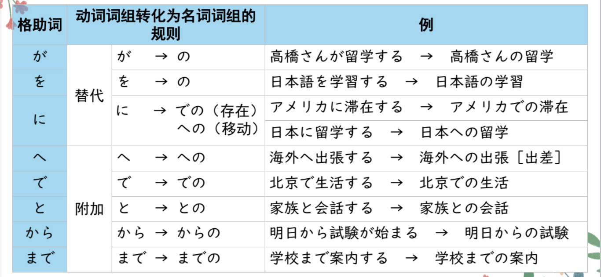
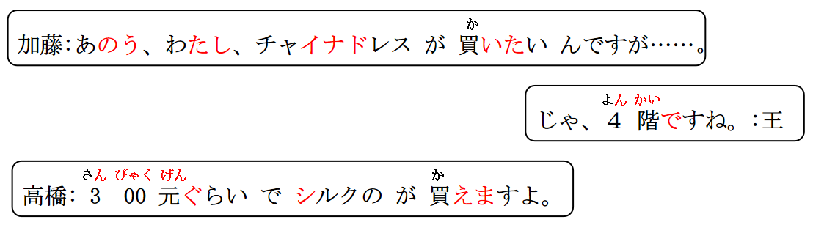

# の、で・ん１のん２

## 形式名词「の」

意义：构成名词词组，代替上文提到的名词内容。避免重复。  
接续：① 名词+の ② 一类形容词+の　 ③ 二类形容词+な＋の ④ 动词简体+の  
翻译：の＝Ｎ　翻译成“的”

```ts
(1) 加藤：私、チャイナドレスが買いたいんですが、、、。
高橋：300元ぐらいでシルクのが買えますよ。能买到丝绸的（旗袍）
(2) このかばんは高橋さんのです。
这个包是高桥的（包）。
(3) 高橋：今晩、中華料理はいかがですか。
加藤：いいですね。本場のが食べたいです。我想吃正宗的（中餐）。
(4) 日本へ留学に行ったのは誰ですか。去日本留学了的（人）是谁啊？
日本へ留学に行ったひとは誰ですか。
(5) 四川料理をよく食べます。辛いのが好きですから。
因为喜欢辣的（食物）。
(6) もっと地味なのがほしいですが、、、。
我想要一个更加朴素一点的（东西）。
```

## 練習 れんしゅう

```ts
(1) 我想要个结实的（包）。 // 结实：丈夫「じょうぶ」A2
⇒ 丈夫なのが欲しい・欲しいです。 の＝Ｎ（鞄）
(2) 热的（便当）是多少钱。 // 热的：熱い「あつい」 多少钱：いくら
⇒ 熱いのはいくらですか。 の＝Ｎ(べんとう）
```

## で＜限定（金钱数量、时间）＞

意义：表示对数量或时间的限定。 花多少钱/时间，能做到什么事情。  
译文：凭借......；花费......（也可视情况不译）用；花  
接续：数量词/疑问词+で いくら なんぷん なんじかん

```ts
(1) 300元ぐらいでシルクのが買えますよ。
花300块钱左右能买到丝绸的（旗袍）。
(2) このパソコンは10万円では買えません。  // えん：日元
 这个电脑花10万日元“买不到”。 // げん：人民币
(3) 駅まで何分で行けますか。
几分钟能到车站呢？
```

## 練習 れんしゅう

```ts
(1) 花100元就能吃北京烤鸭。 // ひゃくげん ぺきんだっく
⇒ 百元で北京ダックが食べられる・食べられます。
(2) 我花一百块钱买了这个包。 // ひゃくえん
百円でこのカバンをかった・買いました。
```

## N1 (+格助词)+の+N2 ＜动词词组名词化＞

1. 在长沙生活。　、ちょうさ　　で生活「せいかつ」する  
   長沙で生活する・します。
2. 生活很开心。　　楽しい「たのしい」  
   生活は楽しい・楽しいです。
3. 在长沙的生活很开心。  
   長沙での生活は楽しい。
4. 学习日语。  
   日本語を勉強する。
5. 日语的学习很艰辛。　　　　大変「たいへん」  
   日本語の勉強は大変です。

意义：动词词组名词化  
①译文：助词+の 翻译成：..的..   
②没有をの、がの、はの、にの这种说法。の直接代替を、が、は使用。  
③にの换成への  
接续：Ｎ1（＋格助词）の动作性意义的名词Ｎ2  
説明：动词词组中的格（连用格）转化为名词词组中的连体格，其变化规则如下



> 本课文中的「お土産」虽然不直接具备动作性意义，但词义中暗
含“买给他人，物品转移给接受方”的对象义和移动义，因此也可以
用「～へのお土産」来表达，类似的还有「～への手紙」等。


```ts
(1) 家族と友達へのおみやげがほしいんです......。
 想要给家人和朋友的礼物，，にの✖ への
 家族と友達にお土産を買います。に：对象；给
(2) 三保さんとの相互学習はとてもよかったです。
 和三保的互相学习非常好。
(3) 日本語への翻訳は難しいです。 中国語から日本語に翻訳する。
 日语的翻译很难。 
(4) 海外からの観光客が増えている [增加]。ふえる
从海外来的游客一直在持续增加。
```

## 練習 れんしゅう

```ts
(1) 友達から手紙が来ました/その手紙はこれです。
⇒ 友達からの手紙はこれです。
(2) 上海から電車が来る/その電車はもうすぐ着く。「しゃんはい」
⇒ 上海からの電車はもうすぐ着く。
(3) 中国語教室で勉強をした/その勉強は楽しかった。
⇒ 中国語教室での勉強は楽しかった。　
(4) 両親にお土産を買う/そのお土産は茶器セットだ。
⇒ 给爸爸妈妈的礼物是茶具套装。
両親へのお土産は茶器セットだ・です。　
```

## 精読の教文
<vue-plyr>
  <audio controls crossorigin playsinline loop>
    <source src="../audio/9-1-3.mp3" type="audio/mp3" />
  </audio>
 </vue-plyr>


