# で、から・かいわ

## 新出単語

<vue-audio file="../audio/9-1-たんご.mp3" loop />

## で「材料」
1. 用筷子吃饭。 箸「はし」  
箸でご飯を食べる。工具
2. 用木头制作筷子。 木「き」 作る「つくる」  
木で箸を作る。

意义：表示事物的生产材料或构成成分。**从成品看得出的原材料。** 
译文：用......；由......；以...... 接续：  
名词+で+（できる、作る等） 完成，（做成）  

```ts
（1）栄養剤です。100％天然成分でできています。
结果的持续
（2）このドレスはシルクでできています。
这个裙子是用丝绸制作而成的。 // ルク 牛奶
（3）蛇の皮でかばんを作ります。 用蛇皮制作包包。

```

## 練習 れんしゅう

```ts
（1）用纸制作纸飞机。 // 紙「かみ」 纸飞机：紙飛行機「かみひこうき」
⇒ 紙で紙飛行機を作る・作ります。
（2）用木头制作箱子。 // 木「き」 箱子：箱「はこ」
⇒ 木で箱を作る。
箱は木でできている。 箱子是由木头制作而成的。
```
## から＜原材料、成分＞从

意义：表示事物或产品的生产材料或构成成分。与「で」相比，一般难以从  
产品推断出原材料为何物。  
译文：用......；由......；以...... 接续：名词+から  

```ts
（1）鹿の角や蛇の皮から栄養剤を作ります。
用鹿角和蛇皮制作补药。
（2）醤油（しょうゆ）は大豆（だいず）から作ります。
（3）牛乳からチーズを作ります。
```
## 練習 れんしゅう

```ts
（1）用葡萄制作红酒。 、// 葡萄「ぶどう」 ワイン wa
⇒ 葡萄からワインを作る・作ります。
（2）用木头制作纸。 // 木「き」 纸：紙「かみ」
⇒ 木から紙を作る・作ります。
```

## 精読の教文

<vue-audio file="../audio/9-2-1.mp3" loop/>

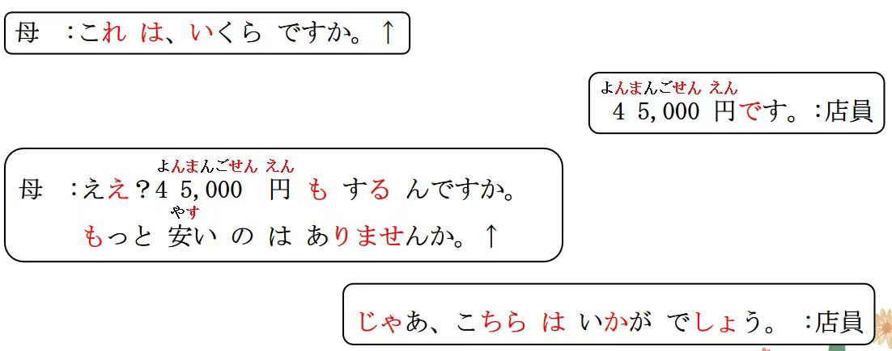

## 会話

<vue-audio file="../audio/9-1-かいわ.mp3" loop=true></vue-audio>
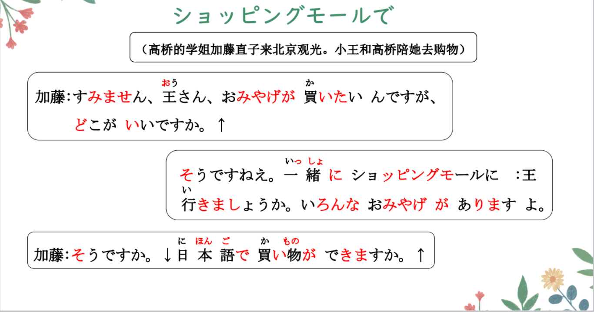
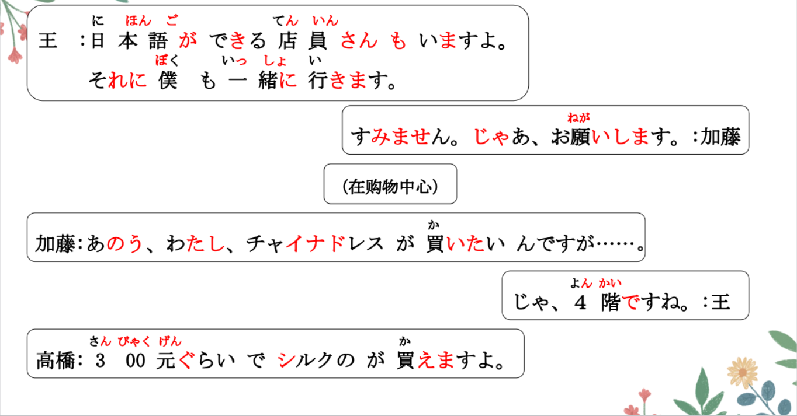
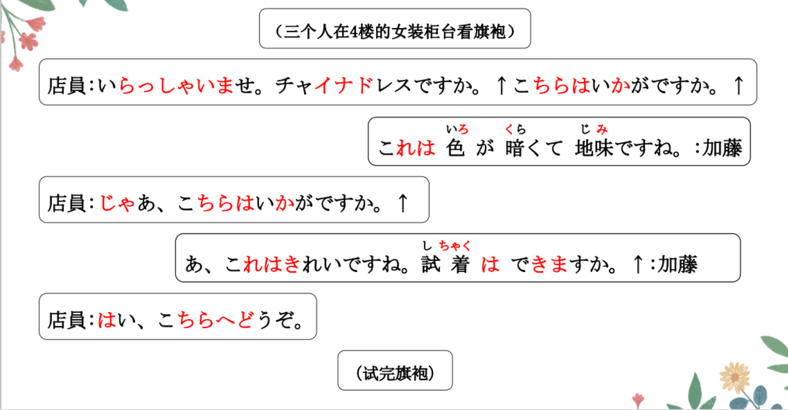
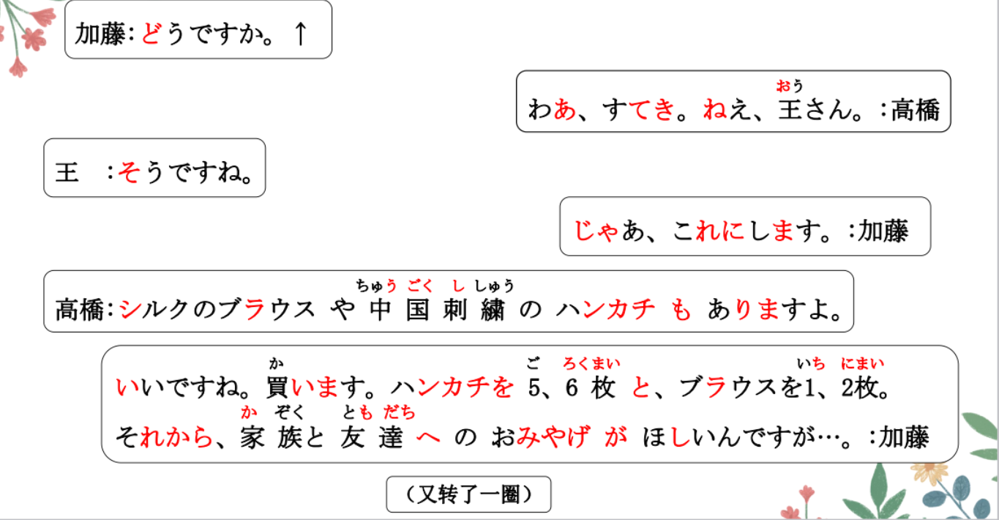
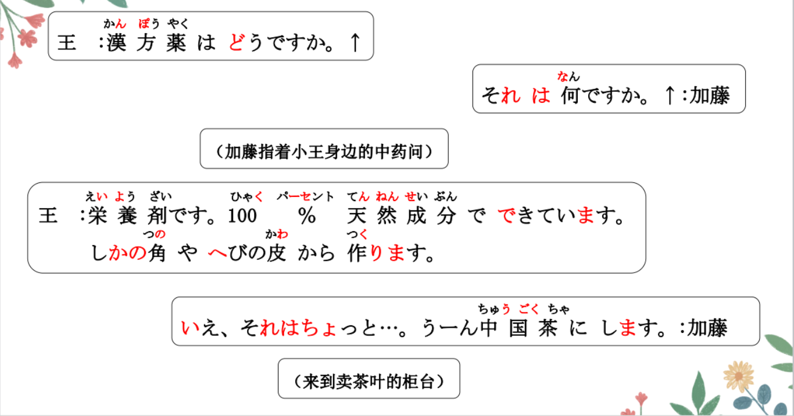
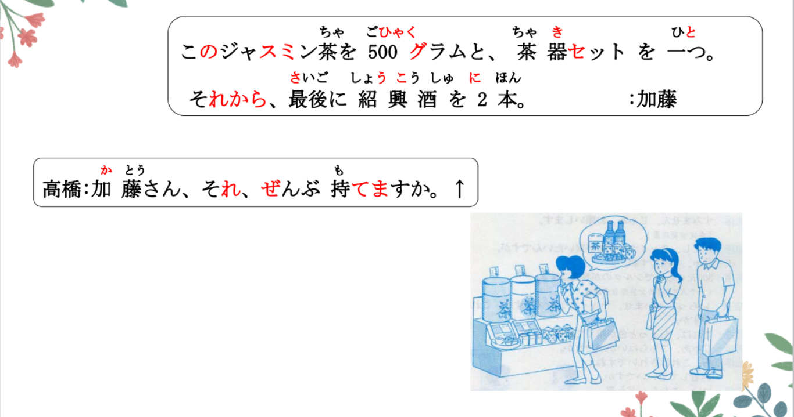
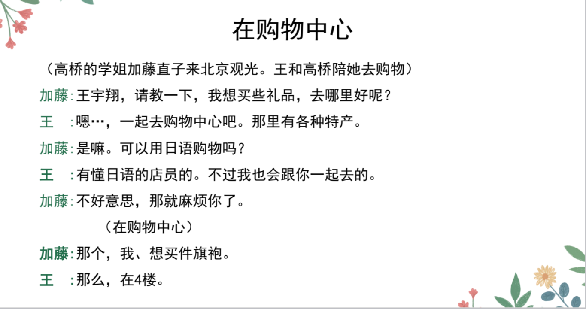
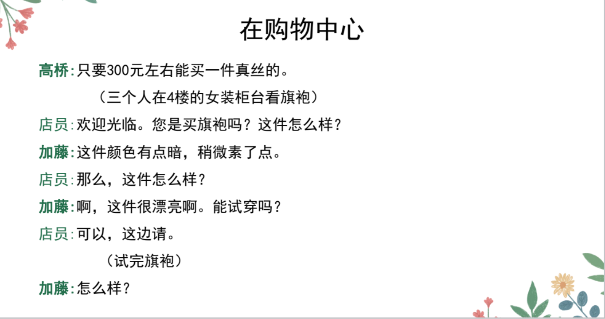
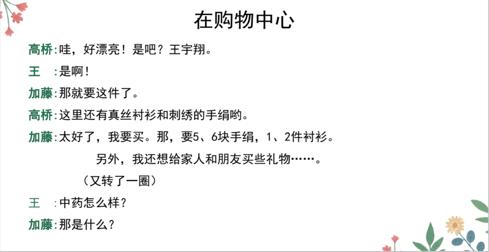
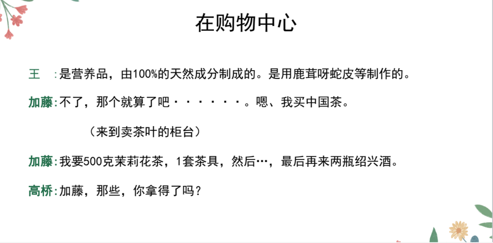