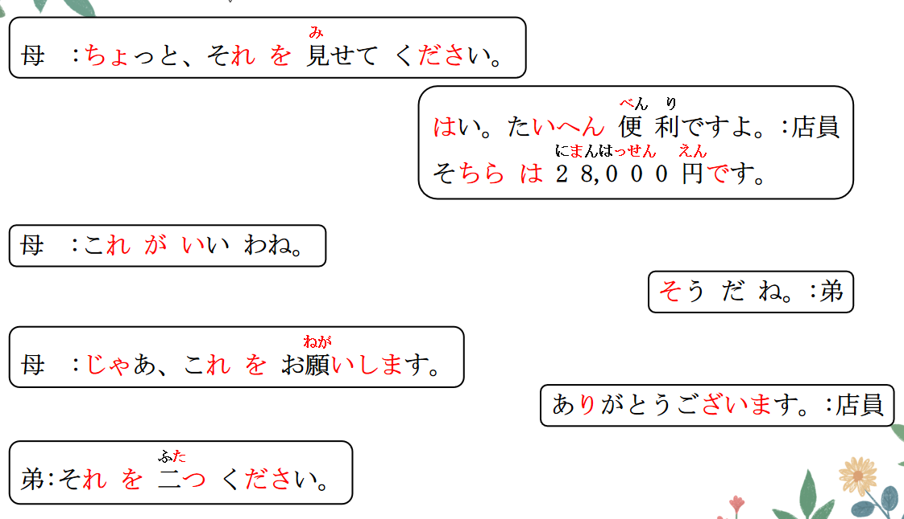
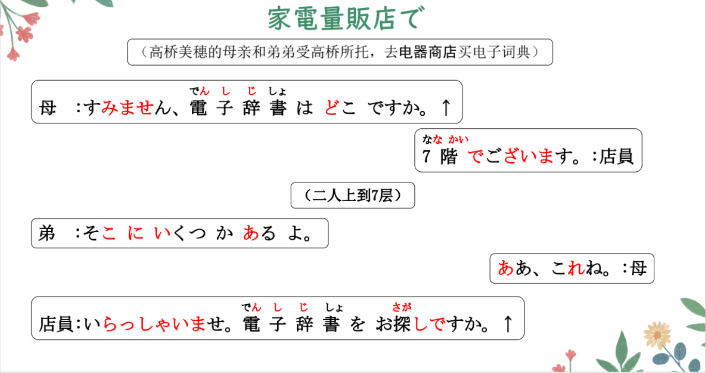
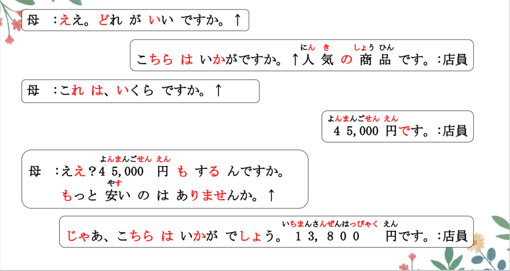
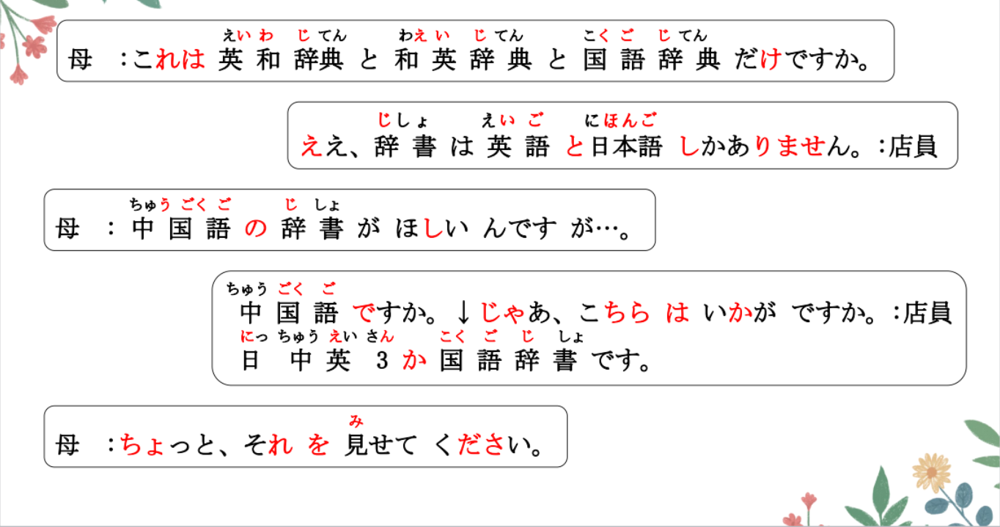
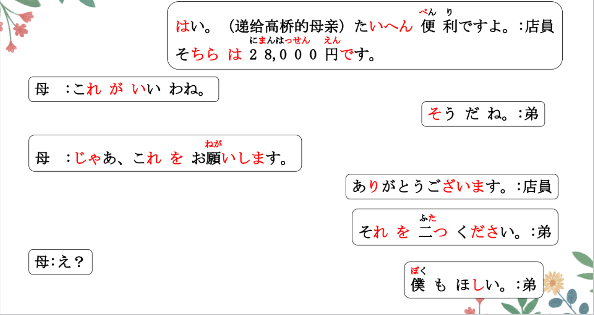
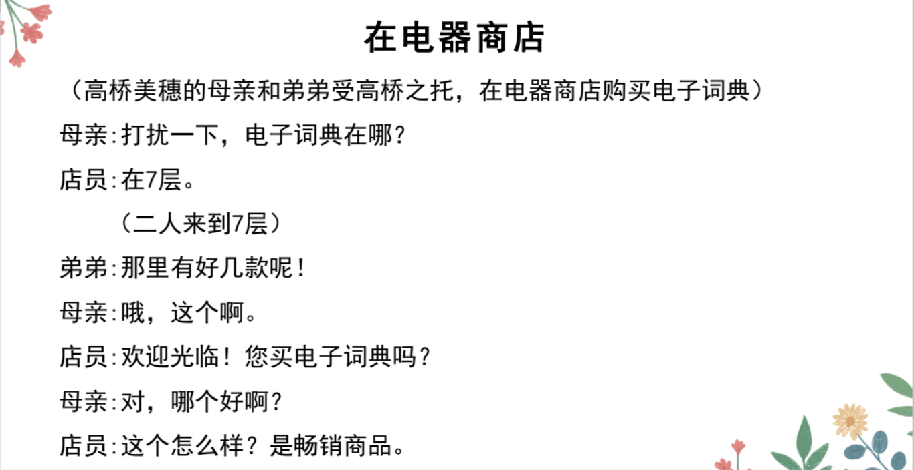
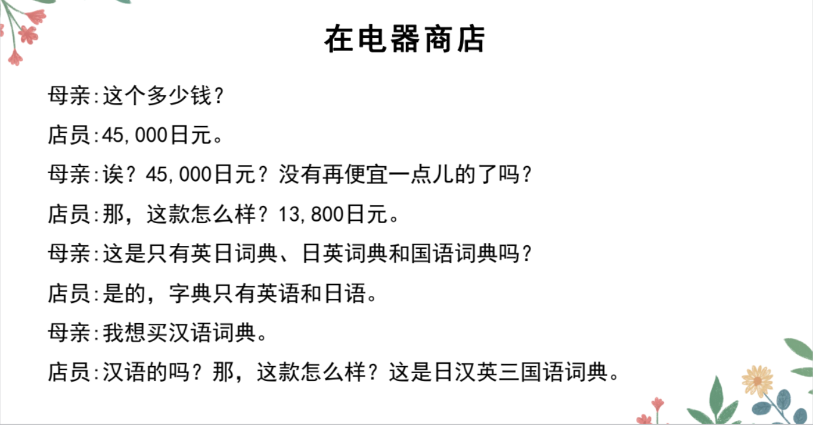
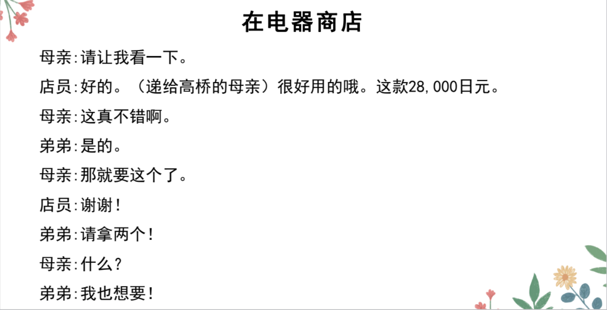

# でござい、いくら、も、だけ..

## 新出単語

<vue-plyr>
  <audio controls crossorigin playsinline loop>
    <source src="../audio/9-2-たんご.mp3" type="audio/mp3" />
  </audio>
 </vue-plyr>

## ~ でございます＜判断（礼貌）＞

意义：判断句的礼貌形式。 です是だ的敬体  
接续：名词+でございます です的敬语でございます  
说明：多用于商业、服务业等场合，表示对说话人的尊敬。店员对客人

```ts
（1）7階でございます。 在7楼 ななかいです。
（2）お手洗いは2階でございます。 二階です。
洗手间在2楼。
（3）はじめまして。加藤太郎の母でございます。 母です。
初次见面，我是加藤太郎的母亲。
```

## 練習 れんしゅう

```ts
（1）餐厅在四楼。服务员对客人说：
⇒ レストランは四階でございます。
```

> 所在句：レストランは四階にあります。 口语：～は地方です

## いくら＜疑问（价格）＞

意义：询问价格或钱数。  
译文：多少钱？多少......？

```ts
（1）これは、いくらですか。这个多少钱？
（2）そのパソコンはいくらで買ったんですか。
（3）ジャスミン茶を500グラムと茶器セットを1つほしいですが、
// 全部でいくらですか。 で：数量的总和
加在一起，一共多少钱？

```

## 練習 れんしゅう

```ts
（1）こ这个包多少钱？ //かばん いくら
⇒ この鞄はいくらですか。
（2）这个可爱的玩具用多少钱买的呢？ // かわいい　　 玩具「おもちゃ」
⇒ 　この可愛い玩具はいくらで買ったんですか。
　 　この可愛い玩具はいくらで買いましたか。
　　　　　　　Ｖ简体んですか 　　形容词/名词です

```

## 数量词 + も ＜主观多量＞

意义：强调数量之多，带有说话人的主观感情。  
译文：竟......；足足......；达......  
接续：数量词+も

```ts
（1）ええ？？！！、45,000円もするんですか。
什么？？！！ 竟然要四万五千日元？？！
金钱数量+する 定价 要
（2）駅で一時間も友達を待ちました。
（3）ゆうべビールを５本も飲みました。
（4）鈴木：毎日コーヒーを３杯飲みます。
王 ：えっ？ ３杯も飲むんですか。

```

## 練習 れんしゅう

```ts
（1）奖金竟然有五千万（日元）。 // 奖金：賞金「 しょうきん」
⇒ 賞金は ごせんまんえんも あるんです。
賞金は ごせんまんえんも ある・あります。
（2）足足看了10本小说。　// 小説「しょうせつ」を読む　じゅっさつ　
⇒ 小説は/を十冊も読んだ・読みました。
読んだんです。
```

## だけ ＜限定＞

意义：表示限定。 教室に王さんだけ（が）いる。  
译文：只有......；仅仅...... 教室に王さんがいる。  
接续：名词+だけ すこしだけ 只要一点点 に、へ、で、と  
说明：「だけ」用于格助词「が」「を」前面时，  
「が」「を」可以省略。其他不省

```ts
（1）これは和英辞書と英和辞書と国語辞典だけですか。
（2）高橋さんだけ（が）来ていません。 只有高桥没来。（现在没来，等下来）
（3）今朝は果物だけ（を）食べました。今天早上只吃了水果。
（4）日本語には漢字、平仮名、片仮名がありますが、中国語は漢字だけです。
日语里有汉字，平假名，片假名，但是 中文只有汉字。
```

## 練習 れんしゅう

```ts
（1）小孩子只会写平假名。 // ひらがな　を書く　　Ｎだけ
⇒ こどもは平仮名だけ（が）書ける・書けます。
（2）我只吃葡萄。　// ぶどうを食べる。
⇒ （私は）葡萄だけ（を）食べる・食べます。
（3）我只去了日本。 // 行くー行った・行きました
⇒ （私は）日本だけに/へ　行った・行きました。
```

## N しか～ない＜限定＞

意义：表示限定。　　
译文：只有......；仅仅...... 　　
接续：名词+しか＋否定的表达方式

```ts
（1）辞書は英語と日本語しかありません。
（2）アフレコ大会は日本語学科の学生しか参加できません。
　　 配音比赛 只有日语专业的学生 能参加。
（3）会話の授業は一週間に一回しかありません。会话课一周只有一次。
（4）いろいろな町へ行きたいですが、
時間がなくて、北京と天津（へ/に）しか行きませんでした。
我想去各种各样的城市（看看），但是（因为）没有，所以只去了北京，天津。
```

> 区别：
> ① だけ 表示“只，仅仅” しか＋「ない」整体表示“只，仅仅”
> ② だけ 中性 しか＋ない 消极
> ③ だけ＋ない：否定“只有、不” しか＋ない：肯定“只”
> 「しか」需要与否定形式搭配使用才能表达限定意义。比起「だけ」，
> 「しか」
> 的主观色彩更强，暗含“本应还有其他因素”的语义，往往带有“嫌少”的语气。

```ts
（5）（正在减肥）果物だけ食べました。（还好）
（6）（肚子很饿，但家里没有饭了）果物しか食べませんでした。
```

> 我只吃葡萄：　葡萄だけ食べる。　葡萄しか食べない.  
> 我只有葡萄不吃：葡萄だけ食べない・食べません。

## 練習 れんしゅう

```ts
（1）钱包里只有两百块了。 // さいふ にひゃくげん
⇒ 財布に二百元しかない・ありません。
（2）只能睡觉两个小时。// にじかん　　ねる　ーねられる
⇒ 二時間しか寝られない・寝られません。
　　二時間だけ寝られる・寝られます。
```

## V てください＜请求＞

意义：表示请求对方做某件事。 要求对方做某事。  
接续：Ｖて+ください  
译文：请（你）......；......吧  
说明：「ください」是动词「くださる[给我（敬语动词）]」的命令形。

```ts
（1）ちょっとそれを見せてください。//みせる
请把那个（给我）看一下。
（2）日本語を教えてください。　　//おしえる　
请（你）教（我）日语。　　　　　　
（3）ここに電話番号を書いてください。
書く 请（你）把电话号码写到这里

```

> ☞ 请求长辈或上级做某事时，要避免使用该句型，应当使用敬意程度更
> 高的表达。语气随意的场合，也可省略「ください」直接说「Ｖて」。

```ts
（4）ちょっと待って。请（你）稍等一下。
ちょっと待って（ください）。

```

## 練習 れんしゅう

```ts
（1）请起立。 //立つ「たつ」
⇒ 立ってください。
（2）请举手 てをあげる。
⇒ 手をあげてください。
（3）请坐。 //座る「すわる」
⇒ 座ってください。 口语：座って（ください）。
```

## N をください＜索要＞

意义：表示索取或购买某物时的请求。  
译文：请(你）给我......吧 お金をください  
接续：名词+を（＋数量词）+ください

```ts
（1）それを二つください。 请给我两个那个
（2）紹興酒を２本ください。　请（你）给我两瓶绍兴酒。
（3）ジャスミン茶を500グラムと、茶器セットを一つください。
（4）すみません、留学の申込書[申请书]をください。// 「もうしこみしょ」
更礼貌说法： Ｎをお願いします
```

## 練習 れんしゅう

```ts
（1）请给我一张邮票。// 切手「きって」 いちまい 行って「いって」
⇒ 切手を一枚ください。 一枚の切手をください。
更加礼貌：切手を一枚お願いします。
（2）请给我两杯可乐。コーラ　　// 二杯「にはい」
⇒ 　コーラを二杯ください。

```

## 精読の教文

<vue-plyr>
  <audio controls crossorigin playsinline loop>
    <source src="../audio/9-2-2.mp3" type="audio/mp3" />
  </audio>
 </vue-plyr>



## 会話

<vue-plyr>
  <audio controls crossorigin playsinline loop>
    <source src="../audio/9-2-かいわ.mp3" type="audio/mp3" />
  </audio>
 </vue-plyr>








