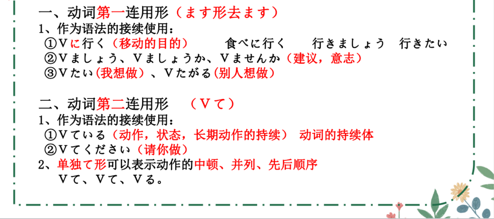
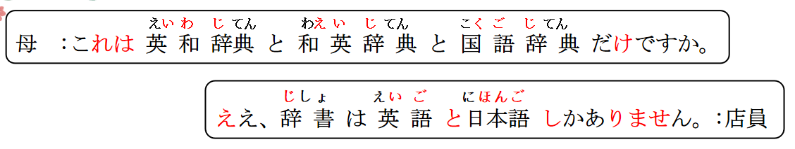
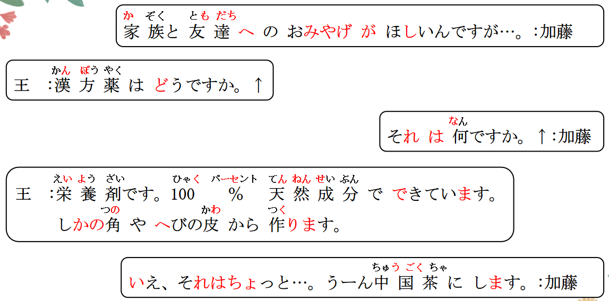
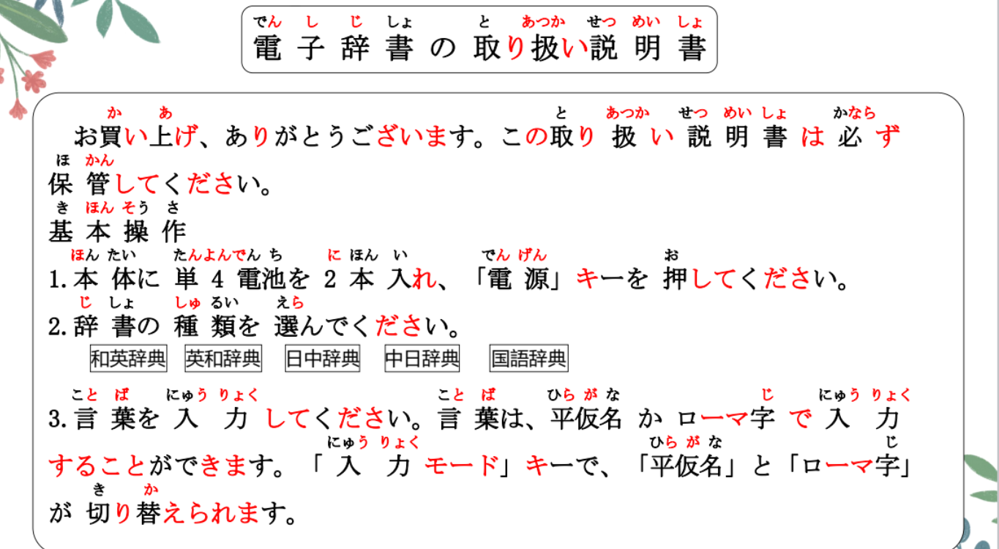
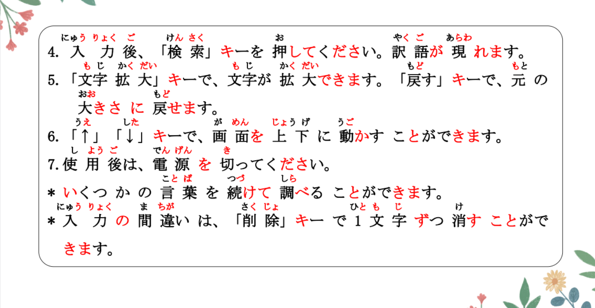
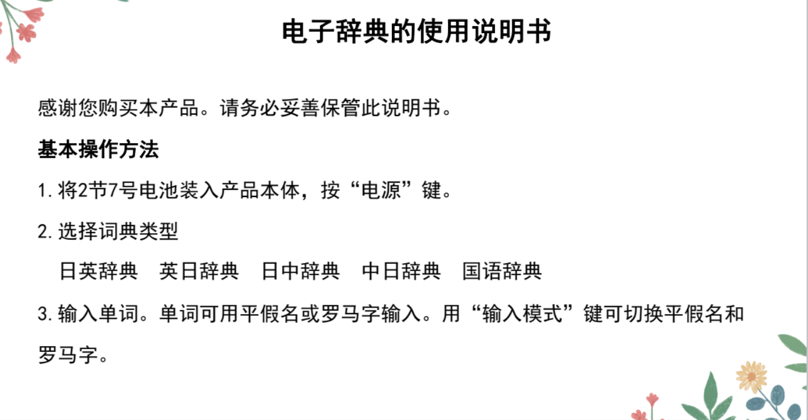
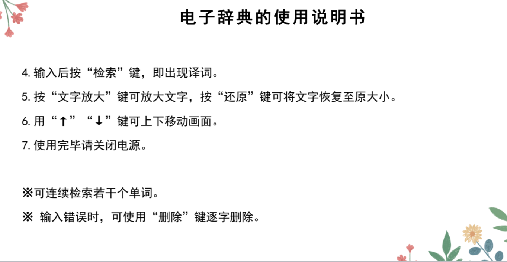

# Vることができる、ずつ

## 新出単語
<vue-plyr>
  <audio controls crossorigin playsinline loop>
    <source src="../audio/9-3-たんご.mp3" type="audio/mp3" />
  </audio>
 </vue-plyr>

## V ることができる　＜可能＞ 固定搭配

意义：表示具有做某事的能力，或在某种条件下动作行为的可能性。  
译文：能够……；可以……；会……  
接续：Vる（原形）+ことができる 事「こと」  
```ts
（1）言葉は、平仮名かローマ字で入力することができます。
单词的话，能 用 平假名或者罗马字输入（打字）。 9键 26键
（2）高木さんはフランス語を話すことができます。
（3）私は200メートル泳ぐことができます。200米
（4）図書館のパソコンは何時まで使うことができますか。
图书馆的电脑 能用到几点（为止）呢？


```

## 練習 れんしゅう

```ts
（1）我会说中文。 // ちゅうごくご 話す
⇒ 中国語を話すことができる・できます。
能动态：（私は）中国語が話せます。
（2）我不会踢足球。 // サッカーをする
⇒ サッカーをすることができない・できません。
サッカーをすることはできない。我“不会”踢足球。
 能动态：　サッカーができない・できません。

```
## 动词的第一连用形 ＜表示并列＞



意义：表示动作的并列或先后顺序。　　
接续：动词第一连用形、+动词第一连用形、动词。　　
说明:第一连用形通常只用于书面语。第二连用形用于口语中顿。　　
```ts
（1）本体に単4電池を2本入れ、
「電源」キーを押してください。
请 先放两节电池到主机，再按电源。 入れる「いれる」放入
（2）100万円を箱に入れ、鍵をかけ、保管した。鍵をかける 上锁
（3）ドアが開き、男が現れた。 ドアが開く「あく」 くーき
```
## 練習 れんしゅう

```ts
（1）听音乐，睡觉。 // おんがくをきく ねる 聴く 精听（听力）
⇒ 书面语： 音楽を聞き、寝る。
口语： 简体： 音楽を聞いて、寝る。
敬体： 音楽を聞いて、寝ます。

```
## ずつ ＜等量＞ 等量分配   等量反复

意义：表示数量的均等分配或者动作、变化的等量反复。  
译文：各……；分别……；每……；  
接续：数量词或表示数量、程度的副词+ずつ 少しずつ  
```ts
（1）入力の間違いは、
「削除」キーで1文字ずつ消すことができます。
输入的错误，可以用删除键逐字删除。
（2）一つの単語を3回ずつ発音してください。
（3）りんごは一人に2つずつある。
（4）毎日、少しずつ練習しています。 每天，一点一点的在练习。

```

## 練習 れんしゅう
```ts
（1）给每一个人三个香蕉。 あげる 给
⇒ ひとりにバナナをみっつあげる。给一个人三个香蕉
一人にバナナを三つずつあげる・あげます。
（2）每个月各存500块。 貯める「ためる」 ごひゃくげん
⇒ まいつき、 五百元ずつ貯める・貯めます。 お金を貯める。
（3）只吃一点饭。 ⇒　　ご飯をすこしだけ食べる。　
　 一点一点的吃饭。 ⇒ ご飯をすこしずつ食べる。
```

## 精読の教文

<vue-plyr>
  <audio controls crossorigin playsinline loop>
    <source src="../audio/9-3-1.mp3" type="audio/mp3" />
  </audio>
 </vue-plyr>



<vue-plyr>
  <audio controls crossorigin playsinline loop>
    <source src="../audio/9-1-4.mp3" type="audio/mp3" />
  </audio>
 </vue-plyr>



## 会話
<vue-plyr>
  <audio controls crossorigin playsinline loop>
    <source src="../audio/9-3-かいわ.mp3" type="audio/mp3" />
  </audio>
 </vue-plyr>




