# Ｎとして...

## 新出単語

<vue-plyr>
  <audio controls crossorigin playsinline loop>
    <source src="../audio/c/4-2-たんご.mp3" type="audio/mp3" />
  </audio>
 </vue-plyr>

| 単語                                               | 词性              | 翻译                                |
| -------------------------------------------------- | ----------------- | ----------------------------------- |
| 環境（<JpWord>かんきょう</JpWord> ）               | ⓪ ＜名＞          | 环境                                |
| 報道（<JpWord>ほうどう</JpWord> ）                 | ⓪ ＜名• 他 Ⅲ ＞   | 报道 ;报导                          |
| 特集（<JpWord>とくしゅう</JpWord> ）               | ⓪ ＜名＞          | 特辑 ;专刊                          |
| 自宅（<JpWord>じたく</JpWord> ）                   | ⓪ ＜名＞          | 自己的住宅                          |
| <JpWord>キャスター</JpWord> （caster）             | ① ＜名＞          | （电视、广播）新闻主播              |
| <JpWord>クローズアップ</JpWord> （close-up）       | ⑤ ＜名• 他 Ⅲ ＞   | 特写 ;（新闻等）聚焦                |
| <JpWord>ワールド</JpWord> （world）                | ① ＜名＞          | 世界                                |
| 起こる（<JpWord>おこる</JpWord> ）                 | ② ＜自 I >        | 发生 ;由来 ;发作                    |
| 砂漠化（<JpWord>さばくか</JpWord> ）               | ⓪ ＜名＞          | 沙漠化                              |
| 砂漠（<JpWord>さばく</JpWord> ）                   | ⓪ ＜名＞          | 沙漠                                |
| ー化（<JpWord>一か</JpWord> ）                     | ＜接尾＞          | 〜化                                |
| 早く（<JpWord>はやく</JpWord> ）                   | ① ＜名＞          | 早 ;原来 ,早先                      |
| 対策（<JpWord>たいさく</JpWord> ）                 | ⓪ ＜名＞          | 对策                                |
| 取り組む（<JpWord>とりくむ</JpWord> ）             | ③⓪ ＜自 I >       | 致力于 ,着力于 ;投身于              |
| 分析（<JpWord>ぶんせき</JpWord> ）                 | ⓪ ＜名・他 Ⅲ ＞   | 分析                                |
| 近年（<JpWord>きんねん</JpWord> ）                 | ① ＜名＞          | 近几年 ;近年来                      |
| 政府（<JpWord>せいふ</JpWord> ）                   | ① ＜名＞          | （中央）政府                        |
| 積極的（<JpWord>せっきょくてき</JpWord> ）         | ⓪ ＜形 Ⅱ>         | 积极（的）;主 动（的）              |
| 政策（<JpWord>せいさく</JpWord> ）                 | ⓪ ＜名＞          | 政策                                |
| まっ黄色（<JpWord>まっきいろ</JpWord> ）           | ⓪ ＜名＞          | 鲜黄色;正黄色                       |
| 黄色（<JpWord>きいろ</JpWord> ）                   | ⓪ ＜名＞          | 黄 ;黄色                            |
| 真っー（<JpWord>まっー</JpWord> ）                 | ＜接頭＞          | 真 〜 ;正 ~                         |
| 映像（<JpWord>えいぞう</JpWord> ）                 | ⓪ ＜名＞          | 影像 ;映像 ;视频                    |
| 内モンゴル（ <JpWord>うちモンゴル</JpWord> ）      | ③ ＜固名＞        | 内蒙古                              |
| 黄砂（<JpWord>こうさ</JpWord> ）                   | ① ＜名＞          | 黄沙 ;风沙 ;沙尘暴                  |
| 高原（<JpWord>こうげん</JpWord> ）                 | ⓪ ＜名＞          | 高原                                |
| 強い（<JpWord>つよい</JpWord> ）                   | ② ＜形 I ＞       | 强（的）;强 壮 （的）               |
| 吹く（<JpWord>ふく</JpWord> ）                     | ①② ＜自 I ＞      | 吹                                  |
| 植物（<JpWord>しょくぶつ</JpWord> ）               | ② ＜名＞          | 植物                                |
| 育つ（<JpWord>そだつ</JpWord> ）                   | ② ＜自 I ＞       | 成长                                |
| 砂嵐（<JpWord>すなあらし</JpWord> ）               | ③ ＜名＞          | 沙尘暴                              |
| <JpWord>へえ</JpWord>                              | ⓪ ＜感＞          | （表示惊讶）是吗 ?真的 ?            |
| 大型（ <JpWord>おおがた</JpWord> ）                | ⓪ ＜名＞          | 大型                                |
| 植林（ <JpWord>しょくりん</JpWord> ）              | ⓪ ＜名＞          | 植树造林 ;人工林                    |
| 緑化（<JpWord>りょっか</JpWord> ）                 | ⓪ ＜名 •他 Ⅲ ＞   | 绿化                                |
| 実施（<JpWord>じっし</JpWord> ）                   | ⓪ ＜名 •他 Ⅲ ＞   | 实施                                |
| 草原（<JpWord>そうげん</JpWord> ）                 | ⓪ ＜名＞          | 草原                                |
| 森林（<JpWord>しんりん</JpWord> ）                 | ⓪ ＜名＞          | 森林                                |
| 努める（<JpWord>つとめる</JpWord> ）               | ③ ＜自 Ⅱ ＞       | 致力于 ;努力                        |
| 対策（<JpWord>たいさく</JpWord> ）                 | ⓪ ＜名＞          | 对策                                |
| 観測（ <JpWord>かんそく</JpWord> ）                | ⓪ ＜名 •他 Ⅲ ＞   | 观测                                |
| 減少（ <JpWord>げんしょう</JpWord> ）              | ⓪ ＜名 •自他 Ⅲ ＞ | 减少                                |
| 傾向（<JpWord>けいこう</JpWord> ）                 | ⓪ ＜名＞          | 倾向                                |
| 効果（<JpWord>こうか</JpWord> ）                   | ① ＜名 ＞         | 效果                                |
| 地球温暖化（<JpWord>ちきゅうおんだんか</JpWord> ） | ⓪ ＜名＞          | 全球变暖                            |
| 地球（<JpWord>ちきゅう</JpWord> ）                 | ⓪ ＜名＞          | 地球                                |
| 温暖（<JpWord>おんだん</JpWord> ）                 | ⓪ ＜名 •形 Ⅱ ＞   | 温暖                                |
| 変化（<JpWord>へんか</JpWord> ）                   | ① ＜名• 自 Ⅲ ＞   | 变化                                |
| 一国（ <JpWord>いっこく</JpWord> ）                | ④⓪ ＜名＞         | 全国                                |
| 用事（<JpWord>ようじ</JpWord> ）                   | ⓪ ＜名 ＞         | （应该做的）事情                    |
| <JpWord>なるべく</JpWord>                          | ⓪ ＜副＞          | 尽量 ;尽可能                        |
| <JpWord>やっぱり</JpWord>                          | ③ ＜副＞          | 果然 ;还是（「やはり」的 口语形式） |
| <JpWord>かな</JpWord>                              | ＜終助＞          | 表示怀疑、不确切的语气              |
| <JpWord>かしら</JpWord>                            | ＜終助＞          | （表示疑问,女性用词）是否           |
| 目上（<JpWord>めうえ</JpWord>）                    | ⓪ ＜名＞          | 上级; 长辈                          |
| 敬語（<JpWord>けいご</JpWord>）                    | ⓪ ＜名＞          | 敬语                                |
| 提案（<JpWord>ていあん</JpWord>）                  | ⓪ ＜名・他 Ⅲ ＞   | 提案,提议;建议                      |
| 地震（<JpWord>じしん</JpWord>）                    | ⓪ ＜名＞          | 地震                                |
| 他人（<JpWord>たにん</JpWord>）                    | ⓪ ＜名＞          | 他人 ;别人                          |
| 屋上（<JpWord>おくじょう</JpWord>）                | ⓪ ＜名＞          | 屋顶; 房顶                          |
| 転換期（<JpWord>てんかんき</JpWord>）              | ③ ＜名＞          | 转换期; 转折期                      |
| 使用量（<JpWord>しようりょう</JpWord>）            | ② ＜名＞          | 使用量                              |
| 方向（ <JpWord>ほうこう</JpWord>）                 | ⓪ ＜名＞          | 方向                                |
| 実力（<JpWord>じつりょく</JpWord>）                | ⓪ ＜名＞          | 实力                                |
| 失業率（<JpWord>しつぎょうりつ</JpWord>）          | ③ ＜名＞          | 失业率                              |
| 失業（<JpWord>しつぎょう</JpWord>）                | ⓪ ＜名 •自 Ⅲ ＞   | 失业                                |
| 改善（<JpWord>かいぜん</JpWord>）                  | ⓪ ＜名 •他 Ⅲ ＞   | 改善                                |
| 景気（<JpWord>けいき</JpWord>）                    | ⓪ ＜名＞          | 景气                                |
| 緩やか（<JpWord>ゆるやか</JpWord>）                | ② ＜形 Ⅱ ＞       | 缓慢（的）;徐徐（的）               |
| 予想（<JpWord>よそう</JpWord>）                    | ⓪ ＜名 •他 Ⅲ ＞   | 预想 , 设想; 预测                   |
| 促す（<JpWord>うながす</JpWord>）                  | ③⓪ ＜他 Ⅰ ＞      | 催促 ;促成                          |

## Ｎとして（性质、资格）

意义：用于表示事物的性质，还可以表示动作主体的资格或身份。  
译文：作为......  
接续：名词+として

```ts
(1)隣国の中国では、早くから深刻な問題として対策に取り組んできました。
 邻国中国很早就将其作为严重问题采取了对策。
(2)この問題は、私たちみんなの問題として考えることが必要だ。
 这个问题有必要作为我们所有人的问题。
(3)万里の長城は世界遺産として国内外で有名だ。
万里长城是作为世界遗产闻名遐迩。
(4)三保さんは交換留学生として中国に留学したことがあります。
三保曾作为交换留学生到中国留学生。
```

## 練習 れんしゅう

```ts
1.作为交换留学生去东西大学。
⇒交換留学生として、東西大学に行く。
2.作为朋友，我有必须要说的。
⇒友達として、言わなければならないことがある。
```

## Ｎに対して/Ｎに対する＜对象＞

意义：表示态度、感情或动作、作用的对象。  
译文：对（于）.....  
说明：修饰动词、形容词时用「に対して」，修饰名词时用「に対する」。

```ts
(1)この問題に対する近年の中国政府の積極的な政策を分析してみましょう。
试分析一下近年来中国政府在这个问题上的积极政策。
(2)父は兄に対してとても厳しい。
父亲对哥哥非常严厉。
(3)お客さんに対してそんな失礼なことを言ってはいけない。
不要对客人说这种无礼的话。
(4)その芝居を見て、京劇に対する興味が高くなった。
看了那出戏，对京剧的兴趣提高了。　
(5)李さんの話から、新生活に対する期待が感じられる。
从小李的话中可以感受到他对新生活的期待。
```

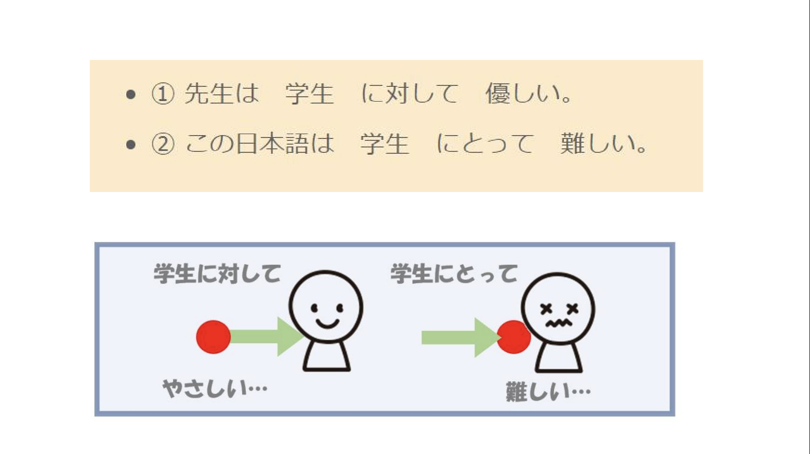
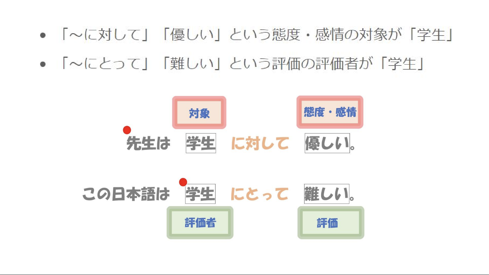

## 練習 れんしゅう

```ts
1.对于部长的提案，也出现反对的声音。【ていあ练ん】【はん习たい】
⇒部長の提案に対して、反対の声も出ている。
2.对于地震，我们必须实施各种各样的对策。【じしん】【たいさく】【じっし】
⇒地震に対して、様々な対策を実施しなければならない。
```

## V てみる＜尝试性的动作＞

意义：表示尝试进行某动作或做某事.  
译文：....一下；试着....  
接续：V て＋みる

```ts
(1)この問題に対する近年の中国政府の積極的な政策を分析してみましょう。
分析一下近年来中国政府在这个问题上的积极政策。
(2)旅行のことはもう一度皆さんと相談してみます。
旅行的事情再和大家商量一下。
(3)一度日本料理を食べてみたいです。
想尝试一次日本料理。
(4)二人でやってみたが、だめだった。
两个人试着做了，但是不行。
```

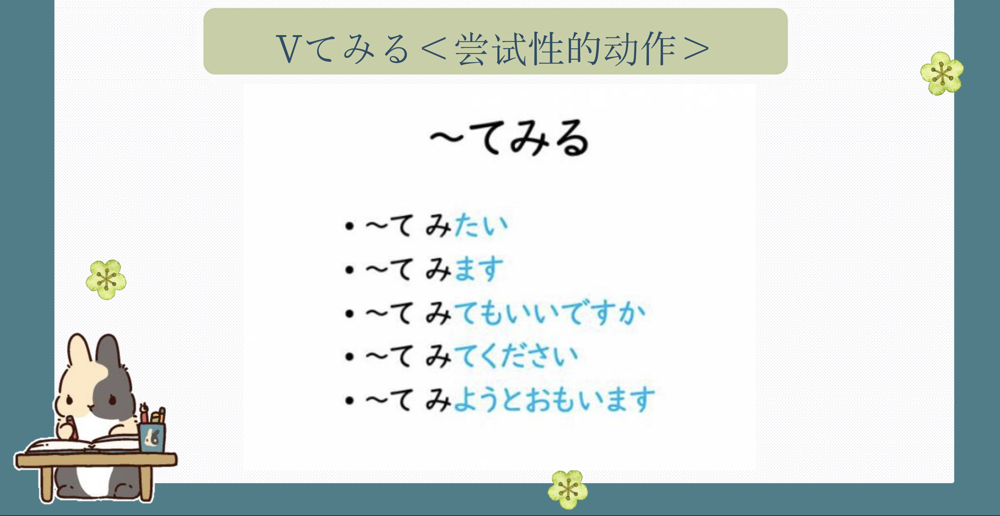
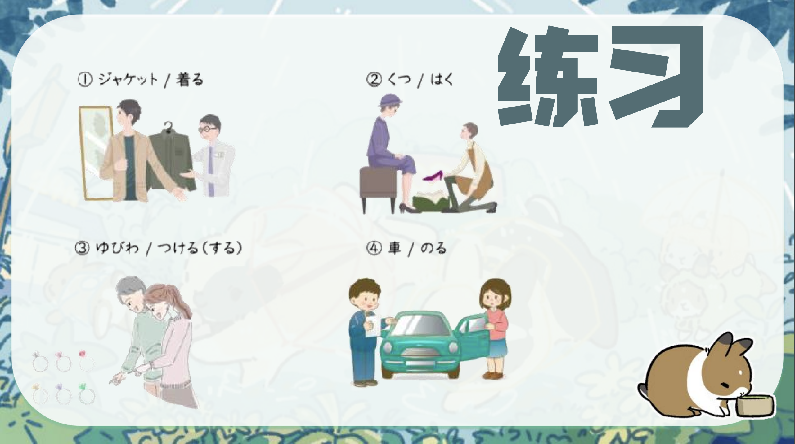

## 練習 れんしゅう

```ts
1.A:鈴木さんは寮に帰ったでしょうか。练习B:看一下教室吧。
⇒教室を見てみましょう。
2.A:屋上から花火が見えるでしょうか。B:去一下看看吧。
⇒行ってみましょう。
```

## Ｎにある＜抽象的处所＞　　

> 意义：表示处在某种不断变化的状况之中  
> 译文：处于....  
> 接续：（表达“趋势、阶段、水平”等意义的）名词+に＋ある  
> 说明：一般用于书面语或正式的场合。

```ts
(1)近年は黄砂を観測する日が減少傾向にあるという効果を見せております。
 近年来，观测黄沙的日子呈减少趋势。
(2)この面での中国の研究は、世界でも高いレベルにある。
中国在这方面的研究在世界上处于较高水平。
(3)近年、人口は減少傾向にあり、少子化が進行している。
近年来，人口呈减少趋势，少子化加剧。
(4) ジャイアントパンダ[大熊猫]は絶滅の危機にある動物である。
熊猫是一种濒临灭绝的动物。
```

## 練習 れんしゅう

```ts
1.失业率有改善的趋势。【しつぎょうりつ】【か练いぜん】【习けいこう】
⇒失業率は改善の傾向にある。
2.铃木选手的实力处于世界水平。「せんしゅ」「じつりょく」「レベル」
⇒鈴木選手の実力は世界レベルにある。
```

## V（よ）うか＜犹豫＞　

意义：表示说话人对是否要进行该动作而犹豫不决、踌躇不定的心情，有时为自言自语，有时则带有与对方商量的语气。  
译文：要不要...；要不....吧  
接续：动词的意志形+か  
说明：一般多用于简体会话中。

```ts
(1)電話しようかな。
打不打电话呢。
(2)寒いから、もう帰ろうか。
太冷了，我们回去吧。
(3)これからどうしようか。
今后怎么办。
(4)今日はもうやめようか。
今天就算了吧。
```

## 練習 れんしゅう

```ts
1.因为很便宜，要不买吧。
练习⇒安いから、買おうか。
2.因为很无聊，算了吧。
⇒つまらないから、やめようか。
```

## ても＜让步条件＞

意义：表示转折关系，意为即使从句所述事项成立，主句的结果也不会改变。  
译文：即使（哪怕、就是、纵然),......也（不）......  
接续：动词、Ⅰ 类形容词的「て形」+も 名词、Ⅱ 类形容词词干+でも

```ts
(1)用事があってもなるべく外出しないほうがいいと言いましょう。
即使有事也尽量不要外出。
(2)明日は雨が降っても香山へ行きます。
明天下雨也去香山。
(3)今必要だから、高くても買います。
因为现在需要，所以就算贵也要买。
(4)体が丈夫でも注意しないと病気になりますよ。
即使身体健康，不注意的话也会生病的。
(5)日曜日でも会社へ行かなければならない。
星期天也必须去公司。
```

## 練習 れんしゅう

```ts
1.即使简单也要练习。
⇒簡単でも練習する。
2.即使是学生也要支付会费。
⇒学生でも会費を払う。
```

## 日语简体会话的特点（1）

> a. 同学、朋友之间,或关系比较密切的人相互交谈时无需客气,即非正式场合的会话通常不需要使用敬语 ,在日语中这时一般使用简体,还使用省略的形式（缩略形）和特定的语气助词，比如本课中出现的「〜かな、〜かしら」等。另外,日语中的语气助词非常丰富 ,部分语气助词的使用也有男女之别, 例如本课中的「かしら」就主要用于女性,男性一般不使用。  
> b. 日语的简体会话中还经常出现一些语音的变化, 比如,在不影响意义的前提下,经常使用缩略形 ,现简单举例如下（箭头右边的为口语中使用的缩略形）

```ts
例：では → じゃ （例如 : じゃ、また。）
Nでは → Nじゃ （例如 :休みじゃないの ?）
ている → Vてる （例如:読んでる /食べてる /見てない）
例：〜と言う /思う → 〜って言う/思う
（例如： 高いって言った/悪いって思う/王さんっていう学生）
〜のだ → 〜 んだ （例如:わかるんだ/おもしろいんだ）
〜だろう → 〜 だろ （例 如 : 日曜日だろ）
```

## 会話

<vue-plyr>
  <audio controls crossorigin playsinline loop>
    <source src="../audio/c/4-1-かいわ.mp3" type="audio/mp3" />
  </audio>
 </vue-plyr>
 
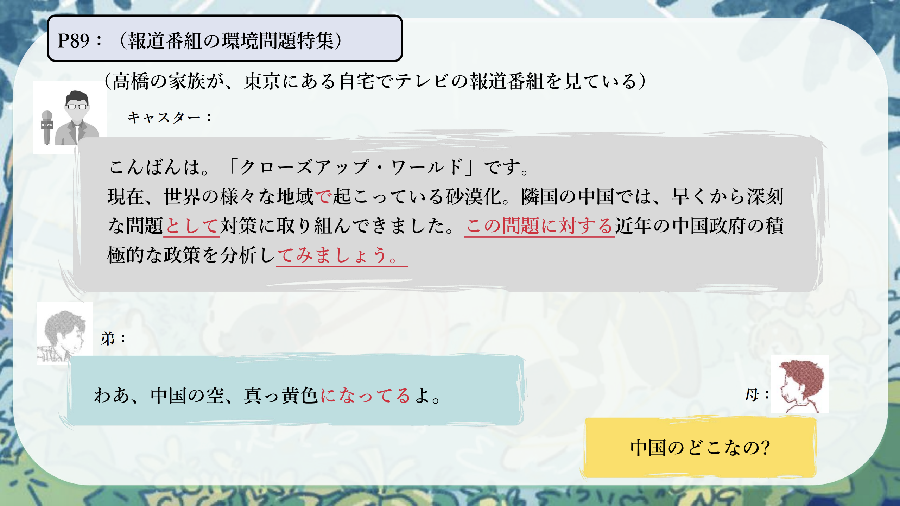
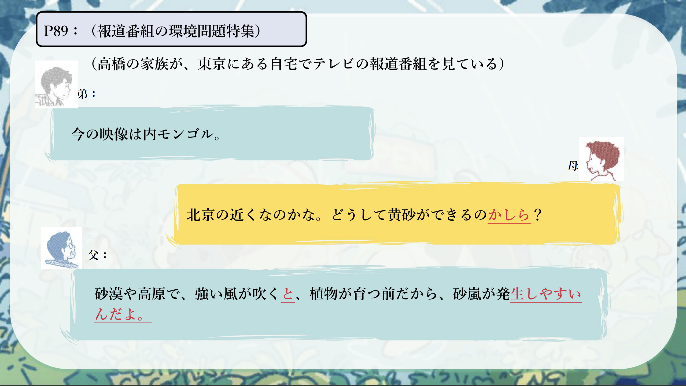
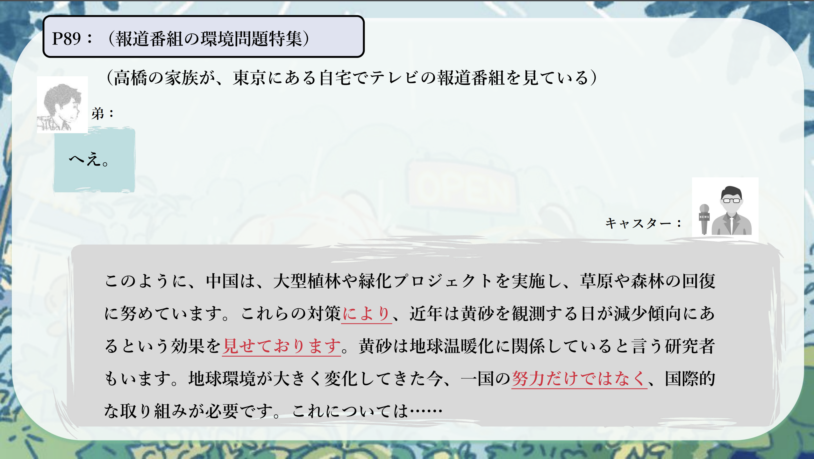
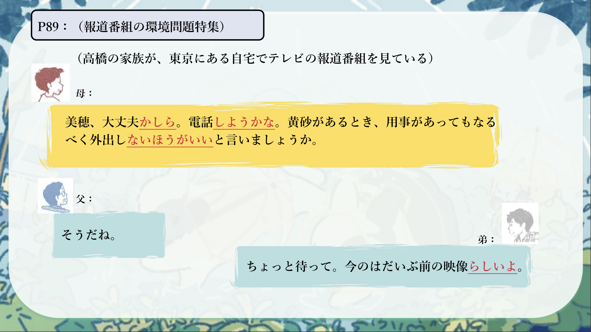
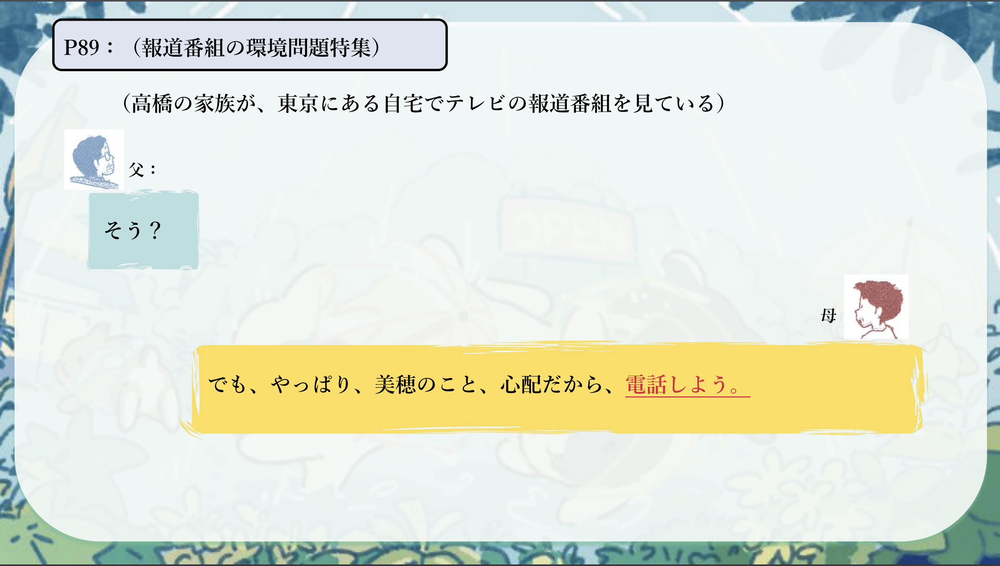
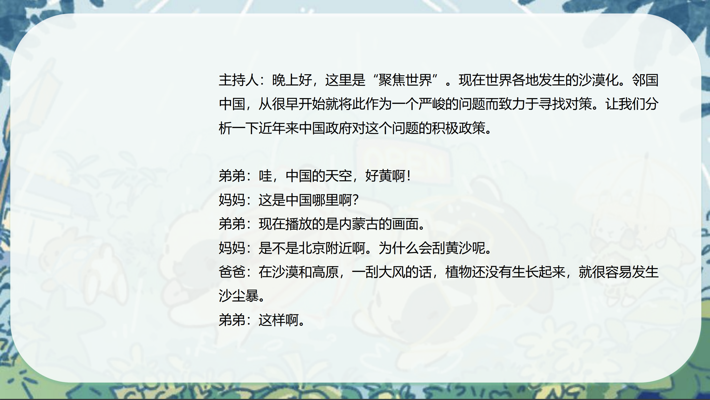
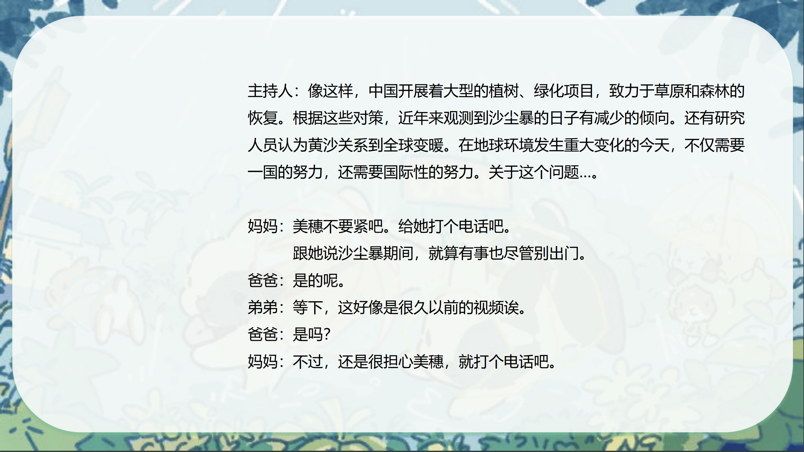
