# 〜んじゃない..

## 新出単語

<vue-plyr>
  <audio controls crossorigin playsinline loop>
    <source src="../audio/c/4-2-たんご.mp3" type="audio/mp3" />
  </audio>
 </vue-plyr>

| 単語                                               | 词性                  | 翻译                                 |
| -------------------------------------------------- | --------------------- | ------------------------------------ |
| ビデオ通話（<JpWord>video つうわ</JpWord>）        | ④ ＜名＞              | 视频通话                             |
| 通話（<JpWord>つうわ</JpWord>）                    | ⓪ ＜名• 自 Ⅲ ＞       | 通话                                 |
| <JpWord>こっち</JpWord>                            | ③ ＜名＞              | （ 「こちら 」 的口语形式）这边;这里 |
| <JpWord>ううん</JpWord>                            | ⓪ ＜感＞              | 表示否定的意思 ;有感而发             |
| 一度（<JpWord>いちど</JpWord>）                    | ③ ＜名＞              | 一 次 ;一 遍                         |
| <JpWord>サングラス</JpWord>（sun glasses）         | ③ ＜名＞              | 太阳镜;墨镜                          |
| <JpWord>かける</JpWord>「掛ける」                  | ② ＜他 Ⅱ ＞           | 佩戴 ; 挂; 系                        |
| 巻く（<JpWord>まく</JpWord>）                      | ⓪ ＜他 I >            | 围 ; 卷 ; 包围                       |
| 映る（<JpWord>うつる</JpWord>）                    | ② ＜自 Ⅰ ＞           | 映 ;照                               |
| <JpWord>わ</JpWord>                                | ＜感＞                | 感叹                                 |
| 晴れ（<JpWord>はれ</JpWord>）                      | ②① ＜名＞             | 晴 ,晴 天 ;放晴                      |
| <JpWord>スモッグ</JpWord>（smog）                  | ② ＜名＞              | 雾霾 ;烟雾,烟尘                      |
| <JpWord>ぼんやり</JpWord>                          | ③ ＜副・自 Ⅲ ＞       | 模糊不清楚; 发呆; 心不在焉           |
| 霞む（<JpWord>かすむ</JpWord>）                    | ⓪ ＜自 I >            | 起霞 ;模糊不清;朦胧                  |
| <JpWord>マスク</JpWord>（mask）                    | ① ＜名＞              | 口罩 ;面具 ;面膜                     |
| <JpWord>だめ</JpWord>                              | ② ＜形 Ⅱ ＞           | 无用 ;白费 ;不行                     |
| <JpWord>わね</JpWord>                              | ＜感＞                | 表示语气柔和的主张或叮问             |
| 文句（<JpWord>もんく</JpWord>）                    | ① ＜名＞              | 抱怨 ,牢骚                           |
| 砂糖（<JpWord>さとう</JpWord>）                    | ② ＜名＞              | 糖 ;砂糖                             |
| 昆明（ <JpWord>こんめい</JpWord>）                 | ① ＜固名＞            | 昆明                                 |
| 招待（<JpWord>しょうたい</JpWord>）                | ① ＜名・他 Ⅲ ＞       | 邀请                                 |
| <JpWord>あげる</JpWord>[上げる • 挙げる • 揚げる ] | ⓪ ＜他 Ⅱ ＞           | 放（烟火）                           |
| 交通（<JpWord>こうつう</JpWord>）                  | ⓪ ＜名＞              | 交通 ;通信往来                       |
| <JpWord>コップ</JpWord>（荷兰语 kop）              | ⓪ ＜名＞              | 玻璃杯                               |
| 指示（<JpWord>しじ</JpWord>）                      | ① ＜名・他 Ⅲ ＞       | 指示 ;指导                           |
| 生まれ変わる（ <JpWord>うまれかわる</JpWord>）     | ⑤ ＜自 Ⅰ ＞           | 脱胎换骨;再生;转世                   |
| 席順（<JpWord>せきじゅん</JpWord>）                | ⓪ ＜名＞              | 座位次序                             |
| -順（<JpWord>-じゅん</JpWord>）                    | ＜名＞                | 〜顺序                               |
| <JpWord>オシャレ</JpWord>[お洒落]                  | ② ＜名 •形 Ⅱ・自 Ⅲ ＞ | （打扮）时髦, 潇洒                   |

## 〜んじゃない（の）か/〜のではないか（と思う）

意义：表示说话人委婉的推测、主张。  
译文：是不是……; 会不会……; 可能是…….  
接续：动词、形容词的连体形+ んじゃない（の）か/のではないか 名词+ な+ んじゃない （の）か/のではないか

```ts
(1)北京は黄砂がひどいんじゃないの？
北京的沙尘暴不是很严重吗？
(2)それって、うそなんじゃないの？
那不是骗人的吗？
(3)やはりAチームのほうが強いんじゃないかな。
 果然还是A队强一些吧？
(4)この値段はちょっと高いんじゃないか。
 这个价格是不是有点贵。
(5)ここより趙さんの部屋のほうが静かなのではないかと思います。
 比起这里，我觉得小赵的房间更安静。
```

## 練習 れんしゅう

```ts
1.对于二年级学生来说是不是很简单呢？
练习⇒二年生にとって簡単なのではないか。
2.是不是再详细地说明比较好呢？
⇒もうちょっと詳しく説明したほうがいいのではないか。
```

## Ｖて/Ｖないで＜伴随状态＞

意义：表示动作主体进行某一动作时的状态，即在该状态下进行谓语动词表示的动作。  
译文：（穿、戴…… ）着 （做 ）……/ 不 （穿、戴…… ） （做 ）…….

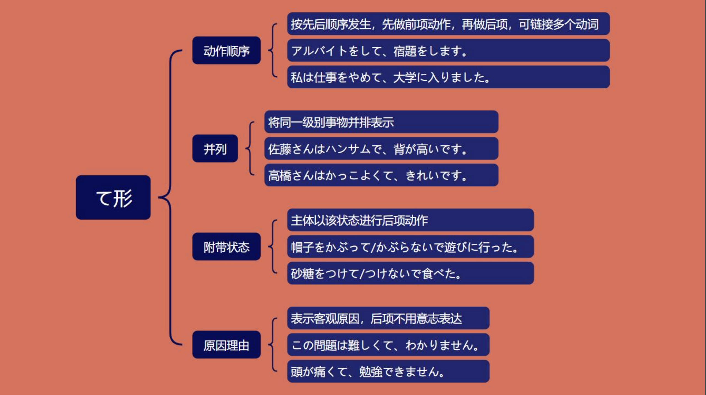

```ts
(1)テレビにはサングラスをかけて、スカーフを巻いて出かけてる人が映っていたわよ。
 电视上出现了一个戴着太阳镜，围着围巾出门的人。
(2)帽子をかぶって/かぶらないで遊びに行った。// 帽子「ぼうし」
戴着帽子/不戴帽子去玩。
(3)マスクをして/しないで出かけてるの?
 戴着口罩/不戴口罩出门吗?
(4)砂糖をつけて/つけないで食べた。 　
蘸着砂糖/不蘸着吃了。//　砂糖「さとう」
```

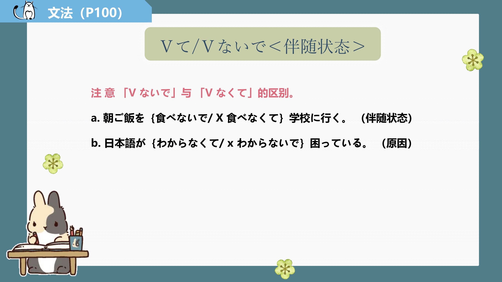
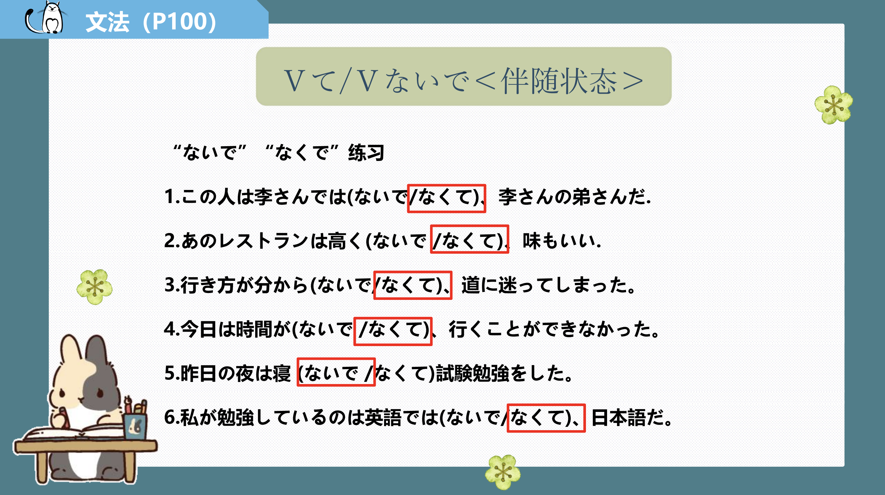

## 練習 れんしゅう

```ts
1.没有洗脸就睡了。
练习⇒顔を洗わないで、寝た。
2.没穿大衣就出去了。
⇒コートを着ないで、出かけた。
```

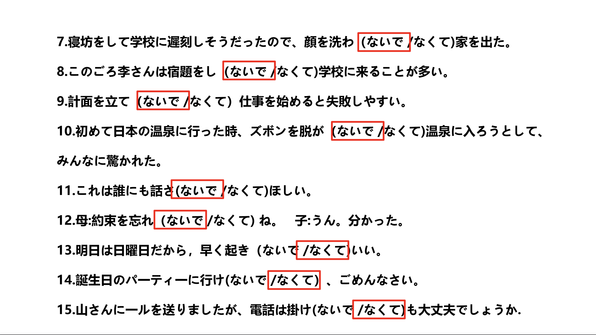

## でも＜极端的情况＞

意义：用于举出极端的事例 ,意为在这种极端的情况下尚且如此 ,其他的情况也不例外。  
译文：就连……都……; 连……也……; 即使……也……  
接续：名词+ でも

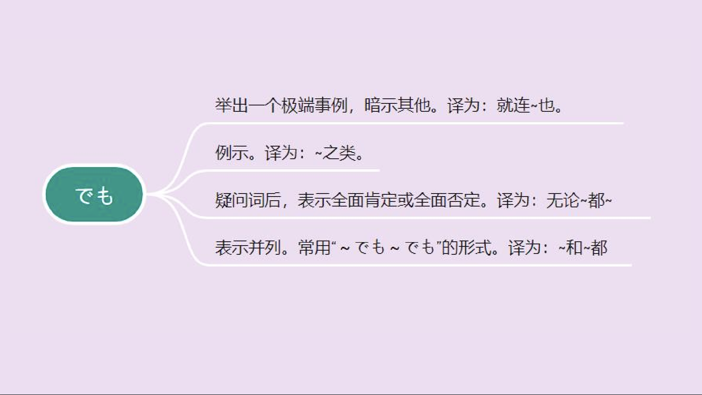

```ts
(1)たまには、晴れでもスモッグか何かでぼんやり霞む日もあるけど……。
 偶尔也会有晴天因为雾霾什么的而朦朦胧胧的日子... ..。
(2)この仕事は病気でも休めません。
 这个工作即使生病也不能请假。
(3)先生でもわからないかもしれません。
 老师可能也不知道。
(4)今度の日曜日は雨でも必ず買い物へ行きます。
 这个星期天即使下雨也一定去购物。
```

## 練習 れんしゅう

```ts
1.那个问题就连孩子都知道。
练习⇒その問題は子供でも分かる。
2.这个宿舍即使是留学生也能进入。
⇒この寮は留学生でも入ることができる。
```

## ~し~ （し）＜并列＞　　

意义：用于并列举出几个相关联的事项。两个 「し」连在一起使用时, 有时用于罗列理由。  
译文：而且...; 又.... 又....  
接续：连接两个或两个以上的小句。

```ts
(1)外から帰ったら、 うがいもしてるし。　
从外面回来后，还要漱口。
(2)ここは静かだし、本もあるし、いいところだ。　
这里很安静，有书，是个好地方。
(3)あの子は頭もいいし、運動もできる。
那孩子很聪明，也会运动。
(4)この一年間はよく勉強したし、よく遊んだ。
这一年我学习很努力，也经常玩。
```

## 練習 れんしゅう

```ts
1.喉咙也痛，也没有食欲。
练习⇒喉も痛いし、食欲もない。
2.放了烟花，还吃了饺子。
⇒花火をあげたし、ギョーザを食べた。
```

## 日语简体会话的特点

在本课的第 1 单元中，我们讲解了日语简体会话的一些特点，在本单元的会话里还可以看到另外一些特点。比如 ,将助词省去不用、省略句尾的判断词等。

```ts
（1）どうしたの ? みんな元気 ? （どうしたんですか。みんな元気ですか。）
（2）田中さんって、学生 ? （田中さんって、学生ですか。）
（3）大丈夫。心配しないで。 （大丈夫です。心配しないでください。）
（4）お茶飲みますか。 （お茶を飲みますか。）
（5）お茶飲む ? （お茶を飲む?）
```

## 練習 れんしゅう

```ts
1.因为很便宜，要不买吧。
练习⇒安いから、買おうか。
2.因为很无聊，算了吧。
⇒つまらないから、やめようか。
```

## ても＜让步条件＞

意义：表示转折关系，意为即使从句所述事项成立，主句的结果也不会改变。  
译文：即使（哪怕、就是、纵然),......也（不）......  
接续：动词、Ⅰ 类形容词的「て形」+も 名词、Ⅱ 类形容词词干+でも

```ts
(1)用事があってもなるべく外出しないほうがいいと言いましょう。
即使有事也尽量不要外出。
(2)明日は雨が降っても香山へ行きます。
明天下雨也去香山。
(3)今必要だから、高くても買います。
因为现在需要，所以就算贵也要买。
(4)体が丈夫でも注意しないと病気になりますよ。
即使身体健康，不注意的话也会生病的。
(5)日曜日でも会社へ行かなければならない。
星期天也必须去公司。
```

## 練習 れんしゅう

```ts
1.即使简单也要练习。
⇒簡単でも練習する。
2.即使是学生也要支付会费。
⇒学生でも会費を払う。
```

## 日语简体会话的特点（1）

> a. 同学、朋友之间,或关系比较密切的人相互交谈时无需客气,即非正式场合的会话通常不需要使用敬语 ,在日语中这时一般使用简体,还使用省略的形式（缩略形）和特定的语气助词，比如本课中出现的「〜かな、〜かしら」等。另外,日语中的语气助词非常丰富 ,部分语气助词的使用也有男女之别, 例如本课中的「かしら」就主要用于女性,男性一般不使用。  
> b. 日语的简体会话中还经常出现一些语音的变化, 比如,在不影响意义的前提下,经常使用缩略形 ,现简单举例如下（箭头右边的为口语中使用的缩略形）

```ts
例：では → じゃ （例如 : じゃ、また。）
Nでは → Nじゃ （例如 :休みじゃないの ?）
ている → Vてる （例如:読んでる /食べてる /見てない）
例：〜と言う /思う → 〜って言う/思う
（例如： 高いって言った/悪いって思う/王さんっていう学生）
〜のだ → 〜 んだ （例如:わかるんだ/おもしろいんだ）
〜だろう → 〜 だろ （例 如 : 日曜日だろ）
```

## 〜たら

意义：表达确定条件或假设条件。  
译文：……之后 ,就……; 如果……就……  
接续：V た+ たら

> I 类形容词词干+ かったら 　
> Ⅱ 类形容词词干 /名词+ だったら

```ts
(1)外から帰ったら、うがいもしてるし。＜确定条件＞
从外面回来，还漱口。
(2)8時になったら、帰ります。
到了8点就回去。
(3)大学を卒業したら、 日本へ留学に行きたい。
 大学毕业后，想去日本留学。
(4)もし地震が来たら、どこに逃げますか。＜假设条件＞
如果发生地震，你会逃到哪里。
(5)もし暑かったら、出かけません。
如果太热的话，就不出门。
(6)元気だったら、またいつか会えるね。
 如果身体好的话，总有一天会再见面的。
(7)日曜日だったら大丈夫です。手伝いますよ。
如果是星期天就好了。我来帮你。
```

> 说明：  
> 例 （1）〜 3）为确定条件,即主句表达的事项在从句表达的事项之后发生;  
> 例（4）〜（7）为假设条件,即假设从句表达的事项成立,则主句表达的事项会发生或成立,经常与副词「もし」一起使用。「〜たら」在口语中经常用于表达一次性的、特定的事项,不用于论文等正式的文体。

## 練習 れんしゅう

```ts
1.如果高桥来了，请告诉我。
练习⇒高橋さんが来たら、教えてください。
2.回家之后想要立马淋浴。
⇒家に帰ったら、すぐシャワーを浴びたい。
```

## 动词的条件形

意义：表示如果该条件（动作 、变化 、状态 、性质等 ）成立 ,就会出现后面的结果。  
译文：如果……就……; 假如……要是……  
说明：「ば」为动词和形容词的条件形之一,二者的活用方式不同。

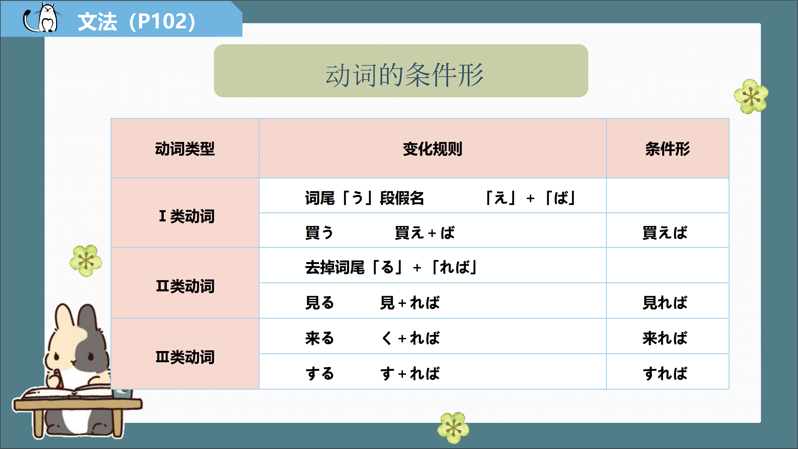

```ts
(1)困ったことがあれば、友達に教えてもらうから、大丈夫よ。 有困难的话，会向朋友请教的，没关系的。
(2)雨が降れば、出かけない。
  如果下雨就不要出门。
 (3)毎日よく練習すれば、きっと上手になる。
 每天好好练习的话，一定会变好的。
 (4)田中さんが来れば、パーティーが楽しくなるでしょう。
  如果田中先生来的话，聚会会变得有趣吧。
```

## 練習 れんしゅう

```ts
1.即使简单也要练习。
⇒簡単でも練習する。
2.即使是学生也要支付会费。
⇒学生でも会費を払う。
```

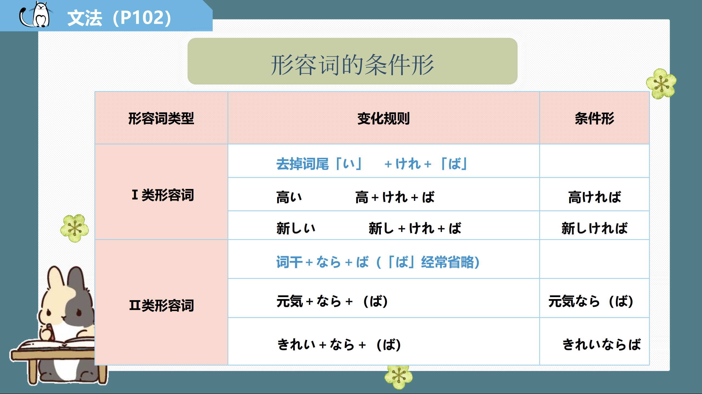

```ts
(1)天気がよければ公園に行きますが、よくなければ行きません。
天气好的话去公园，天气不好的话就不去。
(2)安ければ買いたいと思います。
如果便宜的话，我想买。
(3)静かなら勉強に集中できます。
安静的时候可以专心学习。
(4)作り方が簡単ならば、私も作ろう。
 如果做法简单，我也会做。
```

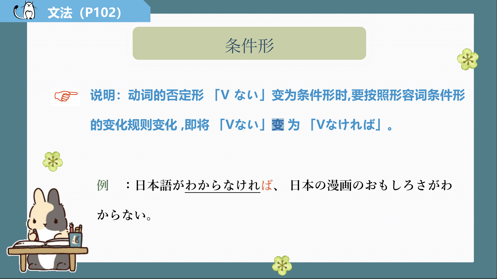
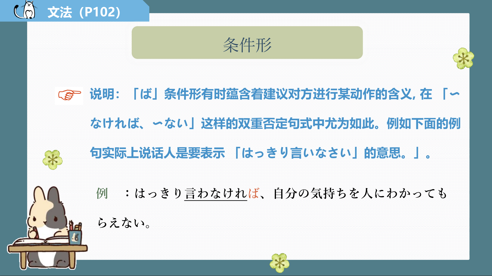

## 練習 れんしゅう

```ts
①每天练习的话，日语会变得更好。
毎日練習すれば、日本語が上手になりますよ。
②如果明天天气好的话就去打网球。
明日、天気がよければテニスをします。
③如果工作早点结束，可以参加酒会。
仕事が早く終われば、飲み会に参加できます。
```

## 会話

<vue-plyr>
  <audio controls crossorigin playsinline loop>
    <source src="../audio/c/4-2-かいわ.mp3" type="audio/mp3" />
  </audio>
 </vue-plyr>
 

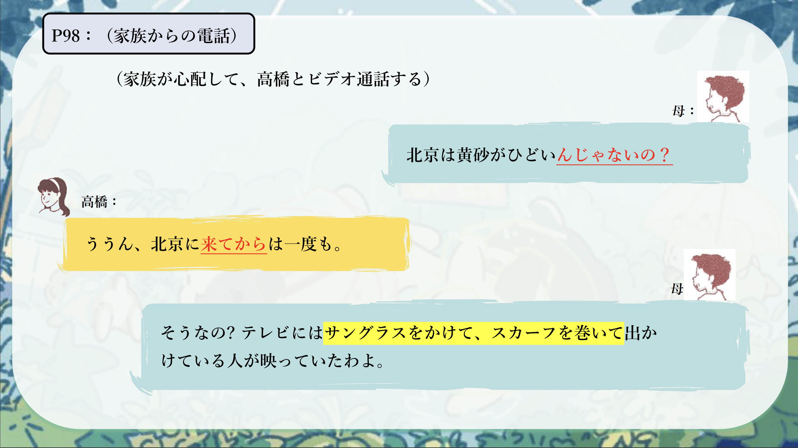
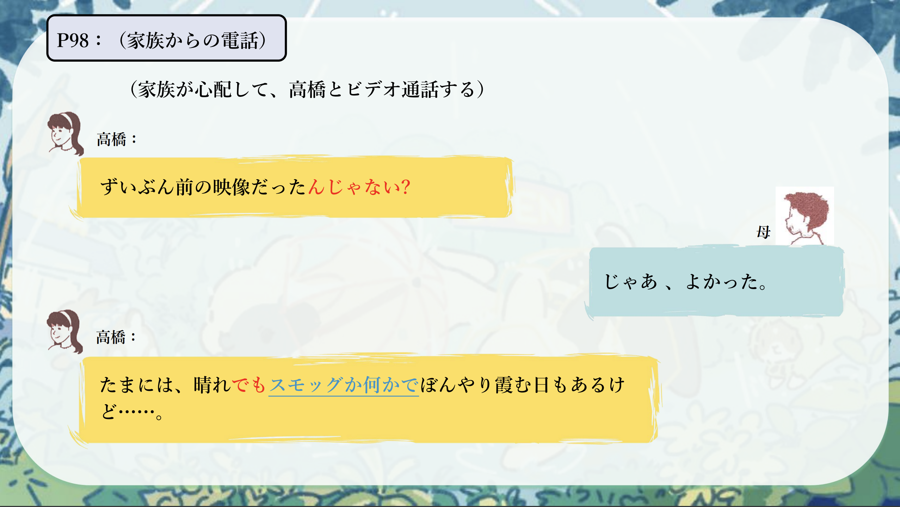
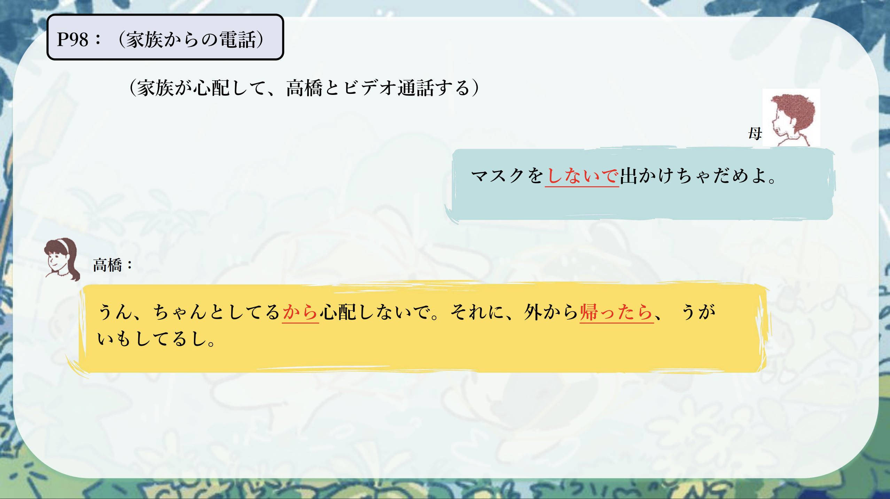
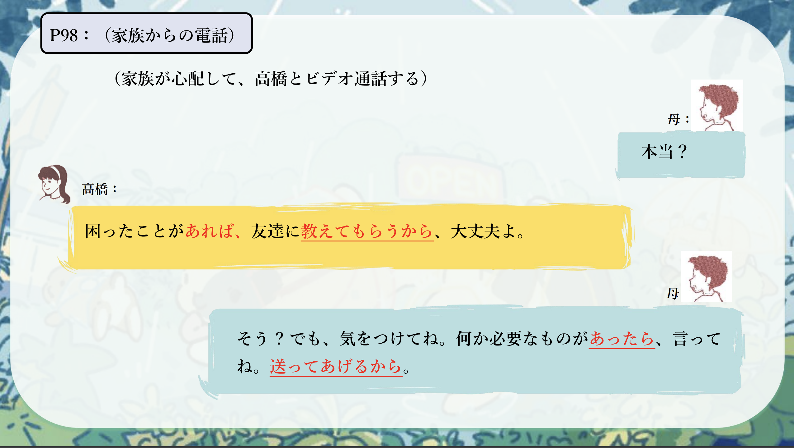
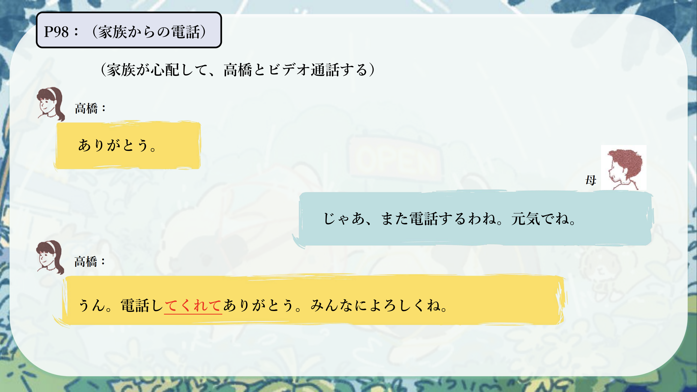
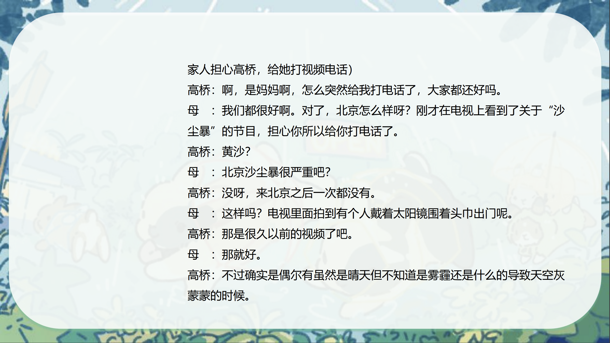
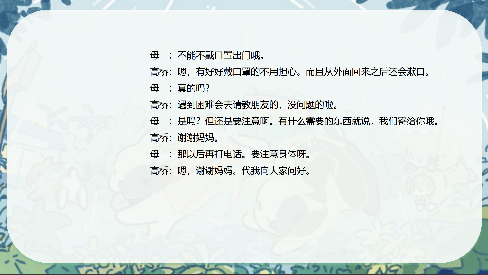
