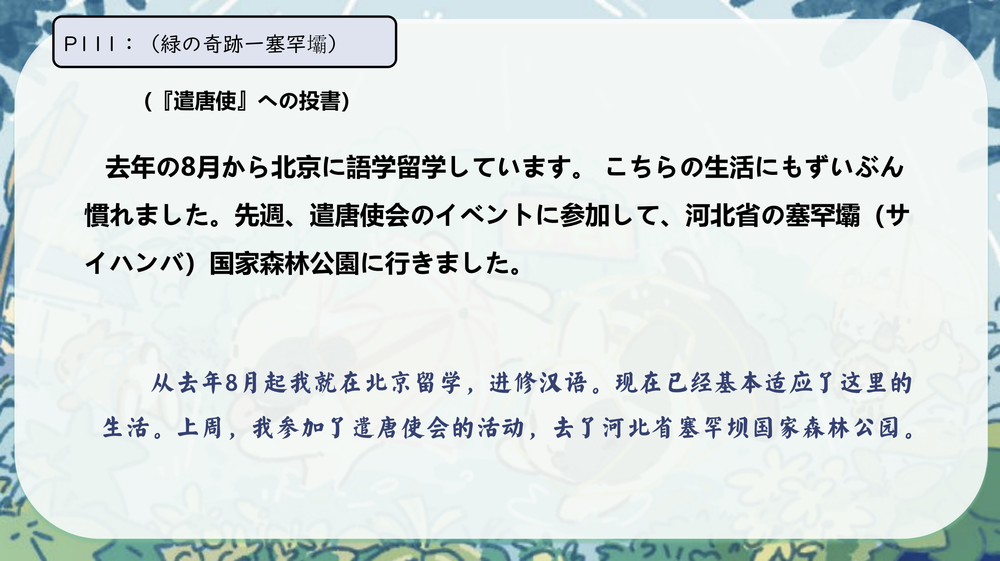
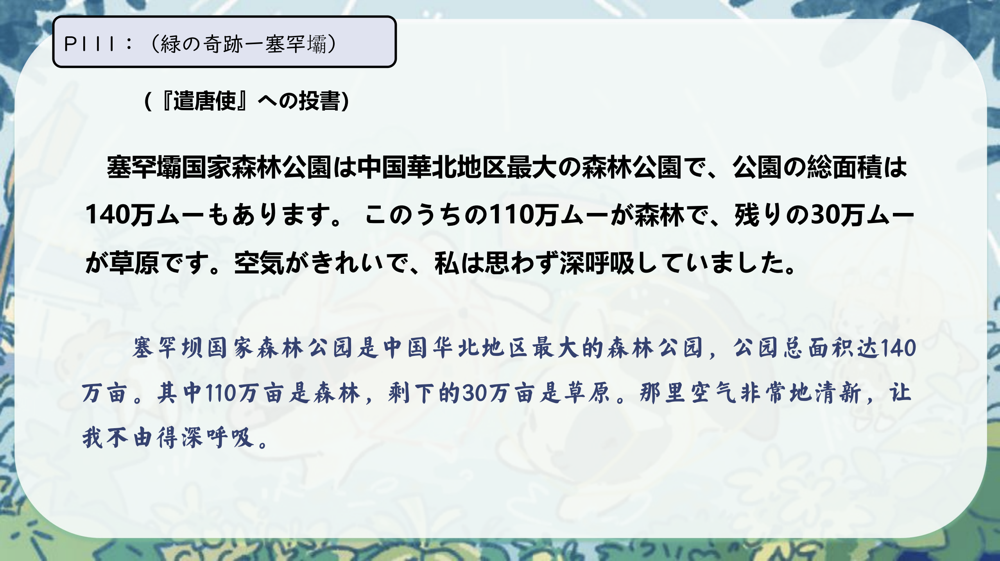
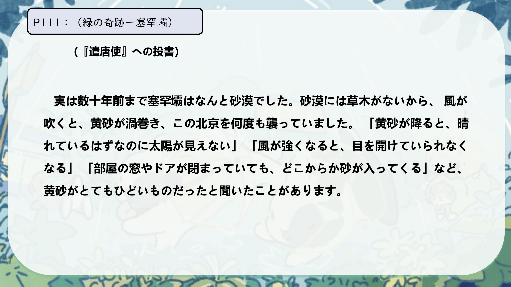
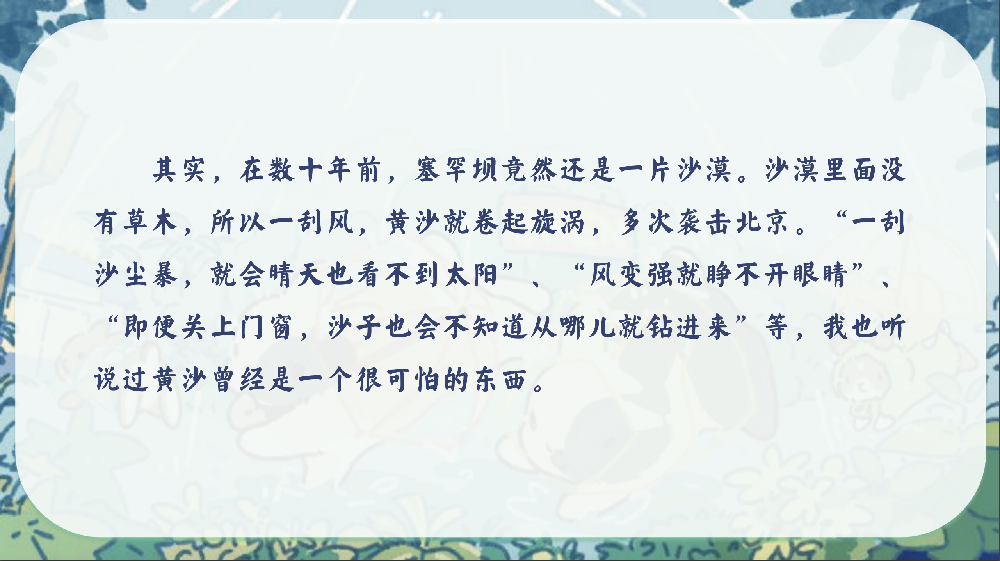
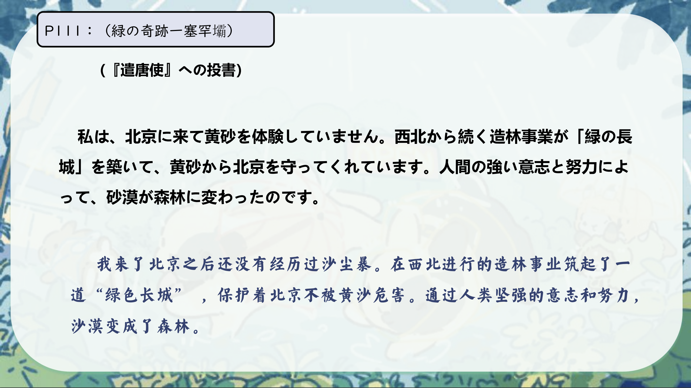
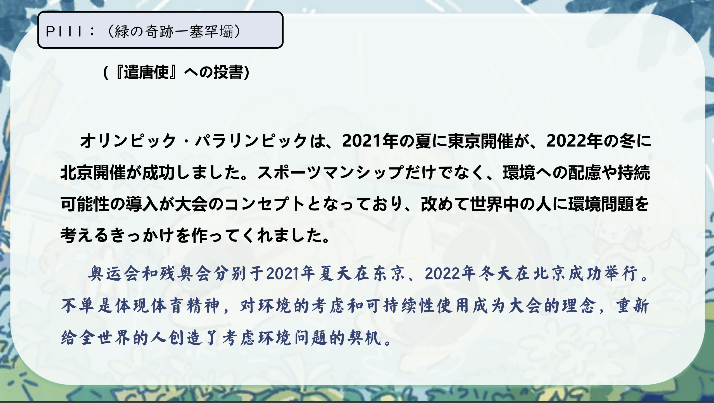
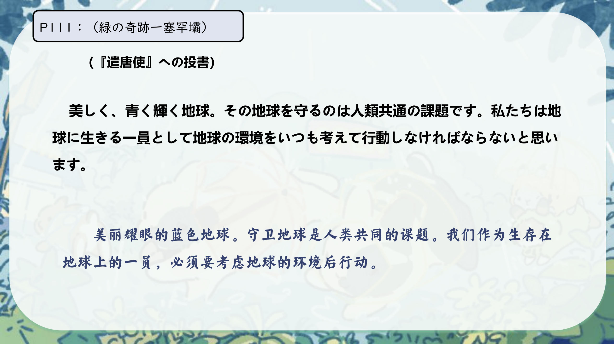

# 〜 のに..

## 新出単語

<vue-plyr>
  <audio controls crossorigin playsinline loop>
    <source src="../audio/c/4-3-たんご.mp3" type="audio/mp3" />
  </audio>
 </vue-plyr>

| 単語                                                 | 词性                | 翻译                                               |
| ---------------------------------------------------- | ------------------- | -------------------------------------------------- |
| <JpWord>みどり</JpWord>）                            | ① ＜名＞            | 绿色                                               |
| 奇跡（<JpWord>きせき</JpWord>）                      | ⓪ ＜名＞            | 奇迹                                               |
| 塞罕壩（<JpWord>サイハンバ</JpWord>）                | ③ ＜固名＞          | （地名）塞罕坝                                     |
| 投書（<JpWord>とうしょ</JpWord>）                    | ⓪ ＜名・自 Ⅲ ＞     | 投稿 ;读者来信                                     |
| 慣れる（<JpWord>なれる</JpWord>）                    | ② ＜自 Ⅱ ＞         | 习惯 ;熟悉                                         |
| <JpWord>イベント</JpWord>（event）                   | ⓪ ＜名＞            | 活动 ;庆典                                         |
| 華北（<JpWord>かほく</JpWord>）                      | ⓪ ＜固名＞          | 华北                                               |
| 地区（<JpWord>ちく</JpWord>）                        | ①② ＜名＞           | 地区                                               |
| 最大（<JpWord>さいだい</JpWord>）                    | ⓪ ＜名＞            | 最大 ;最多                                         |
| 総面積（<JpWord>そうめんせき</JpWord>）              | ③ ＜名 >            | 总面积                                             |
| 総-（<JpWord>そう-</JpWord>）                        | ＜接頭＞            | 总 ;总共                                           |
| 面積（<JpWord>めんせき</JpWord>）                    | ① ＜名＞            | 面积                                               |
| <JpWord>ムー</JpWord>                                | ① ＜固名＞          | 亩                                                 |
| 残り（<JpWord>のこり</JpWord>）                      | ③ ＜名＞            | 残余 ;剩余                                         |
| 空気（<JpWord>くうき</JpWord>）                      | ① ＜名＞            | 空气                                               |
| 思わず（<JpWord>おもわず</JpWord>）                  | ② ＜副＞            | 禁不住;不由自主地                                  |
| 深呼吸（<JpWord>しんこきゅう</JpWord>）              | ③ ＜名・自 Ⅲ ＞     | 深呼吸                                             |
| 呼吸（<JpWord>こきゅう</JpWord>）                    | ⓪ ＜名・自 Ⅲ ＞     | 呼吸                                               |
| 数ー（<JpWord>すうー</JpWord>）                      | ＜接頭＞            | 数 ~ ; 若干 ~                                      |
| <JpWord>なんと</JpWord>                              | ① ＜副•感＞         | （用于感叹）多么〜（啊）；（用于疑问）怎么〜（呢） |
| 草木 （<JpWord>くさき</JpWord>）                     | ② ＜名＞            | 草和树 ;植物                                       |
| 渦巻く （<JpWord>うずまく</JpWord>）                 | ③ ＜自 I ＞         | 漩涡打旋;混乱                                      |
| 襲う （<JpWord>おそう</JpWord>）                     | ⓪② ＜他 I ＞        | 袭击                                               |
| 太陽 （<JpWord>たいよう</JpWord>）                   | ① ＜名＞            | 太阳                                               |
| <JpWord>ドア</JpWord> （door）                       | ① ＜名＞            | 门                                                 |
| 砂 （<JpWord>すな</JpWord>）                         | ⓪ ＜名＞            | 沙子 ;黄砂                                         |
| 西北 （<JpWord>せいほく</JpWord>）                   | ⓪ ＜固名＞          | 西北                                               |
| 造林 （<JpWord>ぞうりん</JpWord>）                   | ⓪ ＜名 • 自他 Ⅲ ＞  | 植树; 造林                                         |
| 渦巻く （<JpWord>うずまく</JpWord>）                 | ③ ＜自 I ＞         | 漩涡打旋;混乱                                      |
| 襲う （<JpWord>おそう</JpWord>）                     | ⓪② ＜他 I ＞        | 袭击                                               |
| 太陽 （<JpWord>たいよう</JpWord>）                   | ① ＜名＞            | 太阳                                               |
| <JpWord>ドア</JpWord> （door）                       | ① ＜名＞            | 门                                                 |
| 砂 （<JpWord>すな</JpWord>）                         | ⓪ ＜名＞            | 沙子 ;黄砂                                         |
| 西北 （<JpWord>せいほく</JpWord>）                   | ⓪ ＜固名＞          | 西北                                               |
| 造林 （<JpWord>ぞうりん</JpWord>）                   | ⓪ ＜名 • 自他 Ⅲ ＞  | 植树; 造林                                         |
| 築く （<JpWord>きずく</JpWord>）                     | ② ＜他 I ＞         | 构筑 ;修建                                         |
| 意志 （<JpWord>いし</JpWord>）                       | ① ＜名＞            | 意志 ;意向                                         |
| <JpWord>パラリンピック</JpWord>（Paralympics）       | ⑤ ＜固名＞          | 残奥会                                             |
| <JpWord>スポーツマンシップ</JpWord>（sportsmanship） | ⑦ ＜名＞            | 运动员精神                                         |
| 配慮 （<JpWord>はいりょ</JpWord>）                   | ① ＜名 •他 Ⅲ ＞     | 考虑;顾虑;关怀                                     |
| 持続可能性 （<JpWord>じぞくかのうせい</JpWord>）     | ⓪ ＜名＞            | 可持续性                                           |
| 持続 （<JpWord>じぞく</JpWord>）                     | ⓪ ＜名 • 自 他 Ⅲ ＞ | 持续                                               |
| 可能 （<JpWord>かのう</JpWord>）                     | ⓪ ＜名＞            | 可能                                               |
| -性（<JpWord>-せい</JpWord>）                        | ＜接尾＞            | 性 ;性质                                           |
| 導入 （<JpWord>どうにゅう</JpWord>）                 | ⓪ ＜名 •他 Ⅲ ＞     | 导入;引用                                          |
| <JpWord>あらためて</JpWord>【改めて】                | ③ ＜副＞            | 重新 ;再                                           |
| 輝く （<JpWord>かがやく</JpWord>）                   | ③ ＜自 Ⅰ ＞         | 放光辉 ;闪耀;辉煌                                  |
| 課題 （<JpWord>かだい</JpWord>）                     | ⓪ ＜名＞            | 课题 ;题目                                         |
| 生きる （<JpWord>いきる</JpWord>）                   | ② ＜自 Ⅱ ＞         | 生存; 生活                                         |
| —員 （<JpWord>いちいん</JpWord>）                    | ⓪ ② ＜名 ＞         | ー员; 一份子                                       |
| 行動 （<JpWord>こうどう</JpWord>）                   | ⓪ ＜名 • 自 Ⅲ ＞    | 行动; 行为                                         |
| 被害 （<JpWord>ひがい</JpWord> ）                    | ① ＜名＞            | 受害; 损失                                         |
| <JpWord>コンセプト</JpWord> （concept）              | ①③ ＜名 ＞          | 理念, 概念;精神                                    |
| 満席 （<JpWord>まんせき</JpWord>）                   | ⓪ ＜名 ＞           | 满员; 无空座位                                     |
| 落ち着く（<JpWord>おちつく</JpWord> ）               | ⓪ ＜自 I ＞         | 镇定; 稳定                                         |
| <JpWord>カルチャーショック</JpWord>（culture shock） | ⑤ ＜名＞            | 文化冲突                                           |
| 体験記 （<JpWord>たいけんき</JpWord>）               | ③ ＜名 ＞           | 体验记                                             |
| 記 （<JpWord>­ き</JpWord>）                         | ＜接尾 ＞           | 记（记叙文 ;记录）                                 |

## 〜のに（转折）

意义：构成转折关系的复句,表示根据从句的内容难以推断出主句叙述的客观事实。  
译文：可是 ;却  
接续：动词、形容词的连体形+ のに名词+ な+のに  
说明：这个句式在会话中使用时,用于表示说话人的意外和不满的语气。

```ts
(1) 晴れているはずなのに太陽が見えない。
明明应该是晴天，却看不见太阳。
(2)こんなに忙しいのに、誰も手伝ってくれない。
明明这么忙，却没有人来帮忙。
(3)上手なのに、どうしてみんなの前で歌わないんですか。
明明唱得很好，为什么不在大家面前唱呢。
(4) 日曜日なのに、仕事ですか。大変ですね。
明明是星期天，你还要上班吗?。真不容易啊。
```

## 〜んじゃない（の）か/〜のではないか（と思う）

> 「のに」有时也可以用于句尾,表示说话人强烈的责怪或感到遗憾的语气

```ts
(1)もう少し早起きれば、電車に間に合ったのに。
如果早一点起床的话，就能赶上电车了。
```

## 練習 れんしゅう

```ts
1.听了那个之后我无法再保持沉默了。
练习⇒それを聞いて、黙っていられない。
2.不知道考试的结果，冷静不下来。
⇒試験の結果が分からなくて、落ち着いていられない。
```

## V ていられない

意义：表示不能继续保持某一状态之意。  
译文：无法一直……; 不能 (保持)……  
说明：「V ていられない」是 「V ている」的能动态的否定形式。

```ts
(1)風が強くなると、目を開けていられなくなる。
风一大，眼睛就睁不开了。
(2)もうすぐ試験があると思うと、ゆっくり寝ていられない。
一想到马上就要考试了，就不能好好睡觉。
(3)困っている人を見ると、黙っていられない。
看到有困难的人，就无法保持沉默。
(4)昨日の映画は怖くて最後まで見ていられなかった。
昨天的电影太恐怖了，没能看完。
```

## 練習 れんしゅう

```ts
1.没有洗脸就睡了。
练习⇒顔を洗わないで、寝た。　
2.没穿大衣就出去了。
⇒コートを着ないで、出かけた。
```

## 会話

<vue-plyr>
  <audio controls crossorigin playsinline loop>
    <source src="../audio/c/4-3-かいわ.mp3" type="audio/mp3" />
  </audio>
 </vue-plyr>
 







