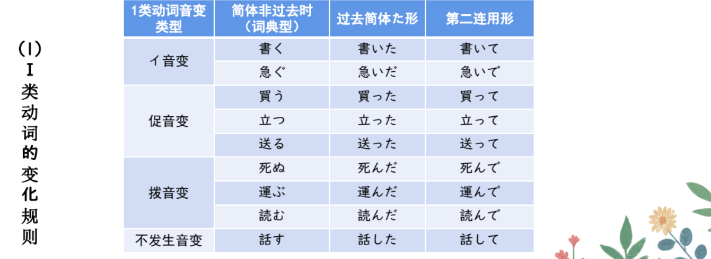
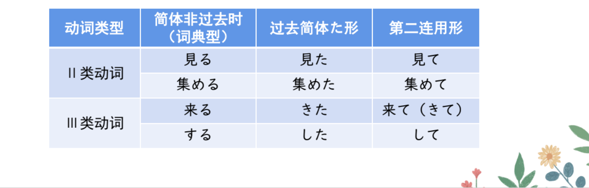
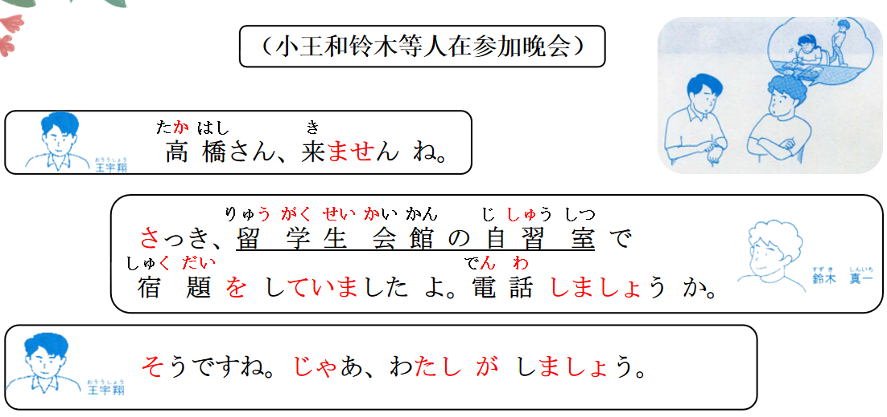

# て、ている、ていたましょ...

## 新出単語
<vue-plyr>
  <audio controls crossorigin playsinline autoplay loop>
    <source src="../audio/8-1-たんご.mp3" type="audio/mp3" />
  </audio>
 </vue-plyr>

## 动词第二连用形<V て形>

> 其变化规则与动词的简体过去时[V た]完全相同。

（1）I 类动词的变化规则



> ☞ 有的教材将「Ｖて」称为动词的“て形”。  
> ☞ 也有个别变化不规则的动词，需要特别注意。例如：**「行く」** 按规则应该发生“イ音变”
> ，但实际上它却发生“促音变”
> ，变为 **「行って」**。

1. 词尾的 う、つ、る　 ⇒ 　促音　＋　て　 ⇒ 　って

```ts
会う ⇒会って
待つ ⇒待って
入る ⇒入って
```

2. 词尾的む、ぶ、ぬ　 ⇒ 　拨音　＋　で　 ⇒ 　んで

```ts
飲む ⇒飲んで
遊ぶ ⇒遊んで
死ぬ ⇒死んで
```

3. 词尾的く　 ⇒ 　い　＋　て　 ⇒ 　いて

```ts
置く ⇒置いて
```

4. 词尾的ぐ　 ⇒ 　い　＋　で　 ⇒ 　いで

```ts
泳ぐ ⇒泳いで
```

> 注意：特殊变形「行く」⇒ 行って

5. 词尾的す　 ⇒ 　し　＋　て　 ⇒ 　して

```ts
返す ⇒ 返して
```

（2）Ⅱ 类动词和 Ⅲ 类动词的变化规则



1. 二类动词：（一段动词）去掉词尾的る + て

```ts
食べる ⇒ 食べて

```

2. 三类动词：カ变动词

```ts
来（く）る ⇒ 来て「きて」
```

3. 三类动词：サ变动词

```ts
勉強「べんきょう」する ⇒ 勉強して

```

## 「Ｖて」的常用用法　　

1. 表示动作的**相继发生**或**句子的并列**  
   ① 家へ帰って、宿題をします。 相继发生（动作的先后顺序）  
   ② お爺さんは山へ行って、お婆さんは川へ行きました。两个句子并列
2. 表示动作进行的**附带状况（保持前面的动作去做后面的事情）**
   ① 眼鏡をかけて本を読みます。  
   ② 手を上げて道路を渡った。
3. 表示**原因理由 　かけて　带着 　 あげて**　  
   ① 風邪を引いて学校を休みました。 かぜをひく ひいて
4. 表示**手段　 走路去公司 あるく　　歩いて会社に行きます。**  
   ① バスに乗って会社に行きます。 バス**で**会社に行きます。名词+で

## V ている（1）＜持续动作＞

意义：表示某一动作正在进行。のむ 水「みず」を飲んでいる：现在正在喝水  
译文：正在......；在......；......呢 飲んでいます  
接续：简体：V ている 敬体：Ｖています 否定：Ｖていない 敬体：ていません  
愛する 愛している 愛してる 口语：Ｖてる  
说明：这里的 V 为动作动词。

```ts
（1）みんな、待っていますよ。どうしたんですか。// 待つ「まつ」 怎么了呢？
（2）李さんは今、図書館で日本語を勉強している。 // 勉強する
（3）高橋さんはお母さんに手紙を書いている。 // 書く 書いて
（4）鈴木：何「なに」をしていますか。 // するーしている
     高橋：インターネットで資料を探しています。 // 探す「さがす」查找
```

## 練習 れんしゅう

```ts
（1）田中正在洗碗。// たなかさん おさらをあらう お皿を洗う
⇒ 田中さんは今 お皿を洗っている・洗っています。
（2）山田现在正在看书。// やまださん ほんをよむ 本を読む
⇒ 山田さん（今） 本を読んでいる・読んでいます。 ている
（3）我现在没有在看书。　　// ている　否定：ていない　敬体：ていません
⇒ 私は（今） 本を読んでいない・読んでいません。
```

## V ていた＜过去持续性动作＞ 敬体：V ていました

意义：表示在过去的某一段时间或时点上的持续动作。 　　
译文：（**过去，刚才，那时**）**在**......；......来着 　　
接续：**简体：V ていた 敬体：Ｖていました　　否定：Ｖていなかった** 　 　
说明：这里的 V 也是动作动词。 **敬体：Ｖていませんでした**

```ts
（1）（高橋さんは）さっき、留学生会館の自習室で宿題を**していました**よ。
   **高桥，刚刚正在留学生会馆的自习室里写作业。**
（2）午前中は図書館で勉強していました。
   上午这一段时间我正在图书馆里学习。
（3）８時から１０時まではテレビを見ていた。 見るーみて。
   8点钟到10点我正在看电视。
（4）午後の３時ごろ、インターネットで資料を調べていた。// 調べる
   下午三点钟左右，我正在通过互联网查找资料。
```

## 練習 れんしゅう

```ts
（1）小王昨天下午（正）在朋友家唱歌。 // 唱歌：歌う「うたう」 うたって
⇒ おうさんは、きのうのごご ともだちのいえで歌っていた・歌っていました。
（2）小李昨天晚上在房间写作业。// 宿題をする 夕べ「ゆうべ」 昨夜「さくや」
⇒ 夕べ李さんは部屋で宿題をしていた・していました。
（3）小李昨天晚上没有在看电视。//テレビをみる　　ている　ていなかった
　りさんは昨夜テレビを見ていなかった。
```

## V ましょう/V ましょうか＜意志、征求同意＞

意义：「Ｖましょう」在这里表示说话人（我）要进行某一动作的意志；  
「Ｖましょうか」除了表示说话人的意志以外，还含有征求对方同意的语气。  
译文：......吧 私がしましょう。するーしましょう。  
接续：动词第一连用形+ましょう／ましょうか 荷物を持ちましょうか。  
说明：这里的 V 也是动作动词。

```ts
（1）鈴木：電話しましょうか。
    要我来打一个电话吗？
    王 ：そうですね。じゃあ、私がしましょう。
    确实应该打一个电话了，那我来打吧。

（2）手伝いましょうか。 // 手伝う：てつだう
    需要我来帮您嘛？
    すみません。 お願いします。
    不好意思，那就拜托你了。
（3）案内しましょうか。// あんないする：案内する
   　需要我来为您带路吗？
   　いいえ、けっこうです。
   　不，不用了。
（４）趙 ：今日は私が料理を作りましょう。// 作るー作り
     今天让我来做饭吧。
     高橋：そうですか。ありがとう。
     这样呀，那就谢谢你了。

```

##  **总结：**  
① **V ましょう、V ましょうか、V ませんか ＜建议＞ 双方 一起做、、**

1. 直接建议：V ましょう（一起、、吧）
2. 比较委婉：V ましょうか（一起、、吗？）
3. 最委婉：V ませんか（不一起、、吗？） Ｖ第一连用形（ます去ます）

**② V ませんか＜建议＞ 单方“你”** 你不做、、吗？ 王さんは休みませんか。  
**③ V ましょう、V ましょうか ＜意志＞ 单方“我”** 我来做、、吧 要我做什么吗？

> 「Ｖましょう／Ｖましょうか」表达说话人意志的用法仅限于第一人称句。  
> 「Ｖましょう／Ｖましょうか」还可以表示建议（见第 7 课第 1 单元）。

## 精読の教文

<vue-plyr>
  <audio controls crossorigin playsinline autoplay loop>
    <source src="../audio/8-1-1.mp3" type="audio/mp3" />
  </audio>
 </vue-plyr>


