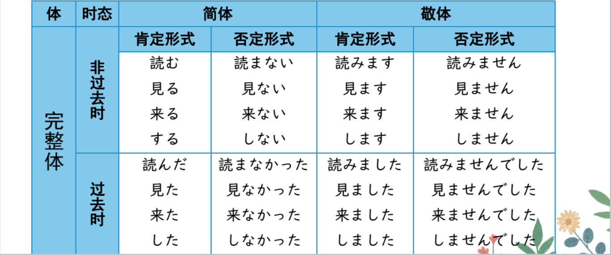
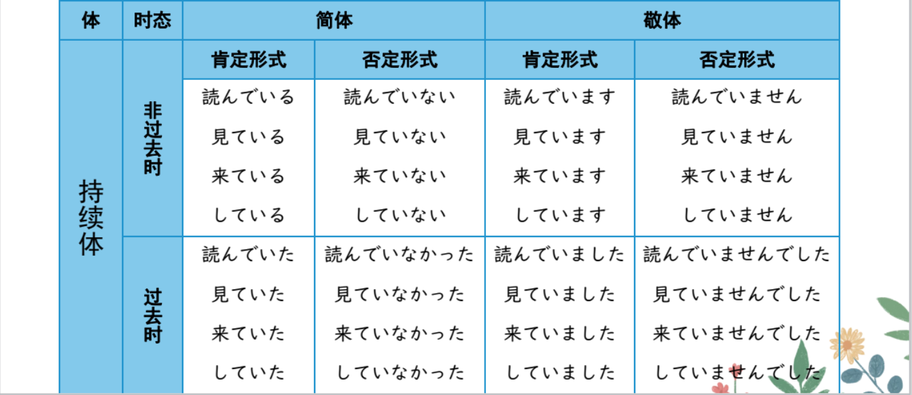
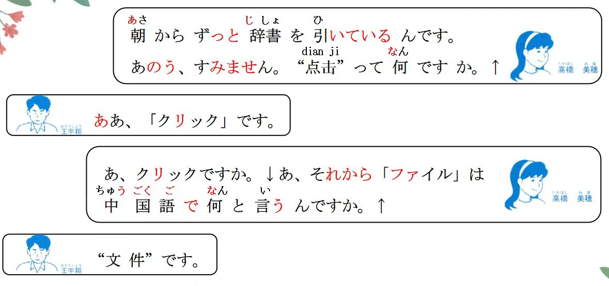
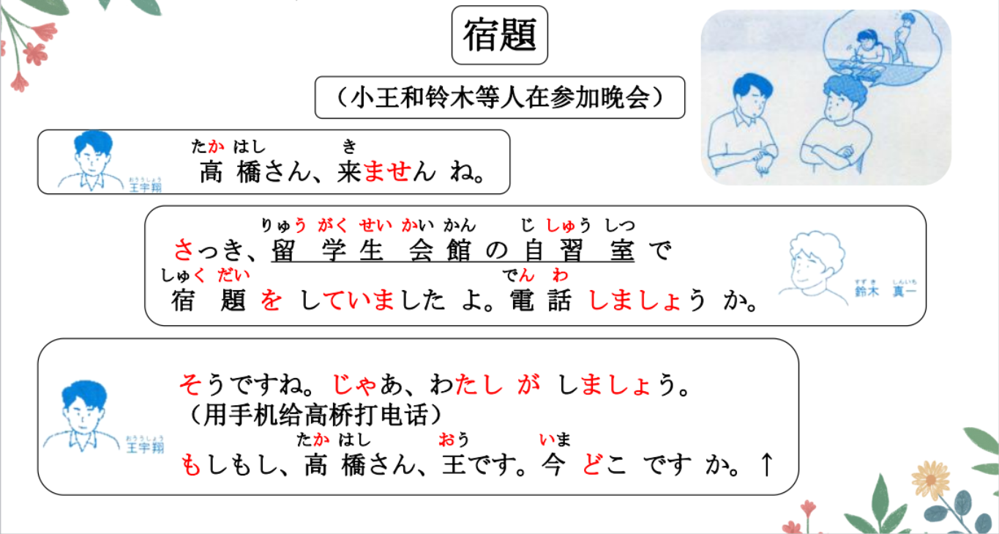
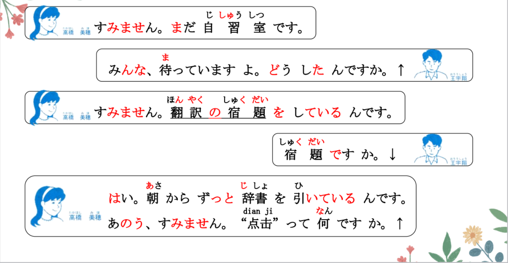
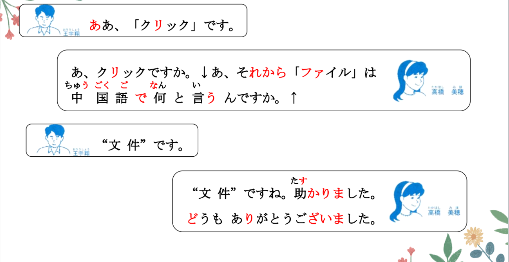
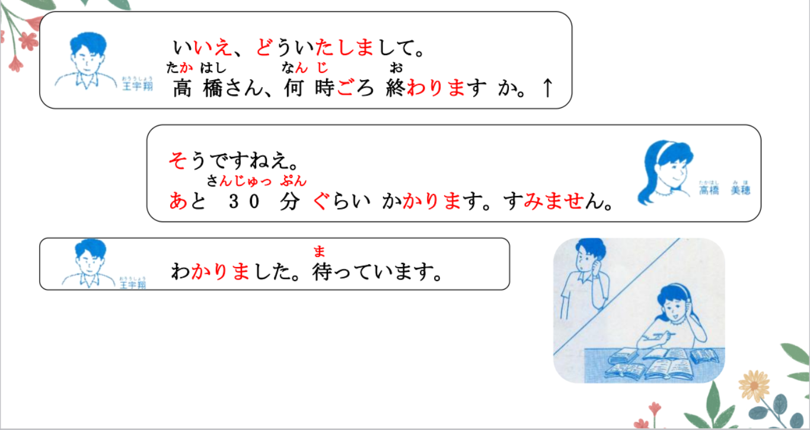
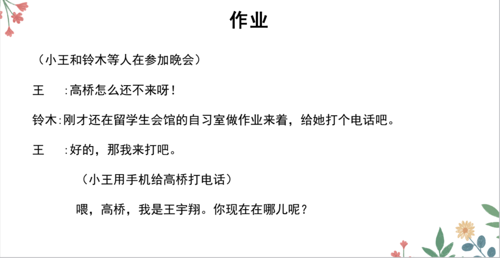
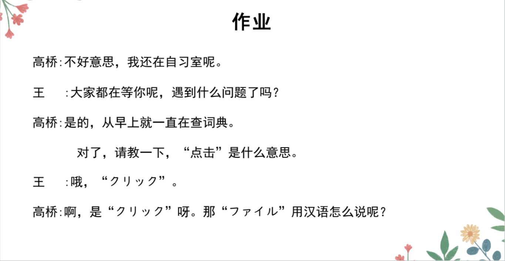
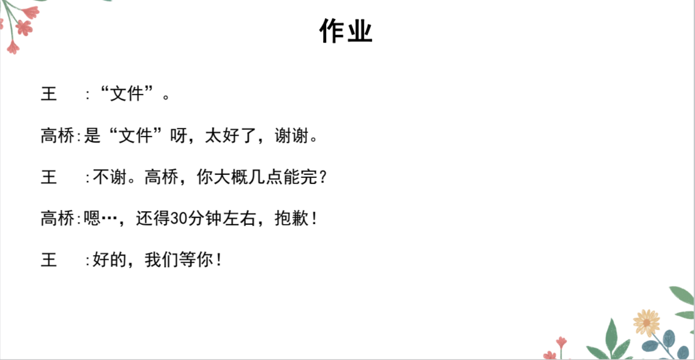

# って、と、V ている、かいわ

## 新出単語

<vue-plyr>
  <audio controls crossorigin playsinline loop>
    <source src="../audio/8-2-たんご.mp3" type="audio/mp3" />
  </audio>
 </vue-plyr>

| 単語                                            | 词性                     | 翻译                                              |
| ----------------------------------------------- | ------------------------ | ------------------------------------------------- |
| <JpWord>オンライン決済</JpWord>on-line けっさい | ⑥<名>:在线支付           |
| 決済<JpWord>けっさい</JpWord>                   | ①<名·他 Ⅲ>               | 支付；结算；决算                                  |
| 夕食<JpWord>ゆうしょく</JpWord>                 | ⓪<名>                    | 晚饭；晚餐 晩ご飯「ばんごはん」                   |
| もう                                            | ①<副>                    | 已经 もう終わった。                               |
| 銀行口座<JpWord>ぎんこうこうざ</JpWord>         | ⑤<名>                    | 银行账户                                          |
| 口座<JpWord>こうざ</JpWord>                     | ⓪<名>                    | 账户                                              |
| 開く<JpWord>ひらく</JpWord>                     | ②<他 Ⅰ>                  | 打开；开设；开(幕，会)                            |
| 窓「まど」                                      | を開く                   | 会議を開く 召开                                   |
| マイページ<JpWord>和制英语 my-pape</JpWord>     | ③<名>                    | 个人主页                                          |
| マイ-<JpWord>my</JpWord>                        | <接頭>                   | 个人的；私人的；专属的 我的                       |
| ページ<JpWord>page</JpWord>                     | ⓪<名>                    | :页；页码　 　                                    |
| 押す<JpWord>おす</JpWord>                       | ⓪<他 Ⅰ>                  | 推；压；按 ドアを押す ドアを引く「ひく」          |
| カード<JpWord>card</JpWord>                     | ①<名>                    | 卡；卡片 銀行カード                               |
| 選ぶ<JpWord>えらぶ</JpWord>                     | ②<他 Ⅰ>                  | 选择；选；挑选 商品「しょうひん」を選ぶ           |
| 入力<JpWord>にゅうりょく</JpWord>               | ⓪<名·他 Ⅲ>               | 输入 入力中「にゅうりょくちゅう」                 |
| 詳しい<JpWord>くわしい</JpWord>                 | ③<形 Ⅰ>:详细；熟悉；精通 |
| カート<JpWord>cart</JpWord>                     | ①<名>                    | 购物车；手推车 商品を選んで、                     |
| 入れる<JpWord>いれる</JpWord>                   | ⓪<他 Ⅱ>                  | 放入；输入 商品を カートに いれる。               |
| タップ<JpWord>tap</JpWord>                      | ①<名·他 Ⅲ>               | 轻叩；轻轻点击 入る「はいる」进入 自              |
| ボタン<JpWord>button</JpWord>                   | ⓪<名>                    | 按钮；按键；纽扣 ボタンを押す                     |
| 次に<JpWord>つぎに</JpWord>                     | ②<副>                    | 然后；接着；其次；下一个；第二次 首先：まず       |
| 住所<JpWord>じゅうしょ</JpWord>                 | ①<名>                    | 住址                                              |
| 電話番号<JpWord>でんわばんごう</JpWord>         | ④<名>                    | 电话号码                                          |
| 番号<JpWord>ばんごう</JpWord>                   | ③<名>                    | 号码；顺序 宿題はよくできました。                 |
| 暗証番号<JpWord>あんしょうばんごう</JpWord>     | ⑤<名>                    | 密码 完成得很棒，很好。                           |
| 暗証<JpWord>あんしょう</JpWord>                 | ⓪<名>                    | 用于密码的数字或文字                              |
| できる                                          | ②<自 Ⅱ>                  | 产生；出现；完成；能够；构成 する 做              |
| 中国通<JpWord>ちゅうごくつう</JpWord>           | ⓪<名>                    | 中国通                                            |
| -通<JpWord>-つう</JpWord>                       | <接尾>:......通；        | 熟知......的人                                    |
| 電気がつく<JpWord>でんきが-つく</JpWord>        | ①-①                      | 开着灯；灯亮着                                    |
| 電気                                            | ①<名>                    | 电灯 エアコン:空调 ドア：门 冷蔵庫：冰箱 窓：窗户 |
| つく                                            | ①<自 Ⅰ>                  | 电器开着；电源接通 あく ⓪<自 Ⅰ>： 开敞开          |
| つける                                          | ②<他 Ⅱ>                  | 把电器的电源打开 あける ⓪<他 Ⅱ>：把、、打开       |
| 決める<JpWord>きめる</JpWord>                   | ⓪<他 Ⅱ>                  | 决定                                              |
| 計画<JpWord>けいかく</JpWord>                   | ⓪<名·他 Ⅲ>               | 计划                                              |
| 今朝<JpWord>けさ</JpWord>                       | ①<名>                    | 今天早晨                                          |
| ふた『蓋』                                      | ⓪<名>                    | 盖子                                              |
| お湯<JpWord>おゆ</JpWord>                       | ⓪<名>                    | 热水                                              |
| お風呂<JpWord>おふろ</JpWord>                   | ②<名>                    | :洗澡；澡堂                                       |
| 飲み物<JpWord>のみもの</JpWord>                 | ②<名>                    | 饮料；饮品                                        |
| 取る<JpWord>とる</JpWord>                       | ①<他 Ⅰ>                  | 拿；取；领                                        |
| お金<JpWord>おかね</JpWord>                     | ⓪<名>                    | 钱                                                |
| コピー機<JpWord>コピーき</JpWord>               | ②<名>                    | 复印机                                            |
| コピー<JpWord>copy</JpWord>                     | ①<名·他 Ⅲ>               | 复印；复制品                                      |
| 置く<JpWord>おく</JpWord>                       | ⓪<他 Ⅰ>                  | 放；放置                                          |
| 枚数<JpWord>まいすう</JpWord>                   | ③<名>                    | 纸、衣服、CD 等的张数；件数                       |
| スキャン<JpWord>scan</JpWord>                   | ②<名·他 Ⅲ>               | 扫描                                              |
| 金額<JpWord>きんがく</JpWord>                   | ⓪<名>                    | 金额                                              |
| 考える<JpWord>かんがえる</JpWord>               | ③<他 Ⅱ>                  | 想；思考；思索                                    |

## って＜话题＞

意义：用于提出话题。 は　　
接续：名词+って （、、的话）　　
说明：在口语中使用。 って更加特指前面这个名词。

```ts
(1) “点击”って何「なん」ですか。
   “点击”是什么呢？
(2) 鈴木さんってどんな人ですか。
   鈴木さんはどんな人ですか。
(3) ファイルって“文件”ですか。
   "ファイル"是指"文件"吗？
(4) 北京ダックっておいしいですね。
   北京烤鸭很好吃呢~
```

## と＜复习＞

```ts
(1) 家族は三人です。両親と私です。 完全列举“..和..”
(2) 私は王さんと同じクラスです。 比较的基准，
“和..一样”
(3) 王さんは高橋さんと結婚する。 双方 相互动作的对象
私は母に手紙を書く。　 　　　 　单方向的动作作用对象　
(4) 私は王さんと一緒に映画を見に行く。 同一动作的参与者
```

## と＜引用＞

意义：表示引用（直接引语）或提示内容。 と的前面是引用的内容  
说明：书写时，所引用的内容大多用引号表示。と言う：说；叫；叫做

> 老师说：“今天好热啊！”。  
> 先生は「今日は暑いね」と言う。

```ts
(1) 高橋：「ファイル」は中国語で何「なん」と言うんですか。
王 ：“文件”です。
「ファイル」用中文是叫做什么的？
(2) 王 ：“手机”は日本語で何と言いますか。
“手机”用日语怎么说？
高橋：「携帯電話」と言います。 叫做「けいだいでんわ」。申す「もうす」
(3) 王と申します。どうぞよろしくお願いします。申します是言います的敬语
```

## 練習 れんしゅう

```ts
(1) 王：“逃学”用日语叫做什么？
⇒ “逃学”は・って日本語で何「なん」と言いますか
   高桥： 是サボる。 叫做サボる。逃学：サボる
⇒ 「サボる」です。「サボる」と言います。　
```

## 动词的体

体：是通过词形的变化表示运动（动作、变化、状态）处于何种状态的语法范  
畴。日语的体由完整体和持续体构成，完整体表示完整的动作、变化、状态，  
持续体则表示动作、状态的持续以及动作的结果或变化结果的持续。

> 在做、、 Ｖている

持续体的表达方式：

> 「Ｖている／Ｖていない、Ｖていた／Ｖていなかった；
> Ｖています／Ｖていません、Ｖていました／Ｖていませんでした」，即在
> 「Ｖて」后面接「いる／いない、いた／いなかった；います／いません、い
> ました／いませんでした」。

☞ 日语动词的体与其他语法范畴的关系可以归纳如下

> （以动词「読む」よむ「見る」みる「来る」くる「する」为例）：



☞ 日语动词的体与其他语法范畴的关系可以归纳如下

> （以动词「読む」「見る」「来る」「する」为例）：在做



## 精読の教文

<vue-plyr>
  <audio controls crossorigin playsinline loop>
    <source src="../audio/8-1-2.mp3" type="audio/mp3" />
  </audio>
 </vue-plyr>



## 会話

<vue-plyr>
  <audio controls crossorigin playsinline loop>
    <source src="../audio/8-1-かいわ.mp3" type="audio/mp3" />
  </audio>
 </vue-plyr>








