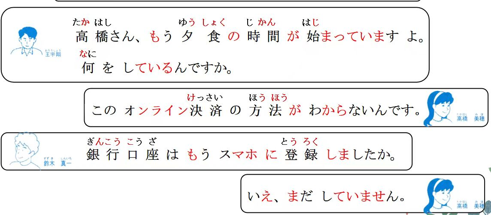
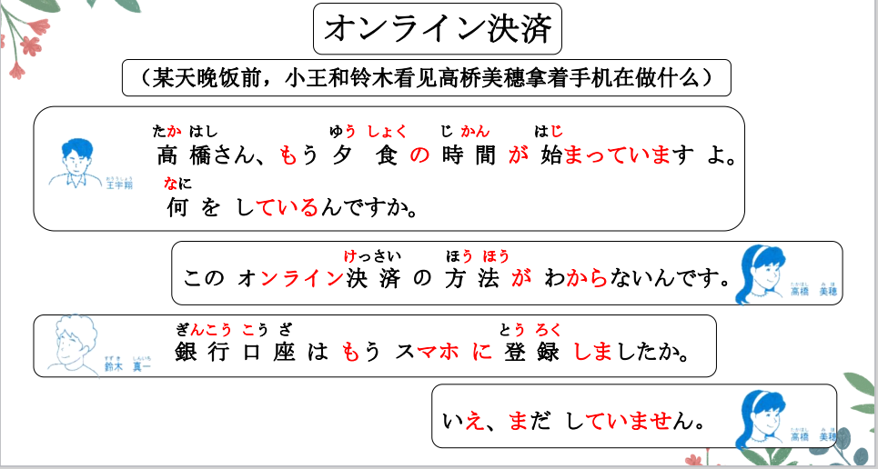
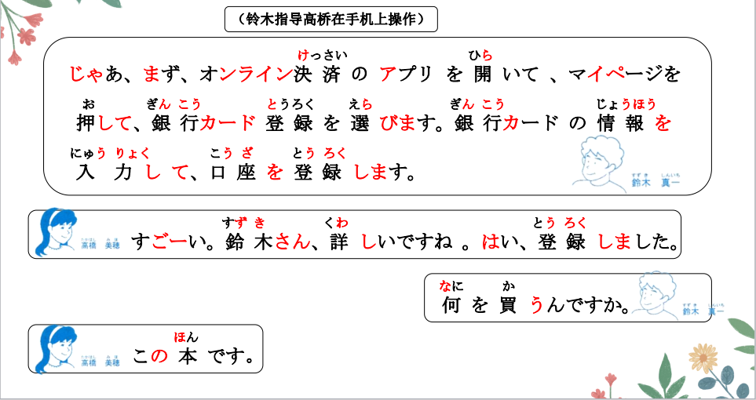
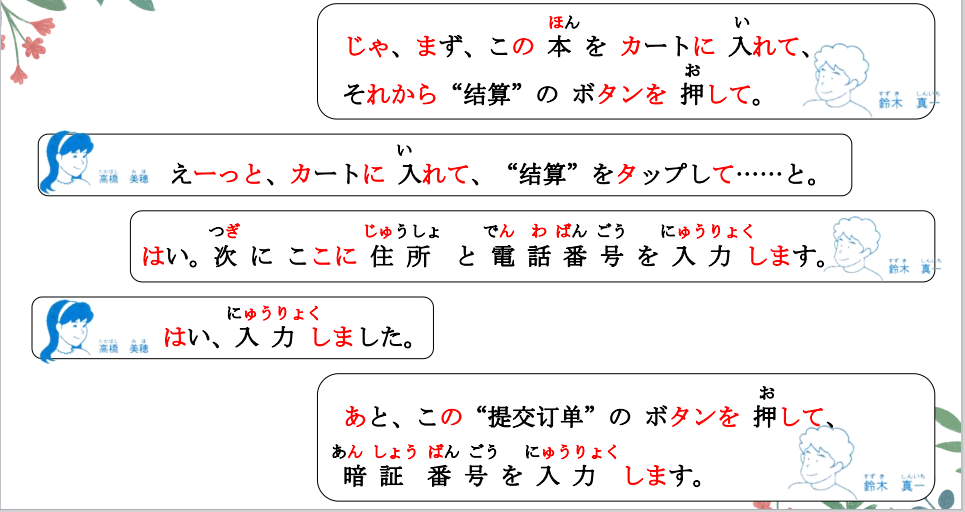
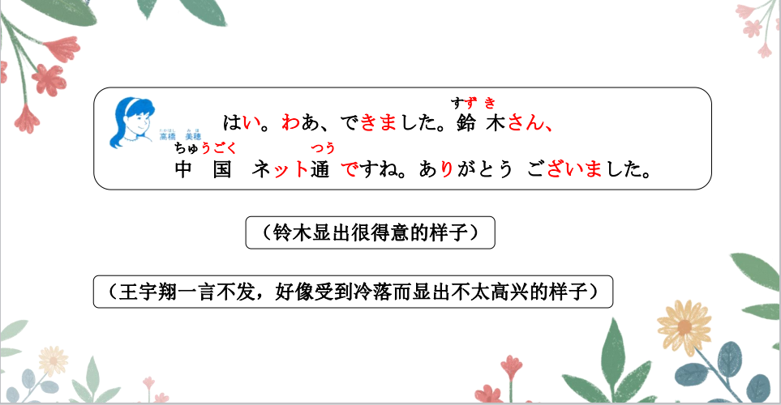
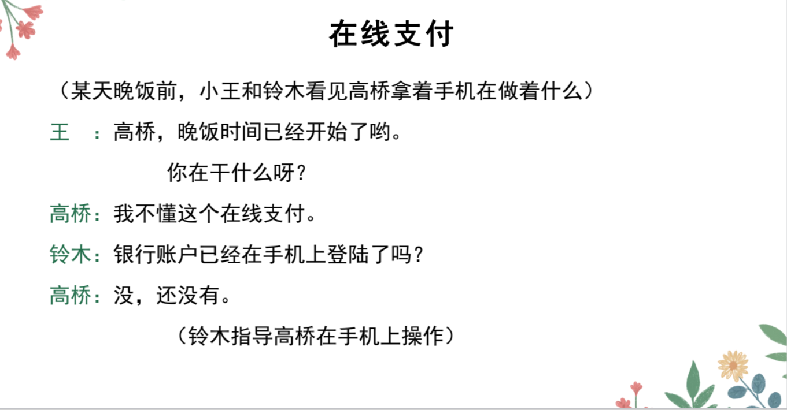
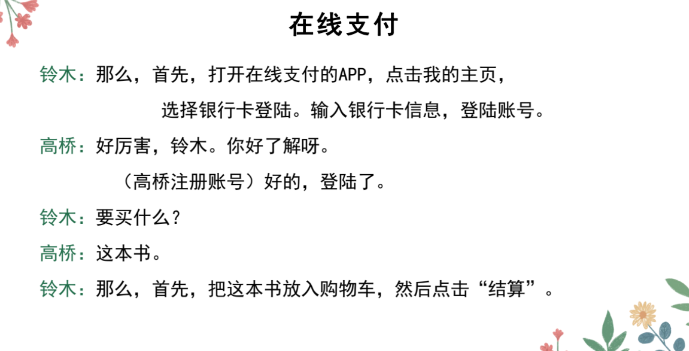
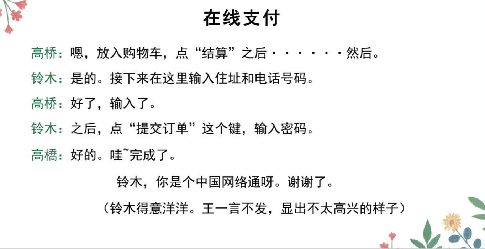

# ている、がる、もうた、まだ..

## 新出単語


## V ている＜结果状态的持续＞

意义：表示变化结果的状态。  
译文：......了；......着  
接续：V て+いる  
说明：这里的 V 为变化动词

```ts
（1）もう夕食の時間が始まっていますよ。
   晚饭的时间已经开始了哦！
（2）もう外は暗くなっている。// 暗い「くらい」 なる
  外面已经天黑了。
（3）兄は日本に行っている。
    哥哥去了日本。现在还在日本。
（4）高橋さんはもう来ていますよ。
  高桥已经来了。（并且人还在）
```

> 「Ｖています」还可以表示单纯的状态。

```ts
(5) このページは画面が二つにわかれている。
这页的画面分成了两半。
(6) 私は高橋さんを知っています。しる
我认识高桥。 しります。 知っている。
(7) あの店はいつも混んでいる。こむ
那个店一直很拥挤。
```

## 練習 れんしゅう

```ts
（1）房间的门开着。 へやのドアが開く あく 開く「ひらく」
⇒ 部屋はドアが開いている・開いています。
（2）高桥和小王结婚了。// （现在还没离婚）　けっこんする
⇒ 高橋さんは王さんと結婚している・しています。 相互作用的对象
　　高橋さんと王さんは結婚している。　完全例举
 高桥结婚了，小王结婚了。 高桥和小王他俩结婚了。
```

## N がわかる＜理解＞ // 知る：知道;认知

意义：表示对人或事物的了解，人或事物一般用「が」表示。  
译文：明白；了解；懂 が：对象 日本語が分かる。 日本語を知っている

```ts
（1）このオンライン決済がわからないんです。这个线上支付我不懂。
（2）この漢字の意味がわかりますか。 // 意味「いみ」意思
①我懂：分かる・わかります。 ②我不懂：分からない・分かりません
③我懂了：分かった・分かりました。④我之前还真不懂：分からなかった
（3）あの人はフランス語がわかる。 那个人懂法语。
```

## 練習 れんしゅう

```ts
（1）小李懂英语，但是小王不懂。 えいごがわかる
⇒ 李さんは英語がわかるが、王さんはわからない。
李さんは英語がわかりますが、王さんはわかりません。
（2）铃木你懂这个语法吗？ // 文法：ぶんぽう
⇒ 鈴木さんはこの文法がわかりますか。
　　分かっている・分かっています。我一直都是懂的。　
```

## 「もう」+V た＜已完成＞

意义：表示该动作已经完成。
译文：已经......了  
接续：副词「もう」+V た

```ts
（1）銀行口座はもうスマホに登録しましたか。
 银行账号已经注册到手机上了嘛？ // に：附着点
（2）そのことはもうお母さんに話しましたか。
 那一件事情已经跟妈妈说过了嘛? // に：单方的对象
（3）王さんはもう帰った。
 小王已经回去了。 //もう帰っている
```

## 練習 れんしゅう

```ts
（1）飞机已经到日本了。// ひこうき 到达：着く「つく」
⇒ 飛行機はもう日本に着いた・着きました。　　着いている。　　　
（2）吃过饭了吗？
⇒ ご飯はもう食べましたか。
    ①已经吃过了。 ⇒ 　もう食べた・食べました。　
    ②还没吃。 ⇒ まだ食べていない・食べていません。
```

## まだＶていない＜未完成＞

意义：表示预计或应该进行的动作尚未进行。  
译文：还没......；尚未...... 只是现在还没有做，，（等下就去,,)  
接续：副词「まだ」+V ていない 昨日学校に行かなかった。之前没有，，  
说明：可以用作对「もう V たか」这一问句的否定性回答，意为将来有可能进行该动作。

```ts
（1）鈴木：銀行口座はもうスマホに登録しましたか。
⇒ 高橋：いえ、まだしていません。 现在还没有。
（2）鈴木：王さんはもう来ましたか。
⇒ 高橋：いいえ、まだ来ていません。还没有来。 （等下就到）
（3）朝からまだ何も食べていない。 从早上开始还什么都没吃。
```

## 練習 れんしゅう

```ts
（1）作业 还没有做。但是，饭已经吃过了。
⇒ 宿題はまだしていない。でも、ご飯はもう食べた。
宿題はまだしていません。でも、ご飯はもう食べした。
宿題はまだしていませんが、ご飯はもう食べした。
（2）作业 还没交。晚上八点前交。
⇒ しゅくだいはまだ出していない。夜八時までに出す。
しゅくだいはまだ出していません。夜八時までに出します。

```

## V1 て、V2 て、V3 ＜连续动作＞ 动词的第二连用形

意义：表示连续进行的几个动作在时间上的先后顺序。  
译文：（先）......之后，...... 最后一个动词要体现简敬体，时态  
接续：两个以上的「V て」连用 朝起きて、会社に行く。 V て（ください）

```ts
（1）まず、オンライン決済のアプリを開いて、マイページを押して、
銀行カード登録を選びます。 // APP ひらく
（2）朝起きて、運動をして、食事をして、会社へ行く。 // しょくじをする
（3）昨日の休みに、友達と一緒に町へ行って、買い物をして、映画を見た。
```

## 練習 れんしゅう

```ts
（1）昨天 我是先回家，再泡澡，最后睡了觉。 泡澡：お風呂に入る 風呂「ふろ」
⇒ 昨日、（私は）家に帰って、お風呂に入って、寝た・寝ました。
（2）出家门，坐公交，到公司，开始工作。 が始まる自 を始める他
⇒ 家を出て、バスに乗って、会社に着いて、仕事を始める・始めます。
出る「でる」 乗る「のる」 着く「つく」 始める「はじまる」
を出る「でる」：出去；离开 を出す「だす」：提交；拿出
```

## 精読の教文




## 会話









