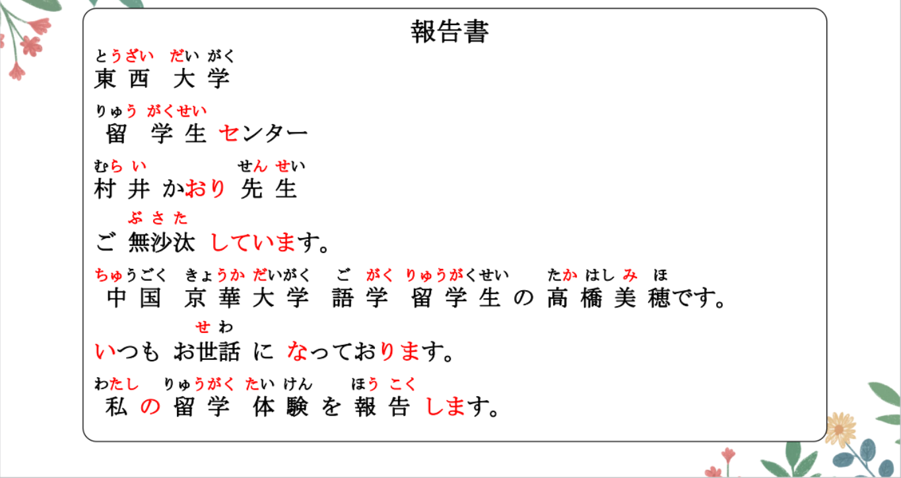
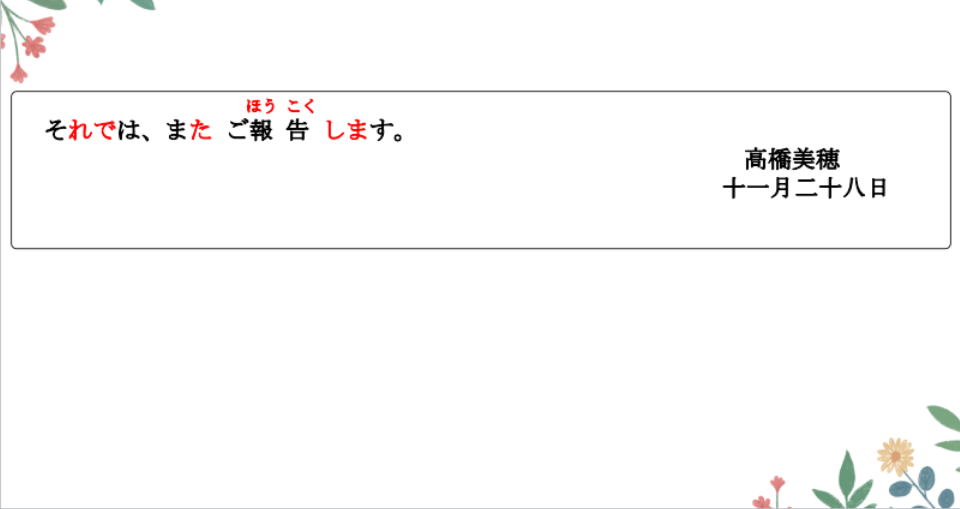

# ているN1でn2がある、Ｖて

## 新出単語

<vue-plyr>
  <audio controls crossorigin playsinline loop>
    <source src="../audio/8-3-たんご.mp3" type="audio/mp3" />
  </audio>
 </vue-plyr>


| 単語                                                                      | 词性            | 翻译                                         |
| ------------------------------------------------------------------------- | --------------- | -------------------------------------------- |
| ご無 ▼ 沙 ▼ 汰<JpWord>ごぶさた</JpWord>                                   | ⓪<名・自 Ⅲ>     | 久疏问候；久违                               |
| いつもお世話になっております<JpWord>いつもおせわになっております</JpWord> |
| 素日承蒙您的关照。 好久不见 久しぶり「ひさしぶり」                        |                 | お世話になる                                 |
| 体験<JpWord>たいけん</JpWord>                                             | ⓪<名・他 Ⅲ>     | 体验                                         |
| 報告<JpWord>ほうこく</JpWord>                                             | ⓪<名・他 Ⅲ>     | 报告；汇报 報告書「～しょ」                  |
| 経つ<JpWord>たつ</JpWord>                                                 | ①<自 Ⅰ>         | 经过<JpWord>时间的流逝</JpWord> 十年経った。 |
| 各地<JpWord>かくち</JpWord>                                               | ①<名>           | 各地；各处；到处                             |
| 充実<JpWord>じゅうじつ</JpWord>                                           | ⓪<自 Ⅲ>         | 充实 充実する                                |
| 国々<JpWord>くにぐに</JpWord>                                             | ② ＜名＞        | 各国                                         |
| 大多数<JpWord>だいたすう</JpWord>                                         | ③④<名>          | 大多数                                       |
| 住む<JpWord>すむ</JpWord>                                                 | ①<自 Ⅰ>         | 居住 長沙「ちょうさ」に住んでいる 长期定居   |
| 二人部屋<JpWord>ふたりべや</JpWord>                                       | ⓪<名>           | 两个人住的房间；双人间                       |
| 二人<JpWord>ふたり</JpWord>                                               | ③ ＜名＞        | 两个人；双人 部屋「へや」                    |
| roommate <JpWord> ルームメイト</JpWord>                                   | ④<名>           | 室友；同一寝室的人                           |
| room<JpWord>ルーム</JpWord>                                               | ① ＜名＞        | 房间 クラスメート：同班同学                  |
| 予習<JpWord>よしゅう</JpWord>                                             | ⓪ ＜名・他 Ⅲ ＞ | 预习 復習「ふくしゅう」                      |
| 空き時間<JpWord>あきじかん</JpWord>                                       | ③<名>           | 空闲时间；空余时间 空く「あく」              |
| bench<JpWord>ベンチ</JpWord>                                              | ①<自 Ⅰ>         | 长椅 椅子「いす」                            |
| 座る<JpWord>すわる</JpWord>                                               | ⓪<自 Ⅰ>         | 坐 ベンチに座る                              |
| 毎週<JpWord>まいしゅう</JpWord>                                           | ⓪<名>           | 每周 せんしゅう こんしゅう らいしゅう        |
| 彼ら<JpWord>かれら</JpWord>                                               | ①<名>           | 他们                                         |
| 彼<JpWord>かれ</JpWord>                                                   | ① ＜名＞        | 他                                           |
| -ら<JpWord>接尾</JpWord>                                                  | 表示人的复数    | ······们                                     |
| 教える<JpWord>おしえる</JpWord>                                           | ⓪ ＜他 Ⅱ ＞     | 教；告诉                                     |
| 習う<JpWord>ならう</JpWord>                                               | ②<他 Ⅰ>         | 学习；请教                                   |
| それでは                                                                  | ③<接>           | 那么 それじゃ口语                            |


## 練習単行本

<vue-plyr>
  <audio controls crossorigin playsinline loop>
    <source src="../audio/8-3-れん-たんご.mp3" type="audio/mp3" />
  </audio>
 </vue-plyr>

| 単語                                       | 词性                   | 翻译                                       |
| ------------------------------------------ | ---------------------- | ------------------------------------------ |
| 一人部屋<JpWord>ひとりべや</JpWord>        | ⓪<名>                  | 单人房间 ２人べや                          |
| 法律<JpWord>ほうりつ</JpWord>              | ⓪ ＜名＞               | 法律 方法「ほうほう」                      |
| 働く<JpWord>はたらく</JpWord>              | ⓪<自 Ⅰ>                | 干活；工作；劳动工場「こうじょう」Ｎで働く |
| 売る<JpWord>うる</JpWord>                  | ⓪<他 Ⅰ>                | 卖；出售 买：買う「かう」                  |
| 勤める<JpWord>つとめる</JpWord>            | ③<自 Ⅱ>                | 就职于···ＸＸ銀行 Ｎに勤める               |
| <JpWord>マントウ</JpWord>                  | ③①<名>                 | 馒头;也作<JpWord>マントー」</JpWord>       |
| 肉饅頭<JpWord>にくまんじゅう</JpWord>      |                        |                                            |
| 通う<JpWord>かよう</JpWord>                | ⓪<自 Ⅰ>                | 固定往返于···上班、上学、去医院等通勤      |
| 会社に行く                                 | 家に帰る 会社に通う    | 往返的目的地 学校に通う                    |
| OLimpic<JpWord>オリンピック</JpWord>       | ④ ＜名＞               | 奥林匹克；奥运会                           |
| LL 教室<JpWord>エルエルきょうしつ</JpWord> | LL:language laboratory | ⑤<名>                                      |


## V ている（3）＜习惯、反复动作＞

意义：表示习惯性的、反复进行的或长期进行的动作。持续体  
接续：Ｖて＋いる

```ts
(1) 学生の大多数は大学の寮に住んでいます。// 住む「すむ」
  大多数的学生住在大学的宿舍。
(2) 高橋さんは毎日中国語で日記を書いている。書く
(3) 私は最近、テレビを見ていない。
(4) 京華大学で はおおぜいの学生が日本語を勉強しています。
  在京华大学有很多的学生学习日语。 で：限定范围
```

## 鉴别：了解

```ts
①毎日運動します。（每天都会做“运动”这个动作）
②毎日運動しています。（处于“每天运动”的这个状态中习惯）
强调长时间处于某习惯当中時，只能使用「Ｖています」。
①私は去年から日本語を（勉強しています/勉強します）。
 我从去年开始就一直在学习日语。○ 就会学习日语。✖
表示将来会养成某种习惯时，只能用「Ｖます」。
②これからは毎日歯（は）を（磨いています/磨きます）。
 今后每天都会刷牙。　○　　今后每天都一直在刷牙 ✖
```

## 練習 れんしゅう

```ts
(1) 我在美国学习法律。アメリカ ほうりつ 法律を勉強する
⇒（私は）アメリカで法律を勉強している・勉強しています。
(2) 铃木在图书馆打工。すずきさん としょかん アルバイトをする
⇒ 鈴木さんは図書館でアルバイトをしている・しています。
```

## Ｎ１で（は）Ｎ２がある＜事件的存在＞

> 桌上有书。 机（つくえ） 上（うえ） 本（ほん） 某地有某物 静态    
> 机の上に本がある。  
> 学校有运动会。 運動会（うんどうかい） 事件 动态  
> 学校で運動会がある。 は に ある 在某地  
> に 静态 Ｎに（东西）がある Ｎに（人、动物）がいる  
> で 动态 Ｎで（事情）がある で是事件发生的场所

意义：表示在某一地方发生某一事件。 が前面的是事情  
接续：表示处所的名词＋で（は）＋动作性名词＋がある 的话  
译文：N1 处有（发生）N2

```ts
(1) 中国では毎週試験があります。
“在中国”每周有考试。
(2) 昨日北海道で地震がありました。
 昨天北海道发生了地震
(3) 午後、会議室で留学説明会がある。
下午，在会议室有说明会。
(4) 来週、東京でサッカーの試合がある。
在东京有足球的比赛 しあい

```

> ☞「Ｎ 1 に（は）Ｎ 2 がある」（第 7 课第 1 单元）表达的是事物的存在  
> 「Ｎ 1 で（は）Ｎ 2 がある」表达的是事件的存在，二者不同

## 練習 れんしゅう

```ts
(1) 昨天在会议室举行了发表会。かいぎしつ はっぴょうかい がある
⇒ 昨日、会議室で発表会があった・ありました。
(2) 下周五在教室有派对。 コンパ パーティー xi
⇒ 来週の金曜日、教室でコンパがある・あります
```
## Vて＜并列＞ 动词的中顿形式
意义：表达两件事情的并列。 名词中顿： で、です。 
接续：前后两个句子用「Ｖて」连接 形容词中顿：A1くて、 A2で、  

```ts
(1) 私は彼らに日本語を教えて、彼らから中国語を習っています。
高桥说：我把日语交给他们，从他们那里学习中文。
(2) 高橋さんは３人兄弟で、上にお姉さんがいて、下に弟さんがいます。
高桥家里是3个兄弟姐妹，上面有姐姐，下面有弟弟。
(3) 王さんの発表は10時20分にあって、李さんの発表は11時15分にあります。
小王的发表在10点20分，小李的发表在11点15分。
(4) 私は日本語を選んで、兄はフランス語[法语]を選びました。
```
## 練習 れんしゅう

```ts
(1) 我去了日本，姐姐去了美国。
⇒ 私は日本に行って、姉はアメリカに行った・行きました。
私は日本へ行って、姉はアメリカへ行った・行きました。
```

## 精読の教文
<vue-plyr>
  <audio controls crossorigin playsinline loop>
    <source src="../audio/8-3-1.mp3" type="audio/mp3" />
  </audio>
 </vue-plyr>


## 会話
<vue-plyr>
  <audio controls crossorigin playsinline loop>
    <source src="../audio/8-3-かいわ.mp3" type="audio/mp3" />
  </audio>
 </vue-plyr>







