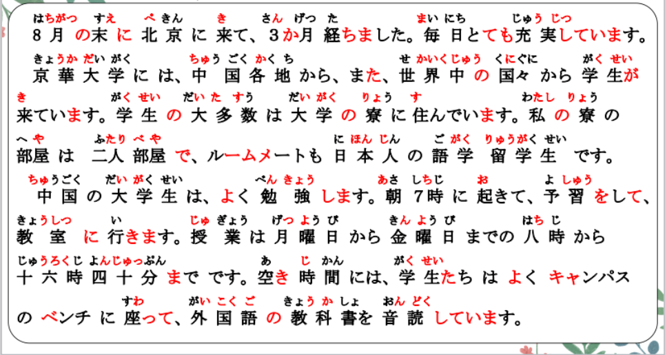
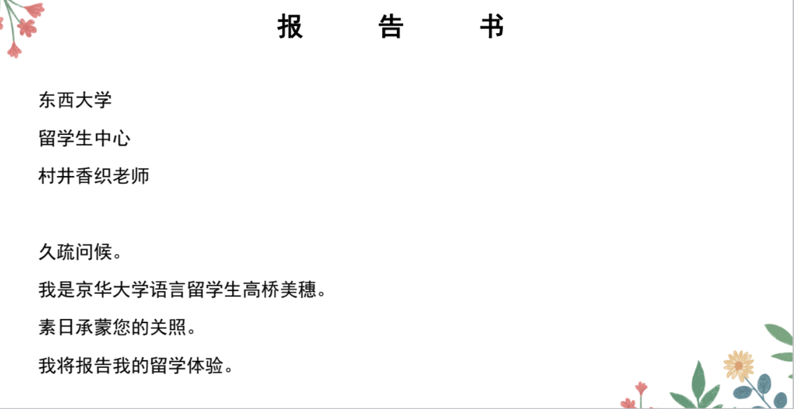

# かいわ

## 新出単語
<vue-plyr>
  <audio controls crossorigin playsinline loop>
    <source src="../audio/8-2-たんご.mp3" type="audio/mp3" />
  </audio>
 </vue-plyr>

## 精読の教文
<vue-plyr>
  <audio controls crossorigin playsinline loop>
    <source src="../audio/8-3-1.mp3" type="audio/mp3" />
  </audio>
 </vue-plyr>

## 会話
<vue-plyr>
  <audio controls crossorigin playsinline loop>
    <source src="../audio/8-3-かいわ.mp3" type="audio/mp3" />
  </audio>
 </vue-plyr>

