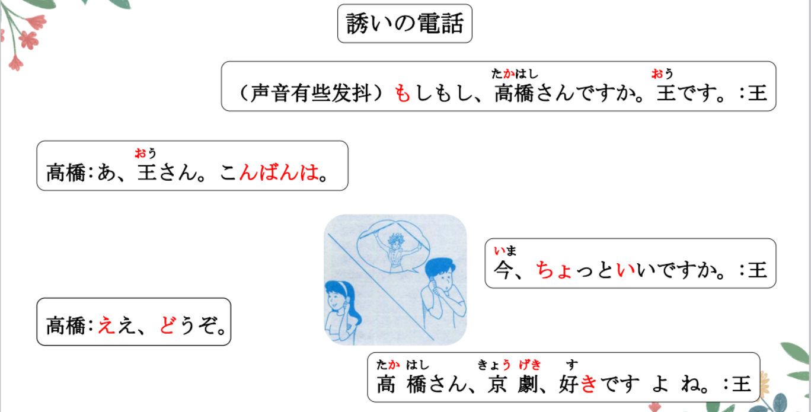
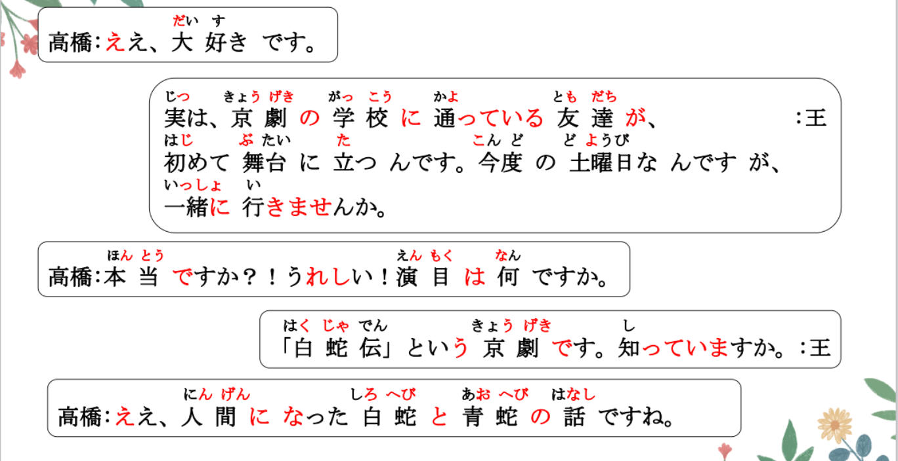
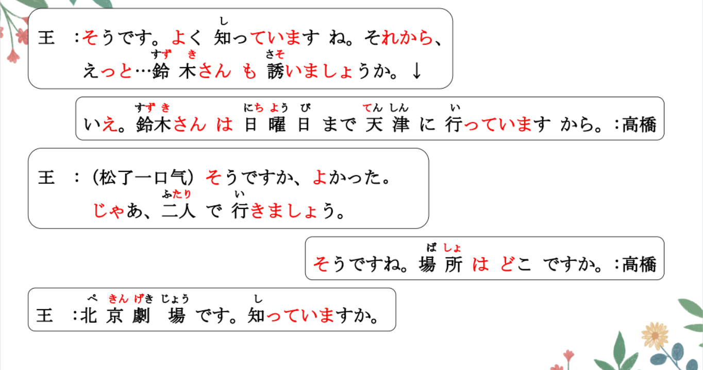
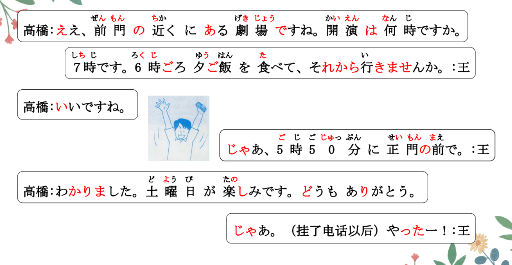
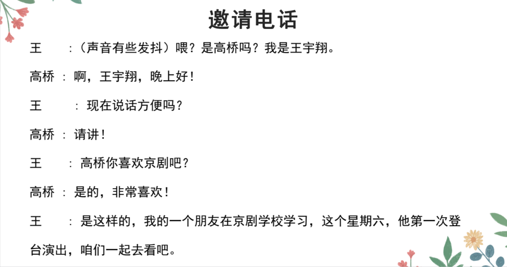
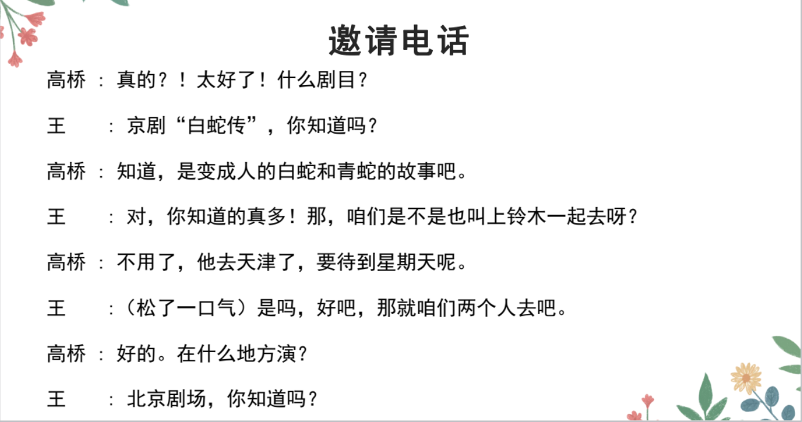
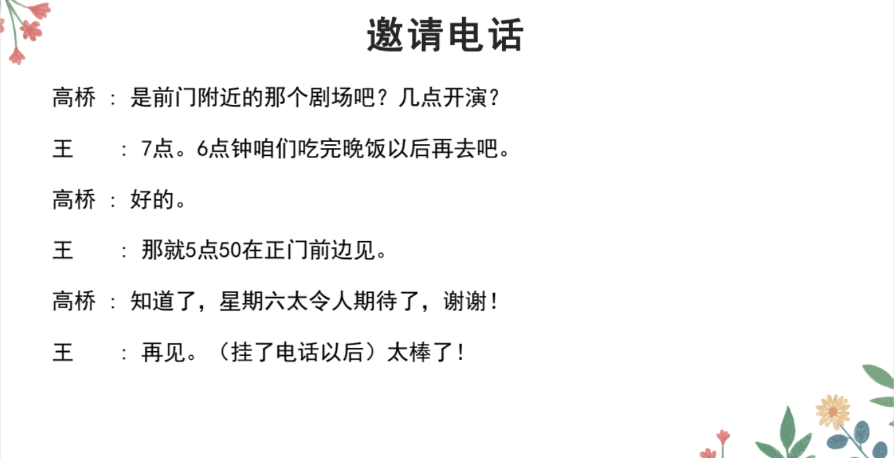

# ひと、が、がる、がっている

## 新出単語

<vue-plyr>
  <audio controls crossorigin playsinline loop>
    <source src="../audio/11-1-たんご.mp3" type="audio/mp3" />
  </audio>
 </vue-plyr>

| 単語                                      | 词性             | 翻译                                          |
| ----------------------------------------- | ---------------- | --------------------------------------------- |
| 誘い<JpWord>さそい</JpWord>               | **⓪**<名>        | 邀请                                          |
| 今晩は <JpWord>こんばんは </JpWord>       | **⑤**            | 晚上好                                        |
| 京劇<JpWord>きょうげき</JpWord>           | **⓪**<名>        | 京剧　                                        |
| 大好き<JpWord>だいすき</JpWord>           | **①**<形 Ⅱ>      | 特别喜欢；非常喜欢　                          |
| 実は<JpWord>じつは</JpWord>               | **②**<副>        | 实际上；说老实话                              |
| 舞台<JpWord>ぶたい</JpWord>               | **①**<名>        | 舞台に立つ「たつ」 // 站在舞台上 （登上舞台） |
| 嬉しい<JpWord>うれしい</JpWord>           | **③**<形 Ⅰ>      | 高兴（的）；令人喜悦（的）　                  |
| 演目<JpWord>えんもく</JpWord>             | **⓪**<名>        | 上演的节目；剧目                              |
| 白蛇伝<JpWord>はくじゃでん</JpWord>       | **③**<固名>      | 白蛇传　　                                    |
| 話<JpWord>はなし</JpWord>                 | **③**<名>        | 话；故事　　　                                |
| 人間<JpWord>にんげん</JpWord>             | **⓪**<名>        | 人；人类                                      |
| 白蛇<JpWord>しろへび</JpWord>             | **⓪**<名>        | 白蛇                                          |
| 青蛇<JpWord>あおへび </JpWord>            | **⓪**<名>        | 青蛇                                          |
| <JpWord>えっと<感> </JpWord> 　　         |                  | （表示在思考或犹豫）嗯；那个                  |
| 誘う<JpWord>さそう</JpWord>               | **⓪**<他 Ⅰ>      | 邀请　　 王さん( )結婚式( )誘う               |
| 天津<JpWord>てんしん</JpWord>             | **①**<固名>      | 天津                                          |
| 北京劇場<JpWord>ぺきんげきじょう</JpWord> | **④**<固名>      | 北京剧场                                      |
| 劇場<JpWord>げきじょう</JpWord>           | **⓪**<名>        | 剧场；剧院                                    |
| 前門<JpWord>ぜんもん</JpWord>             | **⓪**<固名>      | （北京）前门                                  |
| 開演<JpWord>かいえん</JpWord>             | **⓪**<名·自他 Ⅲ> | 开演　                                        |
| 夕ご飯<JpWord>ゆうごはん</JpWord>         | **③**<名>        | 晚饭 　                                       |
| 正門<JpWord>せいもん</JpWord>             | **⓪**<名>        | 正门                                          |
| <JpWord>やったー </JpWord>                | **③**<感>        | （表达事情如愿以偿的喜悦感）太好了！          |
| で                                        | <格助>           | 表示动作主体的数量、范围                      |
| concert <JpWord>コンサート </JpWord>      | ① ＜名＞         | 音乐会；演唱会 電話を受ける 接电话            |
| 受ける<JpWord>うける</JpWord>             | ② ＜他 Ⅱ ＞      | 接受；接收 電話をする 打电话                  |
| 嫌い<JpWord>きらい</JpWord>               | ⓪ ＜形 Ⅱ ＞      | 讨厌（的）；厌烦（的） Ｎが嫌いだ             |
| 犬<JpWord>いぬ</JpWord>                   | ② ＜名＞         | 狗 猫「ねこ」 犬が怖がっている 狗在害怕       |
| chocolate <JpWord>チョコレート </JpWord>  | ③ ＜名＞         | 巧克力 学生時代が懐かしい                     |
| 懐かしい<JpWord>なつかしい</JpWord>       | ④ ＜形 Ⅰ ＞      | 令人怀念（的） 鬼「おに」が怖い               |
| 怖い<JpWord>こわい</JpWord>               | ② ＜形 Ⅰ ＞      | 害怕（的）；可怕（的）私は犬が怖い 我怕狗     |
| <JpWord>さびしい</JpWord>寂しい           | ③ ＜形 Ⅰ ＞      | 寂寞（的）；孤单（的）                        |
| <JpWord>はずかしい</JpWord>恥ずかしい     | ④ ＜形 Ⅰ ＞      | 害羞（的）；羞耻（的）心臓「しんぞう」        |
| <JpWord>こころ</JpWord>心                 | ③ ＜名＞         | 心；心灵；心脏（此处指夏目漱石的小说题目）    |
| 病気<JpWord>びょうき</JpWord>             | ⓪ ＜名＞         | 病；疾病 病気になる 得病；升病                |
| -台<JpWord>-だい</JpWord>                 | ＜接尾＞         | ……台；……辆 風邪「かぜ」をひく 感冒            |
| <JpWord>グループ</JpWord>group            | ② ＜名＞         | 群体；集体；小组                              |
| 規準<JpWord>きじゅん</JpWord>             | ⓪ ＜名＞         | 基准；标准 準備「じゅんび」 准备              |
| 整理<JpWord>せいり</JpWord>               | ① ＜名・他 Ⅲ ＞  | 整理 部屋を整理する                           |
| 分類<JpWord>ぶんるい</JpWord>             | ⓪ ＜名・他 Ⅲ ＞  | 分类                                          |
| 表記<JpWord>ひょうき</JpWord>             | ① ＜名・他 Ⅲ ＞  | 标记；表记；写作                              |
| 用法<JpWord>ようほう</JpWord>             | ⓪ ＜名＞         | 用法 使い方「つかいかた」                     |
| 路上<JpWord>ろじょう</JpWord>             | ⓪ ＜名＞         | 路面 駐車場「ちゅうしゃじょう」               |
| 乗車場<JpWord>じょうしゃじょう</JpWord>   | ⓪ ＜名＞         | 乘车处                                        |
| 乗車<JpWord>じょうしゃ</JpWord>           | ⓪ ＜名・他 Ⅲ ＞  | 乘车                                          |
| 乘せる<JpWord>のせる</JpWord>             | ⓪ ＜他 Ⅱ ＞      | 搭乘；载客 観光客（を）乗せる                 |
| 自動車<JpWord>じどうしゃ</JpWord>         | ②⓪ ＜名＞        | 机动车；汽车 見せる 让看 見る                 |
| 雲<JpWord>くも</JpWord>                   | ① ＜名＞         | 云；云彩；云朵 自転車 自動車に乗る            |
| <JpWord>うかぶ</JpWord>浮かぶ             | ⓪ ＜自 Ⅰ ＞      | 浮；飘 雲が空「そら」に/を浮かぶ              |
| <JpWord>いちめん</JpWord>一面             | ⓪ ＜名＞         | 一面；整片                                    |
| 青い<JpWord>あおい</JpWord>               | ② ＜形 Ⅰ ＞      | 蓝色 青い空 青い海                            |
| 瞬間<JpWord>しゅんかん</JpWord>           | ⓪ ＜名＞         | 瞬间；刹那                                    |
| 気持ち<JpWord>きもち</JpWord>             | ⓪ ＜名＞         | 心情；心意 気持ちがいい                       |
| 顔<JpWord>かお</JpWord>                   | ⓪ ＜名＞         | 脸 気持ちが悪い（恶心） 本「ほん」の気持ち    |
| 働き<JpWord>はたらき</JpWord>             | ⓪ ＜名＞         | 功能；功效；作用 働く 工作；劳动              |
| 受け持つ<JpWord>うけもつ</JpWord>         | ③ ＜他 Ⅰ ＞      | 接受；负责；承担                              |
| 部分<JpWord>ぶぶん</JpWord>               | ① ＜名＞         | 部分                                          |
| 額<JpWord>ひたい</JpWord>                 | ⓪ ＜名＞         | 额头 眼睛：目「め」 嘴巴：口「くち」          |
| 鼻<JpWord>はな</JpWord>                   | ⓪ ＜名＞         | 鼻子 花「はな」 ② 耳朵：耳「みみ」            |
| 左右<JpWord>さゆう</JpWord>               | ① ＜名·他 Ⅲ ＞   | 左右；掌控 選択を左右する                     |
| 脂肪<JpWord>しぼう</JpWord>               | ⓪ ＜名＞         | 脂肪 死亡「しぼう」                           |
| 固める<JpWord>かためる</JpWord>           | ③ ＜他 Ⅱ ＞      | 巩固；加强；使凝固 ドアを～                   |
| 食品<JpWord>しょくひん</JpWord>           | ⓪ ＜名＞         | 食品 食べ物「たべもの」 食物                  |
| butter<JpWord>バター</JpWord>             | ① ＜名＞         | 黄油                                          |
| 生む<JpWord>うむ</JpWord>                 | ⓪ ＜他 Ⅰ ＞      | 产生 問題を生む 赤ちゃんを産む                |
| 育てる<JpWord>そだてる</JpWord>           | ③ ＜他 Ⅱ ＞      | 养育；培养 子供を育てる                       |
| 革<JpWord>かわ</JpWord>                   | ② ＜名＞         | 皮革 革の靴 皮鞋 蛇の皮                       |
| 荷兰语 gom<JpWord>ゴム</JpWord>           | ① ＜名＞         | 橡胶 消しゴム：橡皮擦                         |
| 布<JpWord>ぬの</JpWord>                   | ⓪ ＜名＞         | 布 布で 足を 覆う                             |
| 足<JpWord>あし</JpWord>                   | ② ＜名＞         | 脚；腿 手「て」 手足                          |
| 覆う<JpWord>おおう</JpWord>               | ⓪ ＜他 Ⅰ ＞      | 覆盖 スリッパ：拖鞋                           |
| 履物<JpWord>はきもの</JpWord>             | ⓪ ＜名＞         | 鞋子（总称） 靴「くつ」                       |
| 学問<JpWord>がくもん</JpWord>             | ② ＜名＞         | 学问 学問が広くて深い ふかい                  |
| 技術<JpWord>ぎじゅつ</JpWord>             | ① ＜名＞         | 技术 技術者「ぎじゅつしゃ」                   |
| 芸術<JpWord>げいじゅつ</JpWord>           | ⓪ ＜名＞         | 艺术 芸術家「げいじゅつか」                   |

## 动词的连体形＜连体修饰语＞

意义：充当连体修饰语，对名词起修饰限定的作用。  
说明：动词做连体修饰语时使用的词形叫做“连体形”。动词的各种简体形式，除了表意志的形式（如「しよう」「しなさい」）之外，大多可做连体形，如「する、した、しない、しなかった、している、していた、してい  
ない、していなかった」都可接在名词前用于修饰。  
连体修饰语从句中的主语不能用「は」表示，而要用「が」或者「の」

> ① 形式：当动词加名词前面的时候，要用动词的连体形。**动词连体形=动词的简体**。  
> ② 作用：用动词简体修饰名词，翻译成：**V+的+N。 （动作主体+が）Ｖ简体+Ｎ**  
> ③ 注意：当修饰名词的动词，前面有动作主体时，用**が**提示。

1. Ｖる(原形) ：　　　　　　　 吃苹果的人　　　りんごを食べる人
2. Ｖない(否定）：　　　　　　 不吃苹果的人　　りんごを食べない人
3. Ｖた（过去)：　 　吃了苹果的人　　りんごを食べた人
4. Ｖなかった（过否)：　　　 　没吃苹果的人　　りんごを食べなかった人
5. Ｖている（持续体)：　　　　 正在吃苹果的人　りんごを食べている人

```ts
（1）京劇「きょうげき」の学校に通っている友達が、初めて舞台に立つんです。// 主语：友達 かよう：通う
    长期在京剧学校上学的朋友，第一次要登上舞台
（2）あそこは、李さんがいつも行く喫茶店です。
    那里是小李经常去的咖啡厅。
（3）私が初めて覚えた日本語は「ありがとう」です。
    我每一个记住了的日语是"ありがとう"。
（4）あそこで歌を歌っている人はどなたですか。
    正在那里唱歌的人是哪位呢？
（5）学校に行かない日はうちで勉強します。// 家：うち
    在去学校的日子在家里学习。
（6）昨日来なかった人は誰ですか。
    昨天没来的人是谁？
```

## 練習 れんしゅう

```ts
（1）昨天没有来公司的人是小张。 // かいしゃ：会社　くる：来る　　ちょうさん：張さん
    昨日、会社に来なかった人は張さんです。 // くる-> こない -> こなかった　过去时否定简体
```

## 感情、感觉形容词

> 用于表示人的情感、感觉的就是感情形容词。常用感情形容词：

| 単語                      | 翻译             |
| ------------------------- | ---------------- |
| 羨ましい（うらやましい）  | 羡慕             |
| 嬉しい（うれしい）        | 高兴             |
| 悲しい（かなしい）        | 悲伤             |
| 寂しい （さびしい）       | 寂寞             |
| 苦しい （くるしい）       | 痛苦             |
| 怖い （こわい）           | 怕，可怕的       |
| 懐かしい （なつかしい）   | 怀念             |
| 恥ずかしい （はずかしい） | 害羞             |
| ほしい （ほしい）         | 想要             |
| 残念 （ざんねん）         | 遗憾             |
| 心配 （しんぱい）         | 担心惦记         |
| 嫌だ（いや）              | 讨厌厌恶　不愿意 |

> 用于表示人的**情感**的形容词，有严格的**人称限制**。

1. 描述**第一人称（我）的情感**时，使用**原型**。情感的**对象**用“**が**”提示。
   > 例文：私は欲しい。　 我想要钱：　（私は）お金が欲しい。
2. 描述**他人**情感时，需以**词干+がる**的表达状态的他动词。情感的**对象**用“**を**”

   > 例文：彼は欲しがっている。 他想要钱：彼はお金を欲しがっている。

   > **A1 去掉い+がる(一类形容词)** 　 **A2 去掉だ+がる（二类形容词）**

   > 她担心小王：彼女は王さんを心配がっている。

## 練習 れんしゅう

```ts
（1）我很害羞。 // はずかしい
⇒ （私は）恥ずかしい・恥ずかしいです。
（2）那个小孩子在害羞。
⇒ その子供は恥ずかしがっている・恥ずかしがっています。
（3）我很羡慕高桥。 // うらやましい を＋V
⇒ 私は高橋さんが羨ましい・羨ましいです。
（4）小王很羡慕高桥。
⇒ 王さんは 高橋さんを 羨ましがっている・羨ましがっています。
```

> 特例：N が　好きだ / 嫌いだ　　　
> 说明：好き/嫌い 属于感情形容词，但不受人称限制。

```ts
（1）王さんは高橋さんが好きです。
    小王喜欢高桥。
    私は高橋さんが好きです。
（2）先生は野菜が嫌いです。
    老师讨厌蔬菜
```

## 感情、感觉形容词

意义：表示人的心理状态或生理状态。  
说明：感情形容词作谓语的句子一般主语多为第一人称，且经常省略。感情的对  
象、诱因等一般用「が」标记，构成「（私は）N が～」的句式。非过去时陈述句  
的情况下，当第二或第三人称做主语时，做谓语的感情形容词要采用特定的形式，  
如可以在形容词词干的后面接构词后缀「-がる」使之动词化。

```ts
（1）本当ですか？！うれしい！演目は何ですか。
    真的吗？我好开心呀！你要邀请我去看戏剧
（2）日本人の友達が欲しいです。
我想要认识日本的朋友。
（3）朝から目が痛いです。
从早上开始，我的眼睛就很痛。
（4）参加できないのが残念です。
没能参加这件事情感觉到非常的遗憾。
（5）渡辺さんが高橋さんをうらやましがっています。
渡边非常羡慕高桥。
```

> 描述第三人称高兴的状态时可以使用「嬉しい」的派生动词「嬉しがる」
> 或感情动词「喜ぶ」，但前者多含**贬义色彩**，「喜ぶ」的感情色彩则是中性的。

```ts
（6）そんなに嬉しがらないで、まだまだ早いよ。
    你先不要那么的高兴，还早得很呢？
（7）大学に入ることができましたね。ご両親も喜んでいるでしょう。
    你考上了大学呢。您的爸爸妈妈也会高兴的吧。
```

## という N ＜命名＞

意义：表示所要说明或询问的人或事物的名称。  
译文：叫作……的……；说作……的……；所谓的……;  
接续：名词＋という＋ N //「高橋さん」という女の子

```ts
（1）「白蛇伝」という京劇です。
叫做"白蛇传"的京剧。
（2）これは何「なん」という花ですか。
    这个花的名字是什么呢？ // 　回答的话：「さくら」というはなです。
（3）王 ：田中さんという人を知っていますか。
高橋：いいえ、知りません。どなたですか。
你认识一个叫做田中的人吗？
不，我不认识，是哪位呢？
（4）その田中さんという方は、お友達ですか。
那位叫田中的人，是你的朋友吗？
```

## 練習 れんしゅう

```ts
（1）昨天和高桥在一个叫作“もみじ”的店里吃了饭。
    昨日、高橋さんと「もみじ」というでごはんをたべました。
```

## で ＜动作主体的数量、范围＞

1. 动作发生的场所
   食堂**で**食事をする。
2. 工具手段
   バス**で**学校に行く。
3. 限定范围
   日本**で**富士山が一番高い。
4. 原材料（看得出）
   紙**で**紙飛行機を作る。
5. 限定金钱或者时间的数量
   三百元**で**ドレスが買える。

意义：表示**动作主体**的数量\*\*、范围。私は一人で病院に行く。  
接续：表示人数的数量词或表示人员构成的名词＋で 家族で病院に行く。

```ts
（1）じゃあ、二人で行きましょう。
    那么，我们两个人一起去吧~
（2）一人で行けますか。   // 行くー行ける
  你一个人能去嘛？
（3）みんなで歌を歌いましょう。
    大家一起唱歌吧~ 齐声唱
（4）夏休みに家族で旅行に出かけた。
    暑假，一家人一起外出旅游了。
```

## 練習 れんしゅう

```ts
（1）铃木忙，所以我们两个人去吧。 // いそがしい
すずきさんは忙しいですから、私たちは二人で行きましょう。
```

## 精読の教文

<vue-plyr>
  <audio controls crossorigin playsinline loop>
    <source src="../audio/11-1-1.mp3" type="audio/mp3" />
  </audio>
 </vue-plyr>


## 会話

<vue-plyr>
  <audio controls crossorigin playsinline loop>
    <source src="../audio/11-1-かいわ.mp3" type="audio/mp3" />
  </audio>
 </vue-plyr>








