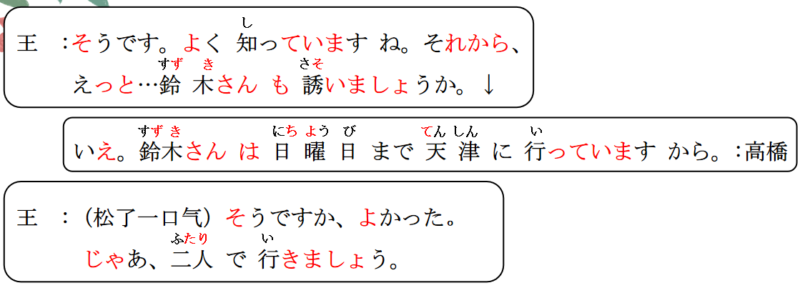

# けど、N2よりN1のほうが

## 新出単語

## けど＜转折、委婉语气＞

意义：表示两个分句的转折关系(逆接），或委婉语气（顺接）  
译文：虽然~但；可是；不过  
接续：两个分句之间  
说明：与「が」的用法非常相似，但是常出现在口语里，郑重的场合不能使用。  
还有「けれど」、「けれども」的形式。

```ts
（1）この道具、説明書を読んだけれど、使い方がよくわかりません。
这个道具，虽然看了说明书， 但是不是很清楚使用方法。
（2）この部屋は新しくてきれいなんですけど、狭いんですよ。
（3）これ、おいしいけど、ちょっと高いね。
先生、この問題がよくわかりませんけど、、 顺接 （请求）
```

## N1 は N2 より~<比较>

意义：表示比较，N1 比 N2 更具有谓语所示的特征  
译文：比……（更）……接续：名词＋は＋名词＋より  
说明：「より」是格助词，表示比较的基准。比较句中可以用副词「ずっと」  
表示二者程度相差很多。 ずっと：一直 、、得多

```ts
（1）高橋さんは私よりずっと詳しいですね。
    高桥比我熟悉得多。
（2）京華大学は北燕大学より大きいです。
    京华大学比北燕大学大。
（3）月曜日は火曜日より忙しいです。
    周一比周二忙。
（4）母は父より朝早く起きます。
    妈妈起得比爸爸早。
```

## 練習 れんしゅう

```ts
（1）哥哥比弟弟高得多。 // あに おとうと 背「せ」が高い「たかい」
⇒ 兄は弟より背が ずっと 高い・高いです。
（2）中国比日本大得多。// （広い）
⇒ 中国は日本よりずっと広いです。

```

## N2 より N1 のほうが ～＜比较＞

意义：表示比较，N1 比 N2 更具有谓语所示的特征。 方「ほう」  
译文：与 N2 相比，N1（更）……  
接续：名词＋より＋名词＋のほうが  
说明：这一句式是「N1 は N2 より～」的变体，也可将词序变为「N1 のほうが N2 より～」。

```ts
（1）実際に見たのは、京劇より宝塚「たからづか」のほうが多いです。
    我实际上看到了的戏剧的话，比起京剧，还是宝塚更加多一点。
（2）北燕大学より京華大学のほうが大きいです。
    比起北燕大学，京华大学更大。
（3）火曜日より月曜日のほうが忙しいです。
    比起周二还是周一更忙。
（4）父より母のほうが朝早く起きます。
    比起爸爸还是妈妈起得早。

```

## 練習 れんしゅう

```ts
（1）比起小王铃木更帅一点。 // より のほうが ～
⇒ おうさんより すずきさんのほうが かっこいい です。
（2）比起日本中国更大一些。//  ひろい
⇒ 日本より 中国のほうが 広い・広いです。

```

> 补充：「ほど」
> 「ほど」用于表示否定比较，后搭配否定形式，表示“不如~ 没有~”
> 接续： N1 は＋ N2 ほど～＋ない

```ts
（1）日本は中国ほど広くないです。
    日本不如中国大。 　　
（2）今年の冬は去年の冬ほど寒くない。
    今年的冬天没有去年冬天冷
（3）北京不如东京热闹。
⇒ 北京は東京ほど賑やかではない・です。
 ```
 　　　　　

## 精読の教文
<vue-plyr>
  <audio controls crossorigin playsinline autoplay loop>
    <source src="../audio/11-1-2.mp3" type="audio/mp3" />
  </audio>
 </vue-plyr>

