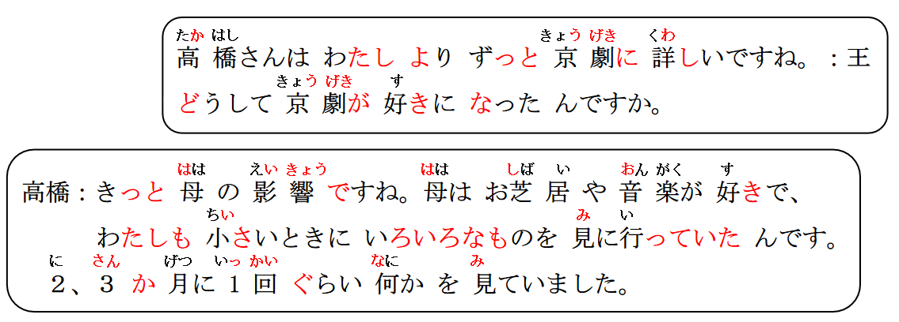

# に、だけなく、がいちばん

## に ＜状态、性质的对象＞

意义：表示状态、性质的对象  
译文：对于……；对……  
接续：名词＋に＋表示能力、态度、必要性等意义的形容词  
詳しい、厳しい、やさしい、必要、、、

```ts
（1）高橋さんは京劇に詳しいです。
（2）遠藤先生は学生に優しいです。
（3）今日は旅行に必要なものを買った。
    今天买了对于旅游有必要的东西。
（4）電子辞書は外国語の勉強に便利です。
```

## 練習 れんしゅう

```ts
（1）香烟对身体不好。// タバコ からだ いい よい ない 悪い
⇒ タバコは体によくない・悪い。
（2）我家离学校很近。 // に ちかい
⇒私の家・うちは学校に近い・近いです。
（3）运动对身体好。// 運動「うんどう」
⇒ 運動は体にいい・いいです。
```

## N1 (周期)　に N2 数量<频率>

意义：表示在某一周期内动作的频率。 週「しゅう」に三回　　
译文：（平均）每…… 一年「いちねん」に二回 一日「いちにち」に三回　　　
接续：时间名词（表示周期）＋に＋次数 一ヶ月「いっかげつ」に一回

```ts
（1）2、3か月に1回ぐらい何かを見ていました。
两三个月左右看上一次什么的（戏剧）。
（2）この薬を1日に3回飲んでください。
这个药请一天吃三次。
（3）わたしは週「しゅう」に1回中国語教室へ行っています。
我一周去一次中文培训班。

```

## 練習 れんしゅう

```ts
 (1) 一周听三次日语课。 // 授業を受ける：听课 しゅう さんかい // 一週間「いっしゅうかん」に三回 一周三次
 週に三回 日本語の授業を受けている。

 (2) 一个月打扫一次房间。 // いっかげつ 毎月「まいつき」一回
⇒ 一ヶ月に一回 部屋を掃除する・している。
```

## N1 だけで（じゃ）なく、 N2 も＜范围＞

意义：表示成立的范围。 。  
译文：不仅 N1，N2 也…… 王さんだけでなく、鈴木さんも高橋さんがすきだ。  
接续：名词＋だけで（じゃ）なく＋名词＋も  
说明：「だけでなく」在口语中可以说成「だけじゃなく」。

```ts
 (1) お母さんは日本の舞台だけじゃなく、外国の舞台にも興味があるんですね。
你的妈妈不只是日本的舞台，对于国外的舞台也很感兴趣呢~
 (2) あの人は英語だけでなく、日本語も話せます。 はなす はなせる
那个人不仅是英语，日语也会说。
 (3) 1年生だけじゃなく、2年生と3年生もパーティーに行きます。
不只是一年级，2年纪和三年级也会去派对。
```

## 練習 れんしゅう

```ts
 (1) 不仅是小王，铃木也喜欢高桥。だけでなく、も だけじゃなく、も
⇒ 王さんだけでなく、 鈴木さんも高橋さんが好きだ・好きです。
 (2) 不只是小孩子，大人也玩游戏。こども　大人「おとな」　ゲームをする
⇒ 子供だけじゃなく、大人もゲームをする・します。
 (3) ①我只吃苹果。 ②我只有苹果 不吃。 ③不只是苹果，香蕉也不吃。
⇒① りんごだけ（を）食べる。 りんごしか食べない・食べません
　②　りんごだけたべない・食べません。　
　③　りんごだけでなく、バナナも食べない・食べません。
```

## （N1 の中で）N2 がいちばん～＜比较＞

意义：表示比较，在 N1 所示的范围内 N2 最具有谓语所示的特征。  
译文：在 N1 之中，N2 最……  
接续：名词＋（の中）で＋名词＋がいちばん  
说明：N1 是明显的表示范围的名词时，后续的「の中」可省略。

```ts
 (1) 母はお芝居の中では歌舞伎がいちばん好きです。
妈妈在”戏剧之中”最喜欢歌舞伎。
 (2) クラスの中で、王さんがいちばん日本語が上手です。
 (3) 中華料理の中では、北京ダックがいちばんおいしいです。
 (4) 日本でいちばん高い山は、富士山です。
```

## 練習 れんしゅう

```ts
  (1) 镜子呀~镜子~在这个世界上谁最漂亮呀？ //  何方「どなた // かがみよ～かがみ～
    この世界（の中）で誰が一番きれいですか。
```

## N1でもN2でも（いい）＜许可＞
意义：表示N1、N2均在许可范围内。 も、も （并列） 私も高橋も学生です。  
译文：N1和N2都可以 私は学生です。高橋さんは学生です。  
接续：名词＋でも＋名词＋でも＋（「いい/大丈夫」等）  

```ts
 (1) 京劇は男性でも女性でもいいんですよ。 京剧是男性和女性都可以（演出）
宝塚は女性だけが出演する。
 (2) メールでも電話でもいいです。連絡してください。れんらくする
短信和电话都可以。 请你联系（我）。
 (3) 土曜日でも日曜日でも大丈夫です。 
    周六和周天都没问题。
```

## 練習 れんしゅう

```ts
  (1) 学习会的话只有一年级可以参加的嘛？ // できる
    ⇒ 勉強会は 一年生だけ（が）参加できますか。
    不，一年级和二年纪都可以。 にねんせい
    ⇒ いいえ、一年生でも 二年生でも いいです。 大丈夫だ・大丈夫です。
```

## N1とN2と（では）どちら（のほう）が～＜选择＞
意义：表示选择性疑问，询问N1、N2二者中哪一个更具有谓语所示的特征。  
译文：N1和N2，哪个更……  
接续：名词＋と＋名词＋と（では）＋どちら＋（のほう）が  
说明：「では」「のほう」可省。回答一般用「N1/N2のほうが～」或者「（N1もN2  
も）どちらも（同じくらい～）」

```ts
 (1) 京劇と宝塚とではどちらのほうが好きですか。
 (2) 高橋：李さんと張さんと(では）、どちら（のほう）が英語が上手ですか。
王：李さんのほうが上手です。
 (3) 王 ：日本では、７月と８月と、どちらが暑いですか。
鈴木：８月のほうが暑いです。

```

## 練習 れんしゅう

```ts
  (1) 西瓜和香蕉哪个更好吃？// すいか バナナ おいしい
    ⇒ 西瓜とバナナと（では）どちら（のほう）が美味しいですか。
    西瓜更好吃。
    ⇒ すいかのほうが美味しいです。
    西瓜和香蕉哪一个都一样好吃。
    西瓜もバナナもどちらも同じぐらい美味しいです。
    哪个都好吃。 // 好吃：美味しい。
    どちらも美味しい。 
```


## 精読の教文

<vue-plyr>
  <audio controls crossorigin playsinline loop>
    <source src="../audio/11-2-1.mp3" type="audio/mp3" />
  </audio>
 </vue-plyr>


