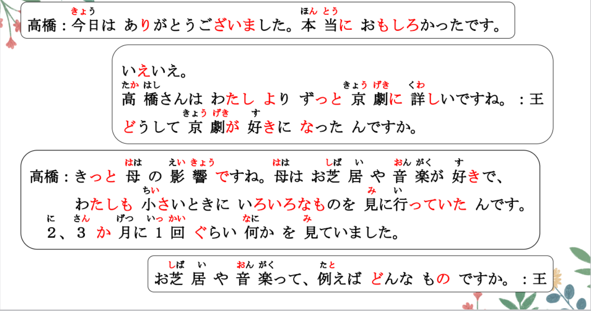
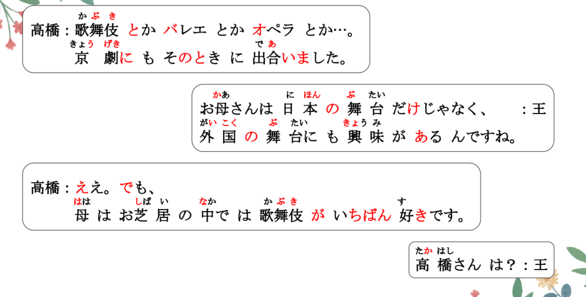
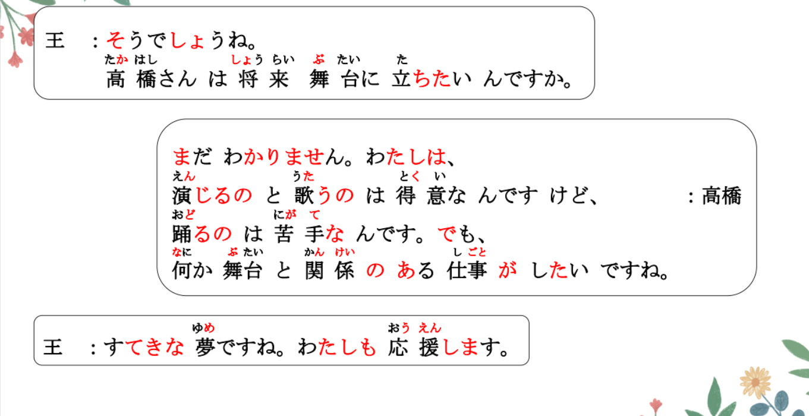
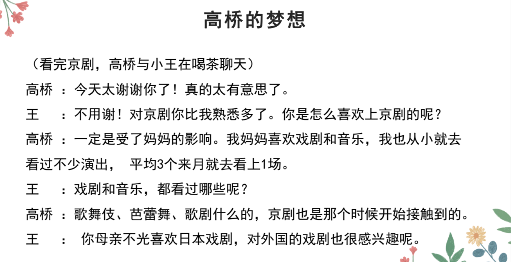

# どちらも、なかなか、の..

## 新出単語

## （N1もN2も）どちらも（同じぐらい）~＜相同＞

意义：表示通过比较得出N1和N2两者的性质或状态基本相同的理论。  
译文：N1和N2都一样……  
接续：名词＋も＋名词＋も＋どちらも＋（同じぐらい）  

```ts
（1）王 ：京劇と宝塚とではどちらのほうが好きですか。
高橋：（京劇も宝塚も）どちらも同じぐらい好きです。
（2）鈴木：英語と日本語とどちらが難しいですか。
李 ：どちらも難しいです。哪个都难。
（3）山田さんはサッカーもテニスも、どちらも上手です。
```

## なかなかＶ（能动态）ない<可能性的否定>

意义：表示难以达成某种行为、状态。  
译文：不容易……；很难…… 难以做到、、  
接续：なかなか＋动词能动态的否定形式  


```ts
（1）日本では京劇はなかなか見られません。 見るー見られる
    在日本很难看到京剧。
（2）みんな忙しいから、なかなか会えません。会うー会える
（因为）大家都很忙，所以很难见上一面。
（3）この町ではさしみはなかなか食べられません。食べるー食べられる
    在这城市很难吃到生鱼片。
（4）（因为）刚刚喝了咖啡，所以难以入睡。 // 寝る「ねる」
さっきコーヒーを飲んだから、なかなか寝られない。
さっきコーヒーを飲みましたから、なかなか寝られません。
飲んだ。だから、ない。
（5）（他的事情难以忘记。 、// 忘れる「わすれる」
彼のことはなかなか忘れられない・忘れられません。

```

## の＜连体修饰语从句中的主语＞

意义：表示连体修饰语从句中的主语。 动作主体が/の V简体+N  
接续：名词＋の＋谓语 は ✖  
说明：连体修饰语从句中的主语原本用格助词「が」表示，但通常它被替换成「の」。  
如果从句中主语用「の」容易引起误解时，宜使用「が」格。【如例（4）】。  

```ts
（1）将来、何か舞台と関係の/がある仕事がしたいです。// 仕事をする 工作
将来， 想从事某些和舞台有关系的工作。
（2）あそこは、李さんの/がいつも行く喫茶店です。李さんは行く喫茶店
（3）わたしの/が初めて覚えた日本語は「ありがとう」です。
（4）王さんが友達に送ったメールは届きませんでした。
小王给朋友发送的 短息没有送到。王さんの友達 小王的朋友。

```

## 練習 れんしゅう

```ts
（1）比起小王铃木更帅一点。 // より のほうが ～
⇒ おうさんより すずきさんのほうが かっこいい です。
（2）比起日本中国更大一些。//  ひろい
⇒ 日本より 中国のほうが 広い・広いです。

```

> 补充：「ほど」
> 「ほど」用于表示否定比较，后搭配否定形式，表示“不如~ 没有~”
> 接续： N1 は＋ N2 ほど～＋ない

```ts
（1）日本は中国ほど広くないです。
    日本不如中国大。 　　
（2）今年の冬は去年の冬ほど寒くない。
    今年的冬天没有去年冬天冷
（3）北京不如东京热闹。
⇒ 北京は東京ほど賑やかではない・です。
 ```
 
## に ＜状态、性质的对象＞

意义：表示状态、性质的对象  
译文：对于……；对……  
接续：名词＋に＋表示能力、态度、必要性等意义的形容词  
詳しい、厳しい、やさしい、必要、、、  


```ts
（1）高橋さんは京劇に詳しいです。
（2）遠藤先生は学生に優しいです。
（3）今日は旅行に必要なものを買った。
（4）電子辞書は外国語の勉強に便利です。
 ```

## 精読の教文
<vue-plyr>
  <audio controls crossorigin playsinline autoplay loop>
    <source src="../audio/11-1-2.mp3" type="audio/mp3" />
  </audio>
 </vue-plyr>


## 会話

<vue-plyr>
  <audio controls crossorigin playsinline autoplay loop>
    <source src="../audio/11-2-かいわ.mp3" type="audio/mp3" />
  </audio>
 </vue-plyr>

 
 
 
 
 
 
 
 