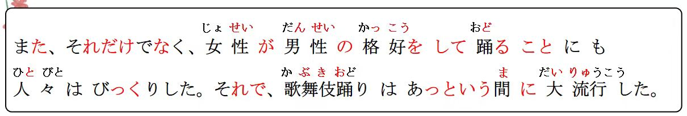

# Ｎとともに、こと、に...

## 新出単語

<vue-plyr>
  <audio controls crossorigin playsinline loop>
    <source src="../audio/11-3-たんご.mp3" type="audio/mp3" />
  </audio>
 </vue-plyr>

| 単語                                           | 词性               | 翻译                                |
| ---------------------------------------------- | ------------------ | ----------------------------------- |
| 伝統芸能 <JpWord>でんとうげいのう</JpWord>     | **5**<名>          | 传统艺术                            |
| 芸能<JpWord> げいのう</JpWord>                 | **0**<名>          | (大众)艺术                          |
| 能狂言 <JpWord>のうきょうげん</JpWord>         | **35**<固名>       | 能与狂言;能乐狂言                   |
| 能<JpWord> のう </JpWord>                      | **0**<固名>        | (日本传统表演形式)能                |
| 狂言 <JpWord>きょうげん </JpWord>              | **3**<固名>        | (日本传统表演形式)狂言              |
| 文楽 <JpWord>ぶんらく </JpWord>                | 1<固名>            | (日本传统表演形式)文乐              |
| 共 <JpWord>とも </JpWord>                      | 0<名>              | 共同;一起;都                        |
| 三大- <JpWord>さんだい- </JpWord>              | <接頭>             | 三大~                               |
| <JpWord>もともと </JpWord>                     | 40<副>             | 原本;本来                           |
| 奇抜 <JpWord>きばつ </JpWord>                  | 0<形 II>           | 奇特(的)<br> 奇抜な髪型「かみがた」 |
| 格好 <JpWord>かっこう </JpWord>                | 0<名>              | 外观;打扮;样子                      |
| story <JpWord>ストーリー </JpWord>             | 2<名>              | 故事;情节                           |
| 当時 <JpWord>とうじ </JpWord>                  | 1<名>              | 当时                                |
| 行う <JpWord>おこなう </JpWord>                | 0<他 I>            | 举办;执行;实施                      |
| 珍しい <JpWord>めずらしい </JpWord>            | 4<形 I>            | 少有;罕见                           |
| 人々<JpWord> ひとびと </JpWord>                | 2<名>              | 人们                                |
| <JpWord>びっくり </JpWord>                     | 3<副·自 III>       | 吃惊;惊讶                           |
| <JpWord>それで </JpWord>                       | 3<接>              | 因此;于是;因而                      |
| あっという間に <JpWord>あっというまに</JpWord> | 0                  | 眨眼间;转瞬间;迅速                  |
| 間 <JpWord>ま </JpWord>                        | 0<名>              | 之间;间隔;空挡                      |
| 大流行 <JpWord>だいりゅうこう</JpWord>         | 3<名·自 III>       | 非常流行 定流                       |
| 流行<JpWord> りゅうこう </JpWord>              | 0<名·自 III>       | 流行                                |
| その後 <JpWord>そのご </JpWord>                | 0<名>              | 那以后;其后                         |
| 江戸幕府 <JpWord>えどばくふ </JpWord>          | 3<固名>            | 江户幕府                            |
| 江戸 <JpWord>えど </JpWord>                    | 0<固名>            | (东京都中心地带的旧称)江户          |
| 幕府<JpWord> ばくふ </JpWord>                  | 1<名>              | 幕府                                |
| 少女 <JpWord>しょうじょ </JpWord>              | 0<名>              | 女性                                |
| 少年 <JpWord>しょうねん</JpWord>               | 0<名>              | 少年(男性女性)                      |
| 禁止 <JpWord>きんし </JpWord>                  | 0<名·他 III>       | 禁止                                |
| 役者 <JpWord>やくしゃ </JpWord>                | 0<名>              | 演员                                |
| 隈取 <JpWord>くまどり </JpWord>                | 0<名·他 III>       | 脸谱                                |
| 血管 <JpWord>けっかん </JpWord>                | 0<名>              | 血管                                |
| 筋肉 <JpWord>きんにく </JpWord>                | 1<名>              | 肌肉                                |
| 表す <JpWord>あらわす </JpWord>                | 3<他 I>            | 表达;表现                           |
| 英雄 <JpWord>えいゆう</JpWord>                 | 0<名>              | 英雄                                |
| 青 <JpWord>あお </JpWord>                      | 1<名>              | 蓝(色);青(色)                       |
| 悪人 <JpWord>あくにん </JpWord>                | 0<名>              | 坏人;恶人                           |
| 茶色 <JpWord>ちゃいろ </JpWord>                | 0<名>              | 茶褐色                              |
| 魔物 <JpWord>まもの </JpWord>                  | 0<名>              | 魔鬼                                |
| 化け物 <JpWord>ばけもの </JpWord>              | 34<名>             | 妖怪                                |
| 様様 <JpWord>さまざま </JpWord>                | 2<形 II>           | 种种;各种各样                       |
| 物語 <JpWord>ものがたり </JpWord>              | 3<名>              | 故事;物语                           |
| 法语 genre <JpWord>ジャンル </JpWord>          | 1<名>              | 领域;种类                           |
| 独特 <JpWord>どくとく </JpWord>                | 0<名・形 II>       | 独特                                |
| 装置 <JpWord>そうち </JpWord>                  | 1<名・他 III>      | 装置;装备                           |
| 完成 <JpWord>かんせい </JpWord>                | 0<名·自他 III>     | 完成                                |
| 代表 <JpWord>だいひょう </JpWord>              | 0<名·他 III>       | 代表                                |
| 多く <JpWord>おおく </JpWord>                  | 1<名·副>           | 多;许多                             |
| fan <JpWord>ファン </JpWord>                   | 1<名>              | 戏迷;歌迷;粉丝;~迷                  |
| 魅了 <JpWord>みりょう </JpWord>                | 0<名·他 III>       | 吸引;迷倒                           |
| 名所 <JpWord>めいしょ </JpWord>                | 0<名>              | 名胜                                |
| 旧跡 <JpWord>きゅうせき </JpWord>              | 0<名>              | 古迹                                |
| 普及 <JpWord>ふきゅう </JpWord>                | 0<名·自 III>       | 普及                                |
| 広州 <JpWord>こうしゅう </JpWord>              | 1<固名>            | 广州                                |
| 南方 <JpWord>なんぽう </JpWord>                | 0<名>              | 南方                                |
| 重要 <JpWord>じゅうよう </JpWord>              | 0<形 II>           | 重要(的)                            |
| 睡眠 <JpWord>すいみん </JpWord>                | 0<名>              | 睡眠                                |
| 雰囲気 <JpWord>ふんいき </JpWord>              | 3<名>              | 氛围                                |
| 観光地 <JpWord>かんこうち </JpWord>            | 3<名>              | 观光地;游览地;旅游景点              |
| ticket <JpWord>チケット </JpWord>              | 21<名>             | (机、车)票;门票;入场券              |
| 趣味 <JpWord>しゅみ </JpWord>                  | 1<名>              | 爱好                                |
| 入院 <JpWord>にゅういん</JpWord>               | 0<名·自 III>       | 入院;住院                           |
| 事業 <JpWord>じぎょう </JpWord>                | 1<名>              | 事业                                |
| 満足 <JpWord>まんぞく </JpWord>                | 1<名·形 II·自 III> | 满足;满意                           |
| 疲れる<JpWord>つかれる</JpWord>                | 3<自 II>           | 疲劳;累                             |
| 困る<JpWord>こまる</JpWord>                    | 2<自 I>            | 为难                                |
| 事業<JpWord>じぎょう</JpWord>                  | 1<名>              | 事业 (前面出现过的重复单词)         |
| 失敗<JpWord>しっぱい</JpWord>                  | 0<名·自 III>       | 失败                                |
| 桜並木<JpWord>さくらなみき</JpWord>            | 04<名>             | 樱花树林                            |
| 感動<JpWord>かんどう</JpWord>                  | 0<名·自 III>       | 感动                                |
| 骨<JpWord>ほね</JpWord>                        | 2<名>              | 骨头;骨骼;骸骨                      |
| 冬休み<JpWord>ふゆやすみ</JpWord>              | 3<名>:寒假         |
| 遅く<JpWord>おそく</JpWord>                    | 0<名>              | 晚;迟                               |
| 眠い<JpWord>ねむい</JpWord>                    | 02<形 I>           | 困(的);犯困(的)                     |
| 晴れる<JpWord>はれる</JpWord>                  | 2<自 II>           | 晴朗，放晴;(心情)舒畅               |
| calcium<JpWord>カルシウム</JpWord>             | 3<固名>            | (元素名)钙                          |
| 豊富<JpWord>ほうふ</JpWord>                    | 0<名·形 II>        | 丰富                                |
| <JpWord>やる </JpWord>                         | 0<他 I>            | 做;从事;                            |
| 閉まる<JpWord>しまる</JpWord>                  | 2<自 I>            | 关;闭                               |
| 相撲<JpWord>すもう</JpWord>                    | 0<名>              | 相扑                                |
| 柔道<JpWord>じゅうどう</JpWord>                | 1<名>              | 柔道                                |
| 生け花<JpWord>いけばな</JpWord>                | 2<名>              | 插花                                |
| 茶道<JpWord>さどう·ちゃどう</JpWord>           | 1<名>              | 茶道                                |
| おせち料理<JpWord>おせちりょうり</JpWord>      | 4<名>              | 日本年夜饭;御节料理                 |

## N とともに＜类同＞

意义：表示某事物与主语性质相同。  
译文：与……相同，与……一样（都）  
接续：名词＋と＋ともに と一緒に 和、、一起

```ts
（1）歌舞伎は、能狂言や文楽とともに日本三大伝統芸能のひとつである。
歌舞伎与能狂言和文乐共同作为日本三大传统艺术其中之一。
（2）上海は北京とともに中国を代表する大都市である。
上海和北京一样都是代表中国的大都市。
（3）英語は日本語とともに必修科目「ひっしゅうかもく」です。
英语与日语一样都是必修科目。
```

## 練習 れんしゅう

```ts
（1）故宮「こきゅう」　　　　　　
　　万里の長城「ばんりのちょうじょう」　
　　中国を代表する「ちゅうごくをだいひょうする」
　　名所旧跡「めいしょきゅうせき」Ｎ。　だ・です・である。　
 故宫和万里长城共同都作为代表中国的名胜古迹。 ⇒ 故宮は万里の長城とともに 中国を代表する名所旧跡だ・です・である。
```

## 形容词的第一、第二连用形用于句子中顿

意义：表示句子的并列、中顿。
说明：我们在第 4 课第 3 单元学过形容词的第二连用形用法，在第 6 课  
第 3 单元学过形容词的第一连用形的用法，其变法规则总结如下：

| 分类       | 第一连用形（规则） | 第一连用形（例） | 第二连用形（规则） | 第二连用形（例） |
| ---------- | ------------------ | ---------------- | ------------------ | ---------------- |
| Ⅰ 类形容词 | A い →A く         | 高い → 高く      | A い →A くて       | 高い → 高くて    |
| Ⅱ 类形容词 | A だ →A に         | 便利だ → 便利に  | A だ →A で         | 便利だ → 便利で  |

> ☞Ⅰ 类形容词的中顿既可以使用第一连用形（如例（1）、（2）），也可以
> 使用第二连用形（如例（3）、（4）），前者多用于书面语，后者口语中
> 多用。 第一连用形：书面 第二连用形：口语

```ts
（1）歌舞伎は能狂言より歴史が新しく、17世紀に始まった。书面
（2）日本は山が多く、川も少なくない。 すくない 少 书面
（3）昨日友達と行ったレストランは安くて、おいしかったです。 口语
（4）大学の図書館は広くて、本が多いです。 口语
```

> 动词第 1 第 2 连用形用于中顿。
> 动词第 1 连用形中顿：书面  
> 动词第 2 连用形中顿:口语  
> 而 Ⅱ 类形容词的中顿只有第二连用形一种形式（如例（5）（6））。

```ts
（5）張さんはテニスが上手で、水泳も得意だ。
上手に、✖
（6）彼の説明は複雑で、専門的だ。 ふくざつに、✖
因为他的解释非常复杂，所以很专业。

```

> 第一连用形（副词化） 多く 书面 上手に　 不可
> 第二连用形（て形） 多く＋て 口语 上手で 可用

## 練習 れんしゅう

```ts
（1）小王又聪明，又热情。
  书面：
  口语：
（2）这个电子词典的话使用方法又简单，价格也很便宜。
```

## ~ こと＜名词化＞

意义：表示小句的名词化。 V 简体こと A1 ＋こと A2+な+こと  
接续：动词、形容词连体形＋こと、名词＋である＋こと  
说明：「こと（事）」除了作为普通的名词使用外，还可以作为形式名词使用。  
小句后接「こと」后变成一个名词性成分，其后可接格助词或判断词。

```ts
（1）それだけでなく、女性が男性の格好をして踊ることにも人々はびっくりした。
（2）私の趣味は絵を描くことだ。
 选择判断：
 私の趣味は本を読みます。（〇・✖）
 私の趣味は本を読むことです。（〇・✖）
（3）毎日努力「どりょく」することがいちばん大事だ。
（4）いちばん大事なのは毎日努力することだ。
（5）高橋さんのお姉さんが看護師であることを知らなかった。
```

> ☞ 除了「こと」之外，常见的形式名词还有「もの、ところ、はず、わけ、
> なか」等，它们的意义各不相同。形式名词一般都使用平假名书写。

## 練習 れんしゅう

```ts
（1）掃除する・あまり好きではない 我不怎么喜欢打扫。
```

## 形式名词「の」

意义：构成名词词组，代替上文提到的名词内容。  
接续：名词+の 　 A1+の 　 A2+な+の 　 V 简体+の

```ts
（1）加藤：私、チャイナドレスが買いたいんですが。
高橋：300元ぐらいでシルクのが買えますよ。
（2）このかばんは高橋さんのです。
（3）高橋：今晩、中華料理はいかがですか。
加藤：いいですね。本場のが食べたいです。
```

> ☞ 动词、形容词的连体形后也可接「の」，将动词、形容词名词化。

## 練習 れんしゅう

```ts
（4）日本へ留学に行ったのは誰ですか。
日本へ留学に行ったことは誰ですか。（〇・✖）
（5）四川料理をよく食べます。辛いのが好きですから。
（6）もっと地味なのがほしいですが。

```

> 只能用「の」名词化的场合。

**1.「の」可以代指人，物，事。**　　　　
「こと」只能代指事情。  
例文：① 彼女が買ったのはこの鞄です。 （〇・✖）  
 彼女が買ったことはこの鞄です。（〇・✖）  
日本へ行ったのは誰ですか。 （〇・✖）  
 日本へ行ったことは誰ですか。 （〇・✖）  
 ③ 来週、行くのは長沙です。 （〇・✖）  
 来週、行くことは長沙です。 （〇・✖）  
 **2. 当后句是表示感觉的词。（聞く、聞こえる、見る、見える）**  
 例文：誰か僕の名前を呼んでいるのが聞こえた。  
　　　先生が走ってるのを見た。

> 只能用「こと」的场合。

**1. 当句子为引用内容、强调具体的内容时。**  
こと：具体的事件的内容  
（言う、話す、聞く（詢問）、読む、書く、願う、望む、祈る、思う、伝える、考える、約束する）  
 例文：明日仕事を辞めることを母に言った。  
 電話があったことを李さんに伝えてください。  
**2. 固定搭配。** 　
（ことができる、ことがある、は～ V ことです、  
～ことにする、  
～ことになる(決定・果)...）  
 Ｖる＋ことがある。有时  
Ｖた＋ことがある。有过。  
例文：泳ぐことができる。  
椅子に寝ることがある。   
山に登ったことがある。  
私の趣味は映画を見ることです。

① 日本語を勉強する（こと・の）は楽しいです。  
② 山田さんが本を読んでいる（こと・の）が聞こえます。  
③ きのう行った（こと・の）は京都です。  
④ やりたい（こと・の）がある。　やりたい：想做  
⑤ 高橋さんが泣いている（こと・の）を見た。  
⑥ 日本人と話す（こと・の）ができる。


## に　<原因、诱因>

意义：表示产生某种感情或感觉的原因。　　
接续：名词＋に＋感情、感觉的动词　　
说明：谓语多为表达感情、感觉的动词。　　


```ts
（1）それだけでなく、女性が男性の格好をして踊ることにも人々はびっくりした。
（2）兄はお金に困っている。[为难，烦恼]
（3）今の大学生活にとても満足している。
（4）高校卒業のとき、友達が書いてくれた言葉に感動した。かんどうする
```

## 練習 れんしゅう

```ts
（1）满足于考试的成绩。しけんのせいせき まんぞく
（2）厌倦于学习。 べんきょう つかれる 疲れる

```

## 精読の教文

<vue-plyr>
  <audio controls crossorigin playsinline loop>
    <source src="../audio/11-3-1.mp3" type="audio/mp3" />
  </audio>
 </vue-plyr>


