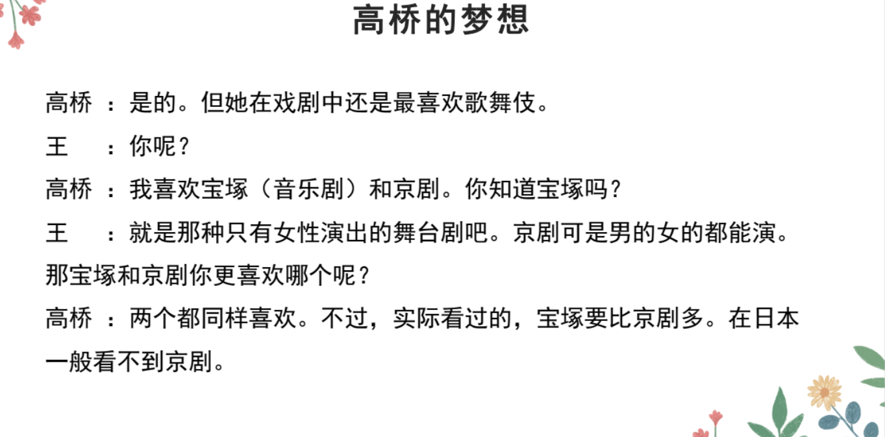
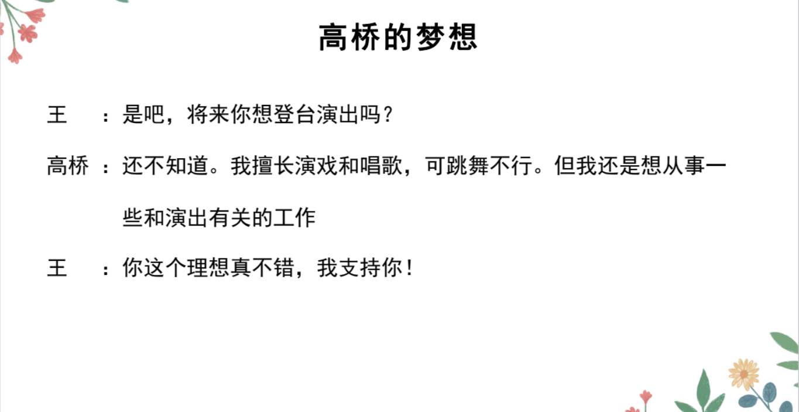

# Ｎとともに、こと、に...

## 新出単語

<vue-plyr>
  <audio controls crossorigin playsinline loop>
    <source src="../audio/11-3-たんご.mp3" type="audio/mp3" />
  </audio>
 </vue-plyr>

| 単語                                           | 词性               | 翻译                                  |
| ---------------------------------------------- | ------------------ | ------------------------------------- |
| 伝統芸能 <JpWord>でんとうげいのう</JpWord>     | **5**<名>          | 传统艺术                              |
| 芸能<JpWord> げいのう</JpWord>                 | **0**<名>          | (大众)艺术                            |
| 能狂言 <JpWord>のうきょうげん</JpWord>         | **35**<固名>       | 能与狂言;能乐狂言                     |
| 能<JpWord> のう </JpWord>                      | **0**<固名>        | (日本传统表演形式)能                  |
| 狂言 <JpWord>きょうげん </JpWord>              | **3**<固名>        | (日本传统表演形式)狂言                |
| 文楽 <JpWord>ぶんらく </JpWord>                | 1<固名>            | (日本传统表演形式)文乐                |
| 共 <JpWord>とも </JpWord>                      | 0<名>              | 共同;一起;都                          |
| 三大- <JpWord>さんだい- </JpWord>              | <接頭>             | 三大~                                 |
| <JpWord>もともと </JpWord>                     | 40<副>             | 原本;本来                             |
| 奇抜 <JpWord>きばつ </JpWord>                  | 0<形 II>           | 奇特(的)  奇抜な髪型「かみがた」   |
| 格好 <JpWord>かっこう </JpWord>                | 0<名>              | 外观;打扮;样子                        |
| story <JpWord>ストーリー </JpWord>             | 2<名>              | 故事;情节                             |
| 当時 <JpWord>とうじ </JpWord>                  | 1<名>              | 当时                                  |
| 行う <JpWord>おこなう </JpWord>                | 0<他 I>            | 举办;执行;实施                        |
| 珍しい <JpWord>めずらしい </JpWord>            | 4<形 I>            | 少有;罕见                             |
| 人々<JpWord> ひとびと </JpWord>                | 2<名>              | 人们                                  |
| <JpWord>びっくり </JpWord>                     | 3<副·自 III>       | 吃惊;惊讶                             |
| <JpWord>それで </JpWord>                       | 3<接>              | 因此;于是;因而                        |
| あっという間に <JpWord>あっというまに</JpWord> | 0                  | 眨眼间;转瞬间;迅速                    |
| 間 <JpWord>ま </JpWord>                        | 0<名>              | 之间;间隔;空挡                        |
| 大流行 <JpWord>だいりゅうこう</JpWord>         | 3<名·自 III>       | 非常流行 定流                         |
| 流行<JpWord> りゅうこう </JpWord>              | 0<名·自 III>       | 流行                                  |
| その後 <JpWord>そのご </JpWord>                | 0<名>              | 那以后;其后                           |
| 江戸幕府 <JpWord>えどばくふ </JpWord>          | 3<固名>            | 江户幕府                              |
| 江戸 <JpWord>えど </JpWord>                    | 0<固名>            | (东京都中心地带的旧称)江户            |
| 幕府<JpWord> ばくふ </JpWord>                  | 1<名>              | 幕府                                  |
| 少女 <JpWord>しょうじょ </JpWord>              | 0<名>              | 女性                                  |
| 少年 <JpWord>しょうねん</JpWord>               | 0<名>              | 少年(男性女性)                        |
| 禁止 <JpWord>きんし </JpWord>                  | 0<名·他 III>       | 禁止                                  |
| 役者 <JpWord>やくしゃ </JpWord>                | 0<名>              | 演员                                  |
| 隈取 <JpWord>くまどり </JpWord>                | 0<名·他 III>       | 脸谱                                  |
| 血管 <JpWord>けっかん </JpWord>                | 0<名>              | 血管                                  |
| 筋肉 <JpWord>きんにく </JpWord>                | 1<名>              | 肌肉                                  |
| 表す <JpWord>あらわす </JpWord>                | 3<他 I>            | 表达;表现                             |
| 英雄 <JpWord>えいゆう</JpWord>                 | 0<名>              | 英雄                                  |
| 青 <JpWord>あお </JpWord>                      | 1<名>              | 蓝(色);青(色)                         |
| 悪人 <JpWord>あくにん </JpWord>                | 0<名>              | 坏人;恶人                             |
| 茶色 <JpWord>ちゃいろ </JpWord>                | 0<名>              | 茶褐色                                |
| 魔物 <JpWord>まもの </JpWord>                  | 0<名>              | 魔鬼                                  |
| 化け物 <JpWord>ばけもの </JpWord>              | 34<名>             | 妖怪                                  |
| 様様 <JpWord>さまざま </JpWord>                | 2<形 II>           | 种种;各种各样                         |
| 物語 <JpWord>ものがたり </JpWord>              | 3<名>              | 故事;物语                             |
| 法语 genre <JpWord>ジャンル </JpWord>          | 1<名>              | 领域;种类                             |
| 独特 <JpWord>どくとく </JpWord>                | 0<名・形 II>       | 独特                                  |
| 装置 <JpWord>そうち </JpWord>                  | 1<名・他 III>      | 装置;装备                             |
| 完成 <JpWord>かんせい </JpWord>                | 0<名·自他 III>     | 完成                                  |
| 代表 <JpWord>だいひょう </JpWord>              | 0<名·他 III>       | 代表                                  |
| 多く <JpWord>おおく </JpWord>                  | 1<名·副>           | 多;许多                               |
| fan <JpWord>ファン </JpWord>                   | 1<名>              | 戏迷;歌迷;粉丝;~迷                    |
| 魅了 <JpWord>みりょう </JpWord>                | 0<名·他 III>       | 吸引;迷倒                             |
| 名所 <JpWord>めいしょ </JpWord>                | 0<名>              | 名胜                                  |
| 旧跡 <JpWord>きゅうせき </JpWord>              | 0<名>              | 古迹                                  |
| 普及 <JpWord>ふきゅう </JpWord>                | 0<名·自 III>       | 普及                                  |
| 広州 <JpWord>こうしゅう </JpWord>              | 1<固名>            | 广州                                  |
| 南方 <JpWord>なんぽう </JpWord>                | 0<名>              | 南方                                  |
| 重要 <JpWord>じゅうよう </JpWord>              | 0<形 II>           | 重要(的)                              |
| 睡眠 <JpWord>すいみん </JpWord>                | 0<名>              | 睡眠                                  |
| 雰囲気 <JpWord>ふんいき </JpWord>              | 3<名>              | 氛围                                  |
| 観光地 <JpWord>かんこうち </JpWord>            | 3<名>              | 观光地;游览地;旅游景点                |
| ticket <JpWord>チケット </JpWord>              | 21<名>             | (机、车)票;门票;入场券                |
| 趣味 <JpWord>しゅみ </JpWord>                  | 1<名>              | 爱好                                  |
| 入院 <JpWord>にゅういん</JpWord>               | 0<名·自 III>       | 入院;住院                             |
| 事業 <JpWord>じぎょう </JpWord>                | 1<名>              | 事业                                  |
| 満足 <JpWord>まんぞく </JpWord>                | 1<名·形 II·自 III> | 满足;满意                             |
| 疲れる<JpWord>つかれる</JpWord>                | 3<自 II>           | 疲劳;累                               |
| 困る<JpWord>こまる</JpWord>                    | 2<自 I>            | 为难                                  |
| 事業<JpWord>じぎょう</JpWord>                  | 1<名>              | 事业 (前面出现过的重复单词)           |
| 失敗<JpWord>しっぱい</JpWord>                  | 0<名·自 III>       | 失败                                  |
| 桜並木<JpWord>さくらなみき</JpWord>            | 04<名>             | 樱花树林                              |
| 感動<JpWord>かんどう</JpWord>                  | 0<名·自 III>       | 感动                                  |
| 骨<JpWord>ほね</JpWord>                        | 2<名>              | 骨头;骨骼;骸骨                        |
| 冬休み<JpWord>ふゆやすみ</JpWord>              | 3<名>:寒假         |
| 遅く<JpWord>おそく</JpWord>                    | 0<名>              | 晚;迟                                 |
| 眠い<JpWord>ねむい</JpWord>                    | 02<形 I>           | 困(的);犯困(的)                       |
| 晴れる<JpWord>はれる</JpWord>                  | 2<自 II>           | 晴朗，放晴;(心情)舒畅                 |
| calcium<JpWord>カルシウム</JpWord>             | 3<固名>            | (元素名)钙                            |
| 豊富<JpWord>ほうふ</JpWord>                    | 0<名·形 II>        | 丰富                                  |
| <JpWord>やる </JpWord>                         | 0<他 I>            | 做;从事;                              |
| 閉まる<JpWord>しまる</JpWord>                  | 2<自 I>            | 关;闭                                 |
| 相撲<JpWord>すもう</JpWord>                    | 0<名>              | 相扑                                  |
| 柔道<JpWord>じゅうどう</JpWord>                | 1<名>              | 柔道                                  |
| 生け花<JpWord>いけばな</JpWord>                | 2<名>              | 插花                                  |
| 茶道<JpWord>さどう·ちゃどう</JpWord>           | 1<名>              | 茶道                                  |
| おせち料理<JpWord>おせちりょうり</JpWord>      | 4<名>              | 日本年夜饭;御节料理                   |

## 精読の教文

<vue-plyr>
  <audio controls crossorigin playsinline loop>
    <source src="../audio/11-2-2.mp3" type="audio/mp3" />
  </audio>
 </vue-plyr>

## 会話

<vue-plyr>
  <audio controls crossorigin playsinline loop>
    <source src="../audio/11-2-かいわ.mp3" type="audio/mp3" />
  </audio>
 </vue-plyr>

