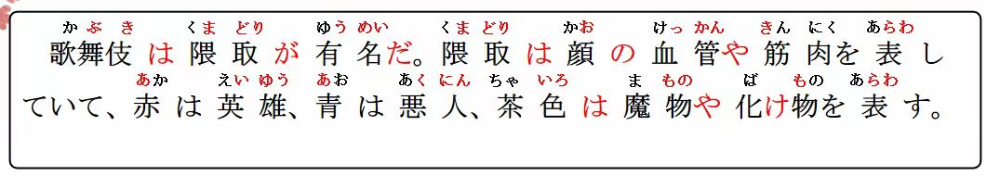
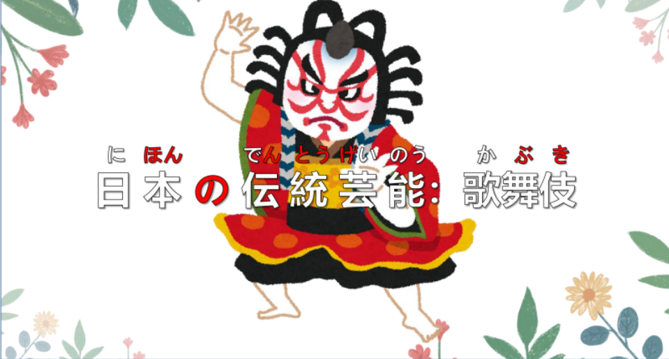
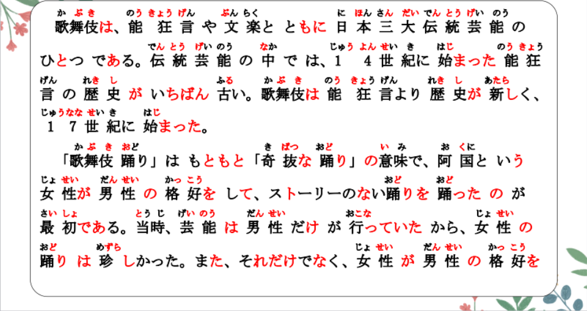
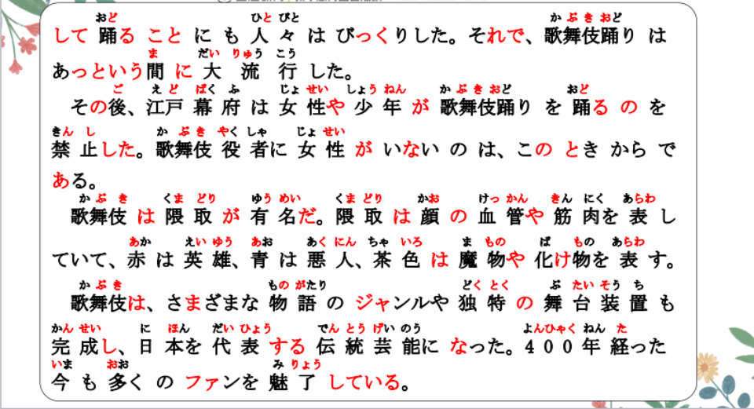
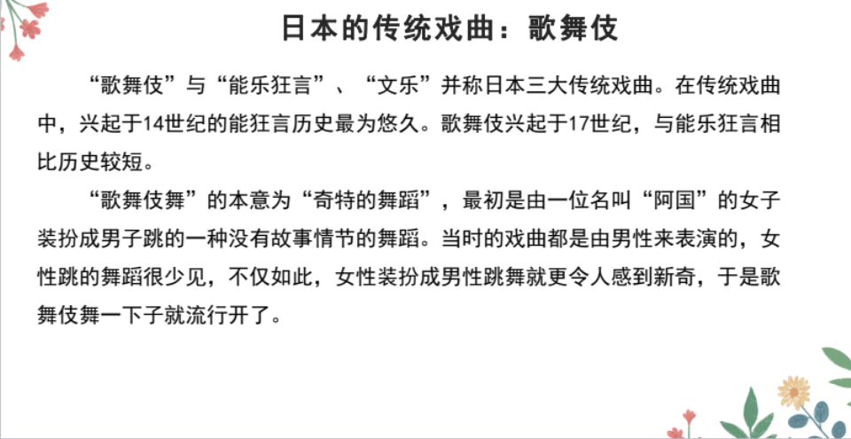
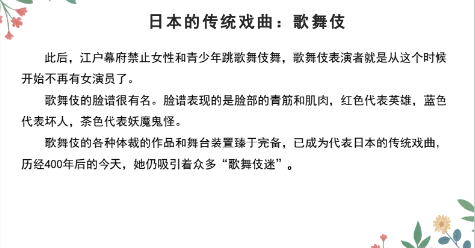

# それで、Ｖていて


## それで　<因果关系>

意义：表示前后两句之间的因果关系。  
译文：所以……；因此……  
接续：前句。それで＋后句。  
说明：表示结果的后句一般为与说话人的意志无关的、自然发生的行为。  

```ts
（1）女性が男性の格好をして踊ることにも人々はびっくりした。
 それで、歌舞伎踊りはあっという間に大流行した。
（2）この食堂は安くておいしい。それで、いつも混んでいる。
（3）あの人は日本で3年間勉強した。それで、ほかの学生より日本語が上手なんだ
```

## 練習 れんしゅう

```ts
（1）最近把烟戒了。因此，变健康了。さいきん　
→
（2）工作很忙。所以，没有看电影的时间。　
```


## Vていて　<中顿>

意义：表示句子的并列、中顿。  
接续：Vて＋いて  
说明：是「Vている」的中顿形式。书面语或正式的谈话中多使用「Vており」。  
 

```ts
（1）隈取は顔の血管や筋肉を表していて、赤は英雄、青は悪人、茶色は魔物や化物表す。
（2）将来のことを考えていて、舞台と関係のある仕事がしたいと思っています。
（3）両国「りょうこく」の文化交流史について興味を持っており、研究を続けている。
```

## 練習 れんしゅう

```ts
（1）他结婚了，孩子也有了。けっこんする　こども
→
```


## 精読の教文

<vue-plyr>
  <audio controls crossorigin playsinline loop>
    <source src="../audio/11-3-2.mp3" type="audio/mp3" />
  </audio>
 </vue-plyr>



## 会話

<vue-plyr>
  <audio controls crossorigin playsinline loop>
    <source src="../audio/11-3-かいわ.mp3" type="audio/mp3" />
  </audio>
 </vue-plyr>






 