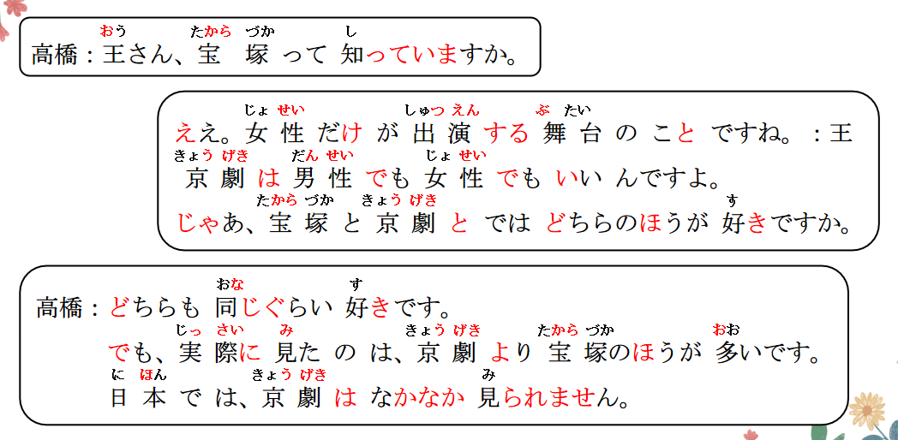
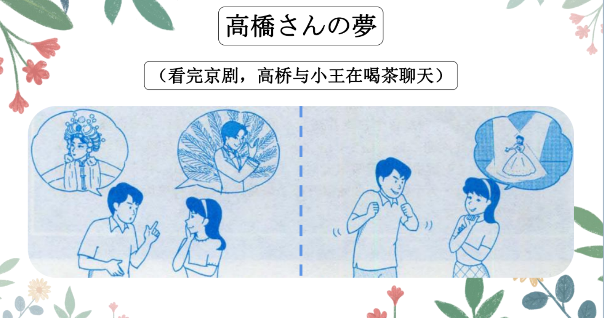
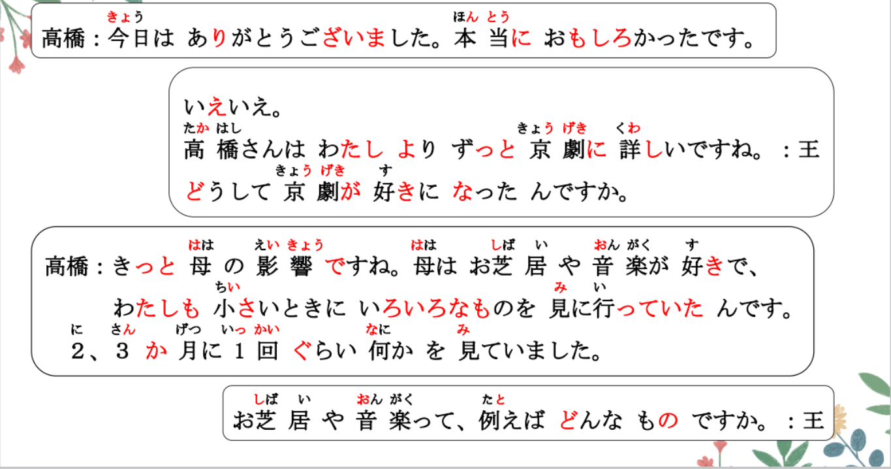
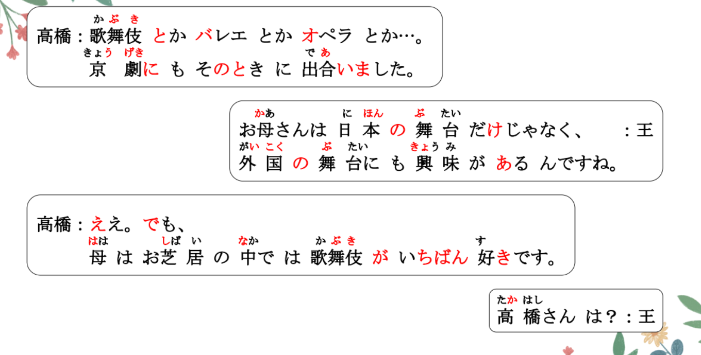
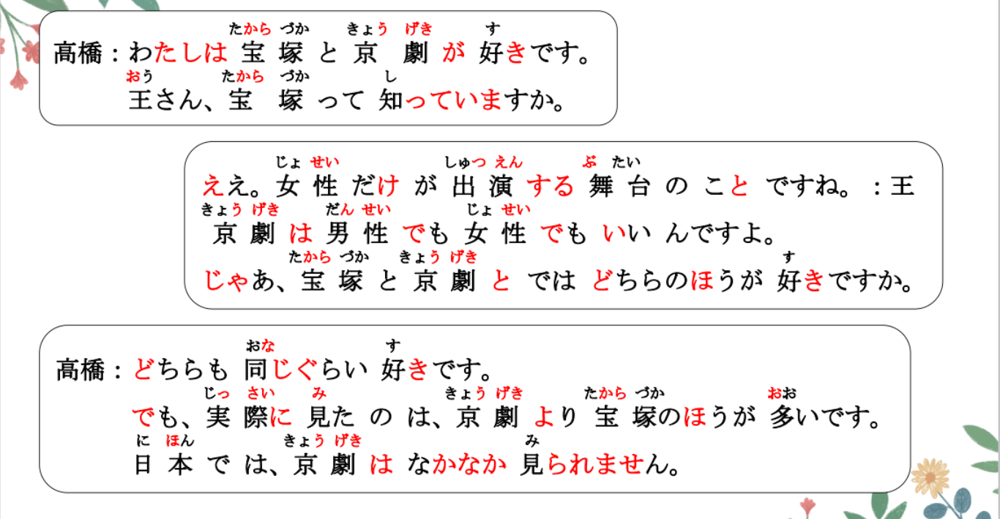
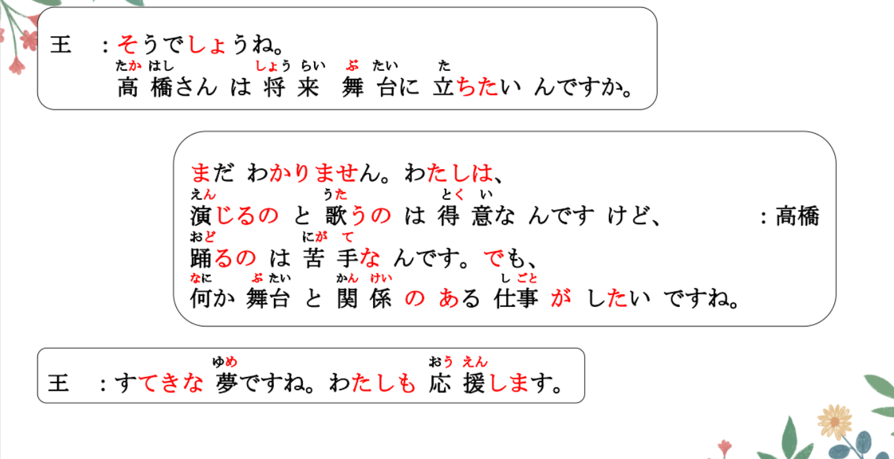
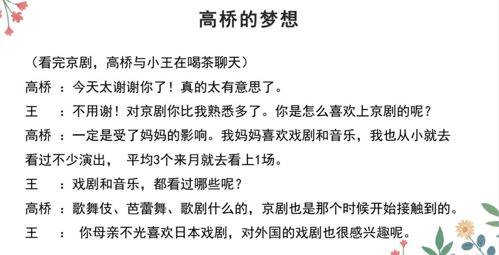
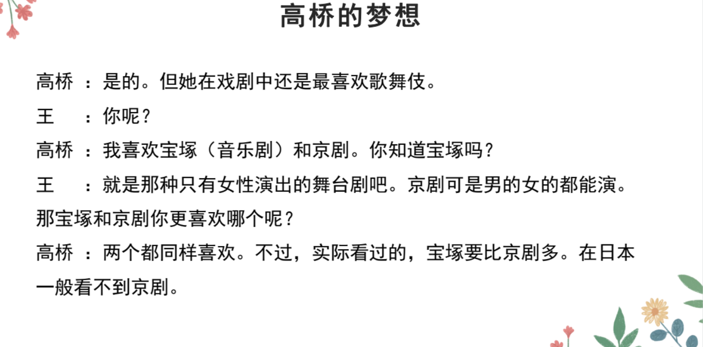
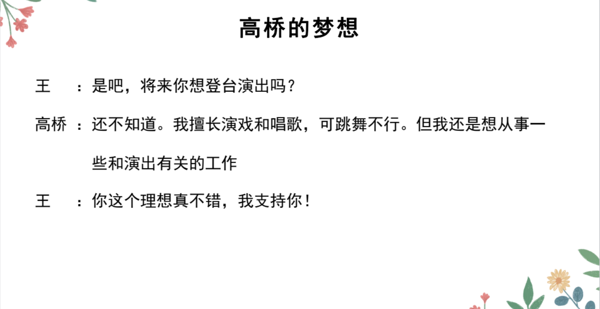

# に、それで、Ｖていて

## 精読の教文

<vue-plyr>
  <audio controls crossorigin playsinline loop>
    <source src="../audio/11-2-2.mp3" type="audio/mp3" />
  </audio>
 </vue-plyr>

## 会話

<vue-plyr>
  <audio controls crossorigin playsinline loop>
    <source src="../audio/11-2-かいわ.mp3" type="audio/mp3" />
  </audio>
 </vue-plyr>

