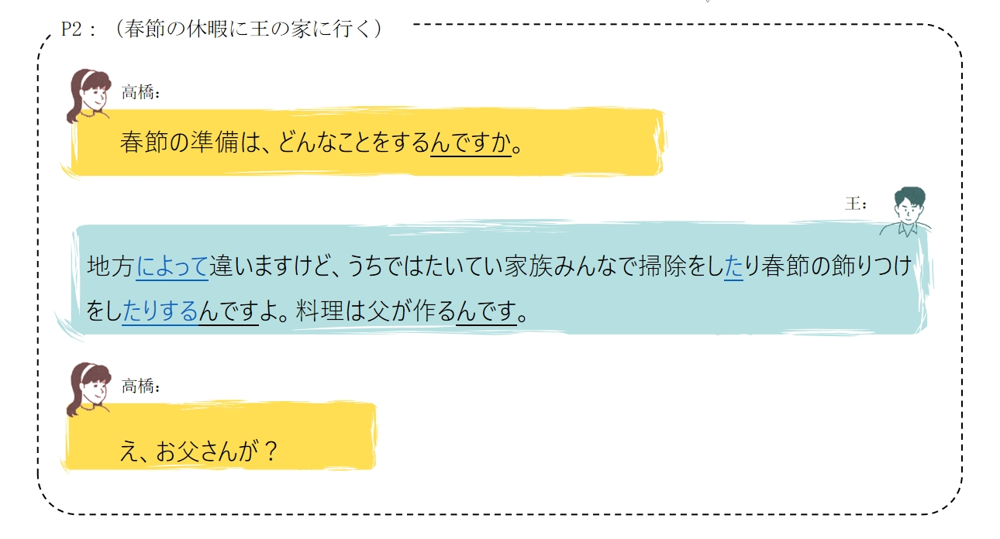
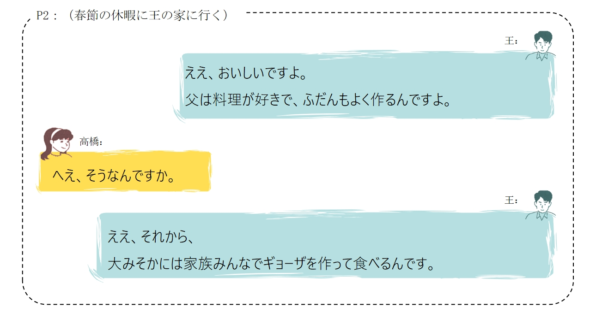
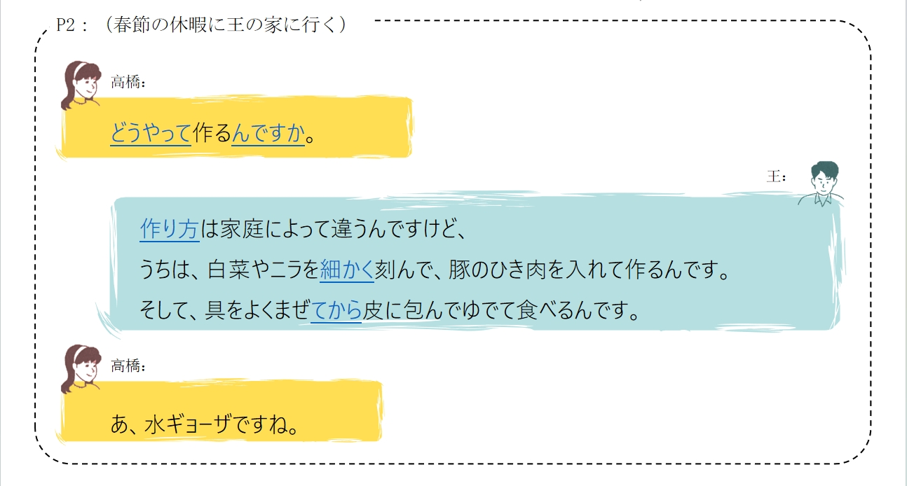
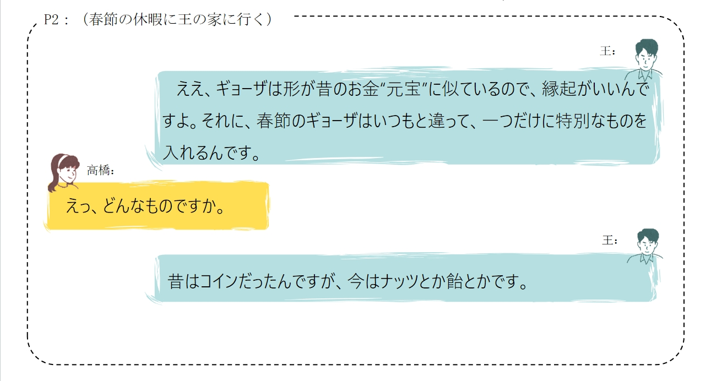
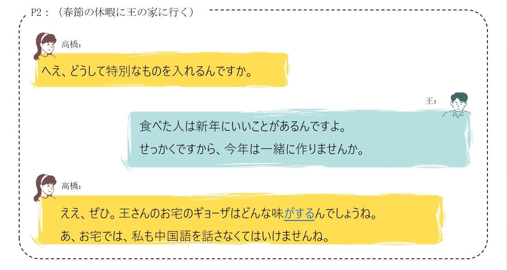
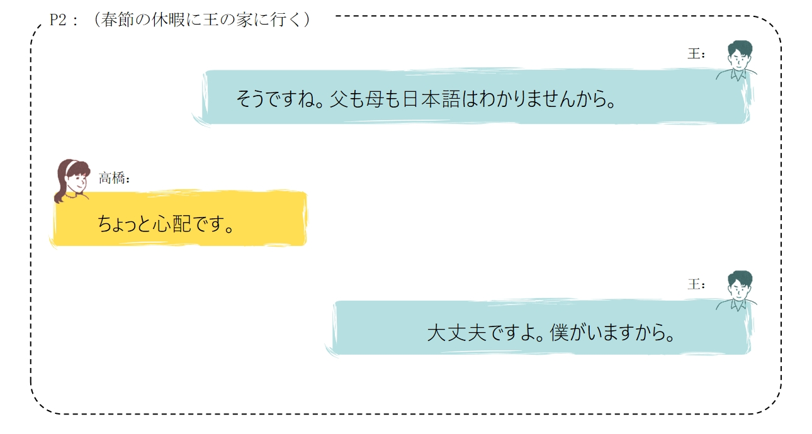
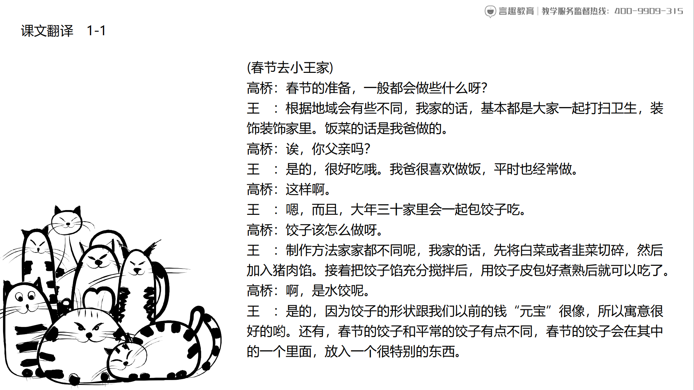
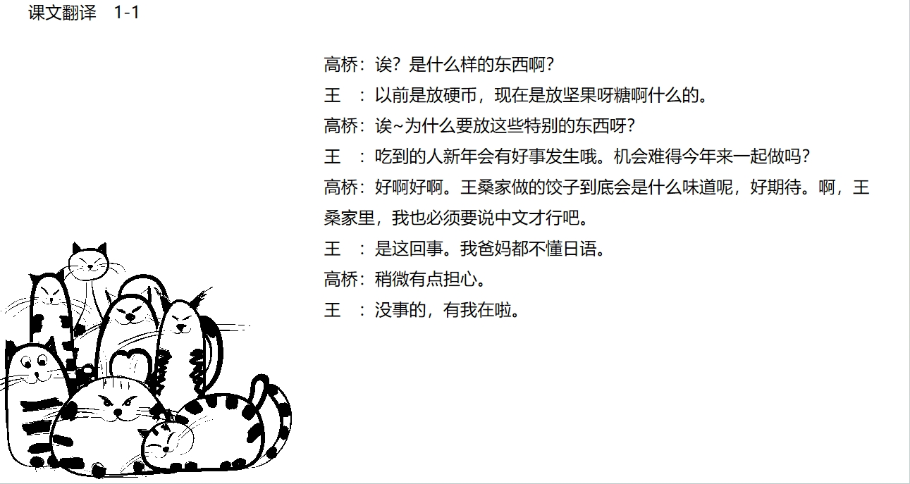

# 春節の習慣

## 新出単語

<vue-plyr>
  <audio controls crossorigin playsinline loop>
    <source src="../audio/c/1-1-たんご.mp3" type="audio/mp3" />
  </audio>
 </vue-plyr>


| 単語                                    | 词性                | 翻译                               |
| --------------------------------------- | ------------------- | ---------------------------------- |
| 休暇<JpWord>きゅうか</JpWord>           | ⓪<名>               | 休假；放假                         |
| 地方 <JpWord>ちほう </JpWord>           | ②①                  | （与首都，中央相对的）地方;        |
| たいてい<JpWord>たいてい</JpWord>       | ⓪                   | 基本上；大都；多半                 |
| 飾りつけ<JpWord>かざりつけ</JpWord>     | ⓪                   | 装饰品；点缀物                     |
| ふだん<JpWord>ふだん</JpWord>           | ①                   | 平时；平常                         |
| 　大晦日<JpWord>おおみそか</JpWord>     | ➂                   | 除夕；大年三十                     |
| どうやって<JpWord>どうやって</JpWord>   | ①                   | 如何；怎样                         |
| 作り方<JpWord>つくりかた</JpWord>       | ⓪                   | 做法；制作方法                     |
| 家庭<JpWord>かてい</JpWord>             | ⓪                   | 家庭                               |
| 韮<JpWord>ニラ</JpWord>                 | ⓪②                  | 韮菜                               |
| 細かい<JpWord>こまかい</JpWord>         | ➂ ＜形 I ＞         | 细小；碎                           |
| 刻む<JpWord>きざむ</JpWord>             | ⓪ <他 I>            | 切碎；刻；印刻                     |
| 豚<JpWord>ぶた</JpWord>                 | ⓪ <名>              | 猪                                 |
| ひき肉<JpWord>ひきにく</JpWord>         | ⓪ <名>              | 肉馅                               |
| 具<JpWord>ぐ</JpWord>                   | ⓪① <名>             | 馅儿；菜码；                       |
| 混ぜる<JpWord>ぐ</JpWord>               | ② <他 II>           | 搅拌；和                           |
| 包む<JpWord>つつむ</JpWord>             | ② <他 I>            | 包；包装；包裹                     |
| ゆでる<JpWord>ゆでる</JpWord>           | ② <他 II>           | 煮；焯                             |
| 水ギョーザ<JpWord>水ギョーザ</JpWord>   | ➂ ＜名＞            | 水饺                               |
| 形<JpWord>かたち</JpWord>               | ⓪ ＜名＞            | 外形；形状                         |
| 昔<JpWord>むかし</JpWord>               | ⓪ ＜名＞            | 过去                               |
| 似る<JpWord>にる</JpWord>               | ⓪ ＜自 II ＞        | 像；相似                           |
| 縁起<JpWord>えんぎ</JpWord>             | ⓪<名>               | 缘由；预兆；兆头                   |
| 特别<JpWord>とくべつ</JpWord>           | ⓪<名.形 II>         | 特别；格外                         |
| コイン<JpWord>コイン</JpWord>           | ①<名>               | 硬币                               |
| nuts<JpWord>ナッツ</JpWord>             | ①<名>               | 果仁；坚果                         |
| 飴<JpWord>あめ</JpWord>                 | ⓪<名>               | 饴糖；糖果                         |
| せっかく<JpWord>せっかく</JpWord>       | ⓪<名.副>            | 煞费苦心；好不容易                 |
| お宅<JpWord>おたく</JpWord>             | ⓪<名>               | 您家；府上（礼貌说法）             |
| 味<JpWord>あじ</JpWord>                 | ⓪<名>               | 味道                               |
| 心配<JpWord>しんぱい</JpWord>           | ⓪<名。形 II.他 III> | 担心；惦记                         |
| 内容<JpWord>ないよう</JpWord>           | ⓪ ＜名＞            | 内容                               |
| 確認<JpWord>かくにん</JpWord>           | ⓪ ＜名・他 Ⅲ ＞     | 确认                               |
| まとめる      <JpWord>まとめる</JpWord>                            | ⓪ ＜他 Ⅱ ＞         | 总结；归纳；整理                   |
| 例<JpWord>れい</JpWord>                 | ① ＜名＞            | 例；例子                           |
| 倣う<JpWord>ならう</JpWord>             | ② ＜他 Ⅰ ＞         | 模仿                               |
|〖醤油〗         <JpWord> しょうゆ</JpWord>               | ⓪ ＜名＞            | 酱油                               |
| お酢<JpWord>おす</JpWord>               | ⓪② ＜名＞           | 醋(美化语用法)                     |
| つける           <JpWord>つける</JpWord>                       | ② ＜他 Ⅱ ＞         | 蘸；带上；附着                     |
| 〖山葵〗 <JpWord>わさび</JpWord>        | ① ＜名＞            | 绿芥末                             |
| チャーハン <JpWord>チャーハン</JpWord>  | ① ＜名＞            | 炒饭                               |
| 卵・玉子<JpWord>たまご</JpWord>         | ② ⓪ ＜名＞          | 鸡蛋                               |
| 炒める<JpWord>いためる</JpWord>         | ③ ＜他 Ⅱ ＞         | 炒                                 |
| 乗換<JpWord>のりかえ・乗り換え</JpWord> | ⓪ ＜名・自 Ⅲ ＞     | 换乘                               |
| 歯<JpWord>は</JpWord>                   | ① ＜名＞            | 牙；牙齿                           |
| 磨く<JpWord>みがく</JpWord>             | ⓪ ＜他 Ⅰ ＞         | 刷（牙）；擦（皮鞋、玻璃）；磨炼　 |
| 聴く<JpWord>きく</JpWord>               | ⓪ ＜他 Ⅰ ＞         | 听；聆听                           |
| 感じ<JpWord>かんじ</JpWord>             | ⓪ ＜名＞            | 感觉                               |
| banana<JpWord>バナナ</JpWord>           | ① ＜名＞            | 香蕉                               |
| 花<JpWord>はな</JpWord>                 | ② ＜名＞            | 花                                 |
| 匂い<JpWord>におい</JpWord>             | ② ＜名＞            | 气味                               |
| 声<JpWord>こえ</JpWord>                 | ① ＜名＞            | 声；声音                           |
| 風<JpWord>かぜ</JpWord>                 | ⓪ ＜名＞            | 风                                 |
| 目まい<JpWord>めまい</JpWord>           | ⓪② ＜名＞           | 头晕；目眩                         |
| 寒気<JpWord>さむけ</JpWord>             | ⓪ ＜名＞            | 感觉冷；打寒战                     |
| 動作<JpWord>どうさ</JpWord>             | ① ＜名・自 Ⅲ ＞     | 动作；（机器等）工作　             |
| 順序<JpWord>じゅんじょ</JpWord>         | ① ＜名＞            | 顺序                               |
| 読書会<JpWord>どくしょかい</JpWord>     | ③ ＜名＞            | 读书会                             |
| 読書<JpWord>どくしょ</JpWord>           | ① ＜名・自 Ⅲ ＞     | 读书                               |
| 伝える<JpWord>つたえる</JpWord>         | ⓪ ＜他 Ⅱ ＞         | 告诉；传达；转达                   |
| 形式<JpWord>けいしき</JpWord>           | ⓪ ＜名＞            | 形式                               |
| pair<JpWord>ペア</JpWord>               | ① ＜名＞            | 一对；（两人或两个）一组           |
| 手順<JpWord>てじゅん</JpWord>           | ①⓪ ＜名＞           | 顺序；次序                         |
| 隣<JpWord>となり</JpWord>               | ⓪ ＜名＞            | 邻；邻居；旁边                     |
| 比べる<JpWord>くらべる</JpWord>         | ⓪ ＜他 Ⅱ ＞         | 比较                               |
| 話し合う<JpWord>はなしあう</JpWord>     | ⓪④ ＜自 Ⅰ ＞        | 谈话；商议；对话                   |
| 季節<JpWord>きせつ</JpWord>             | ①② ＜名＞           | 季节                               |
| 場合<JpWord>ばあい</JpWord>             | ⓪ ＜名＞            | 场合；情况下；如果                 |

## N によって

意义：表示判断的依据或根据。  
译文：根据...（而不同）；因......（而异）
接续：名词+によって

```ts
(1)春節の準備は地方によって違います。 // 違い（ちがい）　不同、区别或差异
春节的准备因地而异。
(2)この単語は時代によって意味が違います。 // 時代(じだい) 意味（いみ）意思;含义
这个词根据时代的不同意思也不一样。
(3)人によって考えが違います。 // 考え（かんがえ）想法;意见;;思考
不同的人有不同的想法。
(4)メニューは季節によって変わります。// 季節（きせつ); 変わり（かわり）用来描述事物的变化。
菜单随季节变化。
```

## 練習 れんしゅう

```ts
特例：人にはいろいろな夢があります。//　夢（ゆめ）梦想
    夢は人によっていろいろです。// 根据人的不同，梦想也不同。
    人によって夢がちがいます。// 每个人都有不同的梦想。
 1.学习的方法因人而异。　//　仕方（しかた）
 ⇒　勉強の仕方は人によって違います。
 2.起床的时间根据星期而不同。// 起きる（おきる）時間（じかん）　曜日　（ようび）星期
 ⇒　起きる時間は曜日によって違います。

```

## どうやって～んですか＜询问方式＞

意义：询问行为、动作的方式、方法或事件的过程。  
译文：怎么样.....；如何.....
接续：どうやって＋动词连体形＋んですか

```ts
(1)ギョーザはどうやって作るんですか。
饺子是怎么做的。
(2)この食べ物は初めて見ました。どうやって食べるんですか。
第一次看到这种食物。怎么吃呢？
(3)すみませんが、駅まではどうやって行くんですか。
对不起，请问去车站怎么走。
(4)李さんはどうやって日本語を勉強しているんですか。　
小李是怎样学习日语的。
```

## 練習 れんしゅう

```ts
1.炒饭要怎么做呀？//　チャーハン　炒饭
⇒チャーハンはどうやって作るんですか。
2.刺身要怎么吃呀？//　刺身（さしみ）
⇒刺身はどうやって食べるんですか。

```

## V 方＜方法＞　

意义：表示行为、动作的方式、方法。  
译文：....法；....的方法  
接续：动词的第一连用形＋方

> 说明：动词带「を格」补足语时，由「N を V」变成「N の V 方」

```ts
(1)ギョーザの作り方は家庭によって違います。　//　家庭（かてい）家庭；家庭生活
饺子的做法因家庭而异。
(2)高橋さんは北京ダックの食べ方を知りませんでした。
高桥不知道北京烤鸭的吃法。
(3)図書館への行き方を教えてください。  // 教えて（おしえて） 请教我或告诉我
请告诉我去图书馆的路。
(4)旅行会社の検索の仕方を説明しました。 // 旅行会社（りょこうがいしゃ）旅行社; 検索（けんさく）搜索;查询
说明了旅行社的搜索方法。
```

## 練習 れんしゅう

> ギョーザを作るーギョーザの作り方

```ts
翻訳（ほんやく）しましょう。
ギョーザを作るーギョーザの作り方 饺子的制作方法。
1.手紙を書く。　//　手紙（てがみ）；　書く（かく）写、书写或画。　
⇒手紙の書き方。
2.予習をする。　　//　予習（よしゅう）预习;
⇒ 予習の仕方。
```

## Ｖてから＜先后顺序＞

意义：表示动作的先后顺序，后面的动作以前面的动作为基础、条件。  
译文：先....，再.....；....之后（再）.....
接续：Vて＋から

```ts
(1)ギョーザは、具をよくまぜてから皮に包みます。// まぜる（まぜる）搅拌  具（ぐ）馅料； 皮（は）皮
 饺子的馅充分混合后包在饺子皮里。
(2)野菜を洗ってから切ります。 // 切る（きる）切、割、割开或切掉; 野菜（やさい）蔬菜
  将蔬菜洗净后切块。
(3)A：急いで映画館に行きましょうか。 // 急いで（いそがれて）匆忙地；急切地  // 映画館（えいがかん）电影院
  B：いいえ、食事をしてから行きましょう。 // 食事（しょくじ）食物；餐食; 
  A：我们去电影院吧？
  B：不，先吃饭再去看电影。
```

> 「Vてから」还可以表达以某事为契机或起点发生的变化。

```ts
(1)日本に来てから３か月になる。 // 来て（きて）来;来到  // か月（かげつ）一个月
来到日本后已经三个月了。
(2)大学に入ってから、ずっと家庭教師のアルバイトをしている。 // 大学（だいがく）大学; // アルバイト（アルバイト）打工 // ずっと（ずっと）一直 // 家庭教師（かていきゅうし）家庭教师
进入大学后，我一直在做家庭教师的兼职。
```

## 練習 れんしゅう

```ts
1.先刷牙，再睡觉。
⇒ 歯を磨いてから.寝ます。
2.我稍微学习了一点日语后，再去日本留学了。
⇒ 少し日本語を勉強してから.日本に留学しました。
```

## だけ＋格助词＜限定＞

意义：表示限定  
译文：仅有....，只有....
接续：名词+だけ+格助词  
说明：「だけ」后接「が/を」时，「が/を」可以省略

```ts
(1)春節のギョーザはいつもと違って、一つだけに特別なものを入れるんです。 // 特別な（とくべつな）特别的 // もの（もの）东西；物品 // 入れる（いれる）放入；加入 // 特別なもの（とくべつなもの）特别的东西  // 春節（しゅんせつ）春节
春节的饺子和平时不一样，要在一个饺子里面放入特别的东西。
(2)子供は平仮名だけで作文を書きます。 // 平仮名（ひらがな）平假名 // 作文（さくぶん）作文 // だけ（だけ）只有 // 子供（こども）孩子
孩子只用平假名写作文。
(3)王さんだけ（が）日本に行きます。 // 行く（いく）去 
只有小王去日本。
(4)うちのギョーザは白菜と豚肉だけ（を）入れます。// 白菜（はくさい）白菜 // 豚肉（ぶたにく）猪肉 // だけ（だけ）只有 // に入れる（いれる）放入
  我家的饺子只放白菜和猪肉。

```

## 練習 れんしゅう

```ts
1.我只和渡边说话。
⇒ わたなべさんだけと話します。
2.只送给了田中先生礼物。　// 上げる（あげる）送
⇒ 田中先生だけにプレゼントを上げました。
```

## Nがする＜感受＞

意义：表示人的器官所感受到的气味、味道、声音或者生理、心理状态等。  
译文：听到声音（声がする）;闻到气味（匂いがする）；听到声响（音がする）  
　　　尝出味道（味がする）；感到....（気がする/感じがする）  
接续：（连体修饰语+）名词+がする

```ts
(1)王さんのお宅のギョーザはどんな味がするんでしょうね。 // お宅（おたく）家 // どんな味（どんなみ）什么味道 // がする（がする）味道 // しょうですね（しょうですね）呢
小王家的饺子什么味道呢？
(2)隣の部屋からコーヒーの匂いがします。 // 隣（りが）旁边 // コーヒー（こふぃー）咖啡 // の匂い（のにおい）气味 // がします（がします）味道
隔壁房间有咖啡的味道。
(3)このキャンディ「糖果」はリンゴの味がする。 // キャンディ（キャンディ）糖果 // リンゴ（りんご）苹果 // の味（のみ）味道 // がする（がする）味道
这个糖果是苹果的味道。
(4)何度も練習して上手になった気がする。　// 練習（れんしゅう）练习 // 上手（じょうず）熟练 // なった（なった）变成 // 気がする（きがする）感到
经过多次练习，感觉自己变得更好了。
(5)ちょっと頭痛がしていましたから、一時間早く家に帰ったのです。// ちょっと（ちょっと）一点，稍微 // 頭痛（つうずつう）头痛 // がしていました（がしていました）感到 // 一時間早く（いちじかんはやく）一个小时早 // 家に帰った（うちに帰った）回家
我有点头痛，所以提前一个小时回家了。

```

## 練習 れんしゅう

```ts
1.闻到了花香味。 // 花香（はなかおり）花香 // 匂い（におい）气味 
⇒ 花の匂いがしました。
2.感觉有点冷。 // 冷（ひや）凉 // 気がする（きがする）感到
⇒ ちょっと寒気がした。
```

## 会話

<vue-plyr>
  <audio controls crossorigin playsinline loop>
    <source src="../audio/11-1-かいわ.mp3" type="audio/mp3" />
  </audio>
 </vue-plyr>








