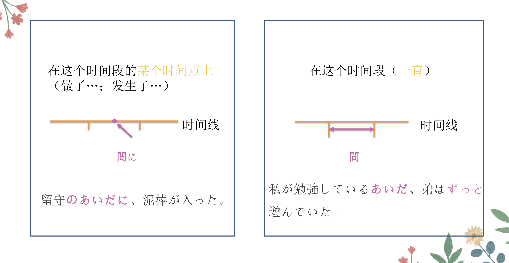
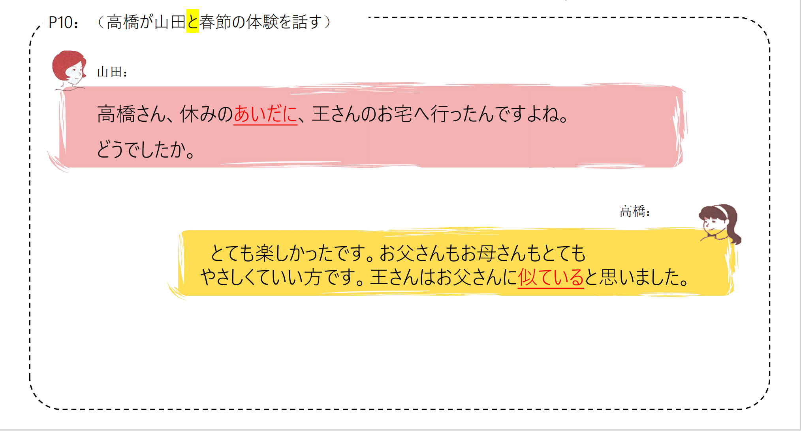
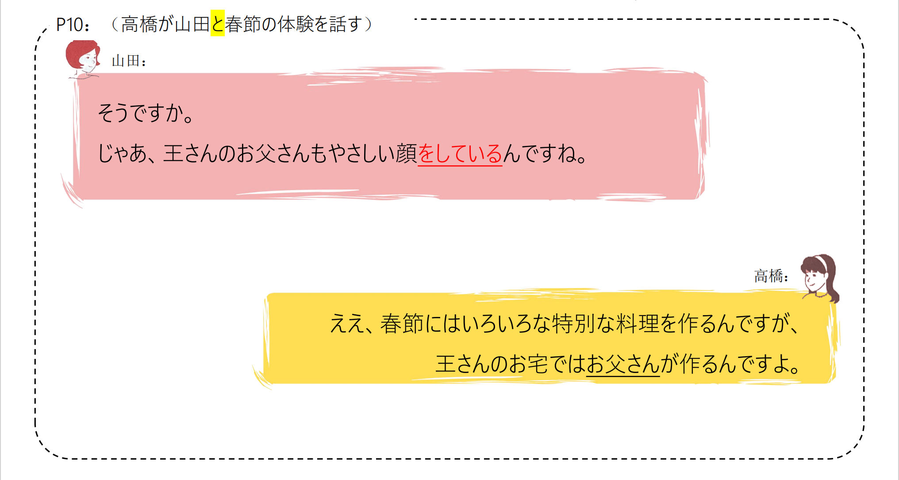
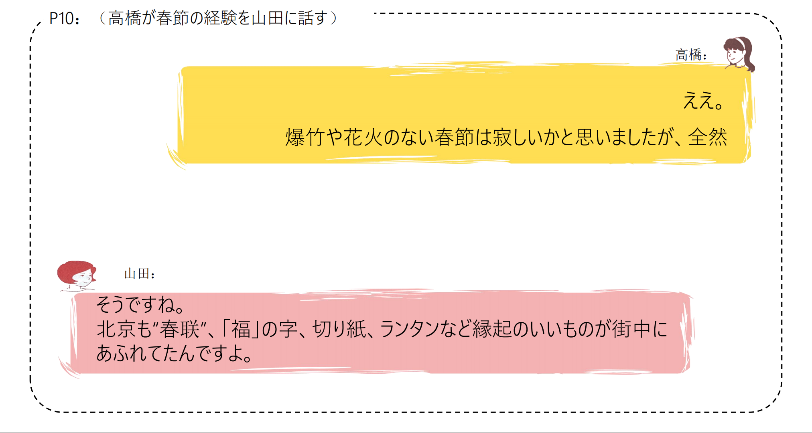
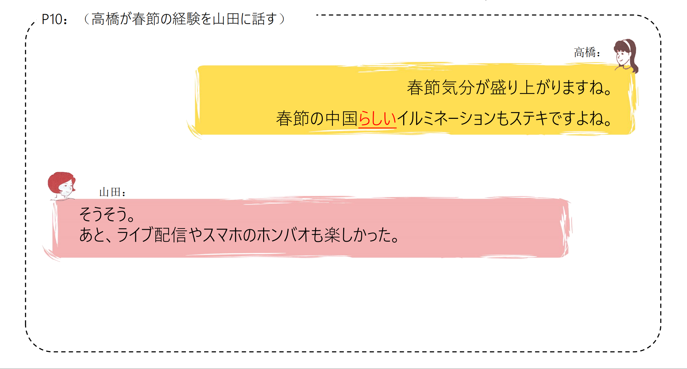
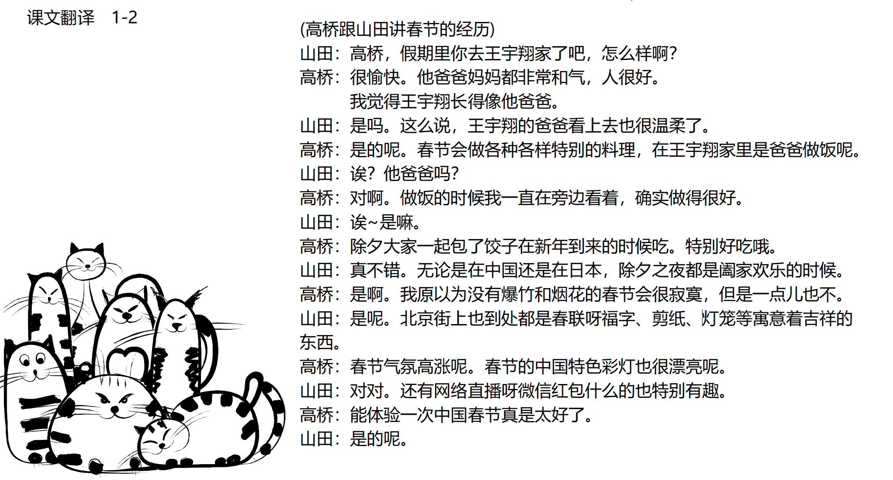

# 春節の体験

## 新出単語

<vue-plyr>
  <audio controls crossorigin playsinline loop>
    <source src="../audio/c/1-2-たんご.mp3" type="audio/mp3" />
  </audio>
 </vue-plyr>

| 単語                                                        | 词性            | 翻译                               |
| ----------------------------------------------------------- | --------------- | ---------------------------------- |
| <JpWord>あいだ</JpWord> 〖間〗                              | ⓪ ＜名＞        | 期间；之间                         |
| 変わる（<JpWord>かわる</JpWord> ）                          | ⓪ ＜自 Ⅰ ＞     | 变化；变换                         |
| 晩（<JpWord>ばん</JpWord> ）                                | ⓪ ＜名＞        | 晚上；傍晚                         |
| 一家（<JpWord>いっか</JpWord> ）                            | ① ＜名＞        | 全家；一家；家                     |
| <JpWord>だんらん</JpWord> 〖団欒〗                          | ⓪ ＜名・自 Ⅲ ＞ | 团圆；团聚                         |
| 爆竹（<JpWord>ばくちく</JpWord> ）                          | ⓪ ＜名＞        | 爆竹                               |
| 花火（<JpWord>はなび</JpWord> ）                            | ① ＜名＞        | 焰火；烟花                         |
| 切り紙（<JpWord>きりがみ</JpWord> ）                        | ⓪② ＜名＞       | 剪纸                               |
| <JpWord>ランタン</JpWord>                                   | ③① ＜名＞       | 灯笼                               |
| 街（<JpWord>まち</JpWord> ）                                | ② ＜名＞        | 街；商业区                         |
| <JpWord>あふれる</JpWord> 『溢れる』                        | ③ ＜自 Ⅱ ＞     | 溢出；充满                         |
| 気分（<JpWord>きぶん</JpWord> ）                            | ① ＜名＞        | 心情                               |
| 盛り上がる（<JpWord>もりあがる</JpWord> ）                  | ④ ＜自 Ⅰ ＞     | （气氛）高涨；鼓起                 |
| <JpWord>イルミネーション</JpWord> （illumination）          | ④ ＜名＞        | 夜景灯光；灯饰                     |
| <JpWord>ライブ配信</JpWord> （live はいしん）               | ④ ＜名＞        | 网络直播                           |
| <JpWord>ライブ</JpWord> （live）                            | ① ＜名＞        | 现场直播                           |
| 配信（<JpWord>はいしん</JpWord> ）                          | ⓪ ＜名・他 Ⅲ ＞ | 传送；发布信息                     |
| <JpWord>ホンバオ</JpWord>                                   | ⓪ ＜名＞        | 红包                               |
| お弁当（<JpWord>おべんとう</JpWord>）                       | ⓪ ＜名＞        | 盒饭（美化语用法）                 |
| 弁当（<JpWord>べんとう</JpWord>）                           | ③ ＜名＞        | 盒饭，便当                         |
| 昼休み（<JpWord>ひるやすみ</JpWord>）                       | ③ ＜名＞        | 午休                               |
| 訪ねる（<JpWord>たずねる</JpWord>）                         | ③ ＜他 Ⅱ ＞     | 拜访；访问                         |
| <JpWord>ゴールデンウイーク</JpWord>（和制英语 golden week） | ⑦ ＜名＞        | 黄金周                             |
| 博物館（<JpWord>はくぶつかん</JpWord>）                     | ④③ ＜名＞       | 博物馆                             |
| 終える（<JpWord>おえる</JpWord>）                           | ⓪ ＜他 Ⅱ ＞     | 结束；终了                         |
| 焼く（<JpWord>やく</JpWord>）                               | ⓪ ＜他 Ⅰ ＞     | 烤；煎；烧                         |
| <JpWord>ソース</JpWord>（sauce）                            | ① ＜名＞        | 沙司；调料汁                       |
| 曲がる（<JpWord>まがる</JpWord>）                           | ⓪ ＜自 Ⅰ ＞     | 拐；拐弯，弯曲                     |
| <JpWord>つながる</JpWord>『繋がる』                         | ⓪ ＜自 Ⅰ ＞     | 连；相连；连接                     |
| 能力（<JpWord>のうりょく</JpWord>）                         | ① ＜名＞        | 能力 超能力                        |
| 優れる（<JpWord>すぐれる</JpWord>）                         | ③ ＜自 Ⅱ ＞     | 优秀；出色（的）；出众（的）；杰出 |
| 目（<JpWord>め</JpWord>）                                   | ① ＜名＞        | 眼睛                               |
| <JpWord>トラ</JpWord>『虎』                                 | ⓪ ＜名＞        | 虎；老虎                           |
| 腕（<JpWord>うで</JpWord>）                                 | ② ＜名＞        | 胳膊；本事；技术                   |
| 毎晩（<JpWord>まいばん</JpWord>）                           | ①⓪ ＜名＞       | 每晚                               |
| <JpWord>ドラマ</JpWord>（drama）                            | ① ＜名＞        | （戏）剧                           |
| 冬（<JpWord>ふゆ</JpWord>）                                 | ② ＜名＞        | 冬；冬天；冬季                     |
| 海南島（<JpWord>かいなんとう</JpWord>）                     | ⓪ ＜固名＞      | 海南岛                             |
| 悲しい（<JpWord>かなしい</JpWord>）                         | ⓪ ＜形 Ⅰ ＞     | 悲伤（的）                         |
| 生まれる（<JpWord>うまれる</JpWord>）                       | ⓪ ＜自 Ⅱ ＞     | 出生；产生                         |
| <JpWord>あきらめる</JpWord>『諦める』                       | ④ ＜他 Ⅱ ＞     | 放弃；死心；作罢                   |
| 希望（<JpWord>きぼう</JpWord>）                             | ⓪ ＜名・他 Ⅲ ＞ | 希望                               |
| 願望（<JpWord>がんぼう</JpWord>）                           | ⓪ ＜名＞        | 愿望；期望                         |
| 瞬間（<JpWord>しゅんかん</JpWord>）                         | ⓪ ＜名＞        | 瞬间                               |


## Nの/Vているあいだに＜时点＞

意义：表示在某一状态持续的阶段、时期内的某一时点上发生了谓语动词所表示的动作或变化。  
译文：在....的时候  
接续：Nの／Ｖている＋あいだに（一般不与表示持续的副词（如「ずっと」）搭配使用）  

```ts
(1) 高橋さん、休みのあいだに、王さんのお宅へ行ったんですよね。　
高桥，放假的时候，你去了小王家对吧。
(2) 一年間の留学のあいだに、とてもよい経験をしました。// けいけん（经验）　// あいだに（期间）
在这一年的留学生活中，我获得了很好的经历。
(3) 兄が掃除をしているあいだに、私は春節の飾りつけをしました。
在哥哥打扫卫生的时候，我做了春节的装饰。
(4) 晩ご飯を作っているあいだに、友達がやってきました。// あいだに（期间）
在做饭的时候，朋友来了。
```

> 注意：修饰「あいだに」的小句中的主语，要用「が」

```ts
(5) 赤ちゃん｛が/Xは｝寝ているあいだに、お母さんは料理を作りました。 // 赤 ちゃん（婴儿）// あいだに（期间）
在婴儿睡觉的时候，妈妈做了饭。
```

## 練習 れんしゅう

```ts
1.在黄金周的期间打扫了房间。// ゴールデンウイーク部屋
⇒ゴールデンウイークの間に、部屋を掃除した.
2.在日本留学的时候，我去了各种各样的地方。 // りゅうがく 留学　// あいだに（期间）
⇒日本に留学している間に、いろいろなところ（に・へ）行った。
```

## Nの/Vているあいだ＜时段＞

意义：表示在某一状态持续的整个阶段，时期（时段）内持续地进行了主句谓语动作所表示的动作。经常与表示持续的副词「ずっと」搭配使用。    
译文：～的时候；～期间；一直~  
接续：Nの／Ｖている＋あいだ  

```ts
(1) 王さんのお父さんが料理を作っているあいだ、私はそばでずっと見ていたんです。
小王的爸爸做饭的时候，我一直有旁边看着。
(2) 旅行のあいだ、ずっと試験のことを心配していました。// りょこう（旅行）// あいだに（期间） // しんぱい（担心） // 試験（しけん）
旅行期间，我一直担心考试。
(3) 夏休みのあいだ、ずっと国に帰っていました。
暑假期间一直在国内。
(4) バスを待っているあいだ、本を読んでいました。// まつ　（等待）// あいだに（期间）
等公共汽车的时候，我在看书。
```

## 練習 れんしゅう

```ts
1.在日本留学期间，一直住在大学的宿舍里。
⇒日本に留学しているあいだ、ずっと大学の寮に住んでいた。
2.父亲做饭期间，一直在房间里学习。
⇒父がご飯を作っている間、ずっと部屋で勉強していた。
```





## Nをしている
意义：表示人、动物或物体所具有的某种特征、形状。  
译文：具有～；长着～；呈～  
接续：（连体修饰语＋N）をしている  


```ts
(1) 王さんのお父さんもやさしい顔をしているんですね。（人） // 顔　かお
小王的父亲也长得很和善呢。
(2) 彼は大きな目をしている。// 目　め // 大きな　おおきな
他有一双大眼睛。
(3) あの建物はおもしろい形をしていますね。（物体） // 建物　たてもの // 形　かたち
那座建筑物的形状很有趣。
(4) 鈴木さんは困った顔をしている。// 困った　こまる // 顔　かお
铃木露出为难表情。
```

## 練習 れんしゅう

```ts
1.猫长着一双可爱的眼睛。// ねこ　猫 // あめい　可爱 // 目　め
⇒猫は可愛い目をしている。
2.这个花颜色真好看。 // この花　(このはな) // いい(好看) // 色(いろ)
⇒この花、ほんとうにいい色をしていますね。
```


## Vている＜持续体＞

###  ①表示动作、行为正在进行或持续。    
例：今、掃除している。／水は流れている。／手紙を書いている。      
経済学を専攻している。／旅行会社に勤めている。／大学の寮に住んでいる。    
### ②表示习惯性、反复性的动作。（句中常有毎日、いつも、よく、時々等词出现）  
例：祖父は毎日朝早く起きて、太極拳をやっている。／毎日牛乳を飲んでいる。      
###  ③表示动作、行为完成后，该结果仍在持续和存在。  
例：橋が落ちている。（桥塌的这个结果在说话的此刻还在持续，还没修好。）    
教室に来ている。／授業は始まっている。／カギがかかっている。／帽子をかぶっている。    


## Vている＜状态＞
意义：表示某种性质，状态。  
说明：做连体修饰语时可以采用「Vた」的形式


```ts
(1) 王さんはお父さんに似ていると思いました。 // 似ている　(像) // 思った　(想)
  我觉得小王和他父亲长的很像。
(2) この建物と隣の建物はつながっています「连接，相连」。 // 建物 たてもの // つながる（连接，相连）
这个建筑和旁边的建筑物是相连着的。
(3) この道はくねくね「弯弯曲曲」曲がっています「弯曲，曲折」。
这条道路弯弯曲曲的。
(4) この大学の学生はみんな優れています。// すぐれる　優れる
这个大学的学生都很优秀。
(5) 東のほうに、高い山が聳えている「耸立」。
在东方耸立着高山。
(6) 着物「和服」は痩せた人も太った人もよく似合います「合适」。
和服的话是瘦的人和胖的人穿都非常合适。
```
> �这种用法带有形容词的性质，与「ドアが開いている」「結婚している」等表示变化结果持续
的「Vている」意义不同。


```ts
(1) 周りに困った人がいます。
  周围有需要帮助的人。
(2) あの人は富ん「とん」だ家に生まれた。 // 家　いえ // 生まれる（出生） // とん　富ん（富裕）
  那个人出生在富裕的家庭。
(3) 彼女はとても澄ん「すん」だ目をしています。 // 目　め // 澄ん　すん（清澈） 
她长着一双十分明亮的眼睛。

```

## 練習 れんしゅう

```ts
1.朋友的能力很优秀。 // りゅうじょ　(朋友) // できる　(能力) // すぐれる　(优秀)
⇒ 友達のコミュニケーション能力が優れている。
2..这个宿舍和旁边的宿舍是相连着的。// 「つながる」
⇒この寮は隣の寮と繋がっている。
```

### 持续动词：在一段时间内能持续动作。这类动词有明显的“开始→进行→结束”的持续过程。
如「読む、書く、話す、降る」等。 例：読んでいる。表正在进行
### 瞬间动词：动作行为瞬间结束，不能持续进行。死んでいる
如「始まる、終わる、立つ、座る、卒業する、消える、死ぬ」等。
例：橋が落ちている。表动作结果的存续
### 状态动词：
①表示事物性质状态的动词。如「痩せる、太る、似る、優れる、聳える」等。  
例：娘は母に似ている。／この道はくねくね曲がっている。做谓语以Vている形式出现  
母に似た娘／曲がった道 做连体修饰语以Vた形式出现  
②表示恒常状态的动词。如「表示存在的ある、いる；表示能力的できる、行ける、読める」等。这类动词没有ている的形式。  

## Nらしい/らしさ＜风格、特征＞

意义：表示具有名词所示事物的特点、性质、风格等。    
译文：很....式；具有....风格的  
接续：N＋らしい  
说明：「Nらしい」是一个复合形容词，其名词形式「Nらしさ」可以用来表示某种特质、风
格

```ts
（1）春節の中国らしいイルミネーションもステキですよね。 // イルミネーション（彩灯） // ステキ（好）
  极具春节中国特色的彩灯也很不错呢。
（2）鈴木さんはとても学生らしい格好で大学に来た。 // 学生（がくせい） // 格好（かたち）
铃木穿得像个学生来大学。
（3）彼の行動はぜんぜん男らしくないと思う。 // 行動（こうどう） // 男（おとこ） // 似ている（像）
我认为他的行为一点也不像个男人。
（4）その作家の作品はいつも自分らしさを大事にしている。 // 自分（じぶん） // 大事に（重要に）
这位作家的作品总是注重个人的风格。
```

## 練習 れんしゅう

```ts
1.今天的天气不像夏天。 // 天气 てんき // 夏らしくない（不像夏天）
⇒今日の天気は夏らしくない。
2.那样的思考方式很小孩子。 // 思考方式　しこうかた // こどもらしい（像孩子）
⇒そんな考え方はこどもらしい。
```

## Vてよかった＜积极评价＞

意义：表示对已经发生（或没有发生）的事情的积极评价。  
译文：幸好....；....，真好  
接续：Vて/Vないで＋よかった

```ts
（1）春節を体験できてよかった。 // 体験（体验）
  能够体验春节真好。
（2）とてもいい映画で、見てよかったと思う。 // 映画（电影） // 見る（看）
非常好的电影，幸好看了。
（3）この本を捨てないでよかった。// 本（书） // 捨てる（扔掉）
幸好没有把这本书扔掉。
（4）いろいろなおもしろいことを体験した。日本に来てよかったと思う。 // おもしろい（有趣） // 体験（体验）
  体验了很多有趣的事情，我觉得来日本真好。
```

## 練習 れんしゅう

```ts
1.没有放弃真是太好了。// 諦める　あきらめる
⇒諦めないでよかった。
2.出生在中国真是太好了。　// うまれる 生まれる
⇒中国に生まれてよかった。
```

## 会話

<vue-plyr>
  <audio controls crossorigin playsinline loop>
    <source src="../audio/c/1-2-かいわ.mp3" type="audio/mp3" />
  </audio>
 </vue-plyr>









